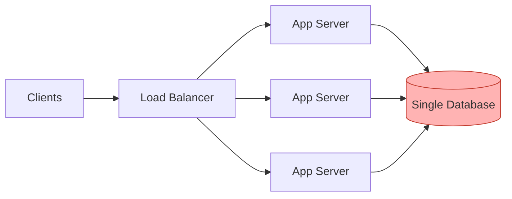

# Scalability

> **In one line:** The ability of a system to handle growth without breaking.

## Overview

Scalability is the ability of a system to handle growth without a proportional degradation in
performance or a collapse in reliability. "Growth" is deliberately broad — it can mean:

- **More users** (concurrent sessions, accounts).
- **More data** (rows, files, events per day).
- **More requests** (traffic per second).
- **More geographic reach** (users spread across continents).

A scalable system expands its capacity to meet that growth while keeping latency, throughput, and
error rates within acceptable bounds — ideally at a cost that grows *slower* than the load.

## Key Idea: A system is only as scalable as its weakest link

Scalability is **not a property of a single component**. It is a property of the entire request path.
The system is only as scalable as its least scalable part. You can scale application servers to
handle 10x the traffic, and the bottleneck simply moves to the database, a shared cache, or even a
third-party API.

*The app tier scales horizontally, but every request funnels into one database — the red node is the
bottleneck that caps the whole system.*

## How to Think About Scaling

1. **Measure first.** Find the actual bottleneck with load tests and production metrics. Do not guess.
2. **Scale the bottleneck**, then re-measure — the constraint will move somewhere else.
3. **Repeat** until the system meets its target load with headroom.

Two fundamental directions exist: **vertical** (a bigger machine) and **horizontal** (more machines).
See [Vertical Scaling](./02-vertical-scaling.md) and [Horizontal Scaling](./03-horizontal-scaling.md).

## Use Cases

- **A viral launch:** traffic jumps 50x overnight; a scalable design absorbs it by adding capacity.
- **Steady data growth:** an analytics platform ingesting billions of events per day needs storage
  and query paths that scale independently.
- **Global expansion:** serving users on new continents without every request crossing an ocean.

## Tips

- **Design stateless services** wherever possible — statelessness is the precondition for cheap
  horizontal scaling.
- **Push state to purpose-built stores** (databases, caches, object storage) that are built to scale.
- **Watch for shared singletons:** a single primary database, a single leader, or a global lock will
  become the ceiling.
- **Track scalability as a ratio:** cost/capacity per unit of load. If cost grows faster than load,
  the design is not truly scalable.
- **Plan for the next 10x, not the next 100x.** Over-engineering for scale you may never reach is its
  own kind of waste.

## Trade-offs & Pitfalls

- Scaling one tier **relocates** the bottleneck; it rarely removes it.
- Higher scalability often means **more moving parts** and operational complexity.
- Premature scaling adds cost and complexity before it is justified by real load.

---

_Notes: (add your own content here)_
