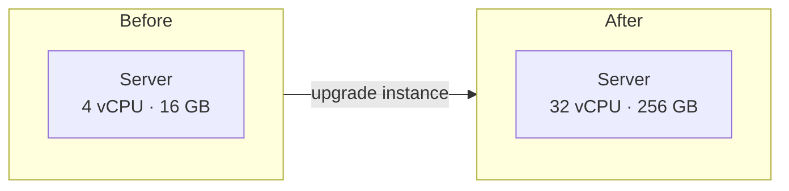

# Vertical Scaling

> **In one line:** Making one machine more powerful (scaling *up*).

## Overview

Vertical scaling — also called *scaling up* — means increasing the capacity of a single machine.
When the system needs more headroom, you upgrade the server with more CPU cores, more memory, faster
disks (e.g. NVMe SSDs), or a bigger network pipe. Crucially, **the application and the architecture do
not change**. You simply run the same software on a bigger box.

## How It Works

*Same architecture, one node — you just move to a larger instance size.*

In the cloud this is often a one-line change (e.g. resizing an EC2 instance from `m5.large` to
`m5.8xlarge`), typically requiring a reboot or a brief failover.

## Use Cases

- **Databases that are hard to distribute.** Relational primaries (PostgreSQL, MySQL) are frequently
  scaled up first because sharding is complex and disruptive.
- **Early-stage products.** When traffic is modest, scaling up buys time without architectural work.
- **Stateful or legacy workloads** that assume a single node and cannot easily be parallelized.
- **Latency-sensitive in-memory systems** (e.g. a large Redis instance) where keeping everything on
  one machine avoids network hops.

## Tips

- **Vertical and horizontal scaling are complementary.** A common pattern is to scale each node *up*
  to a sweet spot of price/performance, then scale *out* by adding more of those nodes.
- **Know your instance ceiling** ahead of time so a resize is a planned event, not a 3 a.m. surprise.
- **Right-size, don't max-size.** Bigger instances cost disproportionately more; profile to find the
  point of diminishing returns.
- **Automate the resize path** (infrastructure-as-code) so upgrades are repeatable and reversible.

## Trade-offs & Pitfalls

- **Hard ceiling.** Every machine has a maximum size; once you hit the largest instance, you are stuck.
- **Single point of failure.** One machine means no redundancy — when it goes down, everything goes
  down with it.
- **Downtime on resize.** Upgrading usually requires a restart or failover.
- **Cost curve is non-linear.** The largest instances carry a steep price premium.

> **Rule of thumb:** Scale up for simplicity and speed of change; scale out for resilience and
> unbounded growth. Most durable systems eventually need horizontal scaling for availability alone.

---

_Notes: (add your own content here)_
