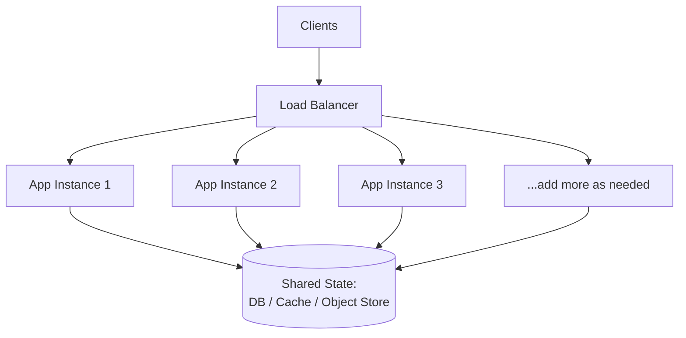

# Horizontal Scaling

> **In one line:** Adding more machines instead of making one bigger (scaling *out*).

## Overview

Horizontal scaling — also called *scaling out* — means adding more machines and running more copies
of the application across them. When the system needs more capacity, you increase the *number* of
nodes rather than the size of a single node. There is no hard ceiling, and the failure of one machine
reduces capacity slightly instead of causing a total outage.

## How It Works

A [load balancer](./04-load-balancer.md) sits in front of a pool of identical, interchangeable
servers and spreads requests across them. You add or remove instances to match demand.

### The statelessness requirement

Horizontal scaling requires servers to be **stateless** — they must hold no request-specific or
user-specific information *between* requests. If a server keeps state locally (e.g. a session in
memory), requests must always return to that same server ("sticky sessions"), which undermines the
flexibility that makes scaling out work and breaks when that node dies.

**Externalize state** to a shared store instead:

- Sessions → a shared cache (Redis, Memcached) or signed tokens (JWT).
- Uploaded files → [object storage](../02-data-and-storage-concepts/13-object-storage.md).
- Persistent data → a database.

## Use Cases

- **Stateless web/API tiers** — the canonical fit; add instances behind a load balancer.
- **Elastic, spiky traffic** — auto-scaling groups add nodes during peaks and remove them after.
- **High-availability requirements** — redundancy across nodes (and availability zones) so no single
  failure takes the system down.
- **Distributed data stores** — sharded databases, Kafka partitions, and NoSQL clusters scale out by
  design.

## Tips

- **Make instances immutable and identical** so any request can go to any node.
- **Use auto-scaling driven by real signals** (CPU, request queue depth, latency) with sensible min/max
  bounds and cooldowns to avoid thrash.
- **Spread across availability zones** for fault tolerance, not just capacity.
- **Health checks matter:** the load balancer must quickly detect and drain unhealthy nodes.
- **Beware shared bottlenecks:** scaling the app tier only helps until the database or cache becomes
  the constraint — scale those too (read replicas, sharding, caching).

## Trade-offs & Pitfalls

- **Complexity.** More nodes mean orchestration, service discovery, and distributed-systems concerns.
- **State is harder.** Requires deliberate externalization of session and file state.
- **Data consistency.** Coordinating data across many nodes introduces replication lag and
  consistency trade-offs (see [CAP Theorem](../03-distributed-systems-concepts/02-cap-theorem.md)).
- **Cost of coordination.** Distributed locking, leader election, and consensus add overhead.

> **Rule of thumb:** Horizontal scaling is the foundation of both large-scale capacity *and* high
> availability. If uptime matters, you will scale out regardless of raw performance needs.

---

_Notes: (add your own content here)_
