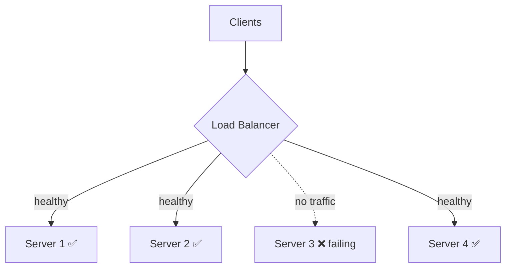

# Load Balancer

> **In one line:** Distributes incoming requests across a group of servers.

## Overview

A load balancer (LB) sits in front of a pool of servers and distributes incoming requests across
them. Every request hits the load balancer first; it picks a backend, forwards the request, and
returns the response. From the outside it looks like a single endpoint; on the inside, many servers
share the work. The load balancer is what makes [horizontal scaling](./03-horizontal-scaling.md)
practical and what keeps a fleet resilient to individual failures.

## How It Works

*The LB continuously health-checks backends and routes around the failing node automatically.*

### Layer 4 vs Layer 7

| | **L4 (Transport)** | **L7 (Application)** |
|---|---|---|
| Operates on | TCP/UDP connections | HTTP(S) requests |
| Can inspect | IP, port | URL path, headers, cookies |
| Routing smarts | Low, very fast | Content-based routing, TLS termination |
| Example | AWS NLB | AWS ALB, Nginx, HAProxy, Envoy |

### Common algorithms

- **Round robin** — rotate through servers in order.
- **Least connections** — send to the server with the fewest active connections.
- **Weighted** — bias toward more powerful nodes.
- **IP hash / consistent hash** — map a client to a consistent server (useful for stickiness or
  cache locality).

### Health checks

The LB periodically probes each backend (e.g. `GET /healthz`). When a server fails checks, the LB
**stops routing to it** and drains it; when it recovers, traffic resumes. This automatic detection
and rerouting is the core of fleet resilience.

## Use Cases

- **Scaling a stateless web/API tier** across many instances.
- **High availability** — surviving the loss of individual nodes and whole availability zones.
- **Zero-downtime deploys** — drain a node, deploy, re-add (rolling / blue-green).
- **TLS termination** — decrypt HTTPS at the LB to offload backends (L7).
- **Blue-green & canary releases** — shift a percentage of traffic to a new version.

## Tips

- **The LB must not become the single point of failure.** Use a managed, redundant LB or run multiple
  instances (often fronted by DNS or an anycast VIP).
- **Prefer stateless backends.** If you must use sticky sessions, understand it weakens even
  distribution and complicates failover.
- **Tune health checks** — too aggressive causes flapping; too lax keeps sending traffic to dead nodes.
- **Enable connection draining** so in-flight requests finish before a node is removed.
- **Match the layer to the need:** L4 for raw throughput and non-HTTP protocols, L7 for
  content-based routing and TLS.

## Trade-offs & Pitfalls

- Adds a network hop and a component that must itself be highly available and scaled.
- L7 features (inspection, TLS) cost more CPU than plain L4 forwarding.
- Sticky sessions can create hot spots and break clean failover.

> **Related:** A load balancer is a specialized kind of [reverse proxy](./10-reverse-proxy.md) focused
> on traffic distribution.

---

_Notes: (add your own content here)_
