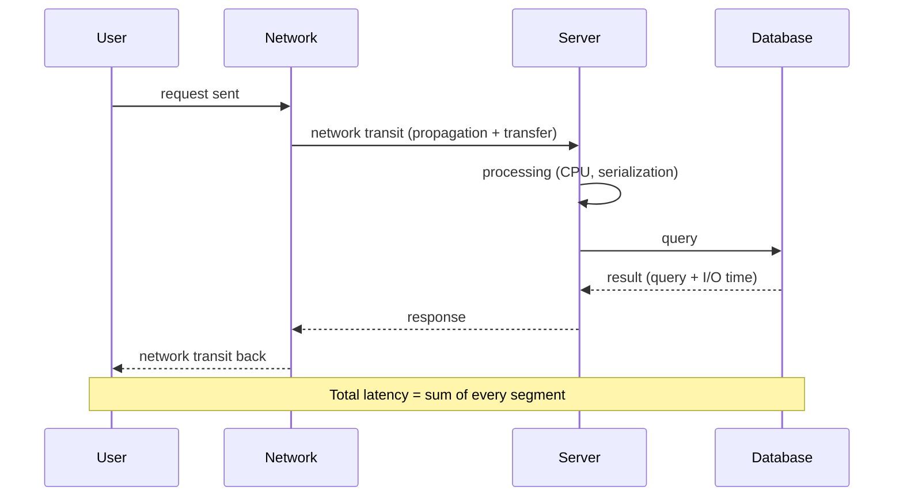

# Latency

> **In one line:** The time between sending a request and receiving a response.

## Overview

Latency is the delay a *single* user experiences — the elapsed time from issuing a request to
receiving the response. Low latency feels instant; high latency feels sluggish. It is distinct from
[throughput](./06-throughput.md), which measures total work per unit time. A system can have high
throughput yet poor latency, and vice versa.

## Where Latency Comes From

Latency is the **sum of many stacked delays** along the request path:

- **Network transit** — propagation (bounded by the speed of light and distance) + transfer time.
- **Server processing** — CPU work, serialization, business logic, waiting on locks.
- **Downstream calls** — database queries, cache lookups, third-party APIs.
- **Queuing** — time spent waiting in queues when the system is busy (grows sharply under load).

Reducing latency means **finding which segment dominates** and optimizing *that* — not guessing.

## Measure the Tail, Not Just the Average

Averages hide pain. Track **percentiles**: p50 (median), p95, p99, p99.9. The tail (p99+) is what
frustrated users and timeouts are made of. A p50 of 50 ms with a p99 of 3 s is a real problem even if
the average looks fine.

## Use Cases / Where It Matters Most

- **Interactive UIs** — every 100 ms of added latency measurably hurts engagement and conversion.
- **Real-time systems** — trading, gaming, video calls, live collaboration.
- **Chained microservices** — latency compounds across hops; one slow dependency drags the whole call.
- **Search & autocomplete** — sub-100 ms responsiveness is expected.

## Tips

- **Cache** hot data close to the consumer (in-memory, [CDN](./07-cdn.md)) to skip slow work.
- **Put content near users** with CDNs and multi-region deployments to cut propagation delay.
- **Parallelize** independent downstream calls instead of chaining them sequentially.
- **Reduce payload size** (compression, pagination, field selection) to lower transfer time.
- **Use connection reuse** (keep-alive, HTTP/2, connection pools) to avoid repeated handshakes.
- **Set timeouts and use [circuit breakers](../05-reliability-performance-and-modern-concepts/01-circuit-breaker.md)**
  so one slow dependency cannot inflate everyone's latency.
- **Attack queuing latency** by adding capacity or shedding load before queues build up.

## Trade-offs & Pitfalls

- Caching lowers latency but risks **staleness**.
- Optimizing latency (e.g. more replicas closer to users) can raise cost and complexity.
- Latency and throughput sometimes trade off — e.g. batching improves throughput but adds latency.

---

_Notes: (add your own content here)_
