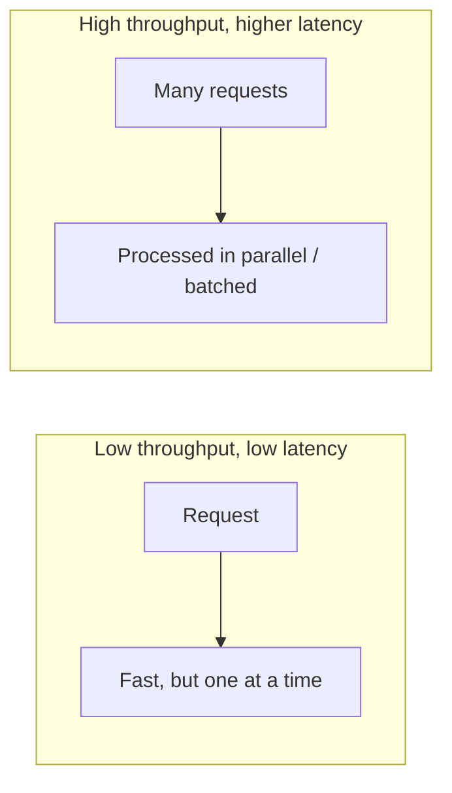

# Throughput

> **In one line:** How much work a system completes in a given period.

## Overview

Throughput is the total amount of work a system completes per unit of time — usually measured in
requests per second (RPS/QPS), transactions per second (TPS), or messages/records per second. It
describes the system's **total capacity for work**, not the speed of any individual request.

## Latency vs Throughput

They are related but different, and optimizing one does not automatically improve the other:

- A system can be **fast per request but low total** if it handles one at a time.
- A system can be **slow per request but high total** if it processes many in parallel.

A useful mental model is **Little's Law**:

> **Concurrency = Throughput × Latency**

To raise throughput you either lower per-request latency or increase concurrency (more workers,
connections, or parallelism).

## What Limits Throughput

Throughput is capped by the **most constrained resource** on the path — CPU, memory, disk I/O,
network bandwidth, database connections, or a downstream API's rate limit. Raising throughput means
finding and widening that bottleneck.

## Use Cases

- **Batch & data pipelines** — maximize records processed per hour (ETL, log ingestion).
- **High-traffic APIs** — sustain millions of RPS across a fleet.
- **Message/stream processing** — Kafka consumers, event processors measured in messages/sec.
- **Capacity planning** — sizing a fleet to a target peak RPS with headroom.

## Tips

- **Scale horizontally** — add workers/instances behind a [load balancer](./04-load-balancer.md) to
  raise aggregate throughput.
- **Batch where possible** — grouping work amortizes fixed costs (great for throughput; watch the
  added latency).
- **Use async processing & queues** — decouple producers from consumers so spikes are absorbed rather
  than dropped (see [Message Queue](../04-messaging-and-communication-concepts/01-message-queue.md)).
- **Pool expensive resources** — connection pools prevent per-request setup from capping throughput.
- **Load test to find the knee** — the point where adding load stops increasing throughput and starts
  increasing latency and errors.
- **Apply backpressure & rate limiting** so throughput degrades gracefully instead of collapsing.

## Trade-offs & Pitfalls

- Chasing maximum throughput (batching, deep queues) often **increases latency**.
- Beyond the saturation point, pushing more load *reduces* effective throughput (thrashing, retries).
- Higher throughput usually means more infrastructure and cost.

> **Design guidance:** State both goals explicitly — e.g. "10,000 RPS at p99 < 200 ms." A throughput
> target without a latency bound (or vice versa) is only half a requirement.

---

_Notes: (add your own content here)_
