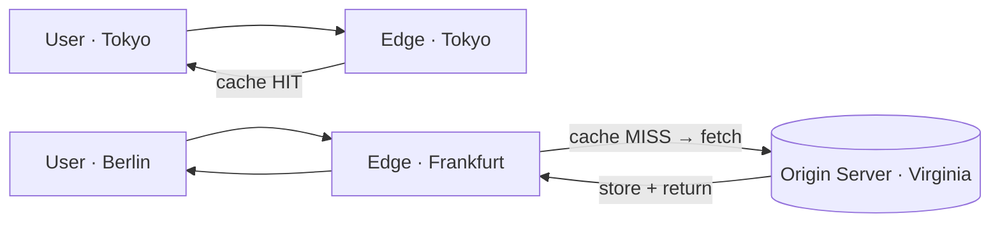

# CDN (Content Delivery Network)

> **In one line:** Globally distributed servers that cache content and serve it from the location nearest to each user.

## Overview

A CDN is a network of servers ("edge" or "PoP" — Points of Presence) distributed around the world
that cache copies of content and serve them from the location closest to each user. Instead of every
user fetching an asset from a single origin server on another continent, they fetch it from an edge
server in or near their city. This cuts [latency](./05-latency.md) dramatically and offloads a huge
amount of traffic from the origin.

## How It Works

1. A user requests an asset; DNS/anycast routes them to the nearest edge.
2. **Cache HIT** — the edge has a fresh copy and returns it immediately.
3. **Cache MISS** — the edge fetches from the origin, caches it, and returns it. Subsequent nearby
   users get a HIT.

### Cache control & invalidation

Freshness is governed by HTTP headers (`Cache-Control`, `ETag`, `max-age`) and by explicit
**invalidation/purge** when content changes. A common pattern is **cache-busting**: put a version or
hash in the filename (`app.9f3c1.js`) so a new deploy is a new URL that can be cached forever.

## What to Serve From a CDN

- **Static assets** — images, video, CSS, JavaScript, fonts, downloads.
- **Dynamic content at the edge** — many CDNs cache API/HTML responses briefly and run edge functions.
- **Large media / streaming** — video segments (HLS/DASH) are a classic CDN workload.

## Use Cases

- **Global websites & SPAs** — ship JS/CSS/images from the edge for fast first paint everywhere.
- **Video streaming** — Netflix/YouTube-style delivery relies on edge caching.
- **Software & game distribution** — large binaries downloaded from nearby edges.
- **DDoS absorption & TLS offload** — the CDN absorbs volumetric attacks and terminates HTTPS at the edge.

## Tips

- **Version immutable assets** and cache them with long TTLs; use short TTLs or purge for things that
  change.
- **Set `Cache-Control` deliberately** — don't rely on CDN defaults.
- **Separate cacheable from personalized content** — never cache user-specific responses on shared
  edges (watch cookies and `Vary` headers).
- **Use a cache key that ignores irrelevant query params** to raise your hit ratio.
- **Monitor cache hit ratio** — a low ratio means you're paying for the CDN without the benefit.
- **Pre-warm** caches before big launches so the first wave of users doesn't all MISS to the origin.

## Trade-offs & Pitfalls

- **Staleness:** cached content can lag the origin until it expires or is purged.
- **Accidental caching of private data** is a real security risk — be explicit about what is cacheable.
- **Invalidation is hard** and purges can take time to propagate globally.
- Adds a vendor dependency and cost, though usually far cheaper than serving everything from origin.

---

_Notes: (add your own content here)_
