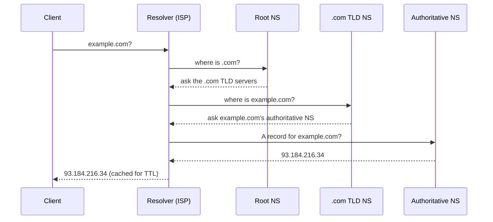

# DNS (Domain Name System)

> **In one line:** Translates human-readable domain names into IP addresses — the internet's directory service.

## Overview

DNS translates human-readable domain names like `example.com` into the IP addresses computers use to
locate each other. Without it we'd memorize IPs. Beyond simple name resolution, DNS is a powerful
**traffic-routing** tool in system design: it can direct users to different servers based on
geography, load, or health.

## How Resolution Works

Results are **cached** at each level (browser, OS, resolver) for the record's **TTL**. This makes DNS
fast but also **slow to reflect changes** — a lowered TTL still won't help clients that already cached
the old value.

### Common record types

| Record | Purpose |
|---|---|
| **A / AAAA** | Domain → IPv4 / IPv6 address |
| **CNAME** | Alias one name to another name |
| **MX** | Mail server for the domain |
| **TXT** | Arbitrary text (SPF, domain verification) |
| **NS** | Delegates a zone to authoritative name servers |

## DNS as a Routing Tool

- **GeoDNS** — return different IPs based on the user's region (route to the nearest data center).
- **Latency-based routing** — send users to the lowest-latency region.
- **Weighted routing** — split traffic by percentage (useful for gradual rollouts).
- **Failover / health checks** — stop returning the IP of an unhealthy endpoint.

## Use Cases

- **Multi-region routing** — direct users to the closest healthy region.
- **Blue-green / canary at the DNS layer** — weighted records shift traffic between stacks.
- **Disaster recovery failover** — flip traffic to a standby region when the primary is down.
- **Service discovery** — internal DNS resolves service names within a cluster.

## Tips

- **Keep TTLs low before planned changes** (e.g. migrations, failover), then raise them again for
  cache efficiency — but plan for the change window since old TTLs still apply to cached entries.
- **Don't rely on DNS for fast failover** — propagation and client caching make it slow (seconds to
  minutes). Combine with a [load balancer](./04-load-balancer.md) or anycast for quick reactions.
- **Use health-checked, managed DNS** (Route 53, Cloudflare, NS1) for automatic failover.
- **Avoid CNAME at the zone apex** (`example.com`) — use ALIAS/ANAME records offered by managed providers.
- **Reduce lookups** by consolidating domains; each new hostname can add a resolution round trip.

## Trade-offs & Pitfalls

- **Slow to propagate:** caching by clients and intermediate resolvers delays changes.
- **Coarse control:** routing decisions are per-resolver, not per-request.
- **A critical dependency & attack surface:** DNS outages take everything down; secure it (DNSSEC,
  registrar locks) and monitor it.

---

_Notes: (add your own content here)_
