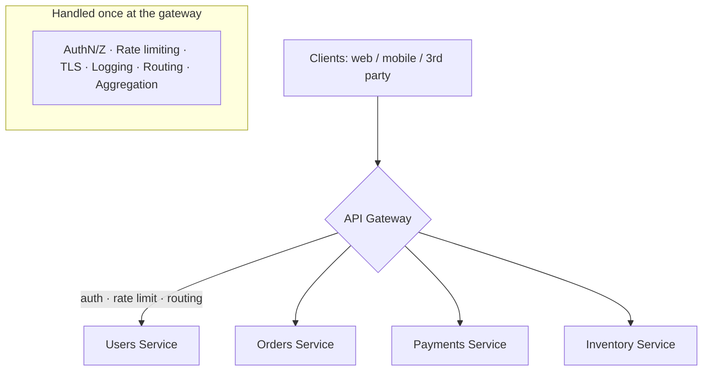

# API Gateway

> **In one line:** A single entry point in front of many services that handles cross-cutting concerns.

## Overview

An API gateway is a single entry point that sits in front of multiple backend services and handles
**cross-cutting concerns** in one place: authentication, authorization, rate limiting, TLS
termination, request routing, aggregation, and observability. It is a cornerstone of microservice
architectures — clients talk to the gateway, and the gateway talks to the services.

## How It Works

Without a gateway, **every** service must implement auth, rate limiting, logging, and TLS itself.
With a gateway, those concerns are centralized and every service behind it inherits them for free,
so services can focus on business logic.

### Typical responsibilities

- **Authentication & authorization** — validate tokens/JWTs, enforce scopes.
- **Rate limiting & throttling** — protect backends from abuse and overload.
- **Routing & versioning** — map `/v2/orders` to the right service/version.
- **Request/response transformation** — protocol translation (REST↔gRPC), field shaping.
- **Aggregation** — fan out to several services and combine responses (reduces client round trips).
- **TLS termination, caching, and observability** — metrics, tracing, and logging in one place.

### Gateway vs Load Balancer

A [load balancer](./04-load-balancer.md) distributes traffic across identical instances of *one*
service (L4/L7 routing). An API gateway is **application-aware**, routing across *many different*
services and adding API-management features. They are complementary and often layered (LB → gateway →
services, or gateway fronted by an LB).

### The BFF pattern

A common variation is **Backend-for-Frontend**: a dedicated gateway per client type (web, mobile,
partner API) tailored to that client's needs.

## Use Cases

- **Microservices front door** — one public endpoint for dozens of internal services.
- **Public/partner APIs** — API keys, quotas, plans, and usage analytics.
- **Mobile & web clients** — response aggregation to minimize chatty round trips.
- **Legacy modernization** — expose old systems behind a clean, secured API surface.

## Tips

- **Make it highly available and horizontally scaled** — it's on the critical path for every request.
- **Keep business logic OUT of the gateway.** It should handle cross-cutting concerns, not domain
  rules — otherwise it becomes a bottleneck and a deployment chokepoint.
- **Avoid the "distributed monolith" trap** where every team's logic creeps into a shared gateway;
  consider per-team BFFs.
- **Cache and short-circuit** cheap responses at the gateway to reduce backend load.
- **Propagate a correlation/trace ID** from the gateway through all services for end-to-end tracing.
- **Fail gracefully** — pair with [circuit breakers](../05-reliability-performance-and-modern-concepts/01-circuit-breaker.md)
  and timeouts so one bad service doesn't stall the gateway.

## Trade-offs & Pitfalls

- **Single point of failure / bottleneck** if under-provisioned or poorly isolated.
- **Added latency** from the extra hop (usually small, but real).
- **Operational & organizational coupling** — a shared gateway can become a contention point between
  teams.

> **Examples:** Kong, Amazon API Gateway, Apigee, Envoy/Ambassador, NGINX, Tyk.

---

_Notes: (add your own content here)_
