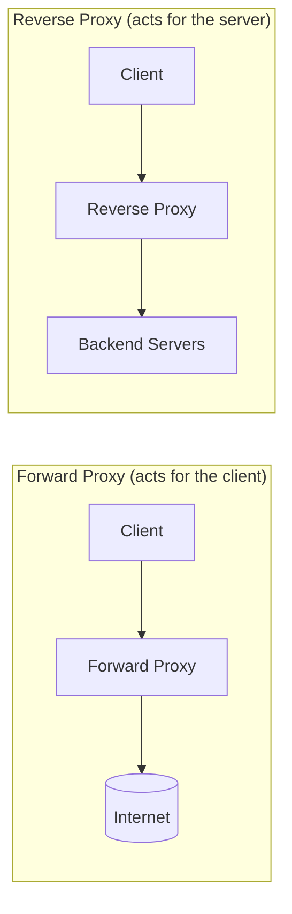
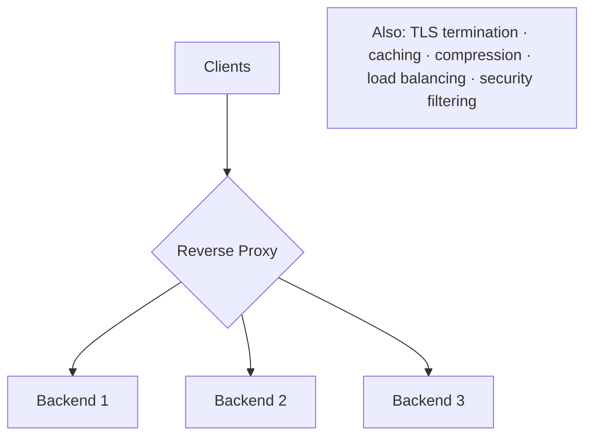

# Reverse Proxy

> **In one line:** A server that receives requests on behalf of backend servers and forwards them.

## Overview

A reverse proxy sits between clients and one or more backend servers, receiving requests and
forwarding them to the appropriate server. The client only ever talks to the proxy and does not know
(or need to know) which backend actually handled the request. It is a broad, general-purpose building
block — [load balancers](./04-load-balancer.md) and [API gateways](./09-api-gateway.md) are both
*specialized* reverse proxies.

## Forward Proxy vs Reverse Proxy

- A **forward proxy** represents the *client* (e.g. a corporate egress proxy or VPN) and hides clients
  from the internet.
- A **reverse proxy** represents the *server* and hides the backend topology from clients.

## What Reverse Proxies Do

- **Load balancing** — spread requests across backends.
- **TLS/SSL termination** — decrypt HTTPS once at the edge, freeing backends.
- **Caching** — serve repeated responses without hitting the backend.
- **Compression** — gzip/brotli responses to cut transfer time.
- **Security** — hide internal IPs, filter requests, act as a WAF, mitigate DDoS.
- **Routing & rewrites** — path-based routing, header manipulation, URL rewriting.

## Reverse Proxy vs Load Balancer vs API Gateway

| | **Reverse Proxy** | **Load Balancer** | **API Gateway** |
|---|---|---|---|
| Primary job | General intermediary | Distribute traffic across identical nodes | Manage APIs across many services |
| Scope | Broad | Traffic distribution | Application/API concerns |
| Relationship | Superset | A specialized reverse proxy | A reverse proxy + API management |

They overlap heavily; a single tool (e.g. NGINX or Envoy) can play all three roles depending on config.

## Use Cases

- **Front a web app** with NGINX for TLS termination, static caching, and compression.
- **Serve many apps on one host/port** via name- or path-based routing.
- **Shield backends** — expose only the proxy publicly; keep app servers on a private network.
- **Ingress controllers** in Kubernetes (NGINX Ingress, Envoy, Traefik) are reverse proxies.

## Tips

- **Terminate TLS at the proxy** to simplify certificate management and offload CPU from backends.
- **Cache static and cacheable responses** at the proxy to cut backend load and latency.
- **Set sensible timeouts and buffering** so slow clients or backends can't exhaust resources.
- **Preserve client context** — forward `X-Forwarded-For`, `X-Forwarded-Proto`, and a trace ID so
  backends still see the real client and can correlate logs.
- **Make it redundant** — like any inline component, the proxy must not be a single point of failure.

## Trade-offs & Pitfalls

- Adds a hop and a component to operate, secure, and scale.
- Misconfigured caching or header forwarding causes subtle bugs (wrong client IP, stale/private data).
- Doing too much in the proxy (heavy logic) turns a simple intermediary into a bottleneck.

> **Examples:** NGINX, HAProxy, Envoy, Traefik, Apache httpd, Caddy.

---

_Notes: (add your own content here)_
