# 1. Design a User Authentication System

> **In one line:** Design a production-grade authentication system for a Node.js application — user
> registration, password hashing, JWT access/refresh tokens, protected APIs, role-based
> authorization, logout/revocation, and the trade-offs behind each choice.

> **Original prompt:** Create the Mongoose schema for users and implement a JWT-based auth middleware.

## Overview

Almost every Node.js developer has built a `/login` endpoint: compare a password hash, sign a JWT, add
an `authenticate` middleware, and move on. That works — until you have to reason about it as a *system*:

- Where are passwords stored, and in what form?
- What happens when a token is stolen?
- How does logout work if JWTs are **stateless**?
- What happens with **multiple Node.js instances** behind a load balancer?
- Where do refresh tokens live, and how do you revoke one?
- Does Redis belong in the request path?
- How do other services (or Google/SSO) verify the token?

The goal of this problem is **not** to memorize one architecture. It is to understand the *patterns*
behind authentication so you can pick the right design when requirements change.

## Step 0: Start With the Problem, Not the Technology

The most common interview mistake is opening with *"I'll use JWT."* That jumps to a solution before the
problem is understood. Start by scoping requirements.

**In scope for this design:**

- User registration and email/password login
- Password hashing
- JWT access tokens + refresh tokens
- Logout and protected APIs
- Role-based authorization (RBAC)
- Multiple stateless Node.js instances
- Rate limiting and token/session revocation

**Explicitly out of scope (can be added later):**

- Social login, MFA, passkeys/WebAuthn, enterprise SSO

## Authentication vs Authorization

These are different questions, and separating them makes the whole design cleaner.

| | Question it answers | Example |
|---|---|---|
| **Authentication** | *Who are you?* | Verify email + password → authenticated user |
| **Authorization** | *What are you allowed to do?* | `role = ADMIN` → can access `/admin/users` |

```text
401 → Not authenticated   (we don't know who you are)
403 → Authenticated but not authorized  (we know you, but you can't do this)
```

## A Mental Model: Four Questions

Rather than memorizing dozens of concepts, drive the design with four questions:

1. **How does the user prove identity?** — password, OTP, passkey, OAuth.
2. **How do we maintain authenticated state?** — session, JWT, refresh token, or a combination.
3. **How do we protect APIs?** — middleware, API gateway, authorization policies.
4. **How do we handle lifecycle & security?** — expiration, refresh, logout, revocation, rate limiting, key rotation.

## High-Level Architecture

The key architectural decision: keep the Node.js application **stateless** wherever possible, so
instances can be added or removed without caring which one receives a request (see
[Scalability](../01-core-infrastructure-concepts/01-scalability.md) and
[Horizontal Scaling](../01-core-infrastructure-concepts/03-horizontal-scaling.md)). Shared state lives
in purpose-built stores — MongoDB for users, Redis for sessions/revocation/rate limiting.

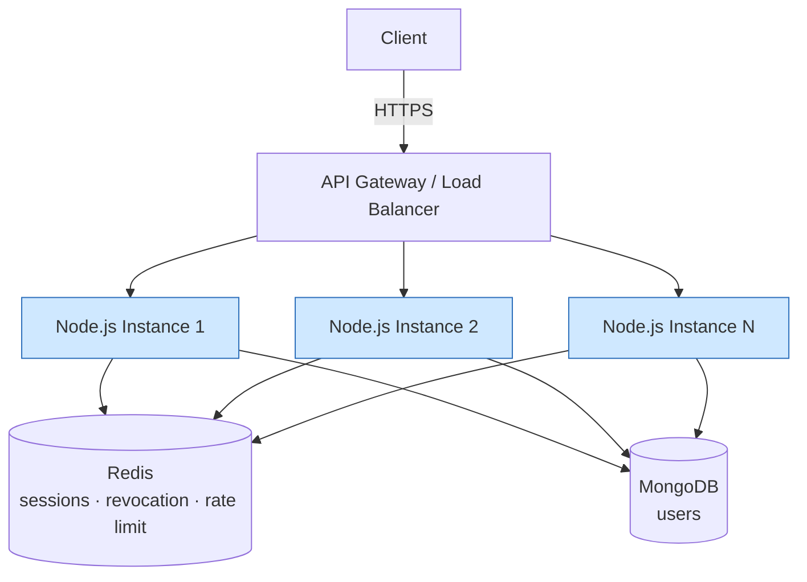

Related infrastructure concepts: [Load Balancer](../01-core-infrastructure-concepts/04-load-balancer.md),
[API Gateway](../01-core-infrastructure-concepts/09-api-gateway.md).

## User Registration Flow

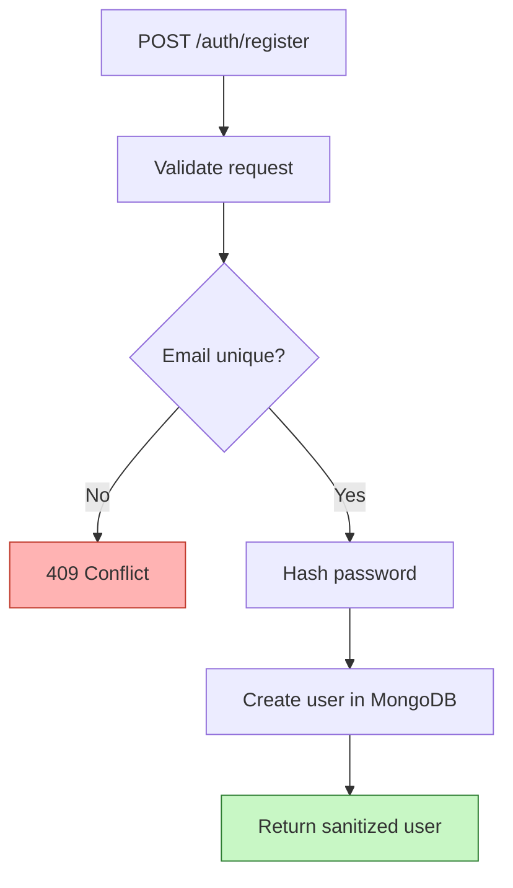

The important part is what we **never** store: the plaintext password. We store only a hash.

```text
password  →  Argon2id / bcrypt  →  passwordHash  →  MongoDB
```

After hashing, the application never needs the original password again.

## Designing the User Schema

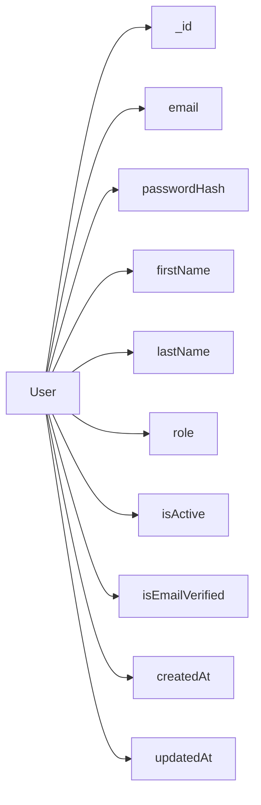

```typescript
import { Schema, model } from "mongoose";

const userSchema = new Schema(
  {
    email: {
      type: String,
      required: true,
      unique: true,   // enforced by a MongoDB unique index, not just app logic
      lowercase: true,
      trim: true,
      index: true,
    },
    passwordHash: {
      type: String,
      required: true,
      select: false,  // never returned by default queries
    },
    firstName: { type: String, required: true, trim: true },
    lastName: { type: String, required: true, trim: true },
    role: {
      type: String,
      enum: ["USER", "ADMIN"],
      default: "USER",
    },
    isActive: { type: Boolean, default: true },
    isEmailVerified: { type: Boolean, default: false },
  },
  { timestamps: true },
);

export const User = model("User", userSchema);
```

Two details worth calling out in an interview:

- **`unique: true` is a database concern, not just validation.** The MongoDB unique index enforces
  uniqueness under concurrency; the application should still catch and translate the duplicate-key
  error into a clean `409`.
- **`select: false` on `passwordHash`** prevents accidentally leaking the hash in normal queries. During
  login you opt in explicitly:

```typescript
const user = await User.findOne({ email }).select("+passwordHash");
```

## Password Hashing

Use a **password-specific** hashing algorithm — **Argon2id** (strong default for new systems) or
**bcrypt** (widely used, well understood). These are *deliberately slow* to make brute-force expensive.

> Do **not** use a fast general-purpose hash like SHA-256 for password storage — it is far too cheap to
> brute-force at scale.

```text
Registration:  password → Argon2id/bcrypt → hash → DB
Login:         password → compare against stored hash → match?
```

Passwords are **hashed, not encrypted** — there is no "decrypt" step, and there shouldn't be.

```typescript
import argon2 from "argon2";

export const hashPassword = (plain: string) => argon2.hash(plain);
export const verifyPassword = (hash: string, plain: string) =>
  argon2.verify(hash, plain);
```

## Login Flow

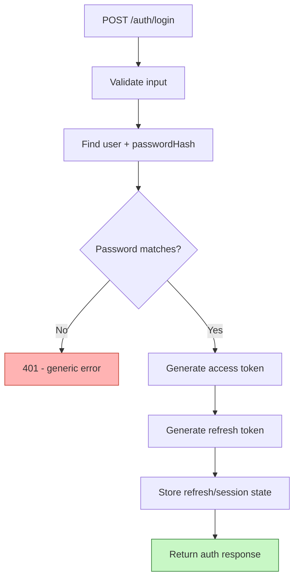

A typical response returns only the short-lived access token in the body:

```json
{ "accessToken": "...", "expiresIn": 900 }
```

The refresh token is handled separately. For **browser** clients, a **Secure, HttpOnly cookie** is often
preferable for the refresh token because JavaScript cannot read it (mitigating XSS token theft).

> **Generic errors matter:** respond with the same "invalid credentials" message whether the email is
> unknown or the password is wrong, so attackers can't enumerate valid accounts.

## Why Both an Access Token and a Refresh Token?

This is one of the most important design decisions.

| Token | Lifetime | Used for |
|---|---|---|
| **Access token** | 5–15 minutes | Normal API requests |
| **Refresh token** | Days / weeks | Obtaining a new access token |

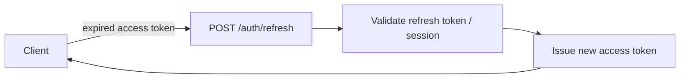

Why not just make the access token valid for 30 days? Because if it is stolen, it works until it
expires. **Short-lived access tokens shrink the damage window**; the long-lived refresh token lives in
a more protected place (HttpOnly cookie / server-side session) and can be revoked.

## What Goes Inside a JWT?

```json
{
  "sub": "user-id",
  "role": "USER",
  "iat": 1720000000,
  "exp": 1720000900,
  "iss": "auth-service",
  "aud": "my-api"
}
```

Useful claims: `sub` (subject/user id), `iat` (issued at), `exp` (expiry), `iss` (issuer), `aud`
(audience). **Do not** put passwords, card data, sensitive PII, or large blobs in the token.

> **A normal JWT is signed, not encrypted.** Anyone holding it can decode the payload; the signature
> only guarantees integrity. Treat the payload as public.

## JWT Authentication Middleware

The middleware's single job: establish *"this request has a valid authenticated identity"* and attach
it to `req.user`.

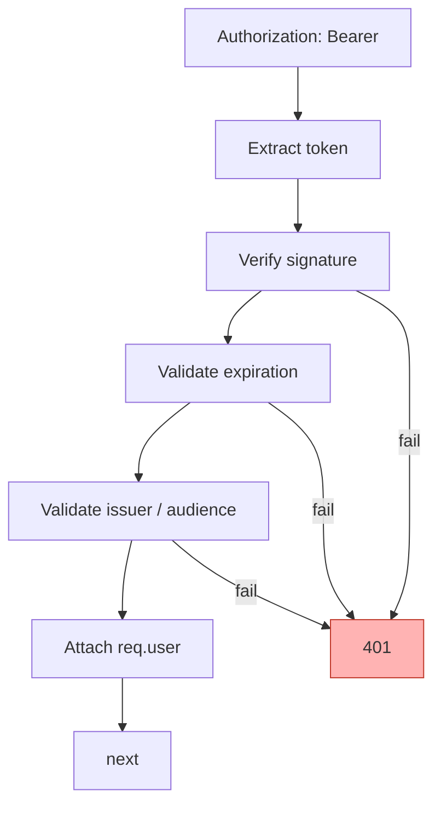

```typescript
export const authenticate = (
  req: AuthenticatedRequest,
  res: Response,
  next: NextFunction,
) => {
  try {
    const header = req.headers.authorization;
    if (!header?.startsWith("Bearer ")) {
      return res.status(401).json({ message: "Authentication required" });
    }

    const token = header.substring(7);
    const payload = jwt.verify(token, process.env.JWT_ACCESS_SECRET!, {
      issuer: "auth-service",
      audience: "my-api",
      algorithms: ["HS256"], // pin the algorithm — never trust the token's own "alg"
    });

    req.user = payload as AuthPayload;
    next();
  } catch {
    return res.status(401).json({ message: "Invalid or expired token" });
  }
};
```

> **Security note:** always pin the accepted `algorithms`. Verifying without an allow-list opens the
> classic `alg: none` and algorithm-confusion attacks.

## Authentication vs Authorization Middleware

Keep them as **separate** middlewares — one answers *who*, the other answers *what they can do*.

```typescript
router.get("/admin/users", authenticate, authorize("ADMIN"), getUsers);
```

```typescript
export const authorize =
  (...roles: string[]) =>
  (req: AuthenticatedRequest, res: Response, next: NextFunction) => {
    if (!req.user) return res.status(401).json({ message: "Not authenticated" });
    if (!roles.includes(req.user.role)) {
      return res.status(403).json({ message: "Forbidden" });
    }
    next();
  };
```

## Refresh Token Rotation

Instead of reusing the same refresh token forever, issue a **new** one on every refresh and invalidate
the old one.

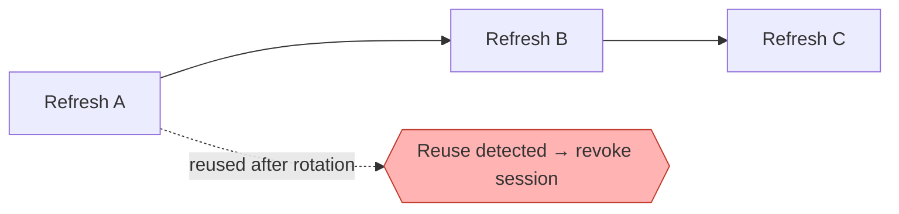

Rotation lets the server **detect replay**: if an already-rotated (old) refresh token is presented, that
signals theft, and the server can invalidate the whole session/family.

## Session Storage

Even with JWTs, you usually want server-side state for **refresh tokens** so you can manage their
lifecycle.

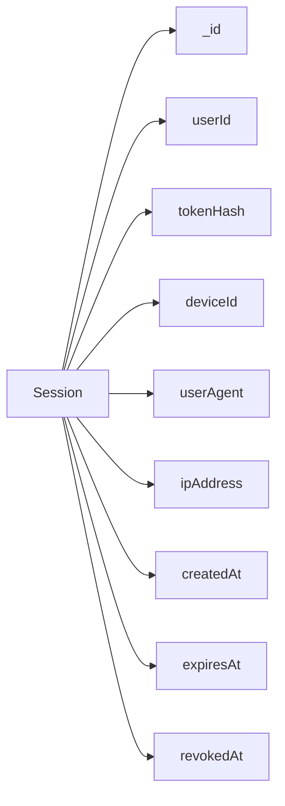

This unlocks: logout current device, logout all devices, revoke a session, list active sessions, and
detect refresh-token reuse. Store the **hash** of the refresh token (`tokenHash`), never the plaintext —
so a database leak doesn't hand out usable tokens.

## The Logout Problem With JWT

A stateless access token can't simply be "deleted." If it is valid for 15 minutes and the user logs out
after 2, the JWT is still technically valid for 13 more minutes.

The pragmatic answer: **short-lived access token + revoke the refresh token/session**.

```text
On logout:
  access token   → left to expire naturally (minutes)
  refresh token  → revoked immediately (no new access tokens can be minted)
```

If you truly need *immediate* access-token invalidation, add a revocation mechanism — at the cost of a
lookup in the request path.

## JWT Revocation Patterns

| Pattern | How it works | Trade-off |
|---|---|---|
| **A. Short-lived JWT** | Access token simply expires quickly | Simplest & most scalable; not *immediate* |
| **B. Redis blacklist** | Check token/jti against Redis on each request | Immediate revocation; adds a lookup to every request |
| **C. Token version** | Store `tokenVersion` per user; embed it in the JWT; bump it to invalidate | Great for "logout everywhere"/password change; coarse-grained |

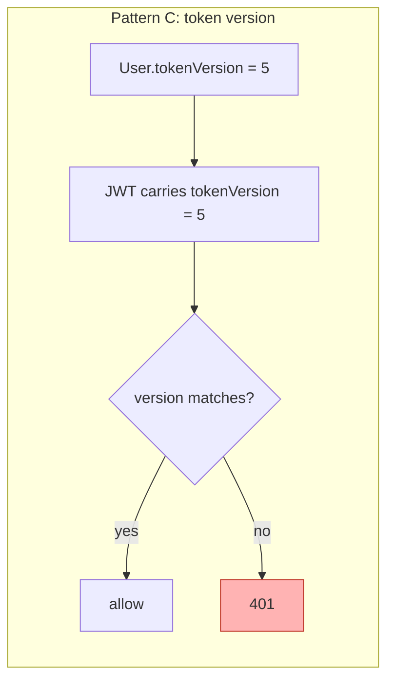

Bumping `tokenVersion` (e.g. `5 → 6`) instantly invalidates every previously issued token — ideal for
password changes, "log out all devices," and security incidents.

## Where Does Redis Fit?

A common mistake: *"Since we use JWT, every JWT goes into Redis."* That defeats the point of stateless
validation. Instead, use [Redis / cache](../02-data-and-storage-concepts/08-cache.md) for:

- Refresh-token / session state
- Revocation lists (blacklist / version)
- [Rate limiting](../05-reliability-performance-and-modern-concepts/02-rate-limiting.md) counters
- Caching and temporary auth workflows (OTP, reset tokens)

The access token itself should normally be validated **locally**, with no network hop.

## Rate Limiting Authentication

Auth endpoints are prime targets for brute force, credential stuffing, bots, and password spraying. In a
distributed deployment, track counters in Redis so the limit is shared across all instances.

```text
Key strategies:  IP + endpoint        (blunt, protects the endpoint)
                 IP + email           (targeted, with safeguards against lockout abuse)
```

See [Rate Limiting](../05-reliability-performance-and-modern-concepts/02-rate-limiting.md) for the token
bucket algorithm. Exact thresholds depend on the product.

## Security Doesn't Stop at JWT

A production system should account for the full checklist:

- HTTPS everywhere
- Password hashing (Argon2id / bcrypt)
- Rate limiting on auth endpoints
- Input validation
- Secure, HttpOnly, SameSite cookies for refresh tokens
- CSRF protection (for cookie-based auth) and XSS protection
- Token expiration + refresh-token rotation
- Signing-key rotation (JWKS)
- Audit logging and secret management
- Generic authentication error messages

> **Cookies vs localStorage:** there's no universal answer, but sensitive long-lived credentials should
> not sit in JavaScript-accessible storage. HttpOnly + Secure + SameSite cookies reduce XSS token theft,
> while CSRF protection is still required for cookie-based flows.

## HS256 vs RS256

This matters once the system grows into multiple services.

| | HS256 (symmetric) | RS256 (asymmetric) |
|---|---|---|
| Keys | One shared secret signs **and** verifies | Private key signs, public key verifies |
| Distribution | Every verifier needs the shared secret | Only the auth service holds the private key |
| Best for | Single app / small system | Distributed systems & microservices |
| Rotation | Harder (secret is everywhere) | Public keys published via a **JWKS** endpoint |

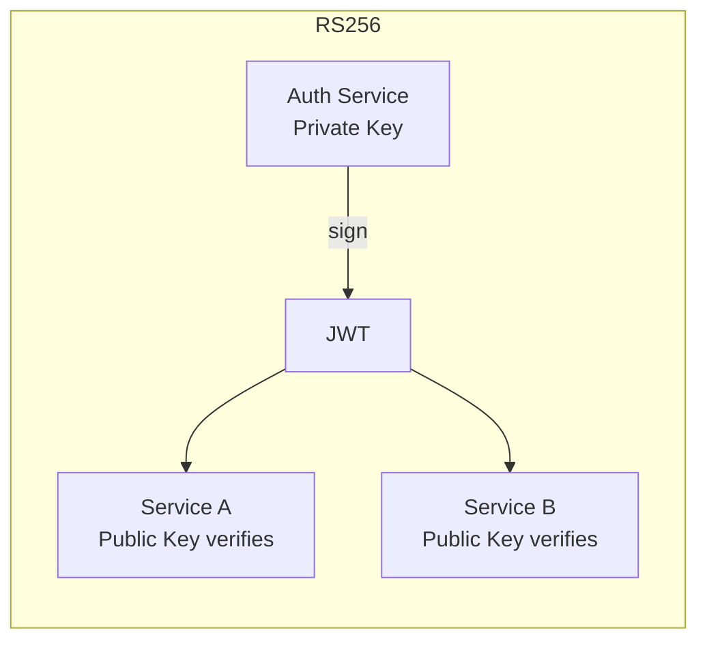

RS256 is attractive at scale because the signing key never leaves the auth service, and rotation is
handled by publishing public keys through JWKS.

## Authentication in Microservices

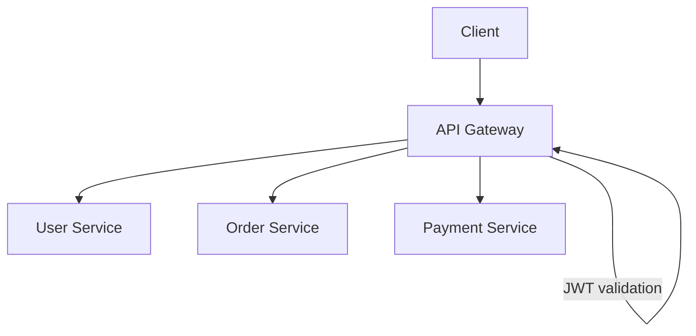

The **Auth Service** owns login, registration, token issuance/refresh, logout, identity, and key
management. Other services **verify** the token (answering *"who is this?"*) and then apply their own
**authorization** (*"can this user do this?"*). The gateway can centralize the common validation.

## The Major Patterns (and When to Use Them)

There is no single "best" authentication architecture — the product decides. The patterns worth knowing:

1. **Server-side sessions** — session ID in a cookie, state in Redis/DB. *Fit:* traditional/server-rendered web apps needing strong session control.
2. **Stateless JWT** — verify locally, no session lookup. *Fit:* APIs, microservices, mobile.
3. **JWT + refresh token** — short-lived access + long-lived refresh in a session store. *Fit:* the common practical default for mobile + API.
4. **JWT + Redis revocation** — validate JWT then check Redis. *Fit:* when immediate revocation matters (adds a request-path lookup).
5. **JWT + token version** — bump a per-user version to invalidate. *Fit:* password change, logout-all, incidents.
6. **OAuth 2.0 / OpenID Connect** — delegate identity to a provider (Google, Microsoft, Auth0, Okta). *OAuth 2.0 is an authorization framework; OIDC adds an identity layer on top.*
7. **API Gateway auth** — gateway validates JWT centrally; services enforce authorization.
8. **Central Auth Service** — one service issues tokens others trust; good for shared identity.
9. **OAuth/OIDC + API Gateway** — enterprise SSO + centralized identity.
10. **Passwordless** — OTP / magic link / passkeys (WebAuthn).
11. **Multi-Factor Authentication** — password **+** OTP/authenticator/passkey; a layer, not a separate architecture.
12. **Hybrid** — server-side session/refresh token issues short-lived JWTs for efficient API auth *and* lifecycle control.

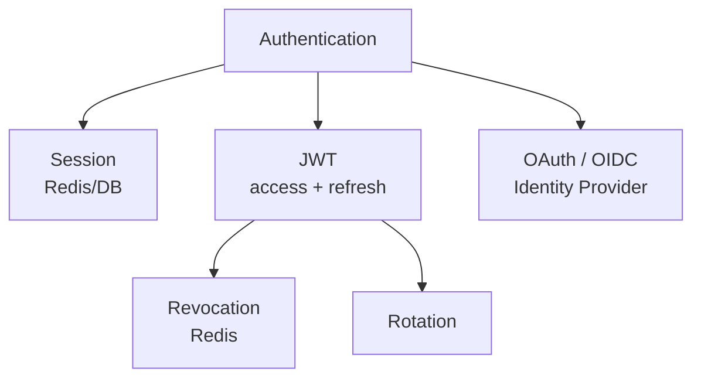

## How to Choose

Don't assert *"JWT is better than sessions."* Match the pattern to the requirement:

| Requirement | Reasonable choice |
|---|---|
| Traditional web application | Server session |
| Stateless API | JWT |
| Mobile + API | JWT + refresh token |
| Microservices | JWT + asymmetric signing (RS256) |
| Enterprise SSO / social login | OAuth / OIDC |
| Immediate revocation | Session or revocation mechanism |
| Simple application | Session or JWT |
| Passwordless product | OTP / passkeys |
| Strong authentication | MFA |
| Large distributed system | Auth service + OIDC/JWT |

## Suggested Node.js Project Structure (LLD)

Keep responsibilities separated — don't put the whole system in one `auth.js`.

```text
src/
├── modules/
│   └── auth/
│       ├── auth.controller.ts   # HTTP handling
│       ├── auth.service.ts      # business logic
│       ├── auth.routes.ts
│       ├── auth.validation.ts
│       └── auth.types.ts
├── models/
│   ├── user.model.ts
│   └── session.model.ts
├── middleware/
│   ├── authenticate.ts          # who is the user?
│   ├── authorize.ts             # what can they do?
│   └── rateLimiter.ts
├── utils/
│   ├── jwt.ts
│   ├── password.ts
│   └── crypto.ts
└── app.ts
```

## Important API Endpoints

```text
POST /auth/register
POST /auth/login
POST /auth/refresh
POST /auth/logout
GET  /auth/me

POST /auth/change-password
POST /auth/forgot-password
POST /auth/reset-password
```

Protected business APIs sit behind `authenticate` (and `authorize` where roles apply):

```text
GET  /users/me
GET  /orders
POST /orders
```

## What the Interviewer Is Really Testing

Designing auth is rarely about whether you know JWT. It probes whether you can reason about:

- **Security** — protecting passwords and tokens.
- **Architecture** — separating authentication from authorization.
- **Scalability** — working across many stateless Node.js instances.
- **State management** — implications of stateless JWTs vs server-side sessions.
- **Failure handling** — behavior when Redis / MongoDB / the auth service fails.
- **Trade-offs** — *why* this approach over another.
- **Implementation** — translating the design into clean Node.js code.

## Interview Strategy

Don't start by listing JWT claims. Scope first, then go breadth-first, going deeper only where asked:

```text
Requirements → HLD → Registration → Login → Access + Refresh Tokens →
JWT Middleware → Authorization → Logout / Revocation → Security → Scaling → Trade-offs
```

## Tips

- Lead with **requirements and scope**, not "I'll use JWT."
- Separate **authentication (401)** from **authorization (403)** — in code and in explanation.
- Keep the app **stateless**; push shared state to MongoDB and Redis.
- Use **short-lived access tokens + long-lived, revocable refresh tokens**.
- **Rotate** refresh tokens and store only their **hash**.
- **Pin the JWT algorithm** on verification; treat the payload as public (signed, not encrypted).
- Reach for **RS256 + JWKS** once multiple services must verify tokens.

## Trade-offs & Pitfalls

- **Stateless JWT vs immediate revocation** is the central tension: fully stateless validation is cheap
  and scalable but can't instantly kill a token; revocation restores control but adds a request-path lookup.
- **Putting every JWT in Redis** throws away the main benefit of stateless validation — use Redis for
  refresh/session state, revocation, and rate limiting, not routine access-token checks.
- **Fast hashes (SHA-256) for passwords** are a security bug — use Argon2id/bcrypt.
- **Long-lived access tokens** widen the blast radius of a stolen token.
- **Storing refresh tokens in plaintext** turns a DB leak into an account-takeover kit — store hashes.
- **Verifying JWTs without an algorithm allow-list** enables `alg: none` and confusion attacks.
- There is **no universally best** architecture — sessions, JWTs, OAuth/OIDC, refresh tokens, Redis, MFA
  and passwordless are tools. The skill is knowing which one fits the requirement and how it behaves as
  the system scales or fails.

## System Design Cheat Sheet

When you hear *"Design a User Authentication System,"* walk this mental map (the interviewer may only ask
three or four branches — follow the ones they push on):

```text
1.  WHAT?          Which auth requirements?
2.  IDENTITY       Password / OTP / OAuth / Passkey?
3.  STATE          Session / JWT / Hybrid?
4.  TOKENS         Access / Refresh / Expiration?
5.  DATA           User / Session / Token metadata?
6.  SECURITY       Hashing / HTTPS / Rate limiting / CSRF / XSS?
7.  API            Register / Login / Refresh / Logout?
8.  AUTHORIZATION  Roles / Permissions?
9.  SCALE          Stateless Node / Redis / Load balancer?
10. REVOCATION     Session / Rotation / Redis / Token version?
11. DISTRIBUTION   Microservices / API Gateway / JWKS?
12. FAILURE        DB / Redis / Auth service failures?
13. TRADE-OFF      Why this design?
```

## Interview Questions & Answers

A structured question bank for this problem — the kind of questions an interviewer asks (and that you
should ask *them*), grouped by theme, each with a short answer.

### A. Requirement Clarification

- **What authentication methods must the system support?** — Clarify before designing; scope drives everything.
- **Are we supporting email/password only?** — Assume yes for the baseline; social/SSO can be layered later.
- **Do we need Google/GitHub/social login?** — If yes, delegate identity via OAuth 2.0 / OIDC instead of building it.
- **Do we need MFA?** — If yes, add it as a second factor *after* password verification, not a separate architecture.
- **Do we need email verification?** — Store `isEmailVerified`; gate sensitive actions until verified.
- **Do we need password reset?** — Yes in production: time-limited, single-use, hashed reset tokens sent out-of-band.
- **Do we need multiple devices/sessions?** — If yes, model sessions server-side so each device is independently revocable.
- **What does logout mean here?** — Define it explicitly: revoke the refresh token/session; access token expires shortly after.
- **Do we need role-based authorization?** — If yes, store a `role`/permissions and enforce with authorization middleware.
- **Monolith or microservices?** — Monolith → HS256 is fine; microservices → prefer RS256 + a shared verification story.
- **What scale are we expecting?** — Drives stateless design, Redis usage, and DB scaling decisions.

### B. HLD / Architecture

- **Draw the high-level architecture.** — Client → API Gateway/LB → stateless Node instances → Redis (sessions/revocation/rate limit) + MongoDB (users).
- **Where does authentication happen?** — At the edge (gateway) and/or via middleware on each service; token issuance is centralized.
- **Would you create a separate Auth Service?** — Yes once multiple apps/services share identity; keep issuance and key management in one place.
- **Where does the API Gateway fit?** — Single entry point that can centralize JWT validation, routing, and rate limiting.
- **How do multiple Node instances authenticate users?** — They validate the signed JWT locally; no sticky sessions needed.
- **Stateful or stateless?** — Access-token validation is stateless; refresh/session lifecycle is stateful (Redis/DB).
- **How would you scale the auth service horizontally?** — Keep it stateless, put shared state in Redis/MongoDB, run behind a load balancer.
- **What if the Auth Service goes down?** — Existing access tokens keep working until expiry; new logins/refreshes fail — degrade gracefully.
- **What if Redis goes down?** — Refresh/revocation/rate limiting degrade; decide fail-open vs fail-closed per endpoint.
- **What if MongoDB goes down?** — Login/registration fail, but stateless access-token validation still works.

### C. User / Database Design

- **Design the User schema.** — `email`, `passwordHash`, `firstName`, `lastName`, `role`, `isActive`, `isEmailVerified`, timestamps.
- **What fields would you store?** — Identity, credentials (hash only), profile, role/status flags, audit timestamps.
- **How would you store passwords?** — As an Argon2id/bcrypt hash, never plaintext or reversible encryption.
- **Would you store the password itself?** — Never — only its hash.
- **What indexes would you create?** — A unique index on `email` (lowercased); others based on query patterns.
- **How would you enforce unique emails?** — A MongoDB unique index, plus handling the duplicate-key error in the app.
- **Would `passwordHash` be returned in normal queries?** — No — `select: false`, opt in only during login.
- **Would you create a separate Session collection?** — Yes, to manage refresh tokens/devices and enable revocation.
- **What would you store in a session?** — `userId`, `tokenHash`, `deviceId`, `userAgent`, `ipAddress`, `expiresAt`, `revokedAt`.
- **Refresh tokens in MongoDB or Redis?** — Either; Redis for speed/TTL, MongoDB for richer querying/audit — often both.
- **How would you clean up expired sessions?** — TTL indexes (Mongo) or native key expiry (Redis).

### D. Password Security

- **How would you hash passwords?** — Argon2id (preferred) or bcrypt, with sensible cost parameters.
- **Why bcrypt/Argon2 instead of SHA-256?** — They're deliberately slow and salted, making brute force expensive.
- **How would you verify a password?** — Recompute/compare against the stored hash using the library's verify function.
- **How would you handle a compromised password database?** — Hashes buy time; force resets, bump token version, notify users.
- **How would you prevent brute-force login attacks?** — Rate limiting, exponential backoff, and account lockout/throttling.
- **How would you prevent credential stuffing?** — Rate limiting, bot detection, breached-password checks, MFA.
- **Different errors for “no user” vs “wrong password”?** — No — return a single generic error to prevent account enumeration.

### E. JWT

- **Why use JWT?** — Stateless, locally verifiable tokens that scale across many instances/services.
- **What goes inside the JWT?** — Minimal claims: `sub`, `role`, `iat`, `exp`, `iss`, `aud`.
- **What would you not put inside?** — Passwords, PII, card data, or large/sensitive payloads.
- **Signing vs encryption?** — Signing guarantees integrity (payload is readable); encryption hides the payload. A normal JWT is signed.
- **How would you validate a JWT?** — Verify signature with a pinned algorithm, then check `exp`, `iss`, and `aud`.
- **How would you handle token expiration?** — Short access-token TTL; client refreshes via the refresh token.
- **What is an access token?** — A short-lived token used to authorize normal API requests.
- **What is a refresh token?** — A long-lived, revocable token used only to obtain new access tokens.
- **Why not a 30-day access token?** — A stolen token would be usable for 30 days; short TTL shrinks the damage window.
- **How long for the access token?** — Typically 5–15 minutes.
- **How long for the refresh token?** — Days to weeks, depending on product and risk.
- **HS256 vs RS256?** — HS256 for a single app; RS256 for microservices so verifiers only need the public key.
- **How would you rotate signing keys?** — Publish keys via JWKS with key IDs (`kid`); overlap old/new during rotation.
- **How do other microservices verify JWTs?** — Fetch/cache public keys from the JWKS endpoint and verify locally.

### F. JWT Middleware / LLD

- **How would you implement the authentication middleware?** — Extract Bearer token, verify signature/claims, attach `req.user`, call `next()`.
- **Where is the middleware applied?** — On protected routes (and/or centrally at the gateway).
- **How would you extract the Bearer token?** — From the `Authorization: Bearer <token>` header.
- **What if the token is missing?** — Return `401 Authentication required`.
- **What if the token is expired?** — Return `401`; client should refresh.
- **What if the signature is invalid?** — Return `401`; never trust the token's self-declared algorithm.
- **Where do you put the authenticated user?** — On the request object, e.g. `req.user`.
- **How would you implement authorization middleware?** — A separate `authorize(...roles)` that checks `req.user.role`/permissions.
- **How do you differentiate 401 and 403?** — 401 = not authenticated; 403 = authenticated but not permitted.

### G. Refresh Token

- **How does the refresh flow work?** — Client sends refresh token → server validates session → issues a new access token (and rotates refresh).
- **Where would you store refresh tokens?** — Server-side session store (Redis/MongoDB); on browsers, in an HttpOnly cookie.
- **Would you store them in plaintext?** — No — store a hash so a DB leak doesn't expose usable tokens.
- **What is refresh-token rotation?** — Issue a new refresh token on each use and invalidate the previous one.
- **How would you detect reuse?** — If an already-rotated token is presented, flag replay and revoke the session family.
- **How would you revoke a refresh token?** — Mark the session `revokedAt` / delete the Redis key.
- **How would you logout from one device?** — Revoke that device's session only.
- **How would you logout from all devices?** — Revoke all sessions for the user or bump the user's token version.

### H. Logout / Revocation

- **JWTs are stateless — how does logout work?** — Revoke the refresh token/session; the short-lived access token expires soon after.
- **Can you immediately invalidate an access token?** — Not with pure stateless JWT; you need a revocation check.
- **Would you use a JWT blacklist?** — Only when immediate revocation is required, accepting the extra lookup.
- **Would you use Redis for revocation?** — Yes — a fast, TTL-bounded store for blacklists/token versions.
- **Trade-offs of blacklisting?** — Adds a stateful lookup to every request, partly undoing statelessness.
- **Invalidate all tokens after a password change?** — Bump a per-user `tokenVersion` embedded in the JWT.

### I. Browser / Client Security

- **Where would you store the access token?** — In memory (not persistent storage) for browser apps.
- **Where would you store the refresh token?** — In a Secure, HttpOnly cookie for browsers.
- **Cookies vs localStorage?** — Prefer HttpOnly cookies for sensitive tokens; localStorage is exposed to XSS.
- **What are HttpOnly cookies?** — Cookies JavaScript can't read, mitigating token theft via XSS.
- **What is the Secure flag?** — Sends the cookie only over HTTPS.
- **What is SameSite?** — Controls cross-site cookie sending; helps mitigate CSRF.
- **How would you protect against XSS?** — Output encoding, CSP, input sanitization, and keeping tokens out of JS-readable storage.
- **How would you protect against CSRF?** — SameSite cookies plus anti-CSRF tokens for cookie-based auth.
- **Would web and mobile differ?** — Yes — mobile typically uses secure device storage and Bearer headers instead of cookies.

### J. Scalability

- **How would you handle millions of users?** — Stateless nodes, indexed MongoDB (sharded if needed), Redis for hot state.
- **Thousands of logins per second?** — Scale nodes horizontally; rate-limit; tune hashing cost; scale the DB.
- **JWT validation without hitting MongoDB?** — Yes — signature/claim verification is local and needs no DB.
- **Why is stateless validation useful?** — No per-request DB/session lookup, so it scales cheaply across instances.
- **Where does Redis help?** — Sessions, revocation, rate limiting, caching, OTP/reset workflows.
- **How would you rate-limit logins?** — Redis counters keyed on IP+endpoint (and IP+email with safeguards).
- **Thousands of simultaneous refreshes?** — Keep refresh cheap, cache verification keys, scale Redis/nodes.
- **How would you scale MongoDB?** — Indexing, replica sets for reads, sharding for writes/data volume.
- **How would you scale Redis?** — Clustering/replication and appropriate eviction/TTL policies.

### K. Failure Scenarios

- **Redis unavailable?** — Refresh/revocation/rate limiting degrade; choose fail-open vs fail-closed deliberately.
- **MongoDB unavailable?** — Login/registration fail; existing access tokens still validate statelessly.
- **Signing-key service unavailable?** — Cache keys/JWKS so verification survives short outages; issuance may pause.
- **Refresh request times out?** — Client retries; make refresh idempotent to avoid duplicate rotations.
- **Client retries the refresh?** — Handle idempotently so a retried valid request isn't treated as replay.
- **Refresh token stolen?** — Rotation + reuse detection revokes the session family; scope cookies tightly.
- **Access token stolen?** — Limited blast radius due to short TTL; revoke the session and rotate keys if widespread.
- **Attacker gets the password database?** — Slow hashes delay cracking; force resets, bump token versions, notify users.

### L. Advanced / Lead-level

- **How would you implement MFA?** — Add a second factor (TOTP/SMS/passkey) after password verification, tracked per session.
- **How would you implement OAuth 2.0?** — Delegate to an identity provider; exchange auth codes for tokens via OIDC.
- **Authentication vs authorization?** — Authentication = who you are (401); authorization = what you may do (403).
- **RBAC vs ABAC?** — RBAC grants by role; ABAC evaluates attributes/policies for finer-grained control.
- **How would you implement permissions?** — Map roles to permissions and check them in authorization middleware/policies.
- **API Gateway for JWT validation?** — Yes — centralize common validation at the edge, keep authz in services.
- **Should every microservice validate JWT?** — Yes for defense in depth, even if the gateway also validates.
- **How would you distribute public keys?** — Via a JWKS endpoint with `kid`-based key selection.
- **How would you implement audit logging?** — Record auth events (login, refresh, logout, failures) with metadata for forensics.
- **What auth metrics would you monitor?** — Login success/failure rates, refresh volume, token errors, rate-limit hits, latency.
- **How would you detect suspicious logins?** — Anomalies in IP/geo/device/velocity; trigger MFA or block.
- **Migrating sessions → JWT?** — Run both in parallel, issue JWTs on new logins, and phase out sessions gradually.
- **What trade-offs did you make?** — State the central one: stateless scalability vs immediate revocation, and how you balanced it.

---

_Notes: (add your own content here)_
