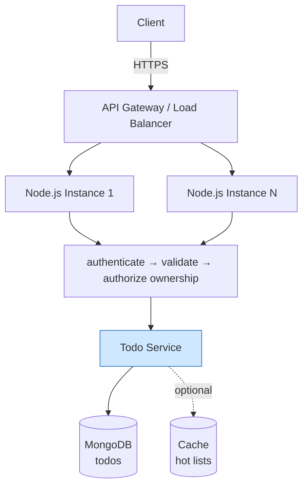
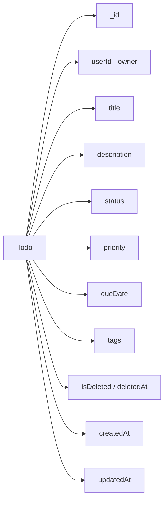
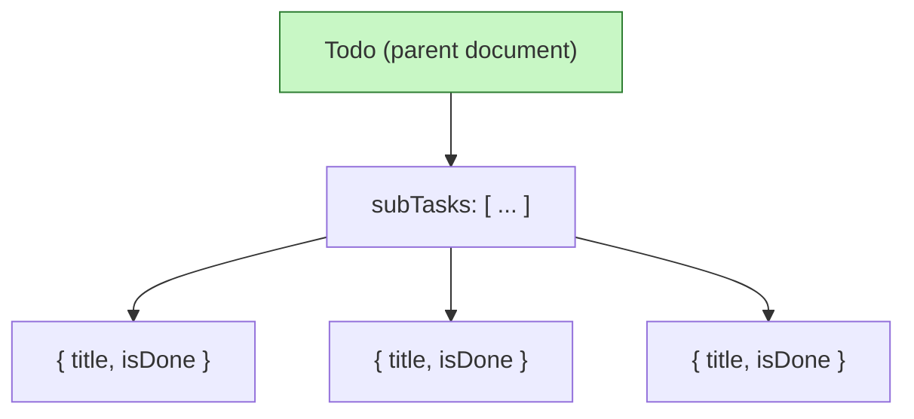
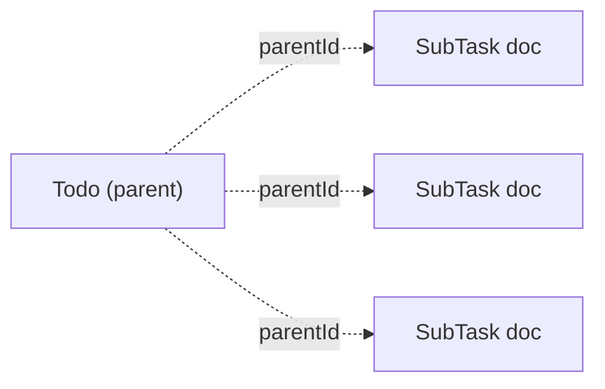
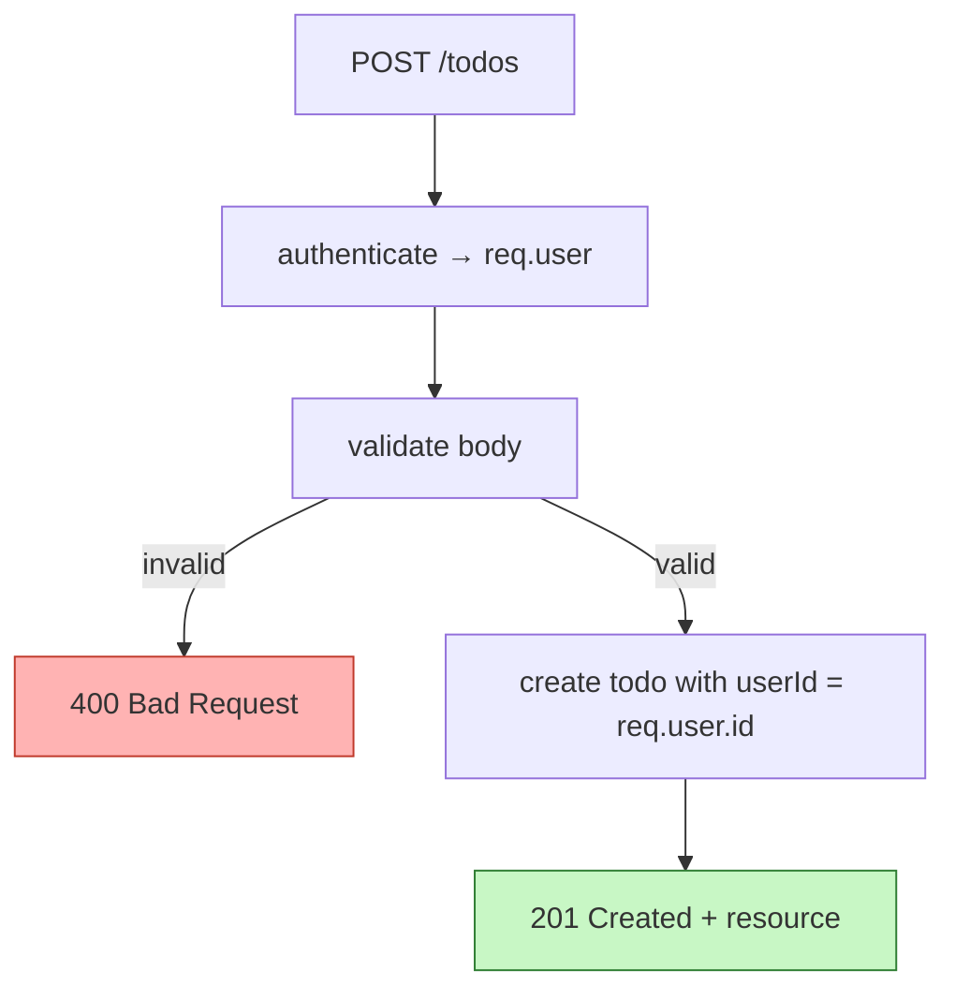

# 2. Design a "Todo" List API

> **In one line:** Design a clean, RESTful Todo API backed by MongoDB — resource modeling, CRUD
> endpoints, sub-tasks (embedded vs. referenced), pagination/filtering/sorting, validation, per-user
> ownership, soft delete, and the trade-offs behind each choice.

> **Original prompt:** Define the RESTful endpoints and MongoDB schema to support sub-tasks (nested vs. referenced).

## Overview

A Todo API looks trivial — "it's just CRUD." But it's the classic warm-up problem precisely because it
forces clear thinking about the fundamentals every API rests on:

- How do you **model the resource** and its relationships (sub-tasks, tags, lists)?
- What are the **right REST endpoints**, verbs, and status codes?
- How do users **only see their own data** (ownership + authorization)?
- How do you return **large collections** without dumping everything at once (pagination)?
- How do you **filter, sort, and search**?
- What happens on **delete** — hard or soft?
- Which **indexes** keep it fast as the collection grows?

Get these right and you've demonstrated the same instincts that scale to far larger systems.

## Step 0: Start With the Problem, Not the Endpoints

Scope the requirements before writing a single route.

**In scope for this design:**

- Authenticated, **per-user** todos (a user only sees their own)
- CRUD on todos: title, description, status, due date, priority
- **Sub-tasks** (the modeling centerpiece)
- List endpoint with **pagination, filtering, and sorting**
- Request **validation** and consistent error responses
- **Soft delete** and timestamps

**Explicitly out of scope (can be added later):**

- Sharing/collaboration between users, real-time sync, reminders/notifications, recurring todos,
  attachments, full-text search across huge datasets.

Authentication itself is assumed solved — see
[Problem 01: User Authentication System](./01-user-authentication-system.md). Every request carries a
verified `userId` via the auth middleware.

## A Mental Model: Four Questions

1. **What is the resource, and what does it contain?** — the Todo entity and its fields.
2. **What are its relationships?** — sub-tasks, tags, lists; embedded or referenced?
3. **What operations are exposed, and how?** — REST endpoints, verbs, status codes.
4. **How does it behave at scale?** — pagination, indexing, filtering, soft delete.

## High-Level Architecture

This is a straightforward stateless CRUD service. Keep Node instances stateless so they scale
horizontally behind a load balancer; all state lives in MongoDB, with an optional cache for hot reads.



Related concepts: [Load Balancer](../../01-core-infrastructure-concepts/04-load-balancer.md),
[Scalability](../../01-core-infrastructure-concepts/01-scalability.md),
[Cache](../../02-data-and-storage-concepts/08-cache.md).

## Modeling the Todo Resource

A single todo carries identity, content, state, scheduling, and audit fields:



`userId` is the most important field: it scopes every query so users never touch each other's data.

## The Centerpiece: Sub-Tasks — Embedded vs. Referenced

This is the key design decision the prompt calls out. There are two ways to model sub-tasks in MongoDB.

### Option A — Embedded (nested documents)

Sub-tasks live **inside** the parent todo document as an array.



- **Reads:** one query fetches the todo *and* all its sub-tasks — no joins.
- **Atomicity:** parent + sub-tasks update together in a single document write.
- **Locality:** the data that's read together is stored together.

### Option B — Referenced (separate collection)

Sub-tasks live in their own collection and point back to the parent via `parentId`.



- **Unbounded growth:** no risk of hitting MongoDB's 16 MB document limit.
- **Independent access:** sub-tasks can be queried, paginated, and updated on their own.
- **Cost:** requires a second query or `$lookup` to assemble the full picture.

### How to Choose

| Factor | Embedded (nested) | Referenced (separate) |
|---|---|---|
| Sub-tasks per todo | Small, bounded (e.g. ≤ ~50) | Large or unbounded |
| Read pattern | Always loaded *with* the parent | Often queried independently |
| Update pattern | Update parent + children together | Update children independently/at scale |
| Query needs | Rarely queried on their own | Filter/sort/paginate sub-tasks directly |
| 16 MB doc limit | A real risk if they grow | Not a concern |
| Complexity | Simplest | Needs joins/second query |

> **Rule of thumb:** For a personal todo list, sub-tasks are few, always shown with the parent, and
> updated alongside it — **embed them.** Switch to **referenced** only if sub-tasks become numerous,
> need independent querying/pagination, or the document risks growing too large. This design embeds
> them and notes the migration path.

## MongoDB Schema (Mongoose)

Embedding sub-tasks, with the fields the API needs:

```typescript
import { Schema, model, Types } from "mongoose";

const subTaskSchema = new Schema(
  {
    title: { type: String, required: true, trim: true, maxlength: 200 },
    isDone: { type: Boolean, default: false },
  },
  { _id: true, timestamps: true }, // _id lets clients target a specific sub-task
);

const todoSchema = new Schema(
  {
    userId: {
      type: Types.ObjectId,
      ref: "User",
      required: true,
      index: true, // every list query filters by owner
    },
    title: { type: String, required: true, trim: true, maxlength: 200 },
    description: { type: String, trim: true, maxlength: 2000, default: "" },
    status: {
      type: String,
      enum: ["TODO", "IN_PROGRESS", "DONE"],
      default: "TODO",
      index: true,
    },
    priority: {
      type: String,
      enum: ["LOW", "MEDIUM", "HIGH"],
      default: "MEDIUM",
    },
    dueDate: { type: Date, default: null },
    tags: { type: [String], default: [] },
    subTasks: { type: [subTaskSchema], default: [] },

    // soft delete
    isDeleted: { type: Boolean, default: false, index: true },
    deletedAt: { type: Date, default: null },
  },
  { timestamps: true },
);

// Compound index for the common "my todos, newest first, not deleted" query.
todoSchema.index({ userId: 1, isDeleted: 1, createdAt: -1 });

export const Todo = model("Todo", todoSchema);
```

Notes worth raising in an interview:

- **`userId` index** — the app *always* filters by owner, so this is the most important index.
- **Compound index** `{ userId, isDeleted, createdAt }` matches the default list query exactly (equality
  fields first, sort field last — the ESR rule). See
  [Index](../../02-data-and-storage-concepts/05-index.md) and
  [Database Indexing](./14-database-indexing.md).
- **Sub-task `_id`** — keeping `_id: true` lets the API address a single sub-task for updates.

## RESTful API Design

Model todos as a resource collection; sub-tasks as a nested sub-resource. Use nouns, plural
collections, and HTTP verbs for actions.

| Method | Endpoint | Purpose | Success |
|---|---|---|---|
| `POST` | `/todos` | Create a todo | `201 Created` |
| `GET` | `/todos` | List todos (paginated/filtered/sorted) | `200 OK` |
| `GET` | `/todos/:id` | Get one todo | `200 OK` |
| `PATCH` | `/todos/:id` | Partially update a todo | `200 OK` |
| `PUT` | `/todos/:id` | Replace a todo | `200 OK` |
| `DELETE` | `/todos/:id` | Delete (soft) a todo | `204 No Content` |
| `POST` | `/todos/:id/subtasks` | Add a sub-task | `201 Created` |
| `PATCH` | `/todos/:id/subtasks/:subId` | Update a sub-task | `200 OK` |
| `DELETE` | `/todos/:id/subtasks/:subId` | Remove a sub-task | `204 No Content` |

Conventions worth stating:

- **`PATCH` vs `PUT`:** `PATCH` for partial updates (e.g. just mark done); `PUT` replaces the whole resource.
- **Status codes:** `201` on create, `204` on delete, `400` validation error, `401` unauthenticated,
  `403` not owner, `404` not found. See [API Response Standardization](./12-api-response-standardization.md).
- **Nested route for sub-tasks** (`/todos/:id/subtasks/:subId`) reflects the ownership hierarchy.

### Create Flow



The server sets `userId` from the authenticated token — **never** from the request body, or a user
could create todos for someone else.

## Ownership & Authorization

Authentication answers *who* the user is; this API must also enforce *what they can touch*: **their own
todos only.** The safest pattern is to scope every query by `userId` rather than fetching-then-checking.

```typescript
// Good: ownership is part of the query — a non-owner simply gets 404.
const todo = await Todo.findOne({ _id: id, userId: req.user.id, isDeleted: false });
if (!todo) return res.status(404).json({ message: "Todo not found" });
```

> Returning **404** (not 403) for someone else's todo avoids leaking the fact that the id exists.

## Pagination, Filtering, and Sorting

The list endpoint must never return an unbounded collection.

- **Filtering:** `GET /todos?status=TODO&priority=HIGH&tag=work`
- **Sorting:** `GET /todos?sort=-createdAt` (prefix `-` for descending)
- **Pagination:** prefer **cursor-based** for large, append-heavy lists; offset is fine for small ones.

```text
Cursor:  GET /todos?limit=20&cursor=<lastId>   → stable under inserts, scales well
Offset:  GET /todos?limit=20&page=3            → simple, but drifts and slows on deep pages
```

See [Implement Pagination (cursor-based)](./03-cursor-based-pagination.md) for the full treatment. A
typical list response wraps data plus paging metadata:

```json
{
  "data": [ { "id": "...", "title": "..." } ],
  "pageInfo": { "nextCursor": "665f...", "hasMore": true, "limit": 20 }
}
```

## Request Validation

Validate at the edge (a schema library such as Zod/Joi) before anything hits the service or database.
See [Request Validation Middleware](./21-request-validation-middleware.md).

```typescript
const createTodoSchema = z.object({
  title: z.string().min(1).max(200),
  description: z.string().max(2000).optional(),
  priority: z.enum(["LOW", "MEDIUM", "HIGH"]).optional(),
  dueDate: z.coerce.date().optional(),
  tags: z.array(z.string()).max(20).optional(),
});
```

Validation guards data integrity, gives clients precise `400` errors, and keeps the service logic clean.

## Soft Delete

Rather than physically removing rows, flag them — so data can be recovered and audited. See
[Soft-Delete System](./16-soft-delete-system.md).

```text
DELETE /todos/:id  →  set isDeleted = true, deletedAt = now  →  204
```

Every read query then adds `isDeleted: false`. A background job (or TTL index on `deletedAt`) can purge
old soft-deleted rows later.

## Indexing Strategy

Indexes are what keep the API fast as todos accumulate. See
[Index](../../02-data-and-storage-concepts/05-index.md).

- `{ userId: 1, isDeleted: 1, createdAt: -1 }` — the default "my active todos, newest first" list.
- Add `status`/`priority`/`dueDate` to the compound index (or a secondary one) if those filters/sorts
  are common.
- Follow **ESR**: **E**quality fields, then **S**ort field, then **R**ange field.

> Don't over-index: each index speeds reads but slows writes and consumes storage. Add them to match
> real query patterns, not hypothetical ones.

## Scaling & Performance

- **Stateless service** → scale Node instances horizontally behind a load balancer.
- **Read-heavy?** Cache hot lists (e.g. a user's active todos) with [cache-aside](./10-caching-layer.md),
  invalidating on write.
- **Huge datasets?** Cursor pagination + right indexes keep queries constant-time regardless of depth.
- **Very large userbase?** Shard by `userId` so each user's todos live together (see
  [Sharding](../../02-data-and-storage-concepts/06-sharding.md)).

## Tips

- Set `userId` from the **authenticated token**, never from the request body.
- Scope every query by `userId` so authorization is enforced *by the query*, not an afterthought.
- **Embed** small, always-loaded sub-tasks; **reference** them only when they grow or need independent access.
- Use `PATCH` for partial updates (e.g. toggling `isDone`) and reserve `PUT` for full replacement.
- Never return an unbounded list — paginate, and prefer cursors for large collections.
- Match your **compound index** to your default query using the ESR rule.
- Prefer **soft delete** for user-generated content to allow recovery and audit.

## Trade-offs & Pitfalls

- **Embedded vs. referenced sub-tasks** is the core trade-off: embedding is simplest and atomic but
  risks the 16 MB document limit and can't be queried independently; referencing scales and decouples
  but needs a join/second query.
- **Offset pagination** is easy but drifts when items are inserted/deleted and gets slow on deep pages;
  cursor pagination is stable and fast but slightly more complex.
- **Trusting `userId` from the body** is an authorization hole — always derive it from the token.
- **Fetch-then-check ownership** risks leaking existence and adds a round trip — scope by `userId` in the query.
- **Hard delete** is irreversible and loses audit history — usually prefer soft delete.
- **Over-indexing** slows writes and wastes storage; **under-indexing** causes full collection scans.
- **Unbounded arrays** (sub-tasks, tags) can bloat documents — bound them or reference instead.

## System Design Cheat Sheet

When you hear *"Design a Todo List API,"* walk this mental map:

```text
1.  SCOPE         Per-user CRUD? Sub-tasks? Sharing?
2.  RESOURCE      Todo fields: title, status, priority, dueDate, tags
3.  RELATIONSHIPS Sub-tasks embedded vs referenced?
4.  SCHEMA        Mongoose model + indexes
5.  ENDPOINTS     REST verbs, nested sub-resources, status codes
6.  OWNERSHIP     Scope every query by userId (404 for non-owners)
7.  LIST          Pagination (cursor) + filtering + sorting
8.  VALIDATION    Schema validation → clean 400s
9.  DELETE        Soft delete + timestamps
10. INDEXES       Compound index matching the default query (ESR)
11. SCALE         Stateless nodes, cache hot lists, shard by userId
12. TRADE-OFF     Why this modeling choice?
```

## Interview Questions & Answers

A structured question bank for this problem, grouped by theme, each with a short answer.

### A. Requirement Clarification

- **Is this a single-user or multi-user todo app?** — Assume multi-user; every todo is scoped to an owner.
- **Do we need authentication?** — Yes; assume it's solved and each request carries a verified `userId`.
- **Do todos have sub-tasks?** — Yes — modeling them (embedded vs referenced) is the central decision.
- **Do we need due dates, priorities, tags?** — Include them; they drive filtering/sorting requirements.
- **Do we need sharing/collaboration?** — Out of scope for the baseline; can be added via a members model later.
- **Do we need real-time sync or reminders?** — Out of scope initially; would add WebSockets/notifications.
- **What scale of todos per user?** — Drives pagination and whether sub-tasks stay embedded.

### B. Resource & Data Modeling

- **What fields does a Todo have?** — `userId`, `title`, `description`, `status`, `priority`, `dueDate`, `tags`, soft-delete flags, timestamps.
- **How would you model sub-tasks?** — Embed them for small, always-loaded lists; reference them if they grow or need independent access.
- **Why embed sub-tasks here?** — They're few, always shown with the parent, and updated together — one atomic document.
- **When would you switch to referenced?** — When sub-tasks are numerous/unbounded, queried on their own, or risk the 16 MB limit.
- **What's MongoDB's document size limit?** — 16 MB; unbounded embedded arrays can approach it.
- **Would you give sub-tasks their own `_id`?** — Yes, so the API can target a specific sub-task for updates/deletes.
- **How do you model tags?** — A bounded string array on the todo; a separate collection only if tags need their own metadata.

### C. REST API Design

- **What endpoints would you expose?** — CRUD on `/todos`, plus nested `/todos/:id/subtasks/:subId`.
- **PATCH vs PUT?** — `PATCH` for partial updates (toggle done); `PUT` to replace the whole resource.
- **What status codes?** — `201` create, `200` read/update, `204` delete, `400/401/403/404` for errors.
- **How do you represent sub-tasks in the URL?** — As a nested sub-resource reflecting ownership: `/todos/:id/subtasks`.
- **Should you use verbs in routes?** — No — use nouns + HTTP methods (`DELETE /todos/:id`, not `/deleteTodo`).
- **How do you standardize responses?** — A consistent envelope for data and errors across endpoints.
- **How would you version the API?** — Prefix (`/v1/todos`) or header-based versioning as it evolves.

### D. Ownership & Authorization

- **How do users only see their own todos?** — Scope every query with `userId` from the token.
- **Where does `userId` come from?** — The authenticated JWT/session — never the request body.
- **404 or 403 for another user's todo?** — Prefer `404` to avoid revealing that the id exists.
- **How do you prevent creating todos for others?** — Ignore any client-supplied `userId`; set it server-side.
- **Do sub-tasks need separate authorization?** — They inherit the parent's ownership; the parent query enforces it.

### E. Listing, Pagination, Filtering, Sorting

- **How do you paginate?** — Cursor-based for large lists (stable, fast); offset for small ones.
- **Offset vs cursor pagination?** — Offset is simple but drifts and slows on deep pages; cursor is stable and scales.
- **How do you filter?** — Query params (`?status=TODO&priority=HIGH`) translated to a Mongo query.
- **How do you sort?** — A `sort` param (e.g. `-createdAt`) mapped to a Mongo sort, backed by an index.
- **How do you keep list queries fast?** — A compound index matching the filter+sort, following ESR.
- **What does a list response look like?** — `data` plus `pageInfo` (nextCursor, hasMore, limit).

### F. Validation & Error Handling

- **Where do you validate input?** — At the edge via middleware (Zod/Joi) before the service/DB.
- **What do you validate?** — Required fields, lengths, enums, date formats, array bounds.
- **What do you return on invalid input?** — `400` with structured field-level error details.
- **How do you handle a missing/invalid id?** — Validate the id format → `400`; missing document → `404`.

### G. Delete & Data Lifecycle

- **Hard delete or soft delete?** — Soft delete for recoverability/audit; flag `isDeleted`/`deletedAt`.
- **How do reads exclude deleted todos?** — Add `isDeleted: false` to every query (and the index).
- **How do you purge old deleted data?** — A background job or TTL index on `deletedAt`.
- **How do you delete a sub-task?** — Pull it from the embedded array (or flag it if soft-deleting sub-tasks).

### H. Indexing & Performance

- **What's the most important index?** — On `userId`, since every query filters by owner.
- **What compound index would you create?** — `{ userId, isDeleted, createdAt }` for the default list.
- **What's the ESR rule?** — Order index fields as Equality, then Sort, then Range.
- **What are the risks of over-indexing?** — Slower writes and more storage; index to match real queries.
- **How do you find slow queries?** — Use `explain()` and profiling to spot collection scans.

### I. Scalability

- **How do you scale the service?** — Keep it stateless and run many instances behind a load balancer.
- **How do you handle read-heavy load?** — Cache hot lists (cache-aside) and invalidate on write.
- **How would you shard?** — By `userId`, so each user's todos and sub-tasks colocate.
- **Does embedding help scaling reads?** — Yes — one document read returns the todo and its sub-tasks.
- **How do you keep deep pagination fast?** — Cursor pagination avoids the cost of large `skip` offsets.

### J. Advanced / Lead-level

- **How would you add sharing/collaboration?** — Introduce a members/ACL model and authorize by membership, not just owner.
- **How would you add real-time updates?** — WebSockets/SSE to push changes to connected clients.
- **How would you support recurring todos?** — Store a recurrence rule and generate instances via a scheduler.
- **How would you add full-text search?** — A text index for small scale; a search engine (e.g. Elasticsearch) at large scale.
- **How would you handle concurrent edits?** — Optimistic concurrency via a version field / `updatedAt` check.
- **How would you support offline clients?** — Client-generated ids + sync/merge with conflict resolution.
- **What metrics would you monitor?** — Request latency, error rates, slow queries, cache hit ratio, list-size distribution.
- **What are the main trade-offs in your design?** — Embedded vs referenced sub-tasks, and cursor vs offset pagination.

---

_Notes: (add your own content here)_
