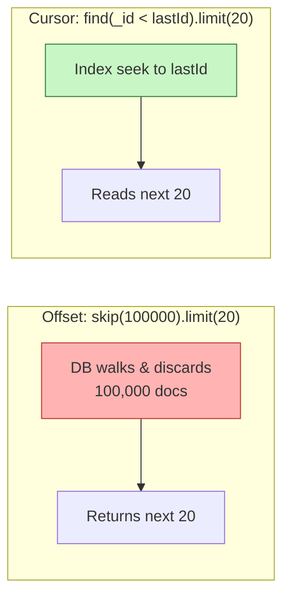

# 3. Implement Pagination

> **In one line:** Return large collections in stable, efficient pages using **cursor-based** (keyset)
> pagination instead of `skip`/`limit` — covering the query mechanics, cursor encoding, indexing,
> security, and how it behaves at Twitter/Instagram scale.

> **Original prompt:** Write a MongoDB aggregation pipeline or find() query using cursor-based pagination (not skip/limit).

## Overview

Every endpoint that returns a list must page it. Returning 50,000 rows in one response exhausts memory,
saturates the network, and times out clients. Pagination breaks a large result set into ordered chunks
the client pulls on demand.

There are two families:

- **Offset pagination** — `skip(N).limit(M)`, or `?page=3&size=20`. Simple and supports "jump to page 7",
  but degrades badly and produces incorrect results on data that changes.
- **Cursor / keyset pagination** — remember *where you left off* using an indexed key, then fetch the
  next slice with a range predicate. Stable and fast at any depth.

This problem is about implementing the cursor approach correctly and knowing exactly when each family is
the right tool.

## Real-World Context

- **Twitter / X timeline, Instagram feed, Slack message history** — infinite scroll over data that is
  constantly changing. Offset pagination here shows users duplicate or skipped posts every time someone
  publishes while they scroll, which is why every large feed uses cursors.
- **Stripe, GitHub, and Slack public APIs** — all expose cursor-based pagination
  (`starting_after`, `?cursor=`, `next_cursor`) precisely because it stays correct and cheap for API
  consumers iterating over millions of records.
- **Admin dashboards / reports** — the *opposite* case: a finite table of 500 rows where a human wants
  "page 12 of 25". Here offset pagination is the right, simpler choice.

The interview signal is recognizing that the *access pattern* (infinite scroll vs. random page access)
and *scale* dictate the choice — not dogma.

## Requirements

**Functional**

- Return an ordered slice of a collection and a way to fetch the next slice.
- Support filtering (e.g. by status) and a defined sort order.
- Optionally support backward paging ("previous").

**Non-functional**

- **Performance:** page latency must stay roughly constant regardless of how deep the user scrolls.
- **Correctness/stability:** concurrent inserts/deletes must not cause duplicated or skipped rows.
- **Scalability:** must work when the collection has hundreds of millions of documents and is sharded.
- **Security:** cursors must not leak internal data or allow a client to read another tenant's rows.

## Offset vs. Cursor — Why Offset Breaks



**Problem 1 — deep pages get slow.** `skip(100000)` still scans and throws away 100,000 documents before
returning anything. Cost grows linearly with the offset, so page 5,000 is dramatically slower than page 1.

**Problem 2 — drift on mutating data.** Suppose the feed is sorted newest-first and the user is viewing
page 2 (`skip 20`). If 3 new posts are inserted before they request page 3, everything shifts down by 3,
so the last 3 items of page 2 reappear as the first items of page 3 (duplicates). Deletes cause the
inverse — silently skipped rows.

| | Offset (`skip`/`limit`) | Cursor (keyset) |
|---|---|---|
| Deep-page latency | Degrades linearly with offset | Constant — index seek |
| Stability under writes | Drifts (dupes/skips) | Stable |
| Random access ("page 37") | Yes | No — sequential only |
| Total count / "X of Y" | Easy | Needs separate (often approximate) count |
| Works well when sharded | Poorly (must merge+skip across shards) | Well (range per shard) |
| Implementation effort | Trivial | Moderate |

## The Cursor: What It Actually Is

A cursor is an **opaque pointer to the last item of the previous page**, encoding the sort key(s) needed
to resume. For newest-first feeds the natural key is `_id` — a MongoDB `ObjectId` embeds a creation
timestamp, is unique, and is monotonically increasing, so `_id`-descending ≈ newest-first and needs no
extra field.

```text
Page 1:  GET /feed?limit=20
         → 20 items + nextCursor = encode(_id of item #20)

Page 2:  GET /feed?limit=20&cursor=<opaque>
         → find({ _id: { $lt: decode(cursor) } }).sort({ _id: -1 }).limit(20)
```

## Query Implementation (find)

```typescript
async function listFeed(userId: string, cursor?: string, limit = 20) {
  const query: any = { userId, isDeleted: false };

  if (cursor) {
    const lastId = decodeCursor(cursor);   // base64 → ObjectId, validated
    query._id = { $lt: lastId };            // strictly "older than" the last seen (newest-first)
  }

  // Fetch limit + 1 so we can tell whether another page exists — no count query.
  const docs = await Feed.find(query)
    .sort({ _id: -1 })
    .limit(limit + 1)
    .lean();                                // skip Mongoose hydration for read-only lists

  const hasMore = docs.length > limit;
  const items = hasMore ? docs.slice(0, limit) : docs;
  const nextCursor = hasMore ? encodeCursor(items[items.length - 1]._id) : null;

  return { items, pageInfo: { nextCursor, hasMore, limit } };
}
```

The **`limit + 1`** trick is the key efficiency win: one extra row tells you `hasMore` without an
expensive `countDocuments()`.

## Tie-Breaking on a Non-Unique Sort Field

Sorting on a **non-unique** field (`createdAt`, `score`, `priority`) breaks a single-key cursor: if 50
posts share the same `createdAt`, a `createdAt < cursor` predicate can skip or repeat some of them at the
page boundary. The fix is a **composite cursor** — the sort field **plus** a unique tiebreaker (`_id`) —
which produces a guaranteed **total ordering**.

```typescript
// Sort by score desc, then _id desc. Cursor encodes { score, id }.
const query = {
  status: "PUBLISHED",
  $or: [
    { score: { $lt: cursor.score } },
    { score: cursor.score, _id: { $lt: cursor.id } },
  ],
};
const docs = await Post.find(query)
  .sort({ score: -1, _id: -1 })
  .limit(limit + 1);
```

## Aggregation Pipeline Variant

When you need joins (`$lookup`) or computed fields, the same keyset predicate goes in the first `$match`:

```typescript
const pipeline = [
  { $match: { userId, isDeleted: false, ...(cursor && { _id: { $lt: cursor } }) } },
  { $sort: { _id: -1 } },
  { $limit: limit + 1 },
  { $lookup: { from: "users", localField: "userId", foreignField: "_id", as: "author" } },
  { $project: { content: 1, createdAt: 1, "author.name": 1 } },
];
const docs = await Post.aggregate(pipeline);
```

Keep `$match` + `$sort` **first** so the pipeline uses the index before heavier stages run; a `$sort`
placed after a `$lookup` cannot use the index and will sort in memory.

## Performance

- **Index the sort/seek key.** Cursor pagination is only O(log n) if the key is indexed. An unindexed
  sort forces an in-memory sort that MongoDB aborts past **32 MB** unless it can spill to disk.
- **Match the compound index to the query.** For `find({userId}).sort({createdAt:-1, _id:-1})` create
  `{ userId: 1, createdAt: -1, _id: -1 }` — follow **ESR** (Equality, Sort, Range). See
  [Index](../02-data-and-storage-concepts/05-index.md) and [Database Indexing](./14-database-indexing.md).
- **Use `.lean()`** for read-only lists to skip Mongoose document construction — meaningful on large pages.
- **Covered queries:** if you only need a few fields, include them in the index so the query is served
  entirely from the index without touching documents.
- **Verify with `explain()`** — you want `IXSCAN`, not `COLLSCAN`, and `SORT_KEY_GENERATOR` absent.

## Scalability

- **Sharded collections** are where cursors shine. Offset pagination across shards forces the router to
  fetch, merge, and then discard `skip` rows from every shard — cost multiplies by shard count. A keyset
  range predicate lets each shard seek locally.
- **Constant cost at depth** means a user 10,000 items deep pays the same as one on page 1 — essential
  for feeds where power users scroll far.
- **Approximate counts:** if you must show "~2.3M results", use `estimatedDocumentCount()` or a cached
  counter rather than an exact `countDocuments()` scan on every request.
- **Read scaling:** list endpoints are read-heavy; route them to replicas / a cache layer and accept
  slightly stale reads for feeds.

## Security

- **Treat cursors as opaque and validate them.** Base64-encode so clients can't infer structure, and on
  decode, verify the value is a well-formed `ObjectId`/date. A raw, unvalidated cursor is an injection
  and tampering vector.
- **Scope by tenant/owner server-side.** The cursor must never be the *only* thing selecting rows —
  always combine it with `userId`/`tenantId` from the auth context, or a user could paginate into another
  user's data by crafting a cursor.
- **Don't leak sensitive fields in the cursor.** If you encode business data (e.g. a score or email) into
  the cursor, it's visible to the client after base64-decoding. Encode only what's needed to resume, or
  sign/encrypt the cursor if it must carry sensitive keys.
- **Bound the `limit`.** Clamp `limit` to a maximum (e.g. 100); an unbounded `?limit=1000000` is a
  cheap denial-of-service.

## Reliability & Edge Cases

- **Deleted anchor:** because keyset uses a *value* comparison (`_id < X`) rather than the document
  itself, the page after a deleted anchor still resolves correctly — a strength over offset.
- **Ties without a tiebreaker** silently corrupt paging; always add `_id`.
- **Backward pagination:** flip the comparison (`$gt`) and sort direction, then reverse the returned array
  before responding.
- **Idempotent reads:** the same cursor returns the same window (modulo new inserts strictly newer than
  the cursor), which makes retries safe.

## Response Shape

```json
{
  "data": [ { "id": "665f...", "title": "..." } ],
  "pageInfo": { "nextCursor": "eyJfaWQiOiI2NjVm...", "hasMore": true, "limit": 20 }
}
```

Align the envelope with [API Response Standardization](./12-api-response-standardization.md); this is the
same contract used by the [Todo List API](./02-todo-list-api.md).

## Tips

- Sort on an **indexed** key; never paginate on an unindexed field.
- Add a **unique tiebreaker** (`_id`) whenever the sort field isn't unique.
- Fetch **`limit + 1`** to detect `hasMore` without a costly count.
- Treat the cursor as **opaque**, **validate** it on decode, and **clamp `limit`**.
- Always combine the cursor with a server-side **owner/tenant filter**.
- Verify the plan with **`explain()`** — you want an index scan, not a collection scan or in-memory sort.

## Trade-offs & Pitfalls

- **No random access:** cursors are sequential — you can't jump to "page 37" or show "page X of Y".
- **Exact totals cost extra** and scale poorly; prefer approximate counts at large sizes.
- **Composite cursors add complexity** but are mandatory for non-unique sort fields.
- **Sorting on unindexed fields** triggers in-memory sorts (32 MB cap) and blocking behaviour.
- **Encoding sensitive data in the cursor** leaks it to clients (base64 is not encryption).
- **Offset is still correct and simpler** for small, bounded lists and admin tables that need jump-to-page.

## System Design Cheat Sheet

```text
1. ACCESS PATTERN  Infinite scroll → cursor; jump-to-page → offset
2. ORDER           Stable, unique sort key (or field + _id tiebreaker)
3. SEEK            WHERE key < lastKey  (not skip N)
4. LIMIT           Fetch limit + 1 to compute hasMore; clamp max
5. CURSOR          Opaque, base64, validated; owner-scoped server-side
6. INDEX           Compound index matching the sort (ESR); verify with explain()
7. SCALE           Per-shard range seek; approximate counts
8. TRADE-OFF       No jump-to-page; totals cost extra
```

## Interview Questions & Answers

### A. Fundamentals

- **Why not just use `skip`/`limit`?**
  Two reasons. First, performance: `skip(N)` makes the database walk and discard N documents before
  returning the page, so latency grows linearly with depth — page 5,000 can be orders of magnitude slower
  than page 1. Second, correctness: on data that changes between requests, offsets drift. If rows are
  inserted above the current window the user sees duplicates; if rows are deleted they silently skip
  records. For an infinite-scroll feed that's constantly updating, both are unacceptable, which is why
  every large feed API uses cursors.

- **What exactly is a cursor, and why encode it?**
  A cursor is an opaque token that encodes the sort key(s) of the last item on the previous page — enough
  information to resume the scan. I base64-encode it so clients treat it as a black box and don't build
  logic around its internals, which lets me change the encoding later (e.g. add a tiebreaker) without
  breaking clients. It also lets me validate/sign it so it can't be tampered with.

- **How does cursor pagination stay stable when data changes?**
  Because it anchors to a *value* (`_id < lastId`) rather than a *position* (`skip 40`). New inserts that
  are newer than the cursor appear at the top of page 1 and never shift the window the user is currently
  reading, so there are no duplicates or skips within their scroll. This value-based anchoring is the core
  reason it's correct under concurrent writes.

### B. Implementation

- **How do you know whether there's a next page without a count query?**
  I request `limit + 1` documents. If I get back more than `limit`, I know another page exists, so I set
  `hasMore = true`, drop the extra row, and build the next cursor from the last item I actually return.
  This avoids a separate `countDocuments()`, which would be an expensive full scan on large collections.

- **How would you paginate on a non-unique field like `createdAt` or a score?**
  A single-field cursor breaks when values tie at the page boundary — rows can be skipped or repeated. I
  use a composite cursor of `(sortField, _id)` and an `$or` predicate: `sortField < X` OR
  (`sortField = X` AND `_id < lastId`). Sorting by `{ sortField: -1, _id: -1 }` with a matching compound
  index gives a total ordering so every row is visited exactly once.

- **How do you implement backward ("previous page") pagination?**
  I flip the comparison operator to `$gt` and reverse the sort direction to fetch the items just *before*
  the cursor, then reverse the returned array in application code so the client still receives them in the
  normal display order. I keep both a `nextCursor` and `prevCursor` in the response for bidirectional
  scroll.

- **When would you use an aggregation pipeline instead of `find`?**
  When the page needs joins (`$lookup`), grouping, or computed fields. The important detail is ordering
  the stages: `$match` (with the keyset predicate) and `$sort` must come first so the index is used before
  the expensive stages; a `$sort` after a `$lookup` can't use an index and sorts in memory.

### C. Performance & Indexing

- **Why must the sort key be indexed, and how do you verify it?**
  Without an index, MongoDB does an in-memory sort that's capped at 32 MB and will error (or spill) on
  large result sets, and it scans the whole collection to find the range — defeating the point. I create a
  compound index matching the query following the ESR rule (Equality fields, then Sort, then Range), and I
  confirm with `explain()` that the plan is an `IXSCAN` with no blocking `SORT` stage.

- **What compound index supports `find({userId}).sort({createdAt:-1,_id:-1})`?**
  `{ userId: 1, createdAt: -1, _id: -1 }`. The equality field (`userId`) comes first so the index narrows
  to one user's documents, then the two sort keys are already in index order, so the database can stream
  results without a separate sort. I'd also consider a covered projection if only a few fields are needed.

- **How does deep-page performance compare between the two approaches?**
  Cursor pagination is effectively constant time regardless of depth because it's an index seek to the
  anchor plus a short scan of the next `limit` rows. Offset degrades linearly — the deeper the page, the
  more rows are read and discarded. At page 100,000 that difference is the gap between a few milliseconds
  and a query that times out.

### D. Scale, Security & Trade-offs

- **How does this behave on a sharded cluster?**
  Cursors are shard-friendly: the range predicate is pushed to each shard, which seeks locally, and the
  router merges small sorted streams. Offset pagination is pathological when sharded — the router must
  gather `skip + limit` rows from *every* shard and then discard, so cost scales with both offset and shard
  count. This is a strong argument for cursors in any large, sharded system.

- **What are the security concerns with cursors?**
  Three things. I validate the decoded cursor is a well-formed key to prevent tampering/injection. I always
  combine the cursor with the owner/tenant filter from the auth context so a crafted cursor can't page into
  someone else's data. And I avoid encoding sensitive fields into the cursor, since base64 is trivially
  decodable — if a sensitive key must be carried, I sign or encrypt the cursor. I also clamp `limit` to
  prevent a huge value from being used as a cheap DoS.

- **How do you show a total count or "page X of Y" with cursors?**
  Strictly, you can't do jump-to-page with pure cursors. If the product needs an approximate total I use
  `estimatedDocumentCount()` or a cached counter updated on writes. If it genuinely needs exact
  random-page access (an admin report), I'll use offset pagination instead — cursors and jump-to-page are
  fundamentally different access patterns.

- **When would you deliberately choose offset pagination?**
  For small, bounded result sets where the human needs random page access — an admin table of a few
  hundred rows, a report with "page 3 of 12". There the deep-page and drift problems don't materialize,
  and offset is simpler to implement and gives free totals. Choosing the simpler tool when scale doesn't
  demand otherwise is itself a good engineering signal.

---

_Notes: (add your own content here)_
