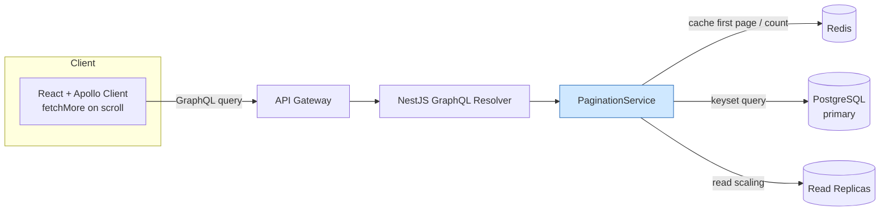

# 3. Implement Pagination

> **In one line:** Design and implement a production-grade pagination system using **cursor / keyset**
> pagination — from the interview conversation through HLD, LLD, real NestJS + GraphQL + Prisma code,
> scaling, and security.

> **Original prompt:** Write a MongoDB aggregation pipeline or find() query using cursor-based pagination (not skip/limit).

---

## 1. The Interview Conversation

Before drawing anything, a strong candidate scopes the problem. Here is how that dialogue typically goes.

> **Interviewer:** "We have a feed endpoint that returns posts. As the data grows it's getting slow and
> users complain about seeing duplicate posts. Design pagination for it."
>
> **Candidate:** "Let me clarify the access pattern first. Is this an infinite-scroll feed, or does the
> UI need to jump to an arbitrary page like 'page 37'?"
>
> **Interviewer:** "Infinite scroll, like a social feed."
>
> **Candidate:** "Good — that rules out offset pagination as the primary mechanism, because `skip/limit`
> both degrades on deep pages and drifts when new rows are inserted while the user scrolls, which is
> exactly the duplicate-posts complaint. I'll use cursor (keyset) pagination. A few more questions:
> what's the sort order — newest first, or by a score/ranking?"
>
> **Interviewer:** "Newest first for now, but we may add a 'top' sort by score later."
>
> **Candidate:** "Then I'll design the cursor to be generic: for newest-first I can key on the primary
> id, but for score-based sorting I'll need a composite cursor of `(score, id)` because score isn't
> unique. What's the scale — thousands of rows or hundreds of millions?"
>
> **Interviewer:** "Assume hundreds of millions, and it may be sharded later."
>
> **Candidate:** "That reinforces keyset — it's O(log n) index seek regardless of depth and works per
> shard, whereas offset forces every shard to over-fetch and discard. Last thing: do we need a total
> count or 'showing X of Y'?"
>
> **Interviewer:** "A rough count is fine, exact isn't required."
>
> **Candidate:** "Perfect, I'll use an approximate count so I don't pay for a full scan on every request.
> Let me lay out requirements and the design."

**What this dialogue demonstrates:** the candidate is choosing the technique from the *access pattern and
scale*, not from dogma — and is surfacing the composite-cursor and count trade-offs before writing code.

---

## 2. Requirements

**Functional**

- Return an ordered slice of a collection plus a token to fetch the next slice.
- Support forward paging (infinite scroll) and, ideally, backward paging.
- Support multiple sort orders (recency now, score later) and filters.
- Provide an approximate total where the product needs it.

**Non-functional**

| Requirement | Target |
|---|---|
| **Latency** | p99 < 30 ms for a page, constant regardless of scroll depth |
| **Correctness** | No duplicated or skipped rows under concurrent inserts/deletes |
| **Scalability** | 100M+ rows, works when sharded, high read QPS |
| **Security** | Cursors opaque, tamper-resistant, tenant-scoped; `limit` bounded |

**Back-of-envelope:** 100M posts, 50k feed reads/sec at peak, page size 20. That's 1M rows/sec streamed.
Offset at average depth 500 would read+discard ~500 rows per request = 25M wasted row-reads/sec —
untenable. Keyset reads only the 20 rows returned. This number *is* the justification for the design.

---

## 3. Recommended Tech Stack

| Layer | Choice | Why |
|---|---|---|
| **Runtime** | Node.js (LTS) | Non-blocking I/O suits high-fan-out read APIs |
| **Framework** | **NestJS** | Structured DI, modules, guards/interceptors — clean place for pagination as a reusable primitive |
| **API style** | **GraphQL (Relay Connections)** for the client feed; REST for internal/service calls | Relay's `Connection`/`edges`/`pageInfo`/`cursor` spec *is* cursor pagination standardized |
| **Primary DB** | **PostgreSQL** via **Prisma** (also shown for **MongoDB/Mongoose**) | Postgres composite B-tree indexes make keyset trivial and fast; Prisma has native `cursor` support |
| **Cache** | **Redis** | Cache the first page (hottest) and approximate counts |
| **Frontend** | **React + Apollo Client** (or Next.js) | Apollo's `fetchMore` + Relay pagination handles cursors natively |

> **Why GraphQL here?** The Relay Connection spec was designed for exactly this: `pageInfo { hasNextPage,
> endCursor }` and `edges { cursor node }` are cursor pagination as a contract, so clients get a
> consistent, tooling-supported paging model. For non-GraphQL services I expose the same shape over REST.

---

## 4. High-Level Design (HLD)



**Component responsibilities**

- **Apollo Client** issues `feed(first: 20, after: $cursor)` and calls `fetchMore` on scroll, appending
  `edges` and tracking `pageInfo.endCursor`.
- **NestJS resolver** validates args (bounds `first`, decodes `after`) and delegates to a generic
  `PaginationService`.
- **PaginationService** is the reusable core: it turns `(sort, filter, cursor, limit)` into a keyset query
  and encodes the response cursor. It is DB-agnostic via a repository interface.
- **Redis** caches the first page (no cursor) and approximate counts — the hottest, most cacheable reads.
- **Read replicas** absorb the read-heavy load; feeds tolerate slight replica lag.

**Request flow (forward page):** client sends `after` cursor → resolver decodes/validates → service builds
`WHERE (sortKey, id) < (cursorSortKey, cursorId) ORDER BY sortKey DESC, id DESC LIMIT n+1` → maps rows to
`edges`, computes `hasNextPage` from the `n+1` row, encodes `endCursor` → returns Connection.

---

## 5. Approaches, Patterns & Algorithms

### Approach A — Offset pagination (`OFFSET/LIMIT`, `skip/limit`)

```sql
SELECT * FROM posts ORDER BY created_at DESC OFFSET 10000 LIMIT 20;
```

- **How it scales:** the DB still reads and discards the 10,000 skipped rows → O(offset). Deep pages are slow.
- **Correctness:** inserts/deletes shift the window → duplicates/skips.
- **Verdict:** only for small, bounded, jump-to-page UIs (admin tables).

### Approach B — Keyset / cursor pagination (chosen)

```sql
-- newest-first, keyed on id (or created_at + id)
SELECT * FROM posts
WHERE (created_at, id) < ($cursorCreatedAt, $cursorId)
ORDER BY created_at DESC, id DESC
LIMIT 21;               -- n + 1 to detect hasNextPage
```

- **How it scales:** an index seek to the anchor + short scan of `n+1` rows → O(log n), constant at any depth.
- **Correctness:** anchored to a value, so concurrent inserts don't shift the window → stable.
- **Verdict:** the production default for feeds/APIs.

### Approach C — Seek with a compound (tuple) key for non-unique sorts

When sorting by a non-unique column (`score`), a single-column cursor skips/repeats ties. Use **row-value
comparison** on `(score, id)` — a total order — so every row is visited exactly once. This is the general
algorithm; keying on `id` alone is just its special case where the sort key is already unique.

### Algorithmic notes

- **`n + 1` fetch** to compute `hasNextPage` without a `COUNT`.
- **Approximate counts:** `SELECT reltuples` (Postgres) / `estimatedDocumentCount()` (Mongo) instead of a
  full `COUNT(*)` scan.
- **Index requirement:** a composite index matching the `ORDER BY` exactly (ESR: Equality, Sort, Range).

| | Offset | Keyset (chosen) |
|---|---|---|
| Deep-page latency | O(offset) | O(log n) |
| Stable under writes | No | Yes |
| Jump to page N | Yes | No |
| Sharding | Poor | Excellent |

---

## 6. Low-Level Design (LLD)

### 6.1 Module structure (NestJS)

```text
src/
├── common/
│   └── pagination/
│       ├── pagination.types.ts      # Connection, Edge, PageInfo, CursorArgs
│       ├── cursor.util.ts           # encode/decode + HMAC signing
│       └── keyset.service.ts        # generic keyset query builder
├── feed/
│   ├── feed.resolver.ts             # GraphQL resolver (Relay Connection)
│   ├── feed.service.ts
│   └── feed.repository.ts           # Prisma-backed data access
└── app.module.ts
```

### 6.2 The cursor: encoding + tamper resistance

A cursor must be **opaque**, **validated**, and **signed** so clients can't forge it to read across tenants.

```typescript
// cursor.util.ts
import { createHmac, timingSafeEqual } from "crypto";

const SECRET = process.env.CURSOR_SECRET!; // rotate periodically

export interface CursorPayload { sortValue: string | number; id: string; }

export function encodeCursor(p: CursorPayload): string {
  const body = Buffer.from(JSON.stringify(p)).toString("base64url");
  const sig = createHmac("sha256", SECRET).update(body).digest("base64url");
  return `${body}.${sig}`;
}

export function decodeCursor(cursor: string): CursorPayload {
  const [body, sig] = cursor.split(".");
  if (!body || !sig) throw new BadRequestException("Malformed cursor");
  const expected = createHmac("sha256", SECRET).update(body).digest("base64url");
  // constant-time compare to prevent tampering
  if (!timingSafeEqual(Buffer.from(sig), Buffer.from(expected)))
    throw new BadRequestException("Invalid cursor signature");
  return JSON.parse(Buffer.from(body, "base64url").toString());
}
```

### 6.3 GraphQL types (Relay Connection)

```typescript
// pagination.types.ts
@ObjectType() export class PageInfo {
  @Field() hasNextPage: boolean;
  @Field() hasPreviousPage: boolean;
  @Field(() => String, { nullable: true }) endCursor?: string;
  @Field(() => String, { nullable: true }) startCursor?: string;
}
@ObjectType() export class PostEdge {
  @Field() cursor: string;
  @Field(() => Post) node: Post;
}
@ObjectType() export class PostConnection {
  @Field(() => [PostEdge]) edges: PostEdge[];
  @Field(() => PageInfo) pageInfo: PageInfo;
  @Field(() => Int) totalCount: number; // approximate
}
```

### 6.4 Resolver + service (the production path)

```typescript
// feed.resolver.ts
@Resolver(() => Post)
export class FeedResolver {
  constructor(private readonly feed: FeedService) {}

  @Query(() => PostConnection)
  async feed(
    @Args("first", { type: () => Int, defaultValue: 20 }) first: number,
    @Args("after", { nullable: true }) after: string | undefined,
    @Args("sort", { defaultValue: "NEW" }) sort: "NEW" | "TOP",
    @CurrentUser() user: AuthUser,          // tenant scoping from auth context
  ): Promise<PostConnection> {
    const limit = Math.min(Math.max(first, 1), 100); // clamp — DoS guard
    return this.feed.paginate({ limit, after, sort, tenantId: user.tenantId });
  }
}

// feed.service.ts
@Injectable()
export class FeedService {
  constructor(private readonly repo: FeedRepository) {}

  async paginate({ limit, after, sort, tenantId }: PaginateArgs): Promise<PostConnection> {
    const cursor = after ? decodeCursor(after) : null;
    const rows = await this.repo.keyset({ limit: limit + 1, cursor, sort, tenantId });

    const hasNextPage = rows.length > limit;
    const page = hasNextPage ? rows.slice(0, limit) : rows;

    const edges = page.map((node) => ({
      node,
      cursor: encodeCursor({
        sortValue: sort === "TOP" ? node.score : node.createdAt.toISOString(),
        id: node.id,
      }),
    }));

    return {
      edges,
      totalCount: await this.repo.approxCount(tenantId), // cached, approximate
      pageInfo: {
        hasNextPage,
        hasPreviousPage: !!after,
        endCursor: edges.at(-1)?.cursor,
        startCursor: edges[0]?.cursor,
      },
    };
  }
}
```

### 6.5 Repository — keyset query in both Prisma and Mongo

```typescript
// feed.repository.ts (PostgreSQL / Prisma) — native cursor support
async keyset({ limit, cursor, sort, tenantId }: KeysetArgs) {
  if (sort === "NEW") {
    return this.prisma.post.findMany({
      where: { tenantId },
      orderBy: [{ createdAt: "desc" }, { id: "desc" }],
      take: limit,
      ...(cursor && { cursor: { id: cursor.id }, skip: 1 }), // Prisma keyset
    });
  }
  // TOP: composite (score, id) via raw row-value comparison for correctness on ties
  return this.prisma.$queryRaw`
    SELECT * FROM "Post"
    WHERE "tenantId" = ${tenantId}
      ${cursor ? Prisma.sql`AND ("score","id") < (${cursor.sortValue}, ${cursor.id})` : Prisma.empty}
    ORDER BY "score" DESC, "id" DESC
    LIMIT ${limit}`;
}
```

```typescript
// Mongo/Mongoose equivalent (composite cursor for a non-unique sort field)
const query = cursor
  ? { tenantId, $or: [
      { score: { $lt: cursor.sortValue } },
      { score: cursor.sortValue, _id: { $lt: cursor.id } },
    ] }
  : { tenantId };
return Post.find(query).sort({ score: -1, _id: -1 }).limit(limit).lean();
```

### 6.6 Sequence diagram

```mermaid
sequenceDiagram
    participant C as Apollo Client
    participant R as NestJS Resolver
    participant S as FeedService
    participant Repo as Repository
    participant DB as PostgreSQL
    C->>R: feed(first:20, after:cursor)
    R->>R: clamp first; @CurrentUser tenantId
    R->>S: paginate()
    S->>S: decodeCursor + verify HMAC
    S->>Repo: keyset(limit=21, cursor, tenantId)
    Repo->>DB: SELECT ... WHERE (k)<(cursor) ORDER BY k LIMIT 21
    DB-->>Repo: 21 rows (index seek)
    Repo-->>S: rows
    S->>S: hasNextPage = rows>20; encode endCursor
    S-->>R: Connection(edges, pageInfo, totalCount)
    R-->>C: page
```


### 6.7 The index that makes it fast

```sql
-- PostgreSQL: composite index matching ORDER BY exactly (ESR)
CREATE INDEX idx_posts_tenant_created ON posts (tenant_id, created_at DESC, id DESC);
CREATE INDEX idx_posts_tenant_score   ON posts (tenant_id, score DESC, id DESC);
```

```javascript
// MongoDB
db.posts.createIndex({ tenantId: 1, createdAt: -1, _id: -1 });
db.posts.createIndex({ tenantId: 1, score: -1, _id: -1 });
```

Verify the plan is a seek, not a scan: `EXPLAIN ANALYZE` (Postgres) should show an `Index Scan`, and
Mongo `.explain()` should show `IXSCAN` with no in-memory `SORT`. See
[Index](../02-data-and-storage-concepts/05-index.md) and [Database Indexing](./14-database-indexing.md).

---

## 7. Production-Ready Implementation Notes

- **Reusable primitive:** `KeysetService` is generic over `(sortColumn, tenantColumn, repository)` so every
  paginated endpoint in the codebase reuses one battle-tested implementation instead of re-inventing paging.
- **Backward pagination:** support Relay's `last`/`before` by flipping the comparison to `>` and the sort
  direction, then reversing the result array before returning.
- **Deterministic tie-break** is mandatory — always append the unique `id` to the sort so identical
  `createdAt`/`score` values never cause a boundary skip.
- **Stateless cursors:** everything needed to resume is inside the signed cursor, so any instance/replica
  can serve any page — no server-side pagination session.

---

## 8. Scaling the System (in detail)

**8.1 Read replicas.** Feed reads are the bulk of traffic and tolerate small lag. Route paginated reads to
replicas and keep the primary for writes.

```typescript
// Prisma read-replica extension: reads → replica, writes → primary
const prisma = new PrismaClient().$extends(
  readReplicas({ url: process.env.REPLICA_URL! }),
);
```

**8.2 First-page + count caching in Redis.** The first page (no cursor) and the approximate count are the
hottest reads and are highly cacheable.

```typescript
async firstPage(tenantId: string) {
  const key = `feed:${tenantId}:new:first`;
  const hit = await this.redis.get(key);
  if (hit) return JSON.parse(hit);
  const page = await this.repo.keyset({ limit: 21, cursor: null, sort: "NEW", tenantId });
  await this.redis.set(key, JSON.stringify(page), "EX", 30); // 30s TTL, invalidate on new post
  return page;
}
```

**8.3 Sharding.** When one node can't hold the data, shard by `tenantId` (or user). Keyset shines here: the
router pushes the range predicate to each shard, which seeks locally and returns a small sorted stream that
the coordinator merges. Offset would force every shard to compute `offset + limit` and discard — cost
multiplies by shard count. See [Sharding](../02-data-and-storage-concepts/06-sharding.md).

**8.4 Approximate counts at scale.**

```sql
-- Postgres: instant estimate from planner statistics, no scan
SELECT reltuples::bigint AS approx FROM pg_class WHERE relname = 'posts';
```

**8.5 Hot-key / celebrity feeds.** Cache assembled first pages per popular tenant; for extreme cases,
precompute and store the top-N page in Redis and refresh it on write.

---

## 9. Securing the System (in detail)

**9.1 Tamper-proof, tenant-scoped cursors.** The signed cursor (§6.2) prevents forgery, but signing alone
isn't enough — the query **must** also filter by the tenant/owner from the auth context, so even a valid
cursor can never page into another tenant's data.

```typescript
// The cursor is NEVER the sole selector — tenantId comes from the verified JWT, not the client.
const rows = await this.repo.keyset({ cursor, tenantId: user.tenantId /* server-derived */, limit });
```

**9.2 Input hardening.**

- **Clamp `first`/`last`** to a max (e.g. 100) — an unbounded `first: 1000000` is a cheap DoS.
- **Validate the decoded cursor** shape and types before use (prevents injection via crafted payloads).
- **GraphQL query-depth & complexity limits** (`graphql-query-complexity`) so a nested query can't
  explode cost.

**9.3 Don't leak data in the cursor.** base64 is *not* encryption — anyone can decode the payload. Encode
only the sort key + id needed to resume; never embed emails, internal flags, or PII. If a sensitive key is
unavoidable, encrypt (not just sign) the cursor.

**9.4 Rate limiting & abuse.** Apply per-user/IP limits on the feed endpoint (see
[Rate Limiter](./05-rate-limiter-middleware.md)); a scraper walking every page is the main abuse vector.

**9.5 Authn/z.** Enforce authentication at the gateway/guard (see
[User Authentication System](./01-user-authentication-system.md)); the resolver reads identity from the
verified token via `@CurrentUser()`, never from arguments.

---

## 10. Observability & Reliability

- **Metrics:** page latency histogram (p50/p95/p99), rows-scanned per request (should ≈ page size — a
  spike means a missing index), cache hit ratio for first pages, cursor-decode failure rate.
- **Tracing:** span the DB query with the chosen index name as a tag to catch plan regressions.
- **Alerts:** alert if `rows_examined / rows_returned` exceeds a threshold (indicates a `COLLSCAN`/seq scan).
- **Reliability:** cursors are stateless, so retries are safe and idempotent; a deleted anchor still
  resolves because the comparison is value-based, not row-based.

---

## 11. Trade-offs & Pitfalls

- **No jump-to-page** with pure cursors — if the product needs random page access (admin report), use
  offset for that surface specifically.
- **Exact totals are expensive** — prefer approximate counts; only compute exact counts for small filtered sets.
- **Composite cursors add complexity** but are mandatory for non-unique sort fields — skipping the tie-break
  silently corrupts paging.
- **Unindexed sort = disaster** — forces sequential scan + in-memory sort (Mongo aborts >32 MB); always
  back the sort with a matching composite index.
- **base64 ≠ security** — sign (and if needed encrypt) cursors, and always re-scope by tenant server-side.

---

## 12. Interview Q&A (detailed)

- **Why does offset pagination cause duplicate posts, and how does keyset fix it?**
  Offset selects rows by *position* (`skip 40`). If new rows are inserted above the current window between
  requests, everything shifts down, so the tail of the previous page reappears at the head of the next —
  duplicates (deletes cause the inverse: skips). Keyset selects by *value* (`WHERE (created_at,id) <
  cursor`), anchoring the window to a specific row's key. New inserts appear at the top of page 1 and never
  shift the window the user is currently reading, so the sequence is stable regardless of concurrent writes.

- **How do you paginate a non-unique sort like a score, and why the tuple comparison?**
  A single-column predicate `score < X` breaks at ties: if 50 rows share a score straddling the page
  boundary, some get skipped or repeated. I encode a composite cursor `(score, id)` and use row-value
  comparison `(score, id) < (cursorScore, cursorId)` with `ORDER BY score DESC, id DESC`. Because `id` is
  unique, `(score, id)` is a total order, so the predicate defines an unambiguous "next" row and every row
  is visited exactly once. The matching composite index makes it a single index seek.

- **How does keyset behave on a sharded database versus offset?**
  Keyset is shard-friendly: the coordinator pushes the range predicate to each shard, each does a local
  index seek returning a small sorted stream, and the coordinator merges them — cost is independent of how
  deep you are. Offset is pathological when sharded: to honor `OFFSET 10000` the coordinator must fetch
  `10000 + limit` rows from *every* shard (because it can't know the global position without them) and then
  discard, so cost scales with both offset and shard count. This is a decisive argument for cursors at scale.

- **Why GraphQL Relay Connections for this, and how does the client consume it?**
  The Relay Connection spec standardizes cursor pagination: `edges { cursor node }` and `pageInfo {
  hasNextPage endCursor }`. The client (Apollo) issues `feed(first, after)` and on scroll calls `fetchMore`
  with `after: endCursor`, appending new edges — the cursor is opaque to it, which is exactly what I want so
  I can change the encoding without breaking clients. It gives a consistent, tooling-supported contract
  across every paginated type in the schema.

- **How do you make the cursor secure?**
  Three layers. I HMAC-sign the base64 payload and verify it in constant time on decode, so a client can't
  forge or mutate a cursor. I never let the cursor be the sole row selector — the query is always
  additionally scoped by the tenant/owner id taken from the verified JWT, so a valid cursor still can't
  cross tenants. And I never put sensitive fields in the cursor because base64 is decodable; if a sensitive
  key were required I'd encrypt the cursor. I also clamp `first`/`last` to bound cost.

- **How do you show a total when counts are expensive?**
  I return an approximate count from the planner statistics (`pg_class.reltuples` / `estimatedDocumentCount`)
  which is O(1), and cache it briefly in Redis. Exact `COUNT(*)` is a full scan that I only run for small,
  filtered result sets where it's cheap. For "load more" UIs the exact total usually isn't needed at all —
  `hasNextPage` from the `n+1` fetch is sufficient.

---

## Cheat Sheet

```text
1. ACCESS PATTERN  Infinite scroll → keyset; jump-to-page → offset
2. STACK           NestJS + GraphQL Relay Connections + Postgres/Prisma + Redis + Apollo
3. CURSOR          Signed (HMAC) opaque token of (sortValue, id); tenant-scoped server-side
4. QUERY           WHERE (sortKey,id) < (cursor) ORDER BY sortKey,id LIMIT n+1
5. INDEX           Composite index matching ORDER BY (ESR); verify with EXPLAIN
6. SCALE           Read replicas; cache first page + approx count; per-shard range seek
7. SECURITY        Clamp limit; validate/verify cursor; no PII in cursor; rate-limit
8. TRADE-OFF       No jump-to-page; approximate totals
```

---

_Notes: (add your own content here)_
