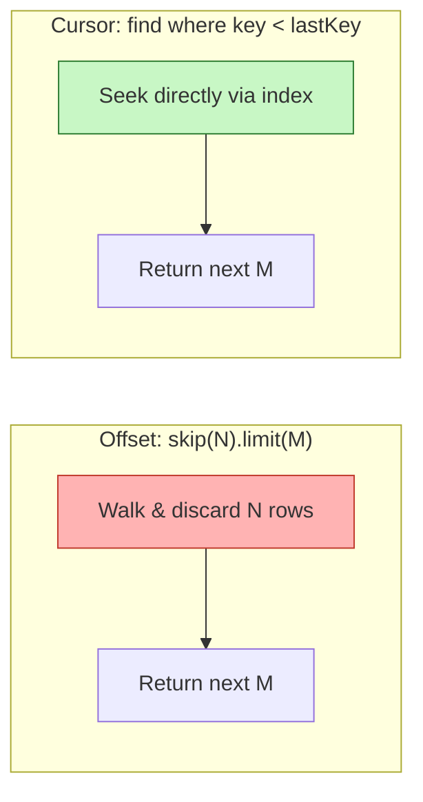

# 3. Implement Pagination

> **In one line:** Return large collections in stable, efficient pages using **cursor-based**
> pagination (keyset) instead of `skip`/`limit` — the schema, the query, the cursor encoding, and the
> trade-offs.

> **Original prompt:** Write a MongoDB aggregation pipeline or find() query using cursor-based pagination (not skip/limit).

## Overview

Any endpoint that returns a list must page it — returning 10,000 rows in one response is slow, expensive,
and fragile. The naive approach is `skip(N).limit(M)` (offset pagination), but it has two well-known
problems at scale:

- **It gets slower the deeper you go.** `skip(100000)` still walks and discards 100,000 documents.
- **It drifts.** If rows are inserted/deleted between page requests, items shift and users see
  duplicates or skipped records.

**Cursor-based pagination** (a.k.a. **keyset pagination**) fixes both by remembering *where you left
off* using an indexed field, instead of counting how many rows to skip.

## Step 0: Clarify the Problem

- **What order?** Cursor pagination requires a **stable, unique sort key** (or a tie-broken composite key).
- **Forward only, or bidirectional?** Forward (infinite scroll) is the common case; back/prev needs a reversed query.
- **Do we need total counts / jump-to-page?** If yes, offset or a hybrid is required — pure cursors can't jump to "page 37".

## Offset vs. Cursor — The Core Idea



| | Offset (`skip`/`limit`) | Cursor (keyset) |
|---|---|---|
| Deep-page performance | Degrades linearly with offset | Constant — index seek |
| Stability under writes | Drifts (dupes/skips) | Stable |
| Jump to arbitrary page | Yes | No (sequential only) |
| Total count / "page X of Y" | Easy | Needs a separate count |
| Implementation | Trivial | Slightly more work |

## The Cursor: What It Actually Is

A cursor is just an **opaque pointer to the last item of the previous page** — encoding the sort key(s)
needed to resume. For a feed sorted by newest first, the natural key is `_id` (a MongoDB `ObjectId`
embeds a timestamp and is monotonic-ish and unique), or an explicit `createdAt` + `_id` tie-breaker.

```text
Page 1:  GET /todos?limit=20
         → returns 20 items + nextCursor = <_id of item #20>

Page 2:  GET /todos?limit=20&cursor=<that _id>
         → find({ _id: { $lt: cursor } }).sort({ _id: -1 }).limit(20)
```

Encode the cursor (e.g. base64) so clients treat it as opaque and you can evolve its shape later.

## Query Implementation (find)

The simplest, most efficient form uses `_id` as the sort key:

```typescript
async function listTodos(userId: string, cursor?: string, limit = 20) {
  const query: any = { userId, isDeleted: false };

  if (cursor) {
    const lastId = decodeCursor(cursor); // base64 → ObjectId
    query._id = { $lt: lastId };         // items "after" the last one seen (newest-first)
  }

  // Fetch limit + 1 to know if there's another page, without a separate count.
  const docs = await Todo.find(query)
    .sort({ _id: -1 })
    .limit(limit + 1)
    .lean();

  const hasMore = docs.length > limit;
  const items = hasMore ? docs.slice(0, limit) : docs;
  const nextCursor = hasMore ? encodeCursor(items[items.length - 1]._id) : null;

  return { items, pageInfo: { nextCursor, hasMore, limit } };
}
```

Fetching `limit + 1` rows is a neat trick: if you get an extra one, there's another page — no expensive
`countDocuments()` needed.

## Tie-Breaking on a Non-Unique Sort Field

If you sort by a **non-unique** field (e.g. `createdAt`, `score`, `priority`), two rows can share the
same value and a single-field cursor would skip or repeat them. Use a **composite cursor**: the sort
field **plus** a unique tiebreaker (`_id`).

```typescript
// Sort by createdAt desc, tie-break by _id desc. Cursor = { createdAt, _id }.
const query = {
  userId,
  isDeleted: false,
  $or: [
    { createdAt: { $lt: cursor.createdAt } },
    { createdAt: cursor.createdAt, _id: { $lt: cursor.id } },
  ],
};
const docs = await Todo.find(query)
  .sort({ createdAt: -1, _id: -1 })
  .limit(limit + 1);
```

This guarantees a **total ordering**, so every row is visited exactly once.

## Aggregation Pipeline Variant

The same keyset predicate works inside an aggregation pipeline when you need joins/computed fields:

```typescript
const pipeline = [
  { $match: { userId, isDeleted: false, ...(cursor && { _id: { $lt: cursor } }) } },
  { $sort: { _id: -1 } },
  { $limit: limit + 1 },
  // $lookup / $project as needed...
];
const docs = await Todo.aggregate(pipeline);
```

Keep the `$match` + `$sort` first so the pipeline can use the index before doing heavier stages.

## The Index That Makes It Work

Cursor pagination is only fast if the sort/seek key is **indexed**. Sorting on an unindexed field forces
an in-memory sort that MongoDB caps at 32 MB.

- Single-key sort → index on that key (`_id` is indexed by default).
- Composite cursor → **compound index** matching the sort exactly, e.g.
  `{ userId: 1, createdAt: -1, _id: -1 }` (equality field first, then the sort keys — the ESR rule).

See [Index](../02-data-and-storage-concepts/05-index.md) and
[Database Indexing](./14-database-indexing.md).

## Response Shape

Return the page plus paging metadata so clients can request the next page without guessing:

```json
{
  "data": [ { "id": "665f...", "title": "..." } ],
  "pageInfo": { "nextCursor": "eyJfaWQiOiI2NjVm..." , "hasMore": true, "limit": 20 }
}
```

Used across list endpoints (see [Todo List API](./02-todo-list-api.md)) for a consistent contract; align
the envelope with [API Response Standardization](./12-api-response-standardization.md).

## Tips

- Sort on an **indexed** key; never paginate on an unindexed field.
- Add a **unique tiebreaker** (`_id`) whenever the sort field isn't unique.
- Fetch **`limit + 1`** to detect `hasMore` without a costly count.
- Treat the cursor as **opaque** (base64-encode it) so you can change its internals later.
- Return a **stable ordering** — otherwise pages overlap or skip rows.
- Use `.lean()` for read-only list queries to skip Mongoose document hydration.

## Trade-offs & Pitfalls

- **No random access:** cursors are sequential — you can't jump to "page 37" or show "page X of Y".
- **Totals cost extra:** exact counts need a separate `countDocuments()` (often approximate at scale).
- **Composite cursors add complexity** but are mandatory for non-unique sort fields.
- **Sorting on unindexed fields** triggers in-memory sorts (32 MB cap) and blocking behavior.
- **Offset is still fine** for small, bounded lists or admin tables where jump-to-page matters more than scale.

## System Design Cheat Sheet

```text
1. ORDER       Stable, unique sort key (or field + _id tiebreaker)
2. SEEK        WHERE key < lastKey  (not skip N)
3. LIMIT       Fetch limit + 1 to compute hasMore
4. CURSOR      Opaque, base64-encoded pointer to last item
5. INDEX       Compound index matching the sort (ESR)
6. RESPONSE    data + pageInfo(nextCursor, hasMore)
7. TRADE-OFF   No jump-to-page; counts cost extra
```

## Interview Questions & Answers

### A. Fundamentals

- **Why not use `skip`/`limit`?** — It walks and discards skipped rows (slow deep pages) and drifts when data changes.
- **What is cursor/keyset pagination?** — Resume from the last item using an indexed key predicate instead of an offset.
- **What is the cursor?** — An opaque pointer encoding the sort key(s) of the previous page's last item.
- **Why base64-encode the cursor?** — To keep it opaque so clients don't depend on its internal shape.

### B. Implementation

- **How do you know if there's a next page?** — Fetch `limit + 1`; an extra row means `hasMore`.
- **How do you paginate by `_id`?** — `find({ _id: { $lt: cursor } }).sort({ _id: -1 }).limit(n)`.
- **How do you paginate by a non-unique field?** — Composite cursor: `createdAt` **plus** `_id` tiebreaker with an `$or` predicate.
- **How would you do backward pagination?** — Flip the comparison and sort direction, then reverse the result set.
- **Aggregation vs find?** — Use aggregation when you need joins/computed fields; keep `$match`+`$sort` first.

### C. Performance & Indexing

- **Why must the sort key be indexed?** — Otherwise MongoDB does an in-memory sort capped at 32 MB and scans the collection.
- **What index supports a composite cursor?** — A compound index matching the sort order, e.g. `{ userId, createdAt, _id }`.
- **How does deep-page performance compare?** — Cursor is constant (index seek); offset degrades linearly.
- **How do you get a total count?** — A separate `countDocuments()` or an approximate/cached count.

### D. Trade-offs & Edge Cases

- **What can't cursor pagination do?** — Jump to an arbitrary page or show "page X of Y".
- **When is offset acceptable?** — Small/bounded lists or admin UIs needing jump-to-page.
- **What happens if the sort field isn't unique and you don't tie-break?** — Rows with equal values get skipped or duplicated.
- **How do you keep pages stable under inserts?** — Keyset predicate anchors to a value, so new inserts don't shift the window.

---

_Notes: (add your own content here)_
