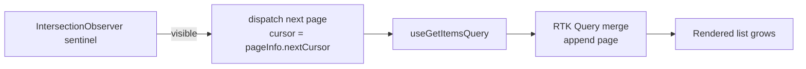

# 3. Implement Pagination (Cursor-Based)

> **In one line:** Design and implement pagination that stays correct and fast at any depth — comparing
> offset vs. cursor/keyset, the opaque cursor contract, stable sort + tie-breakers, bidirectional
> paging, the MongoDB query, and how a React/Redux Toolkit client consumes it as an infinite feed.

> **Original prompt:** Write a MongoDB aggregation pipeline or `find()` query using cursor-based pagination (not skip/limit).

## Overview

Pagination sounds trivial until the data set is large or *changing*. The naive `skip/limit` approach
looks fine in a demo and then falls apart in production:

- On page 5,000 the database still walks and discards 100,000 rows (`skip` is O(offset)).
- If a row is inserted or deleted between requests, items **shift** — users see duplicates or miss rows.

**Cursor (a.k.a. keyset / seek) pagination** fixes both: instead of "skip N rows," it says "give me the
rows *after this specific point*." The cursor encodes the sort key of the last item seen, so the next
page is a simple indexed range scan — constant time regardless of depth, and stable under inserts.

This write-up covers the requirements, the trade-offs between every pagination pattern, the high- and
low-level design, a realistic interview conversation, security, scaling, and a full-stack
implementation ([`./implementation/`](./implementation/)): a **NestJS + Mongoose + Zod** API and a
**Next.js + React + Redux Toolkit (RTK Query)** infinite-scroll client.

## Functional Requirements

1. Return a **bounded page** of items (default + max page size).
2. Provide a **`nextCursor`** so the client can fetch the following page.
3. Support **forward** paging (`after`) and, ideally, **backward** paging (`before`).
4. Results follow a **deterministic order** (a stable sort with a unique tie-breaker).
5. The cursor is **opaque** to the client (an encoded token, not a guessable offset).
6. Expose a `hasNextPage` / `hasPreviousPage` signal.

## Non-Functional Requirements

| Attribute | Target / approach |
|---|---|
| **Latency** | O(page size), independent of how deep you page — backed by an index |
| **Stability** | No duplicates/skips when rows are inserted/deleted between requests |
| **Scalability** | Works on huge collections; shard-friendly (sort key + tie-breaker) |
| **Consistency** | Deterministic ordering via a unique, immutable tie-breaker (`_id`) |
| **Security** | Opaque, tamper-evident cursor; validated inputs; per-user scoping |
| **Interoperability** | Clean contract: `{ data, pageInfo: { nextCursor, hasNextPage } }` |

## A Realistic Interview Conversation

> **I** = Interviewer, **C** = Candidate.

**I:** Paginate a large feed of posts. How?

**C:** First question: is the data changing while users page through it? For a feed, yes — new posts
arrive constantly. That rules out `skip/limit`, because offsets drift when rows are inserted, causing
duplicates and skips. I'd use **cursor / keyset pagination**.

**I:** Explain the difference concretely.

**C:** `skip(100000).limit(20)` makes the DB scan and throw away 100k rows every time — O(offset), and
it drifts. Keyset pagination instead sorts by an indexed key and asks for rows *after the last one seen*:
`WHERE (createdAt, _id) < (lastCreatedAt, lastId) ORDER BY createdAt DESC, _id DESC LIMIT 20`. That's an
indexed range scan — O(limit) at any depth — and it's stable because the boundary is a value, not a
position.

**I:** Why the `_id` in there?

**C:** `createdAt` isn't unique — many posts can share a timestamp. Without a unique tie-breaker the
boundary is ambiguous and you can drop or duplicate rows at page edges. `_id` (or any unique column)
makes the sort total and the cursor unambiguous.

**I:** What exactly is in the cursor?

**C:** An **opaque** token — base64 of the sort key plus tie-breaker, e.g. `{ createdAt, id }`. Opaque
so clients treat it as a black box and we can change its internals; ideally signed/validated so a
tampered cursor is rejected rather than returning arbitrary data.

**I:** Client wants infinite scroll. How does the frontend handle it?

**C:** The client keeps the latest `nextCursor` and requests the next page when the sentinel scrolls
into view (IntersectionObserver). With Redux Toolkit's RTK Query I use `serializeQueryArgs` +
`merge` so each page is **appended** to the same cache entry, and `forceRefetch` when the cursor
changes. That gives a growing list without manual cache juggling.

**I:** What about jumping to "page 50"?

**C:** That's the one thing cursors *can't* do — they're sequential (next/prev), not random-access. If
the product needs numbered pages, offset is the trade-off, accepting its cost and drift. Most
feeds/infinite-scroll UIs only need next, so cursor wins.

**I:** Sorting by something non-unique, like popularity?

**C:** Same principle: the cursor carries `(score, _id)` and the query compares the tuple. Any sort works
as long as you append a unique tie-breaker and have a matching compound index.

## A Mental Model: Four Questions

1. **What order?** — pick a deterministic sort (sort key + unique tie-breaker).
2. **Where am I?** — the cursor encodes the last item's sort key + tie-breaker.
3. **What's next?** — an indexed range scan *after* (or *before*) that boundary.
4. **How does the client assemble it?** — append pages by `nextCursor` (infinite scroll).

## The Patterns (and When to Use Them)

| Pattern | How it works | Pros | Cons | Use when |
|---|---|---|---|---|
| **Offset / `skip`+`limit`** | `skip(page·size).limit(size)` | Random access (jump to page N); trivial | O(offset) cost; **drifts** under writes | Small/stable data, admin tables needing page numbers |
| **Cursor / Keyset / Seek** | `WHERE key < lastKey ORDER BY key LIMIT n` | O(limit) at any depth; stable | Sequential only (no page jump) | Feeds, infinite scroll, large/changing data |
| **Time-range** | `WHERE createdAt < t` | Simple for time series | Needs unique tie-breaker; gaps | Logs, event streams |
| **Page tokens (opaque)** | Server encodes cursor state in a token | Hides internals; versionable | Slightly more server logic | Public APIs (Google/Stripe style) |
| **Bidirectional (Relation-style)** | `after`/`before` + `first`/`last` | Forward + backward | More edge cases | GraphQL Relay, chat scrollback |

> **Rule of thumb:** default to **keyset cursor** pagination. Reach for **offset** only when the product
> genuinely needs jump-to-page numbers on a small/stable data set.

### Why offset drifts (the core insight)

```text
t0  ORDER BY createdAt DESC:  [P10 P9 P8 | P7 P6 P5 | ...]   skip 0 limit 3 → P10 P9 P8
t1  a new post P11 is inserted at the top
t1  skip 3 limit 3 → P8 P7 P6      ← P8 is shown AGAIN (everything shifted by one)
```

Keyset avoids this: page 2 asks for "items after **P8**", not "items at position 3", so the new insert
at the top doesn't shift the window.

## High-Level Design (HLD)

```mermaid
flowchart TD
    subgraph Client[Next.js + React + Redux Toolkit]
      UI[Infinite-scroll Feed] --> RTK[RTK Query api slice<br/>serializeQueryArgs + merge]
    end
    RTK -->|GET /items?limit&cursor| GW[Load Balancer]
    GW --> API[NestJS API<br/>stateless]
    API --> SVC[Pagination Service<br/>decode cursor → keyset query]
    SVC --> DB[(MongoDB<br/>compound index)]
    DB --> SVC --> API -->|{ data, pageInfo }| RTK
```

The server is **stateless** — the cursor carries all the paging state, so any instance can serve any
page (see [Horizontal Scaling](../../01-core-infrastructure-concepts/03-horizontal-scaling.md),
[Load Balancer](../../01-core-infrastructure-concepts/04-load-balancer.md)). The database does the heavy
lifting via an [index](../../02-data-and-storage-concepts/05-index.md).

## Low-Level Design (LLD)

### The cursor contract

```text
cursor = base64url( JSON.stringify({ v: <sortValue>, id: <tieBreakerId> }) )

response:
{
  "data": [ ...items ],
  "pageInfo": { "nextCursor": "eyJ2Ijoi...", "hasNextPage": true, "limit": 20 }
}
```

- **`v`** — the value of the sort field for the last item (e.g. ISO `createdAt`).
- **`id`** — the unique tie-breaker (`_id`) of that same item.
- Opaque + validated: decode failures return `400`, not a stack trace or wrong data.

### The keyset query (forward, sort DESC)

```text
filter: { ...userFilters,
          $or: [ { createdAt: { $lt: c.v } },
                 { createdAt: c.v, _id: { $lt: c.id } } ] }
sort:   { createdAt: -1, _id: -1 }
limit:  pageSize + 1          # over-fetch one to compute hasNextPage
```

```mermaid
sequenceDiagram
    participant C as Client
    participant A as NestJS Controller
    participant Z as Zod query pipe
    participant S as PaginationService
    participant DB as MongoDB
    C->>A: GET /items?limit=20&cursor=eyJ...
    A->>Z: validate/coerce query
    Z->>S: { limit, cursor }
    S->>S: decodeCursor → { v, id }
    S->>DB: find(keyset filter).sort().limit(limit+1)
    DB-->>S: rows (limit+1?)
    S->>S: hasNextPage = rows>limit; nextCursor = encode(last)
    S-->>C: { data, pageInfo }
```

### Backend module layout (NestJS)

```text
server/src/
├── main.ts                     # bootstrap
├── app.module.ts               # wires Mongo + ItemsModule
├── common/
│   ├── cursor.ts               # encode/decode + keyset filter builder
│   └── zod-validation.pipe.ts  # Zod pipe for query validation
└── items/
    ├── item.schema.ts          # Mongoose model + compound index
    ├── items.controller.ts     # GET /items, POST /items/seed
    ├── items.service.ts        # keyset pagination logic
    └── items.dto.ts            # Zod query schema + types
```

### Frontend data flow (Redux Toolkit / RTK Query)

The infinite list is a single cache entry that grows as pages arrive:

```text
serializeQueryArgs: drop `cursor` from the cache key   → all pages share one entry
merge:              append incoming.data to existing   → growing list
forceRefetch:       when `cursor` changes              → actually fetch the next page
```



## The MongoDB Query (the original prompt)

`find()` form (preferred — simplest, index-friendly):

```typescript
const pageSize = 20;
const filter: FilterQuery<Item> = cursor
  ? {
      $or: [
        { createdAt: { $lt: cursor.v } },
        { createdAt: cursor.v, _id: { $lt: cursor.id } },
      ],
    }
  : {};

const rows = await ItemModel.find(filter)
  .sort({ createdAt: -1, _id: -1 }) // deterministic: sort key + unique tie-breaker
  .limit(pageSize + 1)              // over-fetch one to know if there's a next page
  .lean();
```

Aggregation-pipeline form (when you need `$lookup`/computed fields alongside paging):

```typescript
const rows = await ItemModel.aggregate([
  ...(cursor ? [{ $match: { $or: [
    { createdAt: { $lt: cursor.v } },
    { createdAt: cursor.v, _id: { $lt: cursor.id } },
  ] } }] : []),
  { $sort: { createdAt: -1, _id: -1 } },
  { $limit: pageSize + 1 },
]);
```

Backed by the compound index (ESR: equality → sort):

```typescript
itemSchema.index({ createdAt: -1, _id: -1 });
// with per-user scoping: { userId: 1, createdAt: -1, _id: -1 }
```

## Security

- **Opaque + validated cursor** — clients never see an offset; a malformed/tampered cursor is rejected
  with `400`. For untrusted clients, **sign** the token (HMAC) so it can't be forged.
- **Bound the page size** — clamp `limit` to a max (e.g. 100) so a client can't request a million rows.
- **Scope by owner/tenant** — include `userId`/`tenantId` in both the filter and the index so a cursor
  from one user can't leak another's data.
- **Input validation** — validate `limit`/`cursor`/`sort` with Zod; coerce types to avoid NoSQL
  operator injection.
- **No sensitive data in the token** — the cursor is decodable; put only the sort key + id in it.

## Scaling & Performance

- **Index-first** — keyset pagination is only fast with a compound index matching `sort` + tie-breaker.
  Without it, Mongo does a collection scan.
- **Stateless servers** — the cursor holds the paging state, so scale horizontally with no sticky
  sessions.
- **Sharding** — sort key + tie-breaker still works across shards; the router merges shard results by
  the same order (see [Sharding](../../02-data-and-storage-concepts/06-sharding.md)).
- **Caching** — hot first pages can be cached; deeper pages are cheap anyway thanks to the index.
- **Avoid `count()`** — total counts are expensive on huge collections; prefer `hasNextPage` (from the
  over-fetch) over "page X of Y".

## Implementation

A runnable full-stack implementation lives in [`./implementation/`](./implementation/):

| Layer | Stack | Highlights |
|---|---|---|
| **`server/`** | NestJS + Mongoose + Zod | Keyset cursor service, opaque cursor codec, `GET /items`, seed endpoint, e2e test |
| **`web/`** | Next.js + React + Redux Toolkit (RTK Query) + TypeScript | Infinite-scroll feed, `serializeQueryArgs`+`merge` append, IntersectionObserver |

| Design element | Where in the code |
|---|---|
| Cursor encode/decode | `server/src/common/cursor.ts` |
| Keyset filter builder | `server/src/common/cursor.ts` |
| Pagination query | `server/src/items/items.service.ts` |
| Compound index | `server/src/items/item.schema.ts` |
| Zod query validation | `server/src/common/zod-validation.pipe.ts` + `items.dto.ts` |
| RTK Query infinite merge | `web/src/store/itemsApi.ts` |
| Infinite-scroll UI | `web/src/components/Feed.tsx` |

The backend is verified by an end-to-end test (in-memory MongoDB) proving: page size, `hasNextPage`,
**no overlap across pages**, full traversal of the data set, and stability when a new row is inserted
mid-pagination.

## Tips

- Default to **keyset cursor** pagination; use offset only for jump-to-page on small/stable data.
- Always add a **unique tie-breaker** (`_id`) to the sort — otherwise page edges drop/duplicate rows.
- **Over-fetch one** row to compute `hasNextPage` without a separate `count()`.
- Keep the cursor **opaque** (and signed for public APIs); validate and clamp all inputs.
- Match the **compound index** to `sort key + tie-breaker` (ESR), or keyset degrades to a scan.
- On the client, use RTK Query **`merge` + `serializeQueryArgs`** to append pages into one cache entry.

## Trade-offs & Pitfalls

- **Offset is simple but drifts and is O(offset)** — fine for small/stable tables, wrong for feeds.
- **Cursors can't random-access** a page number — that's the price of stability and speed.
- **Forgetting the tie-breaker** silently drops/duplicates rows sharing a sort value — subtle and nasty.
- **`count()` for total pages** is expensive at scale — prefer `hasNextPage`.
- **Un-indexed sort** turns keyset pagination into a full scan — always index the sort tuple.
- **Leaking raw offsets/ids** in the cursor invites tampering — encode and validate (sign if public).

## System Design Cheat Sheet

```text
1.  DATA MUTABLE?  Changing feed → cursor; small/static → offset ok
2.  SORT ORDER     Deterministic: sort key + UNIQUE tie-breaker (_id)
3.  CURSOR         Opaque token = base64({ v: sortVal, id: tieBreaker })
4.  QUERY          WHERE (key,id) < (cursor) ORDER BY key,id LIMIT n+1
5.  INDEX          Compound index on (key, id) — ESR
6.  PAGEINFO       hasNextPage from over-fetch; nextCursor = last item
7.  DIRECTION      forward (after) + optional backward (before)
8.  SECURITY       clamp limit, validate/sign cursor, scope by owner
9.  CLIENT         RTK Query merge + serializeQueryArgs → infinite scroll
10. SCALE          stateless API, indexed range scan, shard-friendly
```

## Interview Questions & Answers

### A. Requirement Clarification
- **Is the data changing during pagination?** — If yes (feeds), cursor; offset would drift.
- **Do we need jump-to-page numbers?** — If yes, offset; otherwise cursor.
- **Forward only or also backward?** — Decide `after`/`before` support up front.
- **What's the sort order?** — Must be deterministic; pick a unique tie-breaker.
- **Per-user/tenant scoped?** — Fold the owner into the filter and index.

### B. Offset vs Cursor
- **Why not skip/limit?** — O(offset) cost and it drifts under inserts/deletes.
- **What is keyset pagination?** — Range scan after the last-seen sort key, not a positional offset.
- **Why is cursor stable?** — The boundary is a value, so new inserts don't shift the window.
- **What can't cursors do?** — Random access to an arbitrary page number.
- **How does cursor stay O(limit)?** — It's an indexed range scan, independent of depth.

### C. Cursor Design
- **What's inside the cursor?** — The sort value + unique tie-breaker, base64-encoded.
- **Why opaque?** — Hides internals, lets you evolve the format, discourages tampering.
- **How do you prevent tampering?** — Sign the token (HMAC) and validate on decode.
- **Why a tie-breaker?** — Non-unique sort keys make the boundary ambiguous → dropped/dup rows.
- **How do you compute hasNextPage?** — Over-fetch one extra row and check if it came back.

### D. Query & Indexing
- **Write the Mongo query.** — `$or` keyset filter + `sort(key,-1,_id,-1)` + `limit(n+1)`.
- **find() or aggregation?** — `find()` normally; aggregation when you need `$lookup`/computed fields.
- **What index?** — Compound on the sort tuple `(createdAt, _id)`, owner-first if scoped.
- **What's the ESR rule?** — Equality, then Sort, then Range fields in the index.
- **How do you avoid count()?** — Use the over-fetch `hasNextPage` signal instead.

### E. Frontend / Client
- **How does infinite scroll work?** — IntersectionObserver triggers the next-page fetch by cursor.
- **How do you append pages in RTK Query?** — `serializeQueryArgs` (drop cursor) + `merge` + `forceRefetch`.
- **How do you avoid duplicate renders?** — One cache entry per query args; append distinct pages.
- **How do you reset the list?** — Change the base query args (e.g. filter) so a new cache entry starts.

### F. Scaling & Security
- **How does this shard?** — Same sort tuple; router merges shard results by that order.
- **How do you bound abuse?** — Clamp `limit`; validate/sign cursors; scope by owner.
- **Where can you cache?** — Hot first pages; deeper pages are already cheap via the index.
- **What are the main trade-offs?** — Offset (random access, drift) vs cursor (stable, sequential).
