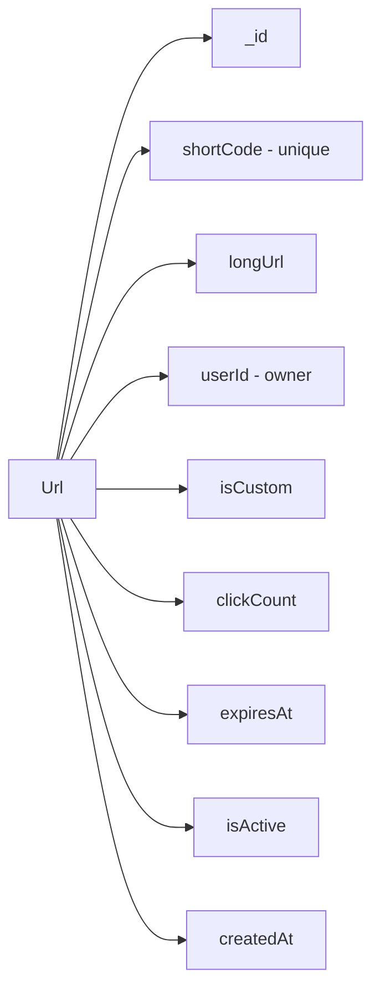
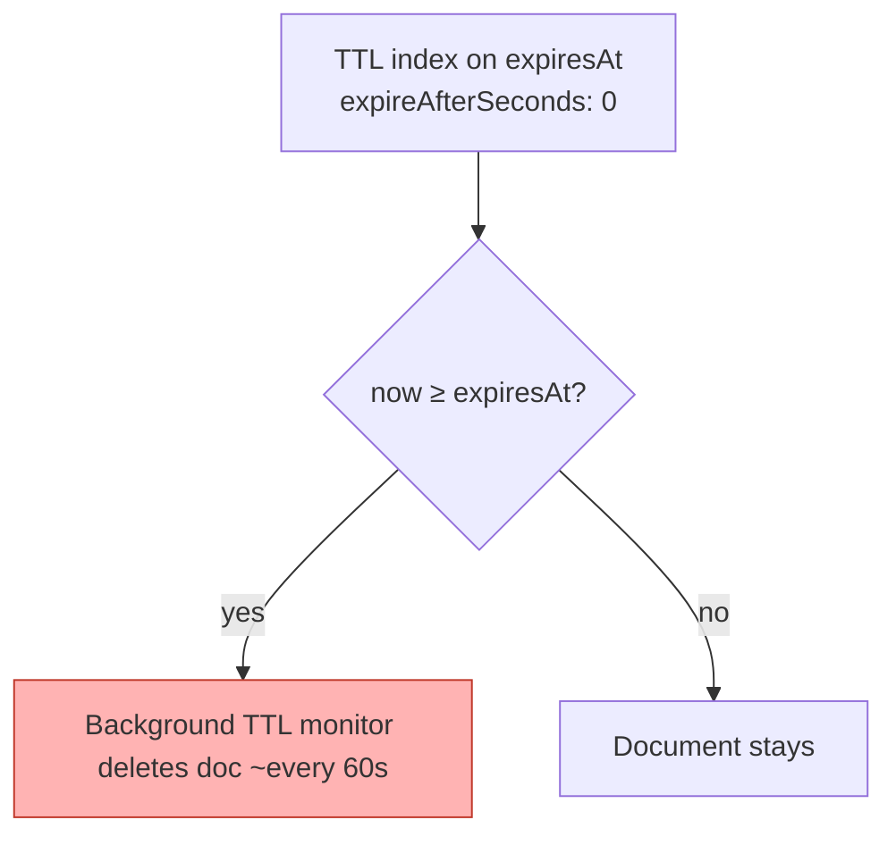
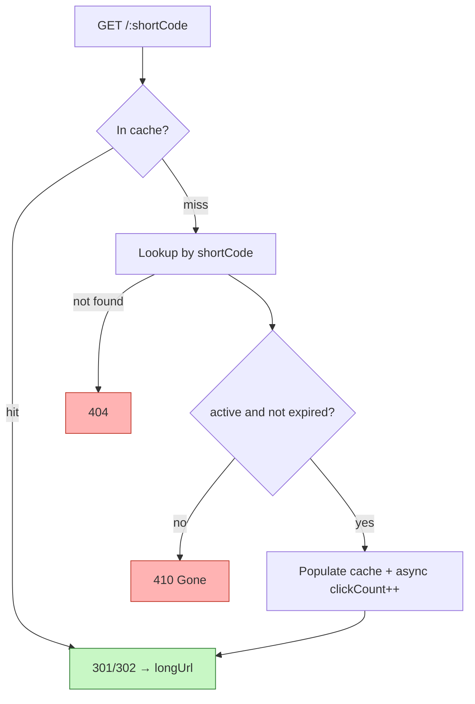

# 4. Design a URL Shortener (Schema)

> **In one line:** Design the data model and lifecycle for a URL shortener (think Bitly / TinyURL) —
> short-code generation, guaranteed uniqueness, TTL-based expiration, and how redirects stay fast,
> secure, and correct at billions of lookups.

> **Original prompt:** Create the database schema to store short codes and handle expiration (TTL indexes).

## Overview

A URL shortener maps a compact code to a long destination and redirects on lookup:

```text
https://sho.rt/aX9bQ2  →  301/302  →  https://example.com/very/long/path?utm=...
```

The schema decisions drive everything: how codes are generated (uniqueness, length, unpredictability),
how the redirect stays O(1) under enormous read traffic, how links expire without a cron job, and how you
stop the service from becoming an open redirect for phishing. This problem centers on the **schema and
the expiration mechanism**, but a strong answer covers the read path, security, and scale too.

## Real-World Context

- **Bitly** handles on the order of billions of clicks per month; the redirect is the hot path and is
  served from cache/CDN, not a database round trip per click.
- **Twitter's `t.co`, WhatsApp link previews, marketing `utm` campaigns** — shorteners double as
  analytics and safety gateways (malware/phishing scanning) as much as space savers.
- **Read/write asymmetry is extreme:** a link is created once and may be read millions of times. Every
  design choice optimizes the read (redirect) path and treats writes (creation) as comparatively rare.

## Requirements

**Functional**

- Create a short code for a long URL (optionally a custom alias).
- Redirect from short code to the long URL.
- Support optional expiration (absolute date or TTL) and deactivation.
- Optional: per-link click analytics and per-user ownership/quotas.

**Non-functional**

- **Performance:** redirect latency in low single-digit milliseconds; effectively O(1) lookup.
- **Scalability:** billions of stored links, very high read QPS, read-dominant by orders of magnitude.
- **Availability:** the redirect path must survive database hiccups (cache/CDN in front).
- **Security:** codes should be unguessable where privacy matters; the service must not become an open
  redirect / phishing amplifier.

## Data Model



```typescript
import { Schema, model, Types } from "mongoose";

const urlSchema = new Schema(
  {
    shortCode: {
      type: String,
      required: true,
      unique: true,        // unique index — this is the redirect lookup key
      index: true,
      minlength: 4,
      maxlength: 32,
    },
    longUrl: { type: String, required: true, trim: true, maxlength: 2048 },
    userId: { type: Types.ObjectId, ref: "User", default: null, index: true },
    isCustom: { type: Boolean, default: false },
    clickCount: { type: Number, default: 0 },

    // TTL: Mongo deletes the doc once now >= expiresAt (with expireAfterSeconds: 0).
    expiresAt: { type: Date, default: null },
    isActive: { type: Boolean, default: true },
  },
  { timestamps: true },
);

urlSchema.index({ expiresAt: 1 }, { expireAfterSeconds: 0 }); // TTL index
export const Url = model("Url", urlSchema);
```

Interview points:

- **`shortCode` is the primary lookup key**, so it carries a unique index; an equality match on it is
  O(log n) and effectively constant for practical sizes. See [Index](../02-data-and-storage-concepts/05-index.md).
- **Store the code directly** — you look up *by* it, so it must be indexable (a hash of it wouldn't help).
- **`longUrl` capped at 2048** — the de-facto safe URL length across browsers.

## Generating Short Codes

Three strategies, each a real trade-off you should be able to argue:

| Strategy | How | Pros | Cons |
|---|---|---|---|
| **Random Base62** | N random `[A-Za-z0-9]` chars; rely on unique index + retry | Unpredictable, stateless, simple | Tiny collision-retry chance |
| **Counter + Base62 encode** | Monotonic id → Base62 | No collisions, shortest codes | **Enumerable/guessable**; needs a global counter |
| **Hash of URL + salt** | Hash long URL, take first N chars | Natural dedupe of identical URLs | Collisions still need handling |

```text
Base62 keyspace (a-z A-Z 0-9):
  6 chars → 62^6 ≈ 56.8 billion
  7 chars → 62^7 ≈ 3.5 trillion
```

A **7-char random Base62** code gives a vast keyspace with negligible collision probability, and — unlike
a counter — is unpredictable so users can't enumerate everyone's links by walking `/1, /2, /3`.

```typescript
import { customAlphabet } from "nanoid";
const gen = customAlphabet(
  "0123456789abcdefghijklmnopqrstuvwxyzABCDEFGHIJKLMNOPQRSTUVWXYZ", 7);
// Insert with the unique index; on E11000 duplicate-key error, regenerate and retry (≤ a few tries).
```

> **Uniqueness is enforced by the database, not the app.** Rely on the unique index and catch the
> duplicate-key error — never "read to check if it exists, then insert", which races under concurrency and
> lets two requests grab the same code.

**At massive write scale**, the retry approach can be replaced with a **counter/key-range service**: a
central counter hands each app server a block of ids (e.g. 1,000 at a time) to Base62-encode locally,
eliminating both collisions and per-write coordination. Mention this as the scale-up path.

## Expiration with TTL Indexes

MongoDB's **TTL index** deletes documents automatically once a Date field passes — no cron job.



- **Expire at an exact time:** store the absolute time in `expiresAt`, index with `expireAfterSeconds: 0`.
  `expiresAt = null` → never expires (TTL skips missing/non-date values).
- **Expire N seconds after creation:** index `createdAt` with `expireAfterSeconds: N`.

Caveats to raise:

- The TTL monitor runs **roughly once per minute**, so deletion is *approximate* — a link can remain
  physically present up to ~a minute past expiry. Therefore **also validate `expiresAt`/`isActive` at read
  time** for correctness; TTL is for cleanup, not for enforcement.
- TTL requires a **Date** type; a numeric or string timestamp silently won't expire.

## Redirect Flow (the hot path)



Because redirects dominate traffic and the code→URL mapping is immutable, it caches beautifully. See
[Cache](../02-data-and-storage-concepts/08-cache.md) and [Caching Layer](./10-caching-layer.md).

## Performance

- **Cache-first reads:** a Redis (or CDN edge) lookup keyed on `shortCode` serves the vast majority of
  redirects without touching MongoDB. The mapping never changes, so cache entries are safe to keep until
  expiry/deactivation.
- **HTTP caching:** a `301` lets browsers and intermediary caches remember the redirect, removing repeat
  hits entirely — great for throughput but it hides analytics and makes changing the target hard.
- **Async click counting:** increment `clickCount` off the request path (fire-and-forget / queue) so
  analytics never add latency to the redirect.
- **Small, indexed documents:** keep the redirect document lean; heavy analytics belong elsewhere.

## Scalability

- **Read scaling:** front with cache/CDN and read replicas; the origin DB should see only cache misses.
- **Write scaling / code generation:** random Base62 + unique index scales without coordination; a
  counter-based scheme needs a distributed counter or key-range allocation to avoid a single hotspot.
- **Analytics volume:** high-frequency click events should be an append-only stream/separate collection
  (or a queue → aggregator), not hot `$inc` updates contending on one popular link's document.
- **Sharding:** shard on **hashed `shortCode`** so both storage and lookups distribute evenly across
  shards (a monotonic counter key would hotspot the newest shard). See
  [Sharding](../02-data-and-storage-concepts/06-sharding.md).

## Security

- **Open-redirect / phishing abuse** is the defining risk: attackers love shorteners because the short
  domain hides a malicious destination. Mitigations: validate and normalize the `longUrl` scheme
  (allow only `http`/`https`), block internal/loopback and metadata addresses (SSRF via `169.254.169.254`,
  `localhost`, private ranges), screen against threat-intel/Safe-Browsing lists, and consider an interstitial
  warning page for untrusted targets.
- **Unguessability:** if links can be private, use random codes (not sequential counters) so URLs can't be
  enumerated. Sequential ids leak volume and let anyone scrape all links.
- **Rate limiting & abuse:** throttle creation per user/IP to stop spammers minting millions of links
  (see [Rate Limiter](./05-rate-limiter-middleware.md)); require auth for creation where appropriate.
- **Input validation:** enforce max length, reject malformed URLs, and store the normalized form.
- **Reserved/blocklisted codes:** prevent custom aliases from colliding with routes (`/api`, `/admin`) or
  spoofing brands.

## Reliability & Edge Cases

- **Expired-but-not-yet-deleted:** the read-time expiry check makes correctness independent of the TTL
  sweep lag; return `410 Gone` for expired, `404` for unknown.
- **Custom alias collisions:** the unique index rejects duplicates; surface a clean "alias taken" error.
- **Cache/DB divergence on deactivation:** deleting or disabling a link must also invalidate its cache
  entry, or it will keep redirecting until the entry expires.

## Tips

- Make `shortCode` a **unique, indexed** field — it's the redirect key.
- Prefer **random Base62 (~7 chars)** for a huge, unpredictable keyspace; enforce uniqueness at the DB.
- Use a **TTL index** (`expireAfterSeconds: 0` on `expiresAt`) for auto-cleanup; `null` = never.
- **Validate expiry at read time** — TTL cleanup lags by up to a minute.
- **Cache** the immutable mapping and increment clicks **asynchronously**.
- **Validate/normalize `longUrl`** and screen destinations to avoid open-redirect abuse.

## Trade-offs & Pitfalls

- **Sequential/counter codes are enumerable** — anyone can walk them; random codes avoid this but need a
  uniqueness retry.
- **TTL deletion is not instant** (~1-minute monitor) — rely on read-time checks for correctness.
- **TTL requires a Date field** — a numeric/string timestamp silently won't expire.
- **301 vs 302:** permanent caches in browsers (fast, fewer analytics, hard to change target); temporary
  always reaches the server (analytics, more load).
- **Hot `clickCount` `$inc`** contends on popular links — batch/async or move to a separate store.
- **Skipping URL validation** turns the service into a phishing/open-redirect/SSRF vector.

## System Design Cheat Sheet

```text
1. ENTITY      shortCode (unique) → longUrl + owner + lifecycle
2. CODE GEN    Random Base62 (~7) vs counter vs hash; DB-enforced uniqueness
3. LOOKUP      Indexed equality on shortCode; cache/CDN in front
4. EXPIRY      TTL index on expiresAt + read-time check (TTL lags ~1 min)
5. REDIRECT    301 vs 302; async clickCount; invalidate cache on change
6. SECURITY    Validate/normalize longUrl; block SSRF; screen phishing; rate-limit
7. SCALE       Cache reads; shard on hashed shortCode; analytics in a stream
```

## Interview Questions & Answers

### A. Requirements & Scope

- **What's the read/write ratio, and why does it matter?**
  It's extremely read-heavy — a link is created once and can be read millions of times. That asymmetry
  dictates the whole design: I optimize the redirect path aggressively (cache/CDN, tiny indexed lookup)
  and treat creation as relatively rare, so I can afford a slightly more expensive write (uniqueness check,
  URL validation) in exchange for a blazing-fast read.

- **Do we need custom aliases, expiration, and analytics?**
  I'd clarify each because they change the schema. Custom aliases mean the code can be user-supplied, so I
  reserve/blocklist system routes and rely on the unique index for collisions. Expiration means a TTL
  mechanism plus a read-time check. Analytics means either a `clickCount` for simple cases or a separate
  event pipeline if they want per-click detail at scale.

### B. Schema & Code Generation

- **How do you generate short codes, and which approach do you prefer?**
  Three options: random Base62, a monotonic counter Base62-encoded, or a hash of the URL. I default to
  ~7-char random Base62 because it gives ~3.5 trillion combinations, is stateless (no central counter to
  coordinate), and is unpredictable so links can't be enumerated. Its only downside is a vanishingly small
  collision chance, which I handle by relying on the unique index and retrying on a duplicate-key error.

- **Why not use an auto-incrementing counter — it never collides?**
  Two problems. First, it's enumerable: `/1, /2, /3` lets anyone scrape every link and infer your total
  volume, which is a privacy and competitive-intel leak. Second, a single global counter is a coordination
  bottleneck and a sharding hotspot. If I did need counter-based codes at scale, I'd use key-range
  allocation — each server grabs a block of ids to encode locally — but random Base62 avoids the problem
  entirely for most systems.

- **How do you guarantee uniqueness safely under concurrency?**
  I let the database enforce it with a unique index on `shortCode` and handle the duplicate-key (E11000)
  error by regenerating and retrying. I specifically avoid "check if it exists, then insert," because
  between the read and the write two concurrent requests can both see "free" and both insert — a classic
  race. The unique index makes the insert itself the atomic arbiter.

### C. Expiration (TTL)

- **How do links expire automatically, and what are the gotchas?**
  A MongoDB TTL index on a Date field: with `expireAfterSeconds: 0` on `expiresAt`, Mongo deletes each
  document once its stored time passes. The gotchas: the TTL monitor only runs about once a minute, so
  deletion is approximate — a link can linger up to a minute past expiry. So I never rely on TTL for
  correctness; I also check `expiresAt`/`isActive` at read time and return `410 Gone`. TTL is for cleanup,
  the read-time check is for enforcement.

- **How would you make some links expire and others never?**
  I store `expiresAt` per document; `null` means never. TTL indexes skip documents where the indexed field
  is missing or not a Date, so a `null`/absent `expiresAt` is simply never collected. That lets the same
  collection hold both permanent and expiring links under one TTL index.

### D. Redirect, Performance & Scale

- **How do you keep redirects fast at billions of clicks?**
  The mapping is immutable, so it's ideal for caching. I serve redirects from a Redis/CDN layer keyed on
  the short code, so the origin database only sees cache misses. I increment click counts asynchronously so
  analytics never sit on the redirect path, and I keep the stored document tiny and indexed. A `301` can
  additionally let browsers cache the redirect, though I weigh that against losing per-click visibility.

- **301 or 302 — which redirect do you return?**
  It's a trade-off. `301` (permanent) is cached by browsers and intermediaries, giving the best
  performance and lowest load, but it means repeat clicks never reach my server so I lose analytics and I
  can't easily change the destination later. `302` (temporary) always hits my server, so I keep analytics
  and control at the cost of more traffic. Most shorteners use `302` (or `307`) precisely because analytics
  and editability matter to them.

- **How would you shard this, and why the hashed key?**
  I'd shard on a hashed `shortCode`. Lookups are equality matches on the short code, so hashing spreads
  both storage and read traffic evenly across shards. If I sharded on a monotonic counter instead, all new
  writes and the hottest recent links would pile onto the newest shard — a hotspot. Hashing trades away
  range queries (which a shortener doesn't need) for even distribution (which it does).

### E. Security

- **What's the biggest security risk, and how do you handle it?**
  Open-redirect abuse — attackers use the trusted short domain to hide phishing or malware links. I
  validate and normalize the destination (allow only `http`/`https`), block requests to internal/loopback
  and cloud-metadata addresses to prevent SSRF, screen targets against threat-intelligence/Safe-Browsing
  feeds, and can show an interstitial warning for untrusted destinations. I also rate-limit and often
  require auth for creation so spammers can't mint links en masse.

- **How do you stop abuse and enumeration?**
  Random (not sequential) codes prevent enumeration of others' links. Creation is rate-limited per user/IP
  to stop mass link generation, custom aliases are validated against a reserved/blocklist so they can't
  shadow real routes or impersonate brands, and I enforce URL length/format limits. Together these keep the
  service from becoming a spam or phishing amplifier.

---

_Notes: (add your own content here)_
