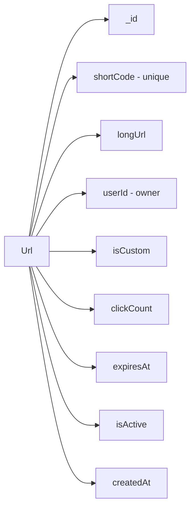
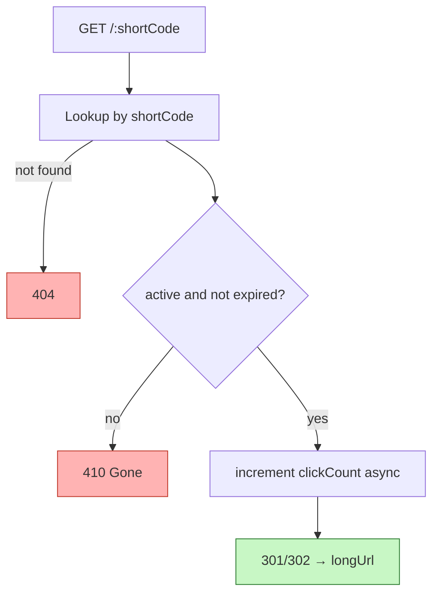

# 4. Design a URL Shortener (Schema)

> **In one line:** Design the data model for a URL shortener — how short codes are generated and stored,
> how redirects stay fast, and how links expire automatically using **TTL indexes**.

> **Original prompt:** Create the database schema to store short codes and handle expiration (TTL indexes).

## Overview

A URL shortener maps a short code (`aX9bQ2`) to a long URL and redirects on lookup:

```text
https://sho.rt/aX9bQ2  →  301/302  →  https://example.com/very/long/path?...
```

It looks simple, but the schema decisions drive everything: how codes are generated (uniqueness,
length, unpredictability), how redirects stay O(1), and how expired links are cleaned up without a
cron job. This problem focuses on **the schema and the expiration mechanism**.

## Step 0: Clarify the Problem

- **Read/write ratio?** Massively read-heavy — redirects vastly outnumber creations. Optimize the lookup.
- **Custom aliases?** Do users pick vanity codes (`/my-brand`) or are all codes generated?
- **Expiration?** Do links expire (after a date, or N days)? This drives the TTL design.
- **Analytics?** Click counts, referrers — store inline or in a separate collection?
- **301 vs 302?** Permanent redirects cache well but hide analytics; temporary redirects always hit the server.

## Data Model

The core entity maps a unique `shortCode` to a `longUrl`, plus ownership, lifecycle, and optional stats.



```typescript
import { Schema, model, Types } from "mongoose";

const urlSchema = new Schema(
  {
    shortCode: {
      type: String,
      required: true,
      unique: true,     // enforced by a unique index — the lookup key
      index: true,
      minlength: 4,
      maxlength: 32,
    },
    longUrl: { type: String, required: true, trim: true, maxlength: 2048 },
    userId: { type: Types.ObjectId, ref: "User", default: null, index: true },
    isCustom: { type: Boolean, default: false },
    clickCount: { type: Number, default: 0 },

    // TTL: MongoDB deletes the document automatically once now >= expiresAt.
    expiresAt: { type: Date, default: null },

    isActive: { type: Boolean, default: true },
  },
  { timestamps: true },
);

// TTL index: expire documents AT the time stored in expiresAt (expireAfterSeconds: 0).
urlSchema.index({ expiresAt: 1 }, { expireAfterSeconds: 0 });

export const Url = model("Url", urlSchema);
```

Key points for an interview:

- **`shortCode` unique index** is the redirect lookup key — an equality match on an indexed unique field
  is O(log n) and effectively constant for practical sizes. See
  [Index](../02-data-and-storage-concepts/05-index.md).
- **Store the code, not a hash** — you look up *by* code, so it must be directly indexable.

## Generating Short Codes

Three common strategies, each with trade-offs:

| Strategy | How | Pros | Cons |
|---|---|---|---|
| **Random (Base62)** | Generate N random `[A-Za-z0-9]` chars; retry on collision | Unpredictable, simple, stateless | Needs a uniqueness check/retry |
| **Counter + Base62 encode** | Auto-increment id → encode to Base62 | No collisions, shortest codes | Sequential = guessable/enumerable; needs a global counter |
| **Hash (of URL + salt)** | Hash the long URL, take first N chars | Deterministic dedupe | Collisions need handling; still needs a check |

```text
62 symbols (a-z, A-Z, 0-9):
  6 chars → 62^6 ≈ 56.8 billion combinations
  7 chars → 62^7 ≈ 3.5 trillion
```

A **7-character random Base62** code gives an enormous keyspace with negligible collision probability,
and unpredictability (unlike a sequential counter, you can't enumerate everyone's links).

```typescript
import { customAlphabet } from "nanoid";
const nanoid = customAlphabet(
  "0123456789abcdefghijklmnopqrstuvwxyzABCDEFGHIJKLMNOPQRSTUVWXYZ",
  7,
);
// Insert with a unique index; on E11000 duplicate-key error, regenerate and retry.
```

> **Uniqueness is enforced by the database**, not just the app — rely on the unique index and handle the
> duplicate-key error with a retry, rather than a read-then-write race.

## Expiration with TTL Indexes

MongoDB's **TTL index** deletes documents automatically once a date field passes — no cron job needed.
There are two idioms:


- **Expire at an exact time:** store the absolute expiry in `expiresAt` and use `expireAfterSeconds: 0`.
  Set `expiresAt = null` for links that never expire (TTL skips missing/non-date fields).
- **Expire N seconds after creation:** index `createdAt` with `expireAfterSeconds: N`.

Caveats worth mentioning:

- The TTL monitor runs **~once per minute**, so deletion is *approximate*, not instant. A link may be
  readable for up to a minute past expiry — so also **check `expiresAt`/`isActive` at read time** for
  correctness.
- TTL requires a **Date** field; storing a number/string won't trigger expiry.

## Redirect Flow



Because redirects dominate traffic, this hot path should be cached — the code→URL mapping is immutable,
so it caches beautifully (see [Cache](../02-data-and-storage-concepts/08-cache.md) and
[Caching Layer](./10-caching-layer.md)). Increment `clickCount` asynchronously so analytics never slow
the redirect.

## Scaling Notes

- **Read-heavy:** front the lookup with a cache (Redis/CDN); a `301` also lets browsers cache the redirect.
- **Write scale / collisions:** random Base62 + unique index + retry avoids coordination; a counter-based
  scheme needs a distributed counter.
- **Analytics volume:** high-frequency click events belong in a separate collection/stream, not as hot
  updates on the URL document.
- **Sharding:** shard on `shortCode` (hashed) so lookups distribute evenly (see
  [Sharding](../02-data-and-storage-concepts/06-sharding.md)).

## Tips

- Make `shortCode` a **unique, indexed** field — it's the redirect key.
- Prefer **random Base62 (~7 chars)** for a huge, unpredictable keyspace; enforce uniqueness at the DB.
- Use a **TTL index** (`expireAfterSeconds: 0` on `expiresAt`) for auto-expiry; `null` = never expires.
- **Also validate expiry at read time** — TTL cleanup lags by up to a minute.
- **Cache** the immutable code→URL mapping; increment click counts **asynchronously**.

## Trade-offs & Pitfalls

- **Sequential/counter codes are enumerable** — anyone can walk `/1, /2, /3`; random codes avoid this.
- **TTL deletion is not instant** (~1-minute monitor) — rely on a read-time check for correctness-critical expiry.
- **TTL needs a Date field** — a numeric/string timestamp silently won't expire.
- **301 vs 302:** permanent redirects cache in browsers (fast, but you lose per-click server hits/analytics);
  temporary redirects always reach the server (analytics, but more load).
- **Hot `clickCount` updates** can contend on popular links — batch/async them or move to a separate store.

## System Design Cheat Sheet

```text
1. ENTITY      shortCode (unique) → longUrl + owner + lifecycle
2. CODE GEN    Random Base62 (~7) vs counter vs hash
3. UNIQUENESS  Unique index + retry on duplicate key
4. LOOKUP      Indexed equality on shortCode (O(1)-ish)
5. EXPIRY      TTL index on expiresAt (expireAfterSeconds: 0)
6. CORRECTNESS Read-time expiry check (TTL lags ~1 min)
7. REDIRECT    301/302; async clickCount; cache the mapping
8. SCALE       Cache/CDN reads; shard on hashed shortCode
```

## Interview Questions & Answers

### A. Requirements

- **What's the read/write ratio?** — Heavily read-dominant; optimize the redirect lookup and cache it.
- **Do we support custom aliases?** — Optionally; mark `isCustom` and check availability against the unique index.
- **Do links expire?** — Support optional expiry via a TTL index; `null` means never.
- **Do we need analytics?** — Track `clickCount`; high-volume click events go to a separate store.

### B. Schema & Code Generation

- **What's the primary lookup key?** — `shortCode`, a unique indexed string.
- **How do you generate codes?** — Random Base62 (~7 chars), counter+Base62, or hash-based — each with trade-offs.
- **Why random over sequential?** — Sequential codes are enumerable/guessable; random ones aren't.
- **How long should the code be?** — ~7 Base62 chars gives 62^7 ≈ 3.5 trillion combinations.
- **How do you guarantee uniqueness?** — A unique index on `shortCode`; retry on the duplicate-key error.
- **Do you store the URL hash?** — You store the code (the lookup key); hashing is only a generation strategy.

### C. Expiration (TTL)

- **How do links expire automatically?** — A MongoDB TTL index on a Date field deletes documents past their time.
- **How do you expire at an exact time?** — Store `expiresAt` and use `expireAfterSeconds: 0`.
- **How do you expire N days after creation?** — TTL index on `createdAt` with `expireAfterSeconds: N`.
- **Is TTL deletion instant?** — No — the monitor runs ~once a minute, so also check expiry at read time.
- **How do you make a link never expire?** — Leave `expiresAt` null; TTL skips missing/non-date values.

### D. Redirect & Scaling

- **301 or 302?** — 301 caches in browsers (fast, fewer analytics); 302 always hits the server (analytics, more load).
- **How do you keep redirects fast?** — Cache the immutable mapping in Redis/CDN; index the lookup.
- **How do you count clicks without slowing redirects?** — Increment asynchronously or via a separate event stream.
- **How would you shard?** — On a hashed `shortCode` for even lookup distribution.
- **What status for an expired/inactive link?** — `410 Gone` (or `404` if you prefer to hide it).

---

_Notes: (add your own content here)_
