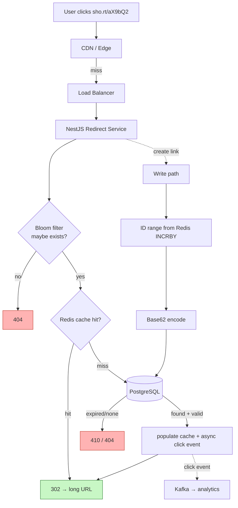
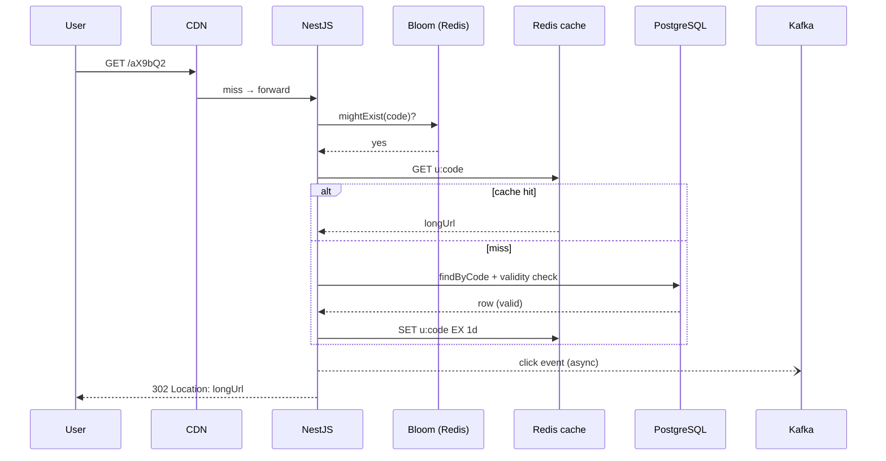

# 4. Design a URL Shortener (Schema)

> **In one line:** Design a production URL shortener (Bitly/TinyURL-class) — the interview conversation,
> HLD, LLD with real NestJS code, code-generation algorithms, TTL expiration, and deep scaling + security
> for billions of redirects.

> **Original prompt:** Create the database schema to store short codes and handle expiration (TTL indexes).

---

## 1. The Interview Conversation

> **Interviewer:** "Design a URL shortener like Bitly. Focus on the data model and how links expire."
>
> **Candidate:** "Let me frame the scale, because it dictates the design. What read/write volume are we
> targeting?"
>
> **Interviewer:** "Assume 100M new links/month and a 100:1 read:write ratio."
>
> **Candidate:** "So ~40 writes/sec average, but ~4,000 redirects/sec, spiking higher — this is an
> extremely read-heavy system, so the redirect path must be O(1) and cache-served, and I'll happily pay a
> bit more at write time. Do we need custom aliases, per-user ownership, analytics, and expiration?"
>
> **Interviewer:** "Custom aliases yes, analytics as click counts, expiration optional per link."
>
> **Candidate:** "Then the code is either generated or user-supplied; I'll enforce uniqueness with a DB
> constraint plus a fast existence check. For code generation I'm choosing between random Base62, a
> counter encoded to Base62, and hashing — I'll argue for a distributed counter with Base62 encoding
> because it guarantees uniqueness without collision-retries at high write rates, and I'll make codes
> non-sequential to avoid enumeration. Should redirects be 301 or 302?"
>
> **Interviewer:** "Which do you prefer?"
>
> **Candidate:** "302 (or 307). 301 is cached by browsers so we lose click analytics and can't change or
> disable a link. Since analytics and revocation matter, I'll use 302 and cache aggressively server-side
> instead. For expiration I'll use a TTL index but *also* check expiry at read time, because the TTL
> sweeper lags by up to a minute. Let me lay out the design."
>
> **Interviewer:** "One more — 5M links exist and someone requests a code that doesn't exist repeatedly.
> How do you avoid hammering the DB?"
>
> **Candidate:** "A Bloom filter in front of the lookup: it answers 'definitely not present' in memory, so
> non-existent codes short-circuit to 404 without touching the database. I'll include that in scaling."

**Signal:** the candidate derives everything (cache-first reads, 302, distributed counter, Bloom filter)
from stated scale and requirements, and pre-empts the negative-lookup problem.

---

## 2. Requirements

**Functional**

- Create a short code for a long URL (generated or custom alias).
- Redirect `GET /:code` → original URL.
- Optional per-link expiration and deactivation; per-user ownership; click analytics.

**Non-functional**

| Requirement | Target |
|---|---|
| **Redirect latency** | p99 < 10 ms (cache-served) |
| **Read scale** | Billions of stored links; thousands of redirects/sec, read-dominant |
| **Availability** | Redirect path survives DB blips (cache/CDN in front) |
| **Security** | Unguessable codes where needed; no open-redirect / SSRF / phishing amplification |

**Capacity math:** 100M links/month × 5 years ≈ 6B links. A 7-char Base62 code = 62⁷ ≈ 3.5 trillion
combinations — comfortably enough. At ~500 bytes/row, 6B rows ≈ 3 TB → plan for sharding/partitioning.

---

## 3. Recommended Tech Stack

| Layer | Choice | Why |
|---|---|---|
| **Runtime / Framework** | Node.js + **NestJS** (REST) | Redirect is a tiny, ultra-low-latency endpoint — REST beats GraphQL overhead here |
| **Edge redirect (optional)** | **Next.js middleware** / CDN edge function | Resolve hot codes at the edge, closest to the user |
| **Durable store** | **PostgreSQL** (or MongoDB) | Strong unique constraint on `short_code`; partition/shard by code |
| **Cache** | **Redis** | Cache immutable code→URL mapping; hosts the ID counter and Bloom filter |
| **ID generation** | **Redis `INCRBY` range allocator** (or Zookeeper/Snowflake) | Collision-free codes without per-write coordination |
| **CDN** | CloudFront / Cloudflare | Cache 302s / serve redirects at edge |
| **Analytics** | **Kafka** → aggregator | Click events as a stream, not hot row updates |

> **Why not GraphQL?** The hot path is a bare redirect — the fastest possible lookup + `302`. GraphQL adds
> parsing/resolver overhead for zero benefit. I keep a small REST/admin API for link management and push
> analytics through a stream.

---

## 4. High-Level Design (HLD)



**Read path (99% of traffic):** CDN → Bloom filter (kills non-existent codes in memory) → Redis (serves
most hits) → Postgres only on a cache miss → populate cache, emit async click event, return `302`.

**Write path (rare):** allocate an id from a Redis-backed range, Base62-encode it (or accept a validated
custom alias), insert with a unique constraint, warm the Bloom filter and cache.

---

## 5. Approaches, Patterns & Algorithms (code generation)

The core algorithmic decision is **how to generate the short code**.

### Approach A — Random Base62 + retry

Generate N random `[A-Za-z0-9]` chars; rely on the unique index and retry on collision.
- **Pros:** stateless, unpredictable (no enumeration).
- **Cons:** collision probability rises as the space fills → retries add latency at high write volume.

### Approach B — Distributed counter + Base62 encode (chosen)

A global monotonic id is Base62-encoded. To avoid a per-write bottleneck, each app instance reserves a
**range** of ids from Redis (`INCRBY counter 1000`) and encodes locally.
- **Pros:** zero collisions, no retry, shortest codes, scales horizontally via range allocation.
- **Cons:** raw counters are sequential → enumerable, so I **scramble** the id before encoding (e.g. a
  reversible bijection / Feistel permutation, or XOR with a secret) to make codes non-guessable while
  staying collision-free.

### Approach C — Hash(longURL + salt), take N chars

- **Pros:** identical URLs dedupe naturally.
- **Cons:** truncated hash → collisions still need detection/handling; not obviously simpler.

### Base62 encoding

```typescript
const ALPHABET = "0123456789abcdefghijklmnopqrstuvwxyzABCDEFGHIJKLMNOPQRSTUVWXYZ";
export function toBase62(n: bigint): string {
  if (n === 0n) return "0";
  let s = ""; const base = 62n;
  while (n > 0n) { s = ALPHABET[Number(n % base)] + s; n /= base; }
  return s;
}
```

| Strategy | Uniqueness | Enumerable? | Write cost | Verdict |
|---|---|---|---|---|
| Random + retry | index-enforced | No | retries at scale | good, simple |
| **Counter + scramble + Base62** | guaranteed | No (scrambled) | O(1), range-batched | **chosen** |
| Hash | needs collision check | No | hash + check | situational (dedupe) |

---

## 6. Low-Level Design (LLD)

### 6.1 Module structure (NestJS)

```text
src/
├── links/
│   ├── links.controller.ts     # POST /links (create), redirect handled separately
│   ├── redirect.controller.ts  # GET /:code  (hot path, minimal)
│   ├── links.service.ts
│   ├── code-generator.service.ts   # id range + scramble + Base62
│   ├── links.repository.ts
│   └── dto/create-link.dto.ts
├── cache/redis.service.ts
├── bloom/bloom.service.ts          # RedisBloom BF.EXISTS / BF.ADD
└── analytics/click.producer.ts     # Kafka producer
```

### 6.2 Schema (PostgreSQL + Prisma; Mongo shown too)

```prisma
model Link {
  id         BigInt   @id @default(autoincrement())
  shortCode  String   @unique @db.VarChar(16)   // the lookup key
  longUrl    String   @db.VarChar(2048)
  userId     String?
  isCustom   Boolean  @default(false)
  clickCount BigInt   @default(0)
  expiresAt  DateTime?
  isActive   Boolean  @default(true)
  createdAt  DateTime @default(now())
  @@index([userId])
  @@index([expiresAt])
}
```

```javascript
// MongoDB equivalent + TTL index
db.links.createIndex({ shortCode: 1 }, { unique: true });
db.links.createIndex({ expiresAt: 1 }, { expireAfterSeconds: 0 }); // TTL
```

> On Postgres, expiration is a scheduled `DELETE ... WHERE expires_at < now()` (pg_cron) or partition drop;
> on Mongo it's a native TTL index. Either way, **also validate at read time** — the sweep lags.

### 6.3 DTO + validation

```typescript
export class CreateLinkDto {
  @IsUrl({ require_protocol: true, protocols: ["http", "https"] })
  @MaxLength(2048)
  longUrl: string;

  @IsOptional() @Matches(/^[a-zA-Z0-9_-]{4,16}$/)   // custom alias charset/length
  customAlias?: string;

  @IsOptional() @IsDateString()
  expiresAt?: string;
}
```

### 6.4 Code generator (counter range + scramble)

```typescript
@Injectable()
export class CodeGeneratorService {
  private lo = 0n; private hi = 0n;                 // per-instance reserved range
  private readonly BATCH = 1000n;
  constructor(private redis: RedisService) {}

  private async nextId(): Promise<bigint> {
    if (this.lo >= this.hi) {                        // range exhausted → reserve next block
      const end = BigInt(await this.redis.incrby("link:id:counter", Number(this.BATCH)));
      this.hi = end; this.lo = end - this.BATCH;
    }
    return this.lo++;
  }

  // scramble makes sequential ids non-enumerable while staying 1:1 (collision-free)
  private scramble(id: bigint): bigint { return id ^ BigInt(process.env.CODE_SALT!); }

  async generate(): Promise<string> {
    const id = await this.nextId();
    return toBase62(this.scramble(id));
  }
}
```

### 6.5 Create + redirect services

```typescript
// links.service.ts — create
async create(dto: CreateLinkDto, userId?: string) {
  const shortCode = dto.customAlias
    ? await this.reserveCustom(dto.customAlias)      // checks reserved words + uniqueness
    : await this.codeGen.generate();
  const link = await this.repo.insert({ ...dto, shortCode, userId, isCustom: !!dto.customAlias });
  await this.bloom.add(shortCode);                   // warm Bloom filter
  await this.redis.set(`u:${shortCode}`, dto.longUrl, "EX", 86400);
  return link;
}

// redirect.controller.ts — hot path
@Get(":code")
async redirect(@Param("code") code: string, @Res() res: Response) {
  if (!(await this.bloom.mightExist(code))) throw new NotFoundException();   // in-memory shortcut
  let url = await this.redis.get(`u:${code}`);                              // cache
  if (!url) {
    const link = await this.repo.findByCode(code);                          // DB miss
    if (!link || !link.isActive || (link.expiresAt && link.expiresAt < new Date()))
      throw new GoneException();                                            // read-time expiry check
    url = link.longUrl;
    await this.redis.set(`u:${code}`, url, "EX", 86400);
  }
  this.clicks.emit({ code, ts: Date.now(), ua: res.req.headers["user-agent"] }); // async, fire-and-forget
  return res.redirect(302, url);
}
```

### 6.6 Sequence diagram (redirect)




---

## 7. Production-Ready Implementation Notes

- **Immutable mapping = cache forever.** A code→URL mapping never changes, so cache entries only need
  invalidation on *deactivation/expiry*, not on normal reads — giving near-100% hit rates.
- **Bloom filter for negative lookups.** Non-existent codes (scanners, typos, expired-and-purged) are the
  hidden load; the Bloom filter answers "definitely absent" in memory so they never reach Postgres.
- **Custom aliases** go through a reserved-word/blocklist check (`api`, `admin`, `login`) and the same
  unique constraint; surface a clean "alias taken" `409`.
- **Analytics off the hot path.** Emit click events to Kafka; a consumer aggregates counts so a viral link
  doesn't hammer a single row with `UPDATE ... SET click_count = click_count + 1`.

---

## 8. Scaling the System (in detail)

**8.1 Cache-first, CDN-first.** Most redirects never touch the DB. Layer: CDN edge → Redis → Postgres.

```typescript
// Cloudflare / Next.js edge middleware resolving hot codes without an origin hop
export async function middleware(req: NextRequest) {
  const code = req.nextUrl.pathname.slice(1);
  const url = await edgeKV.get(`u:${code}`);       // edge KV store
  if (url) return NextResponse.redirect(url, 302);
  return NextResponse.next();                       // fall through to origin
}
```

**8.2 Sharding / partitioning.** At billions of rows, shard by **hashed `shortCode`** so both storage and
lookups distribute evenly. A monotonic key would hotspot the newest shard; hashing spreads writes and the
hottest recent links. Redirects are pure key lookups, so losing range queries costs nothing. See
[Sharding](../02-data-and-storage-concepts/06-sharding.md).

**8.3 ID generation without a bottleneck.** The Redis range allocator (`INCRBY 1000`) means each instance
does one Redis round trip per 1,000 links — effectively free — and never coordinates per write. Alternatives
at extreme scale: Snowflake-style ids or a Zookeeper sequence.

**8.4 Click counting at scale.** Kafka → windowed aggregation → periodic batched `clickCount` update (or a
separate analytics store). This turns millions of hot single-row updates into batched writes.

**8.5 Read replicas & multi-region.** Redirect reads hit replicas; run the cache in every region so a user
in Asia doesn't cross an ocean for a redirect. See [Cache](../02-data-and-storage-concepts/08-cache.md) and
[Caching Layer](./10-caching-layer.md).

---

## 9. Securing the System (in detail)

**9.1 Open-redirect & SSRF (the defining risk).** A shortener trivially becomes a phishing/SSRF weapon if
you don't validate the destination.

```typescript
import { isIP } from "net";
import dns from "dns/promises";

async function assertSafeUrl(raw: string) {
  const u = new URL(raw);
  if (!["http:", "https:"].includes(u.protocol)) throw new BadRequestException("Bad scheme");

  const { address } = await dns.lookup(u.hostname);   // resolve to catch DNS-based bypass
  if (isPrivate(address))                              // block SSRF to internal/metadata
    throw new BadRequestException("Destination not allowed");
}

function isPrivate(ip: string): boolean {
  return /^(10\.|127\.|169\.254\.|192\.168\.|172\.(1[6-9]|2\d|3[01])\.)/.test(ip)
      || ip === "::1" || ip.startsWith("fc") || ip.startsWith("fd");
}
```

- **Block loopback/private/link-local** (`127.0.0.1`, `169.254.169.254` cloud metadata, RFC1918) to stop
  SSRF into internal services.
- **Screen against threat intel / Google Safe Browsing**; show an interstitial for untrusted targets.

**9.2 Anti-enumeration.** Scrambled (non-sequential) codes prevent walking `/1,/2,/3` to scrape every link
and infer volume. For private links, unpredictability is the access control.

**9.3 Abuse & rate limiting.** Require auth for creation; rate-limit creation per user/IP so spammers can't
mint millions of links (see [Rate Limiter](./05-rate-limiter-middleware.md)). Enforce URL length limits and
reject malformed input at the DTO layer.

**9.4 Cache/DB consistency on revocation.** Disabling or deleting a link must **invalidate the cache entry
and CDN** immediately, or it keeps redirecting until TTL — a security issue for a link taken down for abuse.

```typescript
async deactivate(code: string) {
  await this.repo.setInactive(code);
  await this.redis.del(`u:${code}`);
  await this.cdn.purge(`/${code}`);      // purge edge caches too
}
```

**9.5 Reserved routes.** Blocklist system paths so a custom alias can't shadow `/api`, `/admin`, or spoof a brand.

---

## 10. Observability & Reliability

- **Metrics:** redirect p99, cache hit ratio (target > 95%), Bloom false-positive rate, DB QPS (should be
  ~cache misses only), 404/410 rates, code-generation range refills/sec.
- **Reliability:** if Redis is down, fail *through* to Postgres (degraded latency, still correct); if
  Postgres is down, cache still serves known links — the redirect path stays up for hot content.
- **Alerts:** spike in DB QPS = cache/Bloom problem; spike in 404s = possible scanning/enumeration attempt.
- **Idempotent creation:** dedupe custom-alias retries via the unique constraint; retries are safe.

---

## 11. Trade-offs & Pitfalls

- **301 vs 302:** 301 caches in browsers (fastest, but kills analytics and revocation); 302/307 always
  reach us (analytics + control, more load). Chosen: 302 + aggressive server/CDN caching.
- **Sequential counter codes are enumerable** — must scramble; random codes avoid this but need collision retry.
- **TTL deletion lags ~1 min** — never rely on it for correctness; check expiry at read time.
- **Hot single-row click counters** contend on viral links — stream + batch instead.
- **Skipping URL validation** = open redirect / SSRF / phishing amplifier — validate scheme + resolved IP.
- **Forgetting cache/CDN purge on takedown** keeps a malicious link alive — invalidate everywhere.

---

## 12. Interview Q&A (detailed)

- **How do you generate short codes without collisions at high write rates?**
  I use a distributed counter with Base62 encoding rather than random-and-retry. A global counter in Redis
  hands each app instance a range of ids via `INCRBY 1000`, so an instance does one Redis round trip per
  thousand links and never coordinates per write — that eliminates both collisions and retry latency.
  Because raw counters are sequential and therefore enumerable, I pass the id through a reversible scramble
  (a Feistel/bijection or XOR with a secret) before Base62-encoding, so codes stay collision-free but are
  unguessable. Random Base62 is a fine simpler alternative at lower volumes, where the collision-retry cost
  is negligible.

- **The system has billions of links — how do you keep redirects at single-digit milliseconds?**
  The mapping is immutable, so it's ideal for caching. I front the lookup with a CDN/edge KV and Redis, so
  the vast majority of redirects are served without touching Postgres, and I keep the cache in every region.
  I also put a Bloom filter in front so non-existent codes — scanners, typos, purged links — are rejected in
  memory and never generate a DB query. Postgres only sees genuine cache misses for valid, less-popular
  codes, so it's never the bottleneck. Click counting is pushed to Kafka so analytics writes never sit on
  the redirect path.

- **Why 302 over 301, given 301 is faster?**
  301 is permanently cached by browsers and intermediaries, so after the first hit the client never contacts
  us again — which means we lose per-click analytics and, critically, we can't disable or change a link
  (important for abuse takedowns). 302 (or 307) always reaches our service, preserving analytics and
  control, and I recover the performance by caching aggressively at the CDN and Redis layers. So I trade a
  little origin traffic for analytics and revocation, which the product needs.

- **A user repeatedly requests codes that don't exist — how do you protect the DB?**
  That negative-lookup load is a classic hidden cost, because a naive design turns every bogus code into a
  database query. I keep a Bloom filter of existing codes in Redis; it answers "definitely not present" in
  memory with no false negatives, so non-existent codes short-circuit straight to a 404 without a DB hit.
  The small false-positive rate just means an occasional real lookup that returns nothing — safe and cheap.
  Combined with per-IP rate limiting, this neutralizes enumeration/scanning attempts.

- **How do you stop the shortener from becoming a phishing or SSRF tool?**
  I validate the destination on creation: allow only http/https, then resolve the hostname and reject
  private, loopback, and link-local addresses so it can't be used to reach internal services or cloud
  metadata endpoints (SSRF). I screen destinations against threat-intelligence/Safe-Browsing feeds and can
  show an interstitial warning for untrusted targets. Codes are scrambled so private links can't be
  enumerated, creation requires auth and is rate-limited to stop mass link generation, and custom aliases
  are checked against a reserved/blocklist so they can't shadow real routes or impersonate brands.

- **How do link expiration and takedown actually work end to end?**
  Expiration is stored as `expiresAt`; a Mongo TTL index or a Postgres scheduled job/partition-drop reclaims
  storage, but because that sweep lags by up to a minute I also check `expiresAt`/`isActive` at read time and
  return 410, so correctness never depends on the sweeper. For an abuse takedown I set the link inactive and
  then immediately delete the Redis key and purge the CDN edge cache — otherwise the cached entry would keep
  redirecting to the malicious destination until its TTL expired.

---

## Cheat Sheet

```text
1. SCALE FIRST   ~100:1 read:write → cache/CDN-first, O(1) redirect
2. STACK         NestJS REST + Postgres/Mongo + Redis (cache+counter+Bloom) + CDN + Kafka
3. CODE GEN      Distributed counter (INCRBY range) + scramble + Base62 (collision-free, non-enumerable)
4. LOOKUP        Bloom filter → Redis → Postgres; 302 redirect
5. EXPIRY        TTL index/job + read-time check (sweep lags ~1 min)
6. SECURITY      Validate scheme + resolved IP (SSRF); rate-limit; purge cache/CDN on takedown
7. SCALE OUT     Shard on hashed code; regional cache; Kafka for click analytics
8. TRADE-OFF     302 (analytics/control) over 301 (raw speed)
```

---

_Notes: (add your own content here)_
