# 4. Design a URL Shortener

> **In one line:** Design a Bitly/TinyURL-style service that turns a long URL into a short code and
> redirects on lookup — covering short-code generation, the schema (with TTL-based expiration),
> caching, the read-heavy redirect path, analytics, and the trade-offs behind each choice.

> **Original prompt:** Create the database schema to store short codes and handle expiration (TTL indexes).

## Overview

A URL shortener looks trivial: store `shortCode → longURL`, then redirect. But at a Lead/Senior level
the interviewer uses it to see whether you can reason about a *system* rather than a CRUD endpoint:

- How do you generate a short code that is **unique**, **compact**, and **collision-free**?
- What is the **schema**, and how do you expire URLs with **TTL indexes**?
- The workload is overwhelmingly **reads** (redirects) — how do you keep it fast?
- Where does **caching** belong, and what happens when the cache misses, stampedes, or gets penetrated?
- How do you keep **analytics** off the critical redirect path?
- What happens when Redis, the database, or the analytics queue **fails**?

The goal is not to memorize one architecture. It is to explain *why each component exists, what problem
it solves, what happens when it fails, and what trade-off it introduces*.

## Step 0: Start With Requirements, Not Technology

The common mistake is opening with *"I'll use Base62 and Redis."* Scope first.

**Functional questions worth asking:**

- Can any valid long URL be shortened? Are **custom aliases** allowed?
- Are short URLs **permanent**, or can they **expire** (the TTL part of the prompt)?
- Can users **delete/disable** a URL, or **change the destination**?
- Do we need **analytics** (click count, geo, referrer)?
- Is **authentication** required, or optional for basic shortening?
- Should the same long URL always map to the same short URL, or is a fresh code fine each time?

**Non-functional questions worth asking:**

- Expected **traffic** and **read/write ratio**?
- Target **redirect latency** and **availability**?
- Is **eventual consistency** acceptable? Are users **global**?
- Do we need **abuse/malware protection**?

**Assumed requirements for this design** (a reasonable interview baseline):

| Dimension | Assumption |
|---|---|
| New URLs | 100M / month |
| Redirects | 10B / month |
| Workload | Heavily **read-dominated** (~100:1) |
| Availability | 99.99% |
| Redirect latency | < 100 ms |
| Expiration | URLs normally never expire (optional TTL) |
| Aliases | Optional custom aliases |
| Auth | Optional for basic shortening |
| Analytics | Basic click analytics required |
| Users | Global |

## Functional Requirements

1. **Shorten** a valid long URL into a compact short code and return the short URL.
2. **Redirect** a short code to its long URL (HTTP 301/302).
3. Support optional **custom aliases** (e.g. `short.ly/my-launch`).
4. Support optional **expiration** (TTL) so a short URL can stop resolving after a date.
5. Allow the owner to **delete/disable** a short URL.
6. Record **basic click analytics** (count, referrer, geo) *asynchronously*.
7. Reject **malformed or malicious** URLs.

## Non-Functional Requirements

| Attribute | Target / approach |
|---|---|
| **Latency** | Redirect p99 < 100 ms — cache-first read path |
| **Availability** | 99.99% on the redirect path (reads must survive component failure) |
| **Scalability** | ~40K redirects/sec peak; stateless services + cache + CDN |
| **Durability** | Mapping is the source of truth — replicated DB, never lost |
| **Consistency** | Read-your-write on create; redirects tolerate brief cache staleness |
| **Security** | Opaque codes, abuse/malware checks, rate limits, no open-redirect leaks |
| **Cost** | Reads dominate ~100:1 — push them to cache/CDN, keep the DB for writes |

## A Realistic Interview Conversation

> **I** = Interviewer, **C** = Candidate.

**I:** Design a URL shortener like Bitly.

**C:** Let me scope first. Do we need custom aliases, expiration, analytics, and auth? And what scale?

**I:** Custom aliases yes, optional expiration, basic analytics, auth optional. Assume 100M new URLs/month and 10B redirects/month.

**C:** So it's overwhelmingly **read-heavy — ~100 redirects per created URL**. That single fact drives the design: the **redirect path is the critical path** and must be cache-first and independent of everything else. Writes are only ~400/sec at peak; reads are ~20–40K/sec.

**I:** How do you generate the short code?

**C:** Three options. Random string + collision check — simple but needs retries and a uniqueness index. Hashing the URL (e.g. SHA-256 → Base62 prefix) — deterministic but has collision risk and leaks that two users shortened the same URL. My default is a **monotonic counter encoded in Base62**: it's collision-free by construction and compact (`62^7 ≈ 3.5T` codes in 7 chars).

**I:** Doesn't a sequential counter let people enumerate every link?

**C:** Yes — that's the trade-off. If enumeration matters, I run the counter through a reversible permutation (e.g. Feistel/`multiply-by-coprime mod 62^n`) before Base62, so codes look random but stay unique and decodable. In a distributed setup I hand each node a **range/block** of counter values (or use a Snowflake-style id) to avoid a hot single sequence.

**I:** Where does the redirect latency budget go?

**C:** Almost entirely to a cache lookup. On redirect I do **cache-aside**: check Redis, on miss read the DB and backfill. With a 95%+ hit rate the DB barely sees read traffic. Popular links can also be cached at the **CDN/edge** so many redirects never reach the origin.

**I:** What happens when a hot link's cache entry expires and 10K requests hit at once?

**C:** Cache **stampede**. I mitigate with a short lock / single-flight so only one request rebuilds the entry, plus a small jittered TTL. For floods of *non-existent* codes (cache **penetration**) I cache negative results briefly and/or use a Bloom filter. For a single **hot key**, the CDN and local in-process cache absorb most of it.

**I:** How do you store analytics without slowing redirects?

**C:** Never write analytics inline. The redirect emits an event to a **queue**; a separate consumer aggregates counts into an analytics store. If the queue is down, redirects still succeed — analytics is best-effort.

**I:** Expiration?

**C:** A `expiresAt` field with a **TTL index** so Mongo reclaims expired docs, plus a check at read time returning **410 Gone** for expired (vs **404** for never-existed). The cache entry gets a matching TTL.

**I:** Custom alias collisions?

**C:** The short code has a **unique index**; on a duplicate alias the insert fails and I return **409 Conflict** — the DB, not app logic, is the source of truth for uniqueness.

## All Solution Patterns

| Concern | Options | Chosen here | Why |
|---|---|---|---|
| **Code generation** | Random+check · Hash(URL) · **Counter+Base62** | Counter + Base62 | Collision-free, compact, no retry loop |
| **Enumeration defense** | Raw counter · **Permuted counter** · random | Permuted counter (optional) | Keeps uniqueness, hides volume/order |
| **Distributed ids** | Single sequence · **Range blocks** · Snowflake | Range blocks / Snowflake | Avoids a global hot counter |
| **Storage** | SQL · **Document (Mongo)** · KV | Mongo (KV-like access) | Simple `code→url` lookup + TTL index |
| **Read path** | DB-only · **Cache-aside** · write-through | Cache-aside + CDN | Cheap, resilient, read-optimized |
| **Redirect status** | **302 (default)** · 301 · 308 | 302 | Keeps control (analytics, edits); 301 for permanent |
| **Analytics** | Inline write · **Async queue** | Async queue | Keeps redirect fast & decoupled |
| **Expiration** | App check · **TTL index + app check** | Both | Reclaims storage *and* correct 410s |
| **Uniqueness** | App check · **Unique index** | Unique index | Correct under concurrency |

## The Two Core Operations

Everything reduces to two flows with very different traffic profiles — so we design them separately.

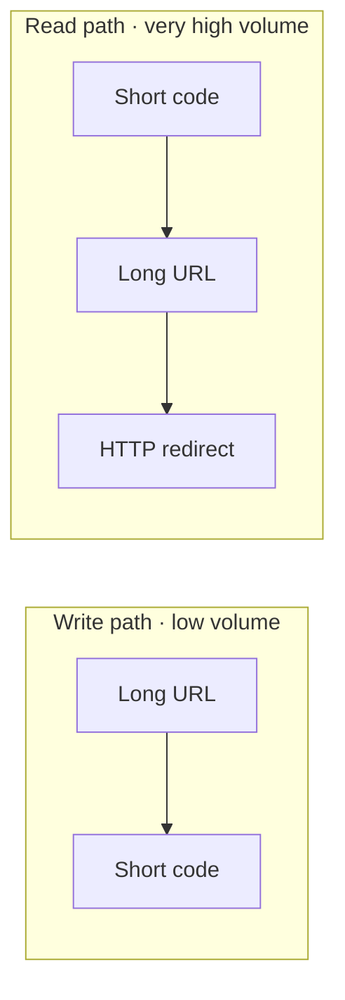

> The **redirect path is the critical path**. It must be extremely fast, highly available, and
> independent of non-critical work like analytics.

## Back-of-the-Envelope Estimation

Never design for average traffic — design for peak. Related: [Throughput](../../01-core-infrastructure-concepts/06-throughput.md),
[Latency](../../01-core-infrastructure-concepts/05-latency.md).

**Writes (URL creation):**

```text
100M / month ÷ 30 days      ≈ 3.3M / day
3.3M ÷ 86,400 s             ≈ ~40 writes/sec  (average)
× ~10 peak factor           ≈ ~400 writes/sec (peak)
```

**Reads (redirects):**

```text
10B / month ÷ 30 days       ≈ 333M / day
333M ÷ 86,400 s             ≈ ~3,860 redirects/sec (average)
× 5–10 peak factor          ≈ ~20K–40K redirects/sec (peak)
```

**Ratio:**

```text
10B ÷ 100M = ~100 redirects per created URL
```

The single most important observation: **this is a read-heavy system**, so the redirect path drives
almost every architectural decision (caching, CDN, stateless scaling).

## High-Level Architecture

Separate the **URL (write) service** from the **redirect (read) service** so each scales on its own
traffic profile. Keep both **stateless** so they scale horizontally
([Horizontal Scaling](../../01-core-infrastructure-concepts/03-horizontal-scaling.md),
[Load Balancer](../../01-core-infrastructure-concepts/04-load-balancer.md)).

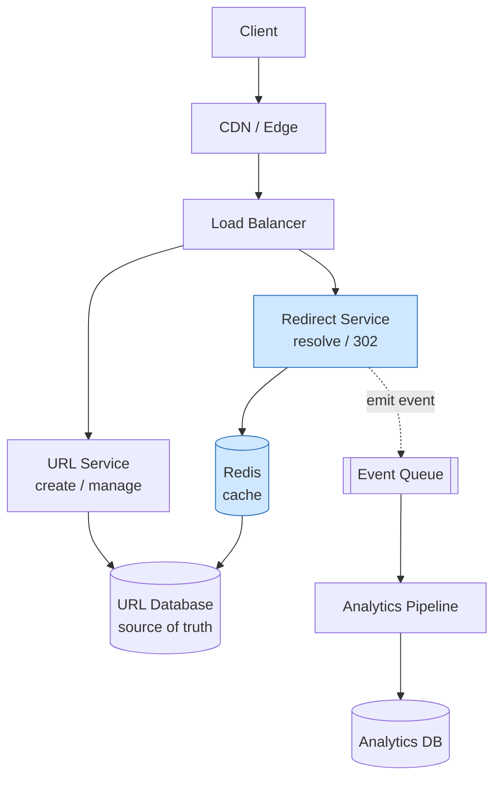

Related infrastructure: [CDN](../../01-core-infrastructure-concepts/07-cdn.md),
[API Gateway](../../01-core-infrastructure-concepts/09-api-gateway.md),
[DNS](../../01-core-infrastructure-concepts/08-dns.md).

## API Design

```text
POST   /api/v1/urls                       # create a short URL
GET    /{shortCode}                        # redirect (the hot path)
GET    /api/v1/urls/{shortCode}            # fetch URL metadata
DELETE /api/v1/urls/{shortCode}            # delete / disable
GET    /api/v1/urls/{shortCode}/analytics  # click analytics (authenticated)
```

**Create request / response:**

```json
// POST /api/v1/urls
{ "longUrl": "https://example.com/products/123", "customAlias": "product123" }

// 201 Created
{ "shortUrl": "https://short.ly/aB93xK" }
```

**Redirect response:**

```http
GET /aB93xK
HTTP/1.1 302 Found
Location: https://example.com/products/123
```

## The Central Problem: Short-Code Generation

There are three common strategies. Understanding the *trade-offs* matters more than picking one.

| Strategy | How | Downside |
|---|---|---|
| **Random string** | Generate 6–8 random chars, check DB | Collision checks = extra DB round-trips at scale |
| **Hash of URL** | `SHA-256(longUrl)` → truncate → Base62 | Collisions on truncation; same URL → same code (may be unwanted) |
| **Unique ID + Base62** | Generate unique numeric ID, encode Base62 | Sequential IDs can be enumerated (fixable — see below) |

**Preferred baseline: unique ID + Base62.** It is deterministic and needs no collision-check loop.


**Base62 alphabet:** `0-9`, `a-z`, `A-Z` = 62 symbols.

### How Long Should the Code Be?

```text
62^6 ≈ 56.8 billion combinations
62^7 ≈ 3.5 trillion combinations
```

Six characters already cover tens of billions; **7 characters** is a comfortable default once you
reserve namespaces and plan for years of growth.

### Sequential IDs Leak Volume — Fixing Enumeration

Raw sequential codes (`short.ly/10001`, `/10002`, `/10003`) let anyone infer how many URLs exist and
scrape them. Separate the two concerns:

- **Collision avoidance** — sequential IDs solve this perfectly.
- **Predictability** — a security/business concern. Don't expose the raw counter.

Fix it by putting a reversible **obfuscation/permutation** step between the internal ID and the code, or
by using a large random identifier:


### Distributed ID Generation

With many app servers, you can't rely on one process for uniqueness.

- **Database sequence** — simplest; the DB hands out `1, 2, 3…`. At ~400 writes/sec peak this is
  perfectly adequate. Can bottleneck only at much larger scale.
- **Snowflake-style ID** — `timestamp + machineId + sequence`. Distributed, ordered, no DB round-trip.
  Better when designing for large future growth.

```text
┌────────────┬───────────┬───────────┐
│ timestamp  │ machineId │ sequence  │   →  Base62  →  short code
└────────────┴───────────┴───────────┘
```

## Designing the Schema (with TTL Expiration)

This is the heart of the original prompt. The core table/collection maps a **unique** `shortCode` to a
`longUrl`, plus ownership, status, and an optional expiry.

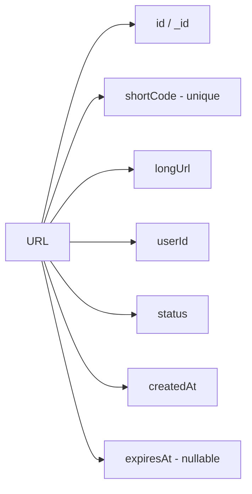

Since this repo's stack is Node.js, here is a **Mongoose** schema. The prompt explicitly asks for
**TTL indexes**, which MongoDB supports natively via `expireAfterSeconds` on a date field:

```typescript
import { Schema, model } from "mongoose";

const urlSchema = new Schema(
  {
    shortCode: {
      type: String,
      required: true,
      unique: true,     // enforced by a unique index, not just app logic
      index: true,
    },
    longUrl: { type: String, required: true },
    userId: { type: Schema.Types.ObjectId, ref: "User", index: true },
    status: {
      type: String,
      enum: ["ACTIVE", "DISABLED"],
      default: "ACTIVE",
    },
    // TTL index: MongoDB deletes the document once `expiresAt` passes.
    // Null / missing = never expires.
    expiresAt: { type: Date, default: null },
  },
  { timestamps: true },
);

// TTL index — expire exactly at `expiresAt` (offset 0).
urlSchema.index({ expiresAt: 1 }, { expireAfterSeconds: 0 });

export const Url = model("Url", urlSchema);
```

Two details worth calling out:

- **`unique: true` on `shortCode` is a database concern**, not just validation. The unique index is what
  guarantees correctness under concurrency (see the alias race condition below). Related:
  [Index](../../02-data-and-storage-concepts/05-index.md).
- **TTL index vs application check.** A TTL index physically reclaims storage, but MongoDB's TTL sweeper
  runs periodically (roughly once a minute), so a URL can be *slightly* past `expiresAt` yet still
  present. Therefore the redirect service should **also** check `expiresAt` at read time and return
  `410 Gone` rather than trusting the sweeper for correctness.

An equivalent SQL shape (Postgres) — note SQL has no native TTL, so expiry is a scheduled cleanup job:

```sql
CREATE TABLE urls (
  id          BIGSERIAL PRIMARY KEY,
  short_code  VARCHAR(16) NOT NULL UNIQUE,
  long_url    TEXT NOT NULL,
  user_id     BIGINT,
  status      VARCHAR(16) NOT NULL DEFAULT 'ACTIVE',
  created_at  TIMESTAMPTZ NOT NULL DEFAULT now(),
  expires_at  TIMESTAMPTZ
);
CREATE INDEX idx_urls_user ON urls(user_id);
CREATE INDEX idx_urls_expires ON urls(expires_at);
```

The dominant lookup is `shortCode → longUrl`, so the **unique index on `shortCode`** is the most
important indexing decision.

## SQL vs NoSQL

The data model is essentially a key → value: `shortCode → longUrl`. Both work; match the choice to the
broader requirements.

| Choose… | When you need… |
|---|---|
| **SQL / Postgres** ([SQL DB](../../02-data-and-storage-concepts/02-sql-database.md)) | Relational data, transactions, user ownership, admin queries |
| **NoSQL / DynamoDB / Cassandra** ([NoSQL DB](../../02-data-and-storage-concepts/03-nosql-database.md)) | Massive global scale, pure key-value access (`PK = shortCode`) |

A pragmatic answer: start with a familiar store (Postgres/MongoDB) + Redis, but keep the mapping behind
a repository abstraction so you can move to DynamoDB/Cassandra if scale demands it. On AWS at very large
scale, **DynamoDB (`PK = shortCode`) + ElastiCache Redis** is a natural fit.

## The Redirect Flow (the Hot Path)

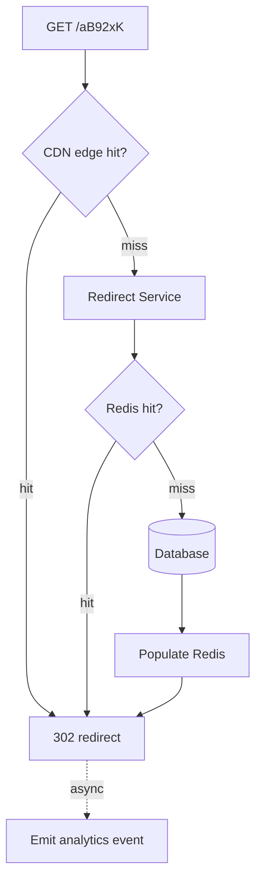

Application logic on a cache miss uses **cache-aside**
([Cache-Aside](../../02-data-and-storage-concepts/09-cache-aside.md),
[Cache](../../02-data-and-storage-concepts/08-cache.md)):

```text
GET shortCode from Redis
  ├── HIT  → return longUrl
  └── MISS → read DB → SET Redis → return longUrl
```

### Why Redis?

At ~20K redirects/sec, hitting the database on every request is wasteful. With a 95% cache hit ratio:

```text
5% × 20K/sec = ~1K/sec actually reach the database
```

That slashes DB load and latency and improves availability. On create, we also `SET` the mapping so the
cache is warm immediately.

### 301 vs 302 vs 308

| Code | Meaning | Caching behavior |
|---|---|---|
| **301** | Permanent | Aggressively cached by browsers/proxies — hard to change later |
| **302** | Temporary | More control; destination can change / be disabled |
| **308** | Permanent (keeps method) | Permanent semantics when needed |

Prefer **302** by default so you retain control over changing/disabling destinations and caching. Use
**301/308** only if mappings are guaranteed immutable (better edge caching).

## Cache Failure Modes

The redirect path lives and dies by the cache, so plan for its failure modes.

### Cache Stampede

A hot key expires and thousands of requests miss simultaneously, all hammering the DB.

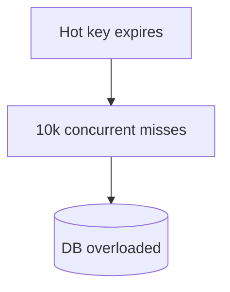

Mitigations:

- **Request coalescing / lock** — first request rebuilds the entry; others briefly wait then read Redis.
- **Probabilistic early refresh** — refresh hot keys *before* they expire.
- **TTL jitter** — `TTL = base + random offset` so keys don't expire in lockstep.

### Cache Penetration

Attackers request random non-existent codes; every one misses the cache and hits the DB.

- **Negative caching** — cache `code → NOT_FOUND` with a short TTL.
- **[Bloom filter](../../05-reliability-performance-and-modern-concepts/04-bloom-filter.md)** — cheaply
  answers "definitely doesn't exist" and returns `404` before touching the DB.

### Hot Key

One viral URL takes 500K req/sec — even a single Redis node/key becomes a bottleneck. Layer the cache:

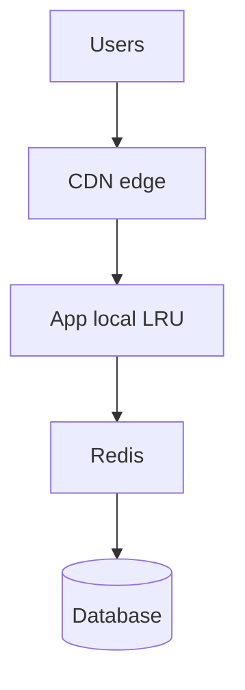

- **CDN** absorbs most traffic at the edge.
- **Local in-memory LRU** on each app instance for the very hottest codes.
- **Redis replicas** ([Replication](../../02-data-and-storage-concepts/07-replication.md)) spread reads.

> A pure local cache isn't enough on its own — each instance has its own copy with no shared
> consistency. Redis stays the shared L2; local memory is an L1 optimization for hot keys.

## Custom Aliases and the Race Condition

Allow clients to request `short.ly/my-product`. Before insert, check uniqueness — but **do not rely on
`SELECT`-then-`INSERT`**, because two concurrent requests can both see "available."

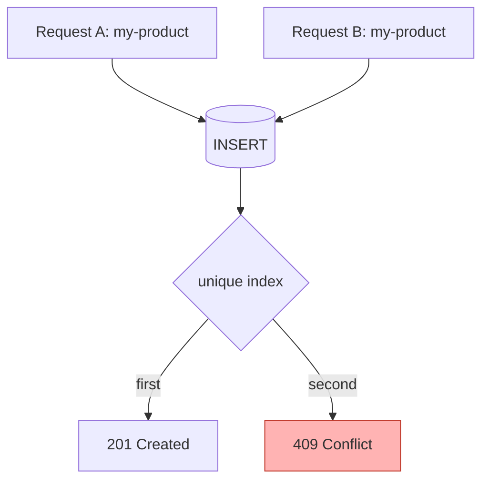

Correctness is enforced at the **unique index**: one insert wins, the other gets a duplicate-key error
that the app translates to `409 Conflict`. Also maintain a **reserved-word list** (`api`, `admin`,
`login`, `health`, `metrics`) that can't be claimed as aliases.

## Analytics — Keep It Off the Critical Path

Never update a click counter synchronously inside the redirect; that turns the hottest path into a write
bottleneck.

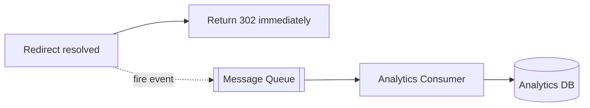

Emit an event and move on:

```json
{ "shortCode": "aB92xK", "ts": "2026-08-26T10:00:00Z", "country": "IN", "referrer": "google.com" }
```

Use a [message queue](../../04-messaging-and-communication-concepts/01-message-queue.md) /
[pub-sub](../../04-messaging-and-communication-concepts/02-pub-sub.md) stream (Kafka/Kinesis/SQS), and a
[dead-letter queue](../../04-messaging-and-communication-concepts/03-dead-letter-queue.md) for poison
events. For storage, use an analytics-friendly store (ClickHouse / BigQuery / Redshift), **not** the
transactional URL DB.

**If the analytics queue is down, redirects must still succeed.** Analytics is a non-critical,
eventually-consistent subsystem — buffer, retry, or accept minor loss, but never fail the redirect.

## Rate Limiting and Abuse

Apply [rate limiting](../../05-reliability-performance-and-modern-concepts/02-rate-limiting.md) at multiple
layers (CDN/WAF → API Gateway → app). Key strategies:

```text
Authenticated users → limit by userId
Anonymous users     → limit by IP / device fingerprint / anonymous token
Creation example    → 10 URL creations / minute / user
```

Redis holds the distributed counters. URL shorteners are magnets for phishing/malware, so also:
validate URL syntax and allowed protocols (block `javascript:`), integrate Safe-Browsing/threat feeds,
authorize so users only manage their own URLs, and protect admin APIs separately.

## Deletion, Updates, and Consistency

Prefer a **soft delete** (`status = DISABLED`) for auditability, analytics preservation, and recovery.

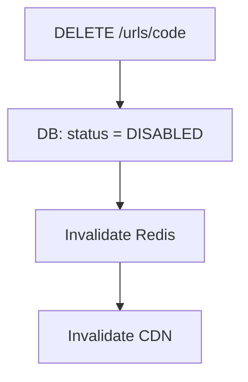

The tricky case: DB says disabled but Redis/CDN still serve the old mapping. This is a cache-consistency
problem. Options: invalidate cache on write (and handle invalidation failure), event-driven
invalidation, or short TTLs for mutable URLs. Decide explicitly: **how stale may a redirect be?** For an
*immutable* shortener the problem disappears — mappings never change.

For "change the destination without changing the short URL," the architecture is the same but cache
invalidation becomes mandatory, and you must define the consistency expectation for in-flight requests.

## Expired vs Unknown: 404 vs 410

```text
Unknown short code        → 404 Not Found
Expired / disabled URL    → 410 Gone
```

`410` signals the resource existed but is intentionally gone; `404` means it was never known.

## Idempotency and Duplicate URLs

- **Retried create requests** (network retries) can mint duplicate codes. If that's undesirable, accept
  an [`Idempotency-Key`](../../03-distributed-systems-concepts/08-idempotency-key.md) header and return the
  stored result on replay ([Idempotency](../../03-distributed-systems-concepts/07-idempotency.md)).
- **Same long URL → same short URL?** A product decision. Generating a *new* code per request is simpler
  and supports independent ownership/analytics; deduplication saves storage but complicates ownership,
  expiry, and permissions. Default to unique-per-creation unless dedup is explicitly required.

## Scaling and Failure Scenarios

- **Database scaling** — start with a primary + [read replicas](../../02-data-and-storage-concepts/07-replication.md);
  Redis absorbs most reads anyway. Grow via [sharding](../../02-data-and-storage-concepts/06-sharding.md) /
  [partitioning](../../02-data-and-storage-concepts/14-data-partitioning.md) using
  `hash(shortCode)` ([consistent hashing](../../02-data-and-storage-concepts/12-consistent-hashing.md)) to
  avoid hotspots — don't shard on a sequential numeric ID.
- **Redis down** — degrade to the DB, but protect it with
  [circuit breakers](../../05-reliability-performance-and-modern-concepts/01-circuit-breaker.md), connection
  limits, and [load shedding](../../05-reliability-performance-and-modern-concepts/03-load-shedding.md);
  lean on CDN/edge caching. Run Redis clustered/replicated.
- **Database down** — redirects cached in Redis/CDN still succeed; misses fail. Use Multi-AZ,
  replication, automatic failover, and backups.
- **Global latency** — Route 53 latency routing + CloudFront + regional redirect services and Redis, with
  a globally replicated store (e.g. DynamoDB Global Tables). CDN can even cache the redirect itself for
  immutable URLs, so most requests never reach the origin.

## Source of Truth

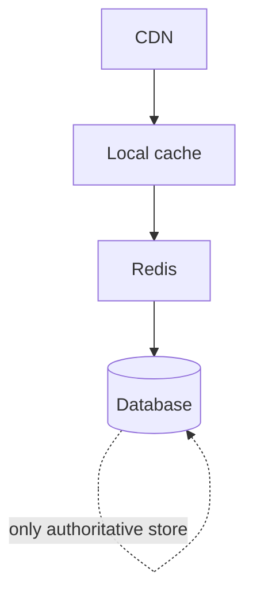

Only the **database** is authoritative; every cache layer is derived data that can be rebuilt. This
simplifies disaster recovery — define RPO/RTO (e.g. RPO < 5 min, RTO < 30 min) around the DB, not the
caches.

## MVP First — Avoid Over-Engineering

The full design is justified for the stated scale, but for a first production version, build
incrementally:

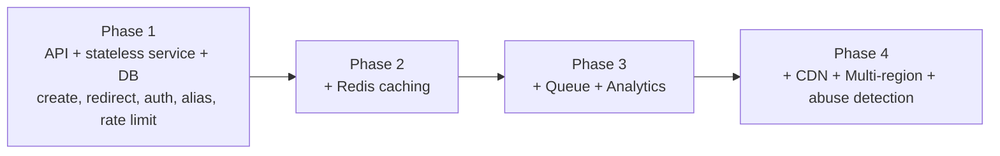

Don't introduce Kafka, multi-region DBs, local caching, and sharding until real traffic justifies them.

## Low-Level Design (LLD)

The service is a layered NestJS application. The **write** path (create/manage) and the **read** path
(redirect) are separate modules so they can scale — and even deploy — independently.

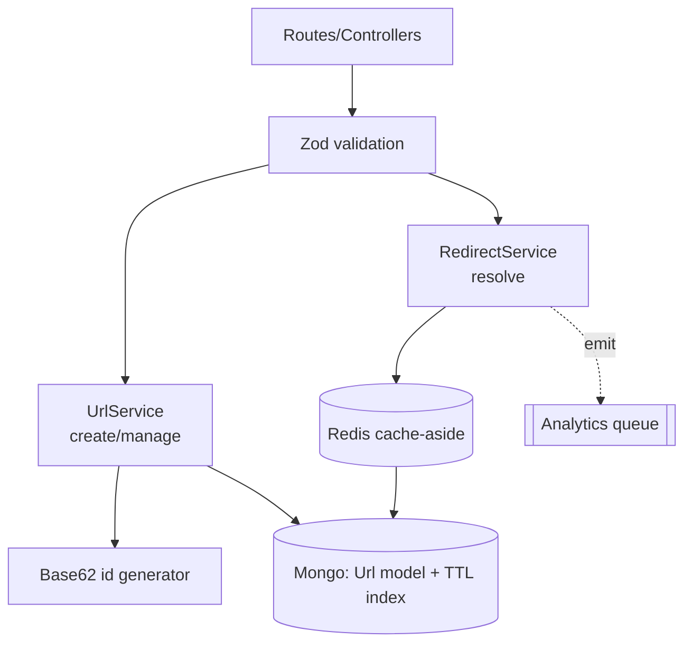

### Service contracts

```text
UrlService.create(longUrl, { alias?, expiresAt?, ownerId? }) → { code, shortUrl }
UrlService.disable(code, ownerId)                            → void        (404 if not owner)
RedirectService.resolve(code)                                → longUrl     (404 unknown / 410 expired)
Analytics.record(code, meta)                                 → fire-and-forget
```

### Create flow

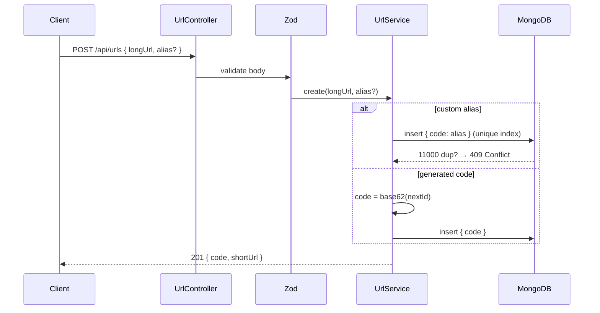

### Redirect flow (the hot path)

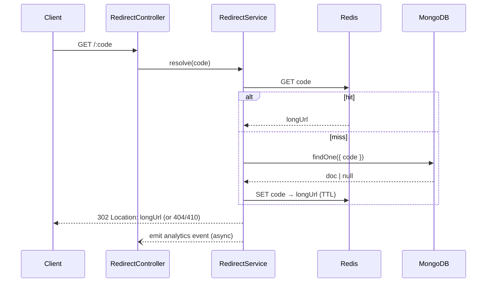

### Suggested project structure

```text
server/src/
├── app.module.ts
├── common/            # base62, cache (Redis), zod pipe
├── urls/              # url.schema (TTL index), url.service, url.controller, dto
├── redirect/          # redirect.controller (GET /:code), redirect.service (cache-aside)
└── counter/           # atomic counter for collision-free Base62 ids
```

Keep the redirect service stateless so it scales horizontally behind a load balancer; scale on
requests/sec, latency, and event-loop utilization.

## Implementation

A runnable full-stack implementation lives in [`./implementation/`](./implementation/):

| Layer | Stack | Highlights |
|---|---|---|
| **`server/`** | NestJS + Mongoose + Zod + Redis (optional) | Counter→Base62 codes, unique index, TTL expiry, cache-aside redirect, custom aliases (409), 302 redirect, async analytics |
| **`web/`** | Next.js + React + Redux Toolkit (RTK Query) | Shorten form + "my links" list; RTK Query mutation/query against the API |

| Design element | Where in the code |
|---|---|
| Base62 counter codec | `server/src/common/base62.ts` |
| Atomic id counter | `server/src/counter/counter.service.ts` |
| Schema + TTL + unique index | `server/src/urls/url.schema.ts` |
| Create + custom alias (409) | `server/src/urls/urls.service.ts` |
| Cache-aside redirect (302/404/410) | `server/src/redirect/redirect.service.ts` |
| Pluggable cache (Redis / in-memory) | `server/src/common/cache.ts` |
| Zod validation | `server/src/common/zod-validation.pipe.ts` |
| Shorten UI + links list | `web/src/components/*` + `web/src/store/urlsApi.ts` |

The backend is verified by an end-to-end test (in-memory MongoDB) covering: create + Base62 code,
redirect `302`, unknown → `404`, expired → `410`, duplicate alias → `409`, cache-hit path, and
short-code uniqueness under repeated creates.

## What the Interviewer Is Really Testing

- **Requirements & estimation** — can you scope and size before designing?
- **Short-code design** — uniqueness, collisions, enumeration, length, distributed ID generation.
- **Data modeling** — the schema, unique index, and TTL-based expiration.
- **Read-path optimization** — caching strategy and cache failure modes.
- **Decoupling** — keeping analytics asynchronous and non-critical.
- **Failure handling** — behavior when Redis / DB / queue fail.
- **Trade-offs** — *why* this component, and what it costs.

## Interview Strategy

Scope first, go breadth-first, deepen only where pushed:

```text
Requirements → Estimation → HLD → API → Short-Code Generation →
Schema + TTL → Redirect Flow → Caching + Failure Modes → Analytics →
Scaling → Failure Scenarios → Trade-offs
```

## Tips

- Lead with **requirements and back-of-the-envelope math**, not "Base62 + Redis."
- Optimize the **redirect (read) path** above all — it's ~100× the write path.
- Enforce short-code/alias uniqueness at the **database unique index**, not app logic.
- Deliver **TTL expiration** with a TTL index **plus** a read-time `expiresAt` check.
- Use **cache-aside** and plan for **stampede, penetration, and hot keys**.
- Make **analytics asynchronous**; never fail a redirect because analytics is down.
- Keep the **database as the single source of truth**; caches are rebuildable.
- Distinguish **404 (unknown)** from **410 (expired/disabled)**.

## Trade-offs & Pitfalls

- **Sequential Base62 is collision-free but enumerable** — add obfuscation/permutation if scraping is a
  concern.
- **Synchronous click counting** turns the hottest path into a write bottleneck — emit events instead.
- **Trusting the TTL sweeper for correctness** — TTL cleanup is periodic, so still check `expiresAt` on
  read.
- **`SELECT`-then-`INSERT` for aliases** races under concurrency — rely on the unique constraint.
- **No cache-failure plan** — stampede/penetration/hot-key can collapse the DB; use jitter, locks,
  negative caching, Bloom filters, and layered caches.
- **301 everywhere** — aggressive caching makes destinations impossible to change later; default to 302.
- **Over-engineering the MVP** — Kafka, multi-region, and sharding are tools; add them when scale, not
  ambition, requires it.

## System Design Cheat Sheet

When you hear *"Design a URL Shortener,"* walk this mental map (the interviewer may only push on a few
branches):

```text
1.  WHAT?        Functional + non-functional requirements?
2.  SCALE        Reads vs writes? Peak QPS? Latency target?
3.  CREATE       Long URL → short code (ID + Base62)?
4.  CODE         Length? Collisions? Enumeration? Distributed IDs?
5.  STORE        Schema? Unique index? TTL expiration?
6.  READ         shortCode → longURL → 301/302?
7.  ACCELERATE   CDN → local cache → Redis → DB?
8.  CACHE FAIL   Stampede / penetration / hot key?
9.  ALIAS        Custom aliases + race conditions + reserved words?
10. ANALYTICS    Async queue → analytics DB (never block redirect)?
11. PROTECT      Rate limit / WAF / validation / abuse detection?
12. SCALE OUT    Stateless services / replicas / sharding / multi-region?
13. FAILURE      Redis / DB / queue down? Source of truth?
14. TRADE-OFF    Why this design?
```

Six-layer mental model:

```text
1. CREATE     Long URL → short code
2. STORE      short code → long URL (+ TTL)
3. READ       short code → long URL
4. ACCELERATE CDN → Redis → DB
5. SCALE      stateless services → sharding → multi-region
6. PROTECT    rate limit → WAF → validation → abuse detection
```

## Interview Questions & Answers

A structured question bank — the kind an interviewer asks (and that you should ask *them*), grouped by
theme, each with a short answer.

### A. Requirement Clarification

- **Are custom aliases required?** — Clarify; they add a uniqueness/reserved-word constraint on creation.
- **Do URLs expire?** — Baseline: normally permanent, with optional TTL — which drives the schema design.
- **Can the destination change after creation?** — If yes, cache invalidation becomes mandatory.
- **Do we need analytics?** — Yes at a basic level; keep it asynchronous and off the redirect path.
- **Is authentication required?** — Optional for basic shortening; required to manage/analyze URLs.
- **Same long URL → same short URL?** — A product decision; default to a fresh code per creation.
- **What traffic and read/write ratio?** — Drives the whole design; assume read-heavy (~100:1).
- **What latency and availability targets?** — E.g. < 100 ms redirects, 99.99% availability.

### B. Estimation

- **How many writes per second?** — ~40 avg, ~400 peak for 100M URLs/month.
- **How many redirects per second?** — ~3,860 avg, ~20K–40K peak for 10B/month.
- **What's the read/write ratio?** — ~100 redirects per created URL — heavily read-dominated.
- **What does that imply?** — Optimize the read path: caching, CDN, stateless horizontal scaling.

### C. Short-Code Generation

- **How do you generate the code?** — Generate a unique ID, then Base62-encode it.
- **Why Base62?** — `0-9a-zA-Z` yields compact, URL-safe codes; `62^7 ≈ 3.5T` combinations.
- **How long should it be?** — ~7 chars is a comfortable default at this scale.
- **Why not random strings?** — They require collision-check DB round-trips at scale.
- **Why not hash the URL?** — Truncation collisions, and same URL → same code may be unwanted.
- **How do you prevent collisions?** — Deterministic unique-ID encoding avoids them entirely.
- **How do you generate IDs across many servers?** — DB sequence at moderate scale, Snowflake at large.
- **Sequential IDs expose volume — fix?** — Add a reversible permutation/obfuscation or use large random IDs.

### D. Schema & Database

- **Design the schema.** — `shortCode` (unique), `longUrl`, `userId`, `status`, `createdAt`, `expiresAt`.
- **What's the most important index?** — The unique index on `shortCode` (the dominant lookup).
- **How do you implement expiration/TTL?** — A MongoDB TTL index on `expiresAt` (`expireAfterSeconds: 0`).
- **Is a TTL index enough for correctness?** — No — the sweeper is periodic, so also check `expiresAt` on read.
- **How does SQL handle TTL?** — No native TTL; use a scheduled cleanup job plus a read-time check.
- **SQL or NoSQL?** — Either; SQL for relational/transactions, NoSQL/DynamoDB (`PK=shortCode`) for scale.
- **How do you enforce alias uniqueness?** — A database unique constraint, translating duplicates to 409.

### E. Redirect & Caching

- **Walk through a redirect.** — CDN → redirect service → Redis (hit) or DB (miss, then populate) → 302.
- **Why Redis?** — At 20K rps, a 95% hit ratio keeps ~1K rps off the DB, cutting load and latency.
- **What caching strategy?** — Cache-aside on read; also `SET` on create to warm the cache.
- **301 vs 302?** — 302 by default for control; 301/308 only when mappings are immutable.
- **What is cache stampede?** — Many misses on an expired hot key; fix with locks, early refresh, TTL jitter.
- **What is cache penetration?** — Floods of invalid codes; fix with negative caching + a Bloom filter.
- **Hot key at 500K rps?** — Layer CDN → local LRU → Redis replicas → DB.
- **Why not only a local in-memory cache?** — Per-instance copies aren't shared/consistent; keep Redis as L2.

### F. Analytics

- **How do you count clicks?** — Emit an async event per redirect; process it downstream.
- **Update the counter synchronously?** — No — it would bottleneck the hottest path.
- **Why a queue/stream?** — Decouples analytics; Kafka/Kinesis/SQS buffer and smooth load.
- **What if the queue is down?** — Redirects still succeed; buffer/retry or accept minor analytics loss.
- **Which analytics store?** — A columnar/analytics store (ClickHouse/BigQuery/Redshift), not the URL DB.

### G. Reliability & Scaling

- **What's the source of truth?** — The persistent database; all caches are rebuildable.
- **Redis down — what happens?** — Fall back to DB, protected by circuit breakers/limits/load shedding.
- **Database down — what happens?** — Cached redirects still work; misses fail; use Multi-AZ + failover.
- **How do you shard the DB?** — `hash(shortCode)` for even distribution — never a sequential numeric ID.
- **How do you reduce global latency?** — Route 53 + CloudFront + regional services/Redis + global tables.
- **Can the CDN cache the redirect?** — Yes for immutable URLs, so most requests skip the origin.

### H. Semantics, Idempotency & Security

- **404 vs 410?** — 404 = unknown code; 410 = expired/disabled but previously existed.
- **Are creates idempotent?** — Optionally, via an `Idempotency-Key` returning the stored result on retry.
- **Delete strategy?** — Soft delete (`status = DISABLED`) for audit/analytics/recovery, then invalidate caches.
- **How do you rate-limit?** — Redis counters by userId (auth) or IP/fingerprint (anon), across layers.
- **How do you prevent malicious URLs?** — Validate protocols, block `javascript:`, use Safe-Browsing/threat feeds.
- **What are the biggest trade-offs?** — Cache freshness vs load, statelessness vs revocation immediacy, MVP simplicity vs future scale.

---

_Notes: (add your own content here)_
