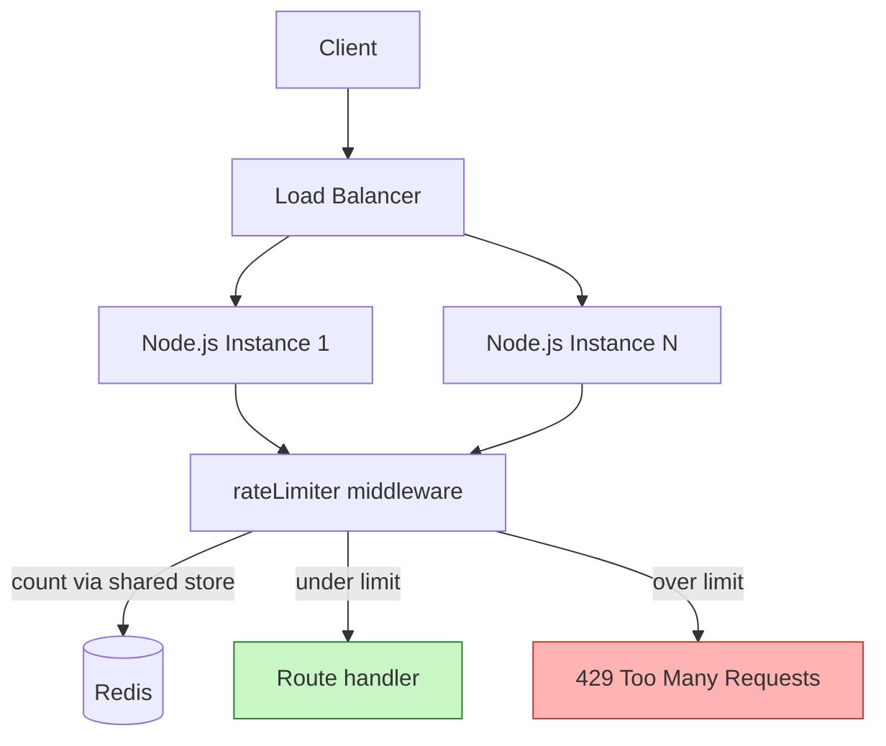

# 5. Rate Limiter Middleware

> **In one line:** Build an Express rate-limiting middleware — pick an algorithm, choose a store
> (in-memory vs. Redis), key requests correctly, and return the right headers/status when a client is
> throttled.

> **Original prompt:** Implement a basic rate limiter in Express.js using redis or in-memory storage.

## Overview

Rate limiting caps how many requests a client may make in a time window, protecting a service from
abuse, brute force, scrapers, and accidental floods, while keeping usage fair across clients. It's a
middleware concern: intercept the request, check the client's recent request count, and either allow it
or reject with **429 Too Many Requests**.

For the concept and algorithms in general, see
[Rate Limiting](../05-reliability-performance-and-modern-concepts/02-rate-limiting.md). This problem is
about *implementing* it as Express middleware.

## Step 0: Clarify the Problem

- **Single instance or many?** One Node process → in-memory is fine. Multiple instances behind a load
  balancer → you need a **shared store (Redis)**, or each instance enforces only its own slice of the limit.
- **What is a "client"?** Key by IP, by authenticated `userId`, by API key, or a composite (`ip + route`).
- **Global or per-route limits?** Login endpoints need tighter limits than read endpoints.
- **Fixed quota or smooth rate?** Drives the algorithm choice below.

## Where It Sits



The critical insight: with multiple instances, an **in-memory counter is per-process**, so a user
hitting three instances gets 3× the intended limit. A shared store (Redis) gives one global count.

## Choosing an Algorithm

| Algorithm | Idea | Pros | Cons |
|---|---|---|---|
| **Fixed Window** | Count per fixed clock window (e.g. per minute) | Trivial, cheap | Burst at window edges (2× near boundaries) |
| **Sliding Window Log** | Store timestamps, count those in the last window | Accurate | Memory grows with request count |
| **Sliding Window Counter** | Weighted blend of current+previous window | Smooth, cheap | Slight approximation |
| **Token Bucket** | Tokens refill at a rate; each request spends one | Allows controlled bursts | Two params to tune (rate, capacity) |
| **Leaky Bucket** | Requests drain at a fixed rate | Smooths output | Queues/delays rather than rejects |

**Token bucket** is the most common general-purpose choice — it enforces a long-term average while
allowing short bursts. **Fixed window** is fine for simple cases; **sliding window counter** is a good
middle ground when edge bursts matter.

## Implementation A — In-Memory (single instance)

Good for a single process, dev, or as a fallback. Uses a fixed window:

```typescript
type Entry = { count: number; resetAt: number };
const buckets = new Map<string, Entry>();

export function rateLimit({ windowMs = 60_000, max = 100 }) {
  return (req, res, next) => {
    const key = req.ip; // choose your key
    const now = Date.now();
    let entry = buckets.get(key);

    if (!entry || now > entry.resetAt) {
      entry = { count: 0, resetAt: now + windowMs };
      buckets.set(key, entry);
    }

    entry.count++;
    const remaining = Math.max(0, max - entry.count);
    res.setHeader("RateLimit-Limit", max);
    res.setHeader("RateLimit-Remaining", remaining);
    res.setHeader("RateLimit-Reset", Math.ceil((entry.resetAt - now) / 1000));

    if (entry.count > max) {
      res.setHeader("Retry-After", Math.ceil((entry.resetAt - now) / 1000));
      return res.status(429).json({ message: "Too many requests" });
    }
    next();
  };
}
```

> **Limitation:** the `Map` is per-process and unbounded (memory leak risk without eviction), and it
> resets on restart. Fine for one instance; wrong for a cluster.

## Implementation B — Redis (distributed)

For multiple instances, keep the count in Redis so it's shared. A fixed-window counter with atomic
`INCR` + `EXPIRE`:

```typescript
export function rateLimitRedis(redis, { windowMs = 60_000, max = 100 }) {
  const windowSec = Math.ceil(windowMs / 1000);
  return async (req, res, next) => {
    const key = `rl:${req.ip}:${Math.floor(Date.now() / windowMs)}`;

    // Atomic: increment, and set TTL only on first hit of the window.
    const results = await redis
      .multi()
      .incr(key)
      .expire(key, windowSec)
      .exec();
    const count = results[0][1] as number;

    res.setHeader("RateLimit-Limit", max);
    res.setHeader("RateLimit-Remaining", Math.max(0, max - count));

    if (count > max) {
      res.setHeader("Retry-After", windowSec);
      return res.status(429).json({ message: "Too many requests" });
    }
    next();
  };
}
```

For sliding-window or token-bucket accuracy, run the read-modify-write inside a **Lua script** so the
whole check is atomic (avoiding races between instances). This is exactly what libraries like
`rate-limiter-flexible` do.

## Keying Strategy

The key defines *who* is limited — choose deliberately:

- **`ip`** — blunt but works for anonymous traffic (careful behind proxies: read `X-Forwarded-For`, and
  trust it only from known proxies).
- **`userId`** — fair per-account limiting for authenticated routes.
- **`apiKey`** — per-tenant quotas.
- **Composite `ip + route`** — protect specific expensive/sensitive endpoints (e.g. `/auth/login`).

For login endpoints, combine `ip + email` with safeguards so an attacker can't lock out a victim by
spamming their email (see [User Authentication System](./01-user-authentication-system.md)).

## Response Contract

- **Status:** `429 Too Many Requests`.
- **`Retry-After`:** seconds until the client may retry.
- **`RateLimit-Limit` / `RateLimit-Remaining` / `RateLimit-Reset`:** standard informational headers so
  well-behaved clients can self-throttle.

## Failure Handling

What if **Redis is down**? Decide the policy explicitly:

- **Fail-open** (allow requests) — availability over protection; the usual default for non-security routes.
- **Fail-closed** (reject) — protection over availability; appropriate for sensitive endpoints.

Also cap latency: a slow Redis shouldn't block requests — use short timeouts and fall back.

## Tips

- Use a **shared store (Redis)** the moment you run more than one instance.
- Make the counter update **atomic** (`INCR`+`EXPIRE`, or a Lua script) to avoid races.
- Return **429 + `Retry-After`** and the standard `RateLimit-*` headers.
- **Tighten limits on auth/expensive endpoints**; keep read endpoints generous.
- Choose the **key** deliberately (IP vs user vs API key vs composite).
- Decide **fail-open vs fail-closed** for store outages, per route.

## Trade-offs & Pitfalls

- **In-memory counters don't work across instances** — each process enforces its own limit, multiplying the real one.
- **Fixed windows allow edge bursts** — up to 2× the limit around the boundary; use sliding window if that matters.
- **Non-atomic read-modify-write races** under concurrency — always use atomic ops.
- **Trusting `X-Forwarded-For` blindly** lets clients spoof IPs — only honor it from trusted proxies.
- **IP limiting harms shared IPs** (NAT, offices) — combine with user/API-key keys where possible.
- **Sliding-window log** is accurate but memory-hungry for high-volume clients.

## System Design Cheat Sheet

```text
1. SCOPE      One instance (in-memory) vs many (Redis)
2. KEY        IP / userId / apiKey / composite
3. ALGORITHM  Fixed / sliding window / token bucket
4. STORE      Atomic INCR+EXPIRE or Lua for accuracy
5. RESPONSE   429 + Retry-After + RateLimit-* headers
6. POLICY     Tighter on auth/expensive routes
7. FAILURE    Fail-open vs fail-closed on store outage
```

## Interview Questions & Answers

### A. Fundamentals

- **What is rate limiting for?** — Protect against abuse/brute force/floods and ensure fair usage.
- **What status code do you return?** — `429 Too Many Requests`, with `Retry-After`.
- **Where does it live?** — As middleware before the route handler.
- **What headers should you send?** — `Retry-After` and `RateLimit-Limit/Remaining/Reset`.

### B. Storage & Distribution

- **In-memory vs Redis — when?** — In-memory for a single instance; Redis (shared) for multiple instances.
- **Why is in-memory wrong for a cluster?** — Each process has its own counter, so the real limit multiplies by instance count.
- **How do you make the Redis counter correct under concurrency?** — Atomic `INCR`+`EXPIRE` or a Lua script.
- **What key would you use?** — IP, userId, API key, or a composite like `ip + route`.
- **What if Redis goes down?** — Choose fail-open (availability) or fail-closed (protection) per route.

### C. Algorithms

- **Which algorithms do you know?** — Fixed window, sliding window (log/counter), token bucket, leaky bucket.
- **What's the fixed-window flaw?** — Bursts at window edges can allow ~2× the limit briefly.
- **How does token bucket work?** — Tokens refill at a rate; each request consumes one; bursts allowed up to capacity.
- **How does sliding window counter improve on fixed?** — Blends current and previous windows to smooth edge bursts.

### D. Application & Security

- **How would you protect a login endpoint?** — Tighter limits keyed on `ip + email` with anti-lockout safeguards.
- **Why is IP-only limiting risky?** — Shared IPs (NAT/offices) get unfairly throttled; behind proxies IPs can be spoofed.
- **How do you handle `X-Forwarded-For`?** — Only trust it from known proxies; configure `trust proxy` correctly.
- **How do per-tenant quotas work?** — Key by API key/tenant id with per-tenant limits.

---

_Notes: (add your own content here)_
