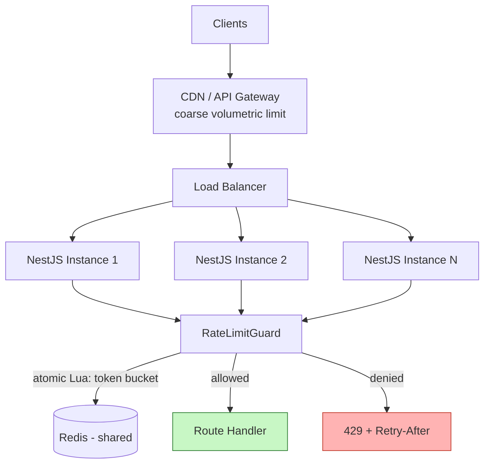
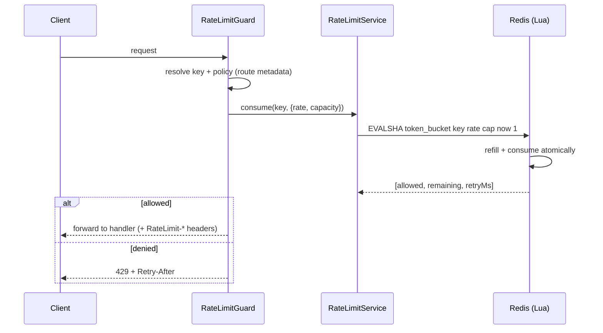

# 5. Rate Limiter Middleware

> **In one line:** Design and implement a distributed rate limiter (Stripe/GitHub/Cloudflare-class) — the
> interview conversation, HLD, LLD with real NestJS + Redis + Lua code, the algorithm choices, and deep
> scaling + security.

> **Original prompt:** Implement a basic rate limiter in Express.js using redis or in-memory storage.

---

## 1. The Interview Conversation

> **Interviewer:** "Implement rate limiting for our API. Start simple, then make it production-grade."
>
> **Candidate:** "First, what am I protecting and at what granularity? Is this general API abuse
> protection, or specific endpoints like login?"
>
> **Interviewer:** "Both — a global per-user API quota and stricter limits on `/auth/login`."
>
> **Candidate:** "So I need per-user quotas and per-endpoint overrides, keyed differently: API by
> `userId`/API-key, login by a layered `ip + email` scheme to resist brute force without letting an
> attacker lock out a victim. How many app instances run behind the load balancer?"
>
> **Interviewer:** "Autoscaling, so anywhere from 3 to 30."
>
> **Candidate:** "Then an in-memory counter is immediately wrong — each instance would only see its slice,
> so a client spread across 10 instances gets 10× the limit. I need a shared store, Redis, with an
> **atomic** check so concurrent requests across instances can't race the counter. What limit shape do we
> want — a hard quota per window, or something that tolerates bursts?"
>
> **Interviewer:** "Clients are bursty on page load but shouldn't sustain high rates."
>
> **Candidate:** "That's the token-bucket use case: a steady refill rate with a burst capacity. I'll
> implement it in a Redis Lua script so the read-modify-write is atomic and single-round-trip. I'll return
> `429` with `Retry-After` and `RateLimit-*` headers. Last question: if Redis is down, do we fail open or
> closed?"
>
> **Interviewer:** "Depends on the endpoint?"
>
> **Candidate:** "Exactly — fail-open for ordinary reads so a Redis blip doesn't take the API down, but
> fail-closed for `/auth/login` where I'd rather reject than allow unlimited password guesses. I'll make
> that policy configurable per route."

**Signal:** the candidate ties key strategy to threat model, rejects in-memory for a fleet, insists on
atomicity, picks token bucket from the burst requirement, and makes the failure mode a deliberate per-route
decision.

---

## 2. Requirements

**Functional**

- Cap requests per client per window; reject excess with `429` + `Retry-After` + `RateLimit-*` headers.
- Per-route limits and key strategies (global API vs login vs per-tenant quota).
- Allow controlled bursts (token bucket).

**Non-functional**

| Requirement | Target |
|---|---|
| **Correctness** | Global limit across all instances; no over-admission under concurrency |
| **Latency** | < 1 ms added per request (single Redis round trip, co-located) |
| **Scalability** | Tens of instances, 100k+ req/s; limiter must not become the bottleneck |
| **Resilience** | Defined behavior on Redis outage (fail-open/closed per route) |

**Math:** 100k req/s each doing one Redis op is well within a single Redis node (~100k–1M ops/s), but a
single **hot key** (one abusive client) can overload the node owning it — so hot-key handling matters.

---

## 3. Recommended Tech Stack

| Layer | Choice | Why |
|---|---|---|
| **Framework** | **NestJS** — implemented as a **Guard** (+ optional global middleware) | Guards run before handlers, integrate with DI, and can read route metadata for per-route limits |
| **Shared store** | **Redis** | Fast, atomic ops, TTL, Lua scripting — the standard for distributed limiting |
| **Atomicity** | **Redis Lua script** | Executes the whole token-bucket read-modify-write atomically, single round trip |
| **Edge layer** | **API Gateway / Cloudflare** rate limiting | Sheds volumetric abuse before it reaches origin |
| **Library option** | `rate-limiter-flexible` / `@nestjs/throttler` (Redis storage) | Production-tested implementations of these exact algorithms |

> **Layered defense:** coarse volumetric limiting at the CDN/gateway, fine-grained per-user/route limiting
> in the app where identity and business context exist. Don't rely on only one layer.

---

## 4. High-Level Design (HLD)



The guard runs on every request, resolves the key + policy for the route, executes the atomic Lua script
against shared Redis, sets headers, and either forwards or rejects. All instances consult the same Redis,
so the limit is global.

---

## 5. Approaches, Patterns & Algorithms

| Algorithm | Idea | Pros | Cons |
|---|---|---|---|
| **Fixed window** | One counter per clock window | Trivial, cheap | ~2× burst at window edges |
| **Sliding window log** | Store every timestamp; count in window | Exact | Memory grows with volume |
| **Sliding window counter** | Weighted blend of current+previous window | Smooth, cheap, near-exact | Slight approximation |
| **Token bucket** (chosen) | Tokens refill at rate R, capacity B; each request spends 1 | Allows controlled bursts, smooth average | Two params to tune |
| **Leaky bucket** | Requests drain at fixed rate | Smooths output | Queues/delays rather than rejects |

**Chosen: token bucket** — real clients are bursty (a page fires several calls at once), and token bucket
enforces a fair long-term average while permitting short bursts up to capacity `B`.

**The fixed-window edge-burst problem** (why not fixed window for sensitive limits):

```text
Limit 100/min, boundary at 12:00:00
  11:59:59 → 100 requests (window A)
  12:00:01 → 100 requests (window B)
= 200 requests in ~2s across the boundary
```

### Token bucket algorithm

State per key: `tokens` (current) and `lastRefill` (timestamp). On each request: refill
`tokens = min(B, tokens + (now - lastRefill) * R)`, then if `tokens >= 1` consume one and allow, else deny.
The refill is lazy (computed on read), so no background timer is needed.

---

## 6. Low-Level Design (LLD)

### 6.1 Module structure (NestJS)

```text
src/
├── rate-limit/
│   ├── rate-limit.guard.ts        # runs before handlers; resolves key + policy
│   ├── rate-limit.decorator.ts    # @RateLimit({ rate, capacity, keyBy, failMode })
│   ├── token-bucket.lua           # atomic refill+consume script
│   ├── rate-limit.service.ts      # loads Lua, executes, maps result
│   └── key-resolver.ts            # ip / userId / apiKey / composite
└── redis/redis.module.ts
```

### 6.2 The atomic Lua script (heart of the system)

```lua
-- token-bucket.lua  KEYS[1]=bucket key  ARGV: rate, capacity, now_ms, requested
local key       = KEYS[1]
local rate      = tonumber(ARGV[1])      -- tokens per second
local capacity  = tonumber(ARGV[2])
local now       = tonumber(ARGV[3])      -- ms
local requested = tonumber(ARGV[4])

local data      = redis.call("HMGET", key, "tokens", "ts")
local tokens    = tonumber(data[1])
local ts        = tonumber(data[2])
if tokens == nil then tokens = capacity; ts = now end

-- lazy refill based on elapsed time
local delta   = math.max(0, now - ts) / 1000
tokens        = math.min(capacity, tokens + delta * rate)

local allowed = tokens >= requested
if allowed then tokens = tokens - requested end

redis.call("HSET", key, "tokens", tokens, "ts", now)
redis.call("PEXPIRE", key, math.ceil(capacity / rate * 1000))  -- self-clean idle buckets

-- return allowed, remaining tokens, ms until one token refills
local retry_ms = allowed and 0 or math.ceil((requested - tokens) / rate * 1000)
return { allowed and 1 or 0, math.floor(tokens), retry_ms }
```

Executing this as one `EVALSHA` guarantees the refill+consume is atomic across all instances — no
read-modify-write race, one round trip.

### 6.3 Decorator + guard

```typescript
// rate-limit.decorator.ts
export interface RateLimitOpts {
  rate: number; capacity: number;
  keyBy?: "ip" | "user" | "apiKey" | ((req) => string);
  failMode?: "open" | "closed";
}
export const RateLimit = (o: RateLimitOpts) => SetMetadata("rateLimit", o);
```

```typescript
// rate-limit.guard.ts
@Injectable()
export class RateLimitGuard implements CanActivate {
  constructor(private reflector: Reflector, private rl: RateLimitService) {}

  async canActivate(ctx: ExecutionContext): Promise<boolean> {
    const opts = this.reflector.get<RateLimitOpts>("rateLimit", ctx.getHandler());
    if (!opts) return true;

    const req = ctx.switchToHttp().getRequest();
    const res = ctx.switchToHttp().getResponse();
    const key = resolveKey(req, opts.keyBy);

    let result: BucketResult;
    try {
      result = await this.rl.consume(key, opts);          // atomic Lua
    } catch (e) {
      if ((opts.failMode ?? "open") === "open") return true;   // Redis down → allow
      throw new ServiceUnavailableException("Rate limiter unavailable"); // fail-closed
    }

    res.setHeader("RateLimit-Limit", opts.capacity);
    res.setHeader("RateLimit-Remaining", result.remaining);
    if (!result.allowed) {
      res.setHeader("Retry-After", Math.ceil(result.retryMs / 1000));
      throw new HttpException(
        { message: "Too many requests" }, HttpStatus.TOO_MANY_REQUESTS);
    }
    return true;
  }
}
```

### 6.4 Applying per-route policies

```typescript
@Controller("auth")
export class AuthController {
  // strict, fail-closed, layered key for brute-force protection
  @UseGuards(RateLimitGuard)
  @RateLimit({ rate: 0.2, capacity: 5, keyBy: (r) => `login:${r.ip}:${r.body.email}`, failMode: "closed" })
  @Post("login")
  login(@Body() dto: LoginDto) { /* ... */ }
}

@Controller("posts")
export class PostsController {
  // generous, fail-open, per-user
  @UseGuards(RateLimitGuard)
  @RateLimit({ rate: 20, capacity: 100, keyBy: "user", failMode: "open" })
  @Get()
  list() { /* ... */ }
}
```

### 6.5 Sequence diagram




---

## 7. Production-Ready Implementation Notes

- **Preload the script:** `SCRIPT LOAD` once at startup, call by SHA with `EVALSHA` (fallback to `EVAL`
  on `NOSCRIPT`) — avoids shipping the script body every request.
- **Clock source:** pass server time into the script (`ARGV now`) or use Redis `TIME` inside it; don't mix
  clocks across instances or refill math drifts.
- **Headers:** always emit `RateLimit-Limit/Remaining/Reset` and `Retry-After` so well-behaved clients
  self-throttle — this alone cuts a lot of retry storms.
- **Reuse a proven lib in prod:** `rate-limiter-flexible` or `@nestjs/throttler` (Redis storage) implement
  these algorithms with edge cases handled; the from-scratch Lua above is to demonstrate understanding.

---

## 8. Scaling the System (in detail)

**8.1 Redis is the shared source of truth**, so app instances scale freely — every instance runs the same
atomic script against the same keys and agrees on the global count.

**8.2 Scaling Redis itself.** Use Redis Cluster and let the key hashing distribute limiter keys across
shards; because each client's key is independent, load spreads naturally.

**8.3 The hot-key problem.** One abusive client hammering a single key concentrates load on the one node
owning that slot. Mitigations: detect and block/tarpit such clients at the edge before they reach Redis;
for extreme cases, shard a hot key into N sub-buckets and sum, or apply a local in-process pre-check that
short-circuits obvious over-limit clients before the Redis call.

```typescript
// Optional L1 pre-check: cheap local guard for clients already known to be over limit
if (this.localBlock.has(key) && this.localBlock.get(key)! > Date.now())
  throw new HttpException({ message: "Too many requests" }, 429);
```

**8.4 Edge + app layering.** Cloudflare/API-gateway limits shed volumetric floods (L3/L4/L7) before origin;
the app enforces business quotas. This keeps the fine-grained Redis counters away from raw attack volume.

**8.5 Multi-region.** Either regional Redis with per-region quotas (accepting that a global limit is
approximate across regions) or a global limit via a single authoritative region for that key — a classic
latency-vs-accuracy trade-off.

---

## 9. Securing the System (in detail)

**9.1 Rate limiting *is* a security control.** Tight limits on `/auth/login` blunt brute force, credential
stuffing, and password spraying; pair with exponential backoff, CAPTCHA after N failures, and account
lockout. See [User Authentication System](./01-user-authentication-system.md).

**9.2 Client-IP spoofing via `X-Forwarded-For`.** The header is client-settable; if trusted blindly, an
attacker forges it to get a fresh bucket per request and bypasses IP limits entirely.

```typescript
// main.ts — only trust the header from known proxy hops
app.set("trust proxy", ["10.0.0.0/8", "loadbalancer-cidr"]); // NOT `true` blindly
// then req.ip is the correct client IP, not a spoofable one
```

**9.3 Login key strategy — avoid two failure modes.** Keying only by IP lets a distributed botnet spread
the attack across IPs; keying only by email lets an attacker lock a victim out by spamming their address.
Use layered limits: per-IP **and** per-account **and** a stricter global anomaly threshold.

**9.4 No information leakage.** `429` responses and login errors must be generic — don't reveal whether an
account exists or which limit was hit in a way that aids an attacker.

**9.5 Protect the store & scripts.** Keep Redis on a private network (no public exposure); an attacker who
can write to Redis could poison counters. Validate any client-supplied component of the key.

**9.6 Fail-closed where it matters.** For auth and other security-critical endpoints, a Redis outage should
**reject** (fail-closed) rather than silently disable limiting and allow unlimited attempts.

---

## 10. Observability & Reliability

- **Metrics:** `429` rate per route/key, allowed vs denied ratio, Redis op latency, hot-key detector hits,
  fail-open/closed activations (a spike means Redis trouble).
- **Dashboards/alerts:** alert on a surge of `429`s on `/auth/login` (attack in progress) and on
  fail-open activations (limiting silently disabled).
- **Reliability:** time-box every Redis call (e.g. 50 ms) so a slow store can't add latency to all traffic;
  on timeout apply the route's fail policy. The lazy-refill token bucket needs no background job, so there's
  nothing to crash or fall behind.

---

## 11. Trade-offs & Pitfalls

- **In-memory counters break across instances** — each process enforces its own limit; multiply by fleet size.
- **Fixed windows allow ~2× edge bursts** — token bucket / sliding window avoids it.
- **Non-atomic read-modify-write races** over-admit under concurrency — always use a Lua script or `INCR`.
- **Trusting `X-Forwarded-For` blindly** enables trivial bypass — configure `trust proxy` to known hops.
- **IP-only keys punish shared IPs** (NAT/carriers) and miss distributed attacks — layer keys.
- **No fail policy** means an outage silently disables limiting (fail-open) or breaks the API (fail-closed)
  by accident — make it explicit per route.
- **Hot keys** overload one Redis node — detect/block upstream or shard the key.

---

## 12. Interview Q&A (detailed)

- **Why is an in-memory counter wrong, and what exactly does Redis fix?**
  With multiple instances behind a load balancer, an in-memory counter only sees the requests that landed
  on that one process. A client whose traffic is spread across ten instances effectively gets ten times the
  intended limit, because no process has the global picture. Redis fixes this by being a single shared
  counter all instances read and write, so the limit is enforced globally. The remaining subtlety is that
  the update must be atomic — otherwise two instances can both read "99, under limit" and both admit — which
  is why I do the whole refill-and-consume inside one Lua script.

- **Walk me through the token-bucket algorithm and why you chose it.**
  Each key holds a token count and a last-refill timestamp. On each request I lazily refill —
  `tokens = min(capacity, tokens + elapsed * rate)` — then if there's at least one token I consume it and
  allow, otherwise I deny and compute how long until a token is available for `Retry-After`. I chose it
  because real clients are bursty: a single page load fires several API calls at once, and token bucket
  permits that burst up to the capacity while still enforcing a steady average rate. Fixed window would
  either reject legitimate bursts or allow a 2× burst across the window boundary; token bucket is smoother
  and the lazy refill means no background timer.

- **How do you make the counter update atomic and fast?**
  I put the read, refill, consume, and write in a single Redis Lua script executed with `EVALSHA`. Redis
  runs scripts atomically and single-threaded, so there's no window for another instance to interleave —
  the race that plagues `GET`-then-`SET` disappears — and it's one network round trip. I preload the script
  at startup and call it by SHA, falling back to `EVAL` on a `NOSCRIPT` error after a Redis restart.

- **How would you rate-limit login specifically?**
  Login needs a layered key. Limiting only by IP lets a botnet spread guesses across thousands of IPs;
  limiting only by email lets an attacker lock a real user out by spamming their address. So I combine
  per-IP, per-account, and a stricter global anomaly threshold, and I pair rate limiting with exponential
  backoff, CAPTCHA after several failures, and lockout. I also make login fail-closed — if Redis is
  unavailable I reject rather than allow unlimited password attempts — and I keep error messages generic so
  the endpoint doesn't reveal whether an account exists.

- **A client sends a forged `X-Forwarded-For` — how do you stop the bypass?**
  `X-Forwarded-For` is client-settable, so if I trust it unconditionally an attacker just sends a random IP
  per request and gets a fresh bucket each time, defeating IP limits. I configure the framework's
  `trust proxy` setting to only accept the header from my known load-balancer/proxy CIDRs and take the
  correct hop in the chain, so `req.ip` is the real client IP and can't be spoofed. Never set
  `trust proxy` to `true` blindly in a public deployment.

- **What happens when Redis goes down, and how does the limiter itself scale?**
  I make the outage behavior an explicit per-route decision: fail-open for ordinary endpoints so a Redis
  blip doesn't take the whole API offline, and fail-closed for security-critical endpoints like login where
  I'd rather reject briefly than allow unlimited attempts. Every Redis call is time-boxed so a slow store
  can't add latency everywhere. For scale, Redis Cluster distributes independent client keys across shards;
  the risk is a hot key from one abusive client overloading a single node, which I handle by detecting and
  blocking that client at the edge, optionally with a cheap in-process pre-check, before it reaches Redis.

---

## Cheat Sheet

```text
1. SCOPE      One instance? in-memory. Fleet? Redis (shared) — always for prod
2. STACK      NestJS Guard + Redis + Lua (EVALSHA); edge/gateway for volumetric
3. ALGORITHM  Token bucket (bursts) — lazy refill; sliding window if edge-burst matters
4. ATOMICITY  Whole refill+consume in one Lua script — no RMW race
5. KEY        user/apiKey for quotas; layered ip+email for login
6. RESPONSE   429 + Retry-After + RateLimit-* headers; generic messages
7. SECURITY   trust proxy → known hops; fail-closed on auth; private Redis
8. SCALE      Redis Cluster; detect/block hot keys upstream; edge+app layering
9. FAILURE    Fail-open (reads) vs fail-closed (auth), time-boxed calls
```

---

_Notes: (add your own content here)_
