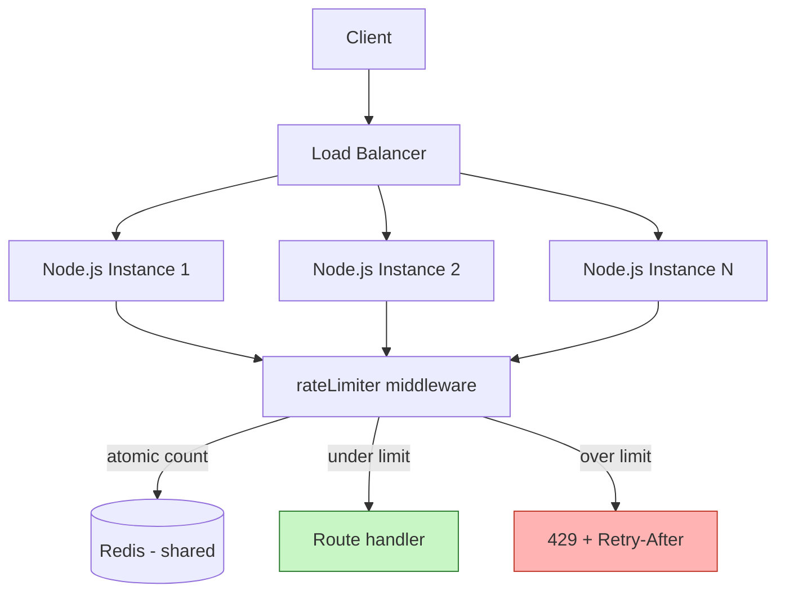

# 5. Rate Limiter Middleware

> **In one line:** Build an Express rate-limiting middleware — choose an algorithm, make it correct
> across a fleet of instances with Redis, key requests sensibly, and handle abuse, bursts, and store
> failures the way production systems (Stripe, GitHub, Cloudflare) do.

> **Original prompt:** Implement a basic rate limiter in Express.js using redis or in-memory storage.

## Overview

Rate limiting caps how many requests a client may make in a time window. It protects a service from
abuse (brute force, credential stuffing, scraping), from accidental floods (a buggy client in a retry
loop), and enforces fair usage and paid quotas. It's implemented as middleware: intercept the request,
check the client's recent usage, then allow it or reject with **429 Too Many Requests**.

For the underlying concept and algorithms, see
[Rate Limiting](../05-reliability-performance-and-modern-concepts/02-rate-limiting.md). This problem is
about *implementing* it correctly in Express — and the correctness subtleties are exactly what
interviewers probe.

## Real-World Context

- **Public APIs (Stripe, GitHub, Twitter/X)** publish explicit per-key limits and return
  `429` + `RateLimit-*` headers so clients can self-throttle. GitHub's REST API, for example, allows a
  fixed budget per hour per token.
- **Login endpoints** are the classic target: without limiting, an attacker can try millions of
  password guesses (brute force) or reuse leaked credentials across accounts (credential stuffing).
- **Cloudflare / API gateways** apply limiting at the edge before traffic reaches origin servers,
  shedding abusive load early. In-app limiting complements — not replaces — edge limiting.

The interview signal is understanding that a per-process in-memory counter is wrong the moment you run
more than one instance, and knowing how to make it correct and atomic with a shared store.

## Requirements

**Functional**

- Limit requests per client per window; reject excess with `429` and a `Retry-After`.
- Support different limits per route (tight on `/auth/login`, generous on reads).
- Emit informational headers so clients can back off gracefully.

**Non-functional**

- **Correctness across instances:** the limit must be global, not per-process.
- **Atomicity:** concurrent requests must not race the counter and over-admit.
- **Performance:** the check adds minimal latency (a single fast store round trip).
- **Resilience:** a store outage must degrade in a defined way (fail-open or fail-closed).

## Where It Sits



The critical insight: with three instances and an in-memory counter, a client spraying requests across
all three via the load balancer gets **3× the intended limit**, because each process counts only what it
sees. A shared store (Redis) gives one authoritative global count.

## Choosing an Algorithm

| Algorithm | Idea | Pros | Cons |
|---|---|---|---|
| **Fixed Window** | Count per fixed clock window (per minute) | Trivial, cheap, one counter | Burst at edges — up to 2× near boundaries |
| **Sliding Window Log** | Store request timestamps, count those in the last window | Exact | Memory grows with request volume |
| **Sliding Window Counter** | Weighted blend of current + previous window | Smooth, cheap, near-exact | Slight approximation |
| **Token Bucket** | Bucket refills tokens at a rate; each request spends one | Allows controlled bursts, smooth average | Two params (rate, capacity) to tune |
| **Leaky Bucket** | Requests drain at a fixed rate | Smooths output rate | Queues/delays instead of rejecting |

**Token bucket** is the most common general-purpose choice — it enforces a long-term average while
tolerating short, legitimate bursts (e.g. a page that fires 5 API calls on load). **Fixed window** is
fine for simple protection; **sliding window counter** is the pragmatic middle when edge bursts matter
but you don't want the memory cost of a full log.

### The Fixed-Window Burst Problem

```text
Limit = 100/min.  Window boundary at 12:00:00.
  11:59:59 → 100 requests   (allowed, fills window A)
  12:00:01 → 100 requests   (allowed, fills window B)
→ 200 requests in ~2 seconds, straddling the boundary.
```

Sliding-window approaches remove this by considering a rolling interval rather than a hard reset.

## Implementation A — In-Memory (single instance / fallback)

Good for a single process or local dev; a fixed window:

```typescript
type Entry = { count: number; resetAt: number };
const buckets = new Map<string, Entry>();

export function rateLimit({ windowMs = 60_000, max = 100 }) {
  return (req, res, next) => {
    const key = req.ip;                       // choose the key deliberately (see below)
    const now = Date.now();
    let entry = buckets.get(key);

    if (!entry || now > entry.resetAt) {
      entry = { count: 0, resetAt: now + windowMs };
      buckets.set(key, entry);
    }
    entry.count++;

    const remaining = Math.max(0, max - entry.count);
    res.setHeader("RateLimit-Limit", max);
    res.setHeader("RateLimit-Remaining", remaining);
    res.setHeader("RateLimit-Reset", Math.ceil((entry.resetAt - now) / 1000));

    if (entry.count > max) {
      res.setHeader("Retry-After", Math.ceil((entry.resetAt - now) / 1000));
      return res.status(429).json({ message: "Too many requests" });
    }
    next();
  };
}
```

> **Limitations:** the `Map` is per-process (wrong for a cluster), unbounded (memory-leak risk without
> eviction), and resets on restart. Fine as a fallback; not a production cluster solution.

## Implementation B — Redis (distributed, atomic)

For multiple instances, keep the count in Redis. A fixed-window counter with atomic `INCR` + `EXPIRE`:

```typescript
export function rateLimitRedis(redis, { windowMs = 60_000, max = 100 }) {
  const windowSec = Math.ceil(windowMs / 1000);
  return async (req, res, next) => {
    const bucket = Math.floor(Date.now() / windowMs);
    const key = `rl:${req.ip}:${bucket}`;

    // Atomic: INCR returns the new count; EXPIRE sets TTL so the window self-cleans.
    const [count] = await redis
      .multi()
      .incr(key)
      .expire(key, windowSec)
      .exec()
      .then((r) => [r[0][1] as number]);

    res.setHeader("RateLimit-Limit", max);
    res.setHeader("RateLimit-Remaining", Math.max(0, max - count));

    if (count > max) {
      res.setHeader("Retry-After", windowSec);
      return res.status(429).json({ message: "Too many requests" });
    }
    next();
  };
}
```

**Why atomicity matters:** a naive `GET` → compare → `SET` has a race — two instances both read `99`,
both allow, both write `100`, and the client gets `101`. `INCR` is atomic, so the increment and the read
are one operation. For sliding-window or token-bucket accuracy, run the whole read-modify-write in a
**Lua script** (executed atomically server-side in Redis) — this is what libraries like
`rate-limiter-flexible` do, and it's the production-grade answer.

## Keying Strategy

The key defines *who* is limited — the most consequential design choice:

- **`ip`** — works for anonymous traffic, but blunt: shared IPs (corporate NAT, mobile carriers) mean
  many users share one bucket, and behind proxies the IP must be read from a *trusted* `X-Forwarded-For`.
- **`userId`** — fair per-account limiting for authenticated routes.
- **`apiKey` / tenant** — per-customer quotas (SaaS billing tiers).
- **Composite `ip + route`** — protect specific expensive/sensitive endpoints independently.

For **login**, combine `ip + email` with care: limiting purely by email lets an attacker lock a victim
out by spamming their address; limiting purely by IP lets a botnet spread the attack. A layered approach
(per-IP + per-account + global anomaly detection) is standard — see
[User Authentication System](./01-user-authentication-system.md).

## Response Contract

- **`429 Too Many Requests`** status.
- **`Retry-After`** — seconds until the client may retry (well-behaved clients honor it).
- **`RateLimit-Limit` / `RateLimit-Remaining` / `RateLimit-Reset`** — standard informational headers for
  self-throttling.
- Return a **JSON error body** consistent with your API's error envelope, not just a bare status.

## Performance

- **One round trip:** the Redis pipeline (`INCR`+`EXPIRE`) is a single network op; keep Redis co-located
  (same region/AZ) to keep it sub-millisecond.
- **Short TTLs self-clean:** window keys expire automatically, so memory doesn't grow unbounded.
- **Avoid heavy algorithms on the hot path:** a sliding-window *log* stores every timestamp and grows
  with volume; prefer the sliding-window *counter* or token bucket for high QPS.
- **Local pre-check (optional):** a small in-process cache can short-circuit obviously-over-limit clients
  before hitting Redis, trading a little accuracy for latency.

## Scalability

- **Redis is the shared source of truth**, so all instances agree; scale app instances freely.
- **Redis itself** can be scaled with clustering; shard limiter keys by client so no single node is hot.
- **Edge + app layering:** coarse limiting at the CDN/gateway sheds volumetric abuse; fine-grained
  per-user/route limiting lives in the app. Don't rely on only one layer.
- **Hot keys:** a single abusive client hammering one key can hotspot a Redis node — detect and
  block/tarpit such clients upstream.

## Security

- **This *is* a security control** for auth endpoints: tight limits blunt brute force, credential
  stuffing, and password spraying. Pair with lockouts/backoff and CAPTCHA on repeated failures.
- **`X-Forwarded-For` spoofing:** never trust the header blindly — a client can forge it to dodge IP
  limits. Configure Express `trust proxy` to only honor it from known proxy hops.
- **Don't leak information** in limit responses (e.g. "email not found") — keep messages generic.
- **Protect the limiter store:** if Redis is reachable/writable by untrusted parties, an attacker could
  poison counters; keep it on a private network.

## Reliability & Failure Handling

What happens when **Redis is down or slow**? Decide explicitly, per route:

- **Fail-open** (allow requests) — availability over protection; the usual default for ordinary read
  endpoints, so a Redis blip doesn't take the whole API down.
- **Fail-closed** (reject) — protection over availability; appropriate for sensitive endpoints like
  `/auth/login` where you'd rather reject than allow unlimited attempts.
- **Cap latency:** wrap the Redis call in a short timeout so a slow store doesn't stall every request;
  on timeout, apply the chosen fail policy.

## Tips

- Use a **shared store (Redis)** the moment you run more than one instance.
- Make the counter update **atomic** (`INCR`+`EXPIRE`, or a Lua script) to avoid over-admission races.
- Return **`429` + `Retry-After`** and the standard `RateLimit-*` headers.
- **Tighten limits on auth/expensive routes**; keep reads generous.
- Choose the **key** deliberately, and only trust `X-Forwarded-For` from known proxies.
- Decide **fail-open vs fail-closed** per route, and time-box the store call.

## Trade-offs & Pitfalls

- **In-memory counters don't work across instances** — each process enforces its own limit, multiplying
  the real one by the instance count.
- **Fixed windows allow edge bursts** (up to 2×); use sliding window if that matters.
- **Non-atomic read-modify-write races** under concurrency — always use atomic ops.
- **Trusting `X-Forwarded-For` blindly** lets clients spoof IPs and bypass limits.
- **IP-only limiting harms shared IPs** (NAT/offices/carriers) — combine with user/API-key keys.
- **Sliding-window log** is exact but memory-hungry at high volume.
- **No fail policy** means a Redis outage silently disables limiting (fail-open) or breaks the API
  (fail-closed) by accident — make it a decision.

## System Design Cheat Sheet

```text
1. SCOPE      One instance (in-memory) vs many (Redis, shared)
2. KEY        IP / userId / apiKey / composite (ip+route, ip+email)
3. ALGORITHM  Fixed / sliding window / token bucket (bursts?)
4. ATOMICITY  INCR+EXPIRE or Lua script — no read-modify-write races
5. RESPONSE   429 + Retry-After + RateLimit-* headers + JSON body
6. POLICY     Tighter on auth/expensive; layered edge + app
7. FAILURE    Fail-open vs fail-closed per route; time-box the store call
```

## Interview Questions & Answers

### A. Fundamentals

- **What is rate limiting protecting against, and where does it belong?**
  It protects against abuse (brute force, credential stuffing, scraping), accidental floods (a client
  stuck in a retry loop), and enforces fair usage/paid quotas. It belongs as middleware that runs before
  the route handler, and ideally in layers — coarse volumetric limiting at the edge/gateway, and
  fine-grained per-user or per-route limiting in the application where I have identity and business
  context.

- **What do you return when a client is limited?**
  `429 Too Many Requests`, with a `Retry-After` header telling the client how many seconds to wait, plus
  the standard `RateLimit-Limit/Remaining/Reset` headers so well-behaved clients can self-throttle before
  they hit the wall. I also return a JSON body matching my API's error envelope so clients can handle it
  programmatically rather than parsing a bare status.

### B. Storage & Distribution

- **Why is an in-memory counter wrong once you have multiple instances?**
  Each Node process only counts the requests it personally handles. With three instances behind a load
  balancer, a client whose requests get spread across all three effectively gets three times the intended
  limit, because no single process sees the full picture. The moment you scale past one instance you need a
  shared store — Redis — so all instances read and write one authoritative counter.

- **How do you avoid a race condition on the counter?**
  A naive `GET` then `SET` is racy: two instances can both read 99, both decide "under limit," and both
  write 100, admitting one request too many — and it's worse under real concurrency. I use an atomic
  operation instead: Redis `INCR` returns the incremented value in a single atomic step, and I set the
  window TTL with `EXPIRE`. For sliding-window or token-bucket logic that needs multiple reads and writes,
  I put the whole thing in a Lua script, which Redis runs atomically server-side.

- **How does the window key expire so memory doesn't grow?**
  I embed the window number in the key (e.g. `rl:<ip>:<minute>`) and set a TTL equal to the window length
  with `EXPIRE`. Old windows simply expire and are reclaimed by Redis, so I never accumulate stale
  counters — the store self-cleans.

### C. Algorithms

- **Walk me through the algorithm options and your default.**
  Fixed window is one counter per clock interval — cheap but allows a ~2× burst straddling the boundary.
  Sliding window log stores every timestamp for exactness but its memory grows with request volume.
  Sliding window counter blends the current and previous window to smooth the edge burst cheaply. Token
  bucket refills tokens at a steady rate and lets requests spend them, allowing controlled bursts around a
  fixed average. My default is token bucket for general APIs because real clients are bursty (a page load
  fires several calls at once) and it enforces a fair average without punishing legitimate bursts.

- **What's the fixed-window edge-burst problem?**
  Because the counter resets hard at the window boundary, a client can send the full limit just before the
  reset and the full limit again just after — roughly double the intended rate in a couple of seconds
  across the boundary. If that matters (e.g. protecting a fragile downstream), I switch to a
  sliding-window counter, which considers a rolling interval instead of resetting abruptly.

### D. Keying & Security

- **How would you rate-limit a login endpoint specifically?**
  Login needs a layered key strategy. Limiting only by IP lets a distributed botnet spread the attack
  across many IPs; limiting only by email lets an attacker lock a legitimate user out by spamming their
  address. So I combine per-IP limits, per-account limits, and a stricter global anomaly threshold, and I
  pair rate limiting with exponential backoff and CAPTCHA/lockout after repeated failures. I also keep
  error messages generic so the endpoint doesn't reveal whether an account exists.

- **How do you handle `X-Forwarded-For` behind a load balancer?**
  The client's real IP arrives in `X-Forwarded-For`, but that header is client-settable, so if I trust it
  blindly an attacker can forge it and get a fresh bucket per request, bypassing the limit entirely. I
  configure Express's `trust proxy` to only accept the header from my known proxy/load-balancer hops and
  take the correct entry in the chain — so I use the real client IP but can't be spoofed.

### E. Reliability & Scale

- **What happens if Redis goes down?**
  I make it an explicit, per-route decision rather than an accident. For ordinary endpoints I fail-open —
  allow requests — so a Redis blip doesn't take the whole API offline. For sensitive endpoints like login
  I fail-closed — reject — because I'd rather deny service briefly than allow unlimited password guesses. I
  also wrap the Redis call in a short timeout so a slow store doesn't add latency to every request; on
  timeout I apply the same fail policy.

- **How does the limiter itself scale, and what about hot keys?**
  Redis is the shared source of truth and scales with clustering; I shard limiter keys by client so load
  spreads across nodes. The risk is a hot key — one very abusive client hammering a single key can
  overload the node that owns it — so I detect and block or tarpit such clients upstream (at the edge)
  rather than letting them pound Redis. Layering edge and app limiting keeps volumetric abuse away from the
  fine-grained app-level counters.

---

_Notes: (add your own content here)_
