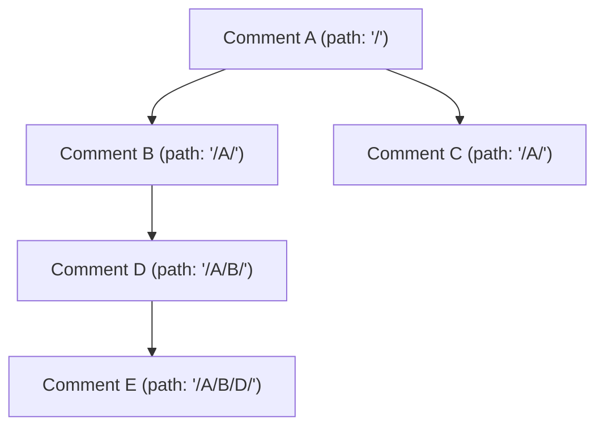

# 6. Design a Comment System

> **In one line:** Model a Reddit-style nested comment thread in MongoDB using the **Materialized Path**
> pattern — so an entire subtree can be fetched, sorted, and paginated with a single indexed query.

> **Original prompt:** Model a schema for a nested comment thread (Reddit style) using the Materialized Path pattern.

## Overview

Nested comments form a tree: a comment replies to a comment, which replies to another, arbitrarily
deep. The hard part isn't storing one comment — it's **reading a whole thread efficiently** and
**rendering it in the right nested order**. The naive "store `parentId`, then recurse with a query per
level" approach causes N+1 queries and unbounded round trips.

The **Materialized Path** pattern solves this by storing, on each comment, the *path from the root to
its parent*. That single string turns "fetch this entire subtree" into one indexed prefix query.

## Step 0: Clarify the Problem

- **How deep can threads go?** Reddit-style is effectively unlimited; that rules out fixed-depth schemas.
- **Read vs write ratio?** Very read-heavy — optimize for fetching and rendering threads.
- **Sort order within a level?** By time, or by score (upvotes)? Affects indexing.
- **Edits/deletes?** Deleting a parent with replies needs a policy (tombstone vs cascade).

## Tree-Modeling Options

| Pattern | Idea | Read subtree | Insert | Weakness |
|---|---|---|---|---|
| **Parent Reference** | Each node stores `parentId` | Recursive / `$graphLookup` | Trivial | N+1 queries or expensive graph lookup |
| **Array of Ancestors** | Store an array of all ancestor ids | One query (`ancestors: id`) | Easy | Array management; larger docs |
| **Materialized Path** | Store the path string (`/a/b/c`) | One **prefix** query | Easy | Path maintenance on move |
| **Nested Sets** | Store left/right bounds | One range query | **Expensive** — rebalancing on insert | Bad for write-heavy trees |

For a comment thread (write-often, read-as-subtree, arbitrary depth), **Materialized Path** hits the
sweet spot: cheap inserts and a single query to read any subtree.

## The Materialized Path Idea

Each comment stores the **path of ancestor ids** leading to it. A reply's path is
`parent.path + parent._id`. To fetch a whole subtree, query for every comment whose path **starts with**
the ancestor's path.



To load the subtree under **B**, one query: `path` starts with `/A/B/`. Depth is derivable from the
path (count the separators), so you can indent correctly when rendering.

## Schema (Mongoose)

```typescript
import { Schema, model, Types } from "mongoose";

const commentSchema = new Schema(
  {
    postId: { type: Types.ObjectId, ref: "Post", required: true, index: true },
    userId: { type: Types.ObjectId, ref: "User", required: true },

    parentId: { type: Types.ObjectId, ref: "Comment", default: null },

    // Materialized path of ancestor ids, e.g. ",A,B,D," (root comments = ",").
    path: { type: String, required: true, default: "," },
    depth: { type: Number, required: true, default: 0 },

    content: { type: String, required: true, maxlength: 10_000 },
    score: { type: Number, default: 0 },     // upvotes - downvotes

    isDeleted: { type: Boolean, default: false }, // tombstone, keeps replies intact
    deletedAt: { type: Date, default: null },
  },
  { timestamps: true },
);

// Fetch a whole thread/subtree: match postId, then prefix-match path.
commentSchema.index({ postId: 1, path: 1 });
// Sort a level by newest or by score.
commentSchema.index({ postId: 1, path: 1, createdAt: -1 });

export const Comment = model("Comment", commentSchema);
```

I use comma delimiters (`,A,B,`) so a prefix query can't accidentally match a different id that shares
a leading substring.

## Creating a Reply

```typescript
async function addReply(postId, userId, parentId, content) {
  let path = ",", depth = 0;
  if (parentId) {
    const parent = await Comment.findById(parentId).lean();
    if (!parent) throw new Error("Parent not found");
    path = `${parent.path}${parent._id},`; // parent's path + parent id
    depth = parent.depth + 1;
  }
  return Comment.create({ postId, userId, parentId, path, depth, content });
}
```

The path is computed once at insert time from the parent — no recursion, one extra read.

## Reading a Thread

One indexed query returns the entire subtree (or whole post's comments), already filterable and
sortable:

```typescript
// Entire thread for a post, root comments first, then by recency.
const thread = await Comment.find({ postId, isDeleted: false })
  .sort({ path: 1, createdAt: -1 })
  .lean();

// Just the subtree under a given comment:
const subtree = await Comment.find({
  postId,
  path: { $regex: `^${escapeRegex(parent.path + parent._id + ",")}` },
});
```

Then build the nested structure **in application memory** from the flat list (group by `parentId`, or
order by `path` and indent by `depth`). Sorting on `path` yields a natural depth-first ordering.

> **Anchor the regex with `^`** so it's a *prefix* match that can use the index; an unanchored regex
> forces a full scan.

## Pagination in Threads

Big threads still need paging. Two common approaches:

- **Top-level pagination:** paginate root comments (cursor by `_id`/`score`), then lazy-load each
  comment's replies on demand ("view more replies"). This is the Reddit/YouTube model.
- **Flat cursor pagination:** paginate the flat, path-ordered list. See
  [Cursor-Based Pagination](./03-cursor-based-pagination.md).

## Deletes

Deleting a comment that has replies shouldn't orphan the subtree. Use a **tombstone**: set
`isDeleted: true`, blank the content ("[deleted]"), but keep the node so its children still render — the
standard forum behavior.

## Scaling Notes

- **Read-heavy:** cache rendered/assembled threads for hot posts (see
  [Caching Layer](./10-caching-layer.md)); invalidate on new replies.
- **Indexing:** the `{ postId, path }` compound index is what makes subtree reads fast — see
  [Index](../02-data-and-storage-concepts/05-index.md).
- **Very large posts:** cap initial depth/breadth and lazy-load deeper replies.
- **Counts/scores:** maintain reply counts and scores as denormalized fields updated on write, rather
  than counting on read.

## Tips

- Store the **path of ancestors** (comma-delimited) plus a **`depth`** on every comment.
- Compute the path **once at insert** from the parent — no recursion.
- Read any subtree with a single **anchored prefix** query on `path` (index-backed).
- **Assemble the tree in memory** from the flat result; order by `path` for depth-first rendering.
- **Tombstone** deleted comments with children instead of removing them.
- Paginate **top-level comments** and lazy-load replies for big threads.

## Trade-offs & Pitfalls

- **Materialized Path vs Parent Reference:** path enables one-query subtree reads but requires
  maintaining the path string; parent-reference is simpler to write but causes N+1 / graph lookups on read.
- **Unanchored regex on `path`** can't use the index → full collection scan; always anchor with `^`.
- **Moving a subtree** requires rewriting the path of all descendants — rare for comments, but a real cost.
- **Nested sets** are elegant for reads but terrible for the frequent inserts a comment system sees.
- **Hard-deleting a parent** orphans replies — use tombstones.
- **Very deep threads** can produce long path strings and huge in-memory trees — cap depth / lazy-load.

## System Design Cheat Sheet

```text
1. SHAPE       Arbitrary-depth tree, read-as-subtree, write-often
2. PATTERN     Materialized Path (path + depth per node)
3. WRITE       reply.path = parent.path + parent._id
4. READ        One anchored prefix query on path (indexed)
5. RENDER      Assemble tree in memory; order by path, indent by depth
6. DELETE      Tombstone parents with children
7. PAGINATE    Top-level cursor + lazy-load replies
8. SCALE       Cache hot threads; denormalize counts/scores
```

## Interview Questions & Answers

### A. Modeling

- **How do you model a nested comment tree?** — Materialized Path: each comment stores the path of ancestor ids plus its depth.
- **Why not just store `parentId`?** — Parent-reference forces recursive/N+1 reads or an expensive `$graphLookup` to fetch a subtree.
- **What tree patterns exist?** — Parent reference, array of ancestors, materialized path, nested sets.
- **Why materialized path for comments?** — Cheap inserts *and* single-query subtree reads for arbitrary depth.
- **Why store `depth`?** — To render indentation without parsing the path each time.

### B. Reads & Writes

- **How do you fetch a whole thread?** — One query: match `postId` and prefix-match `path` (index-backed).
- **How do you compute a reply's path?** — `parent.path + parent._id + separator` at insert time.
- **How do you build the nested structure?** — Assemble in memory from the flat list; order by `path` for depth-first.
- **Why anchor the regex with `^`?** — So it's a prefix match that can use the index instead of scanning.
- **Why comma-delimit the path?** — To prevent prefix matches across ids that share leading characters.

### C. Deletes, Pagination, Scale

- **How do you delete a comment with replies?** — Tombstone it (`isDeleted`, "[deleted]") so children still render.
- **How do you paginate large threads?** — Paginate top-level comments and lazy-load replies, or cursor-paginate the flat path-ordered list.
- **What index makes this fast?** — A compound index on `{ postId, path }` (plus a sort key).
- **How do you handle hot posts?** — Cache assembled threads and invalidate on new replies; denormalize counts/scores.
- **What breaks with nested sets here?** — Frequent inserts require rebalancing left/right bounds — too costly for comments.

---

_Notes: (add your own content here)_
