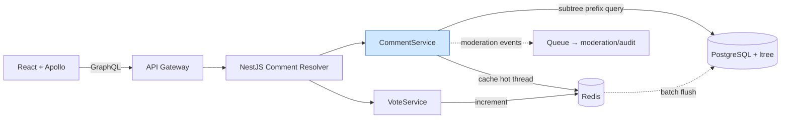

# 6. Design a Comment System

> **In one line:** Design a Reddit/YouTube-scale nested comment system — the interview conversation, HLD,
> LLD with real NestJS + GraphQL code, competing tree-storage patterns, and deep scaling + moderation +
> security.

> **Original prompt:** Model a schema for a nested comment thread (Reddit style) using the Materialized Path pattern.

---

## 1. The Interview Conversation

> **Interviewer:** "Design the comment system for a Reddit-style site. Comments can be nested
> arbitrarily deep."
>
> **Candidate:** "The core challenge isn't storing one comment — it's reading a whole thread efficiently
> and rendering the nesting. Let me confirm depth: truly arbitrary (Reddit), or capped at two levels
> (YouTube/Instagram)? It changes the data model significantly."
>
> **Interviewer:** "Arbitrary depth."
>
> **Candidate:** "Then a naive `parentId` with recursive queries gives N+1 round trips per thread, which
> won't scale. I'm choosing between Adjacency List, Materialized Path, Closure Table, and Nested Sets. For
> a write-often, read-as-subtree workload I'll argue for Materialized Path — one indexed prefix query
> fetches an entire subtree, and inserts are cheap. What's the read/write ratio and scale?"
>
> **Interviewer:** "Very read-heavy. A viral post can have 100k+ comments."
>
> **Candidate:** "So I can't load a whole thread at once — I'll paginate top-level comments and lazy-load
> replies, and cache assembled hot threads. Do we need voting/ranking, editing, deletion with replies, and
> moderation?"
>
> **Interviewer:** "Yes to all. What happens when you delete a comment that has replies?"
>
> **Candidate:** "Tombstone it — mark deleted and show '[deleted]' but keep the node so children still
> render; hard-deleting would orphan the subtree. Voting needs dedup so a user can't inflate a score. And
> since comments are user-generated HTML shown to others, XSS is my top security concern — I'll sanitize on
> output. Let me lay it out."

**Signal:** the candidate identifies read-as-subtree as the crux, compares four tree patterns, plans for
viral threads (pagination + cache), and calls out tombstones, vote-dedup, and XSS unprompted.

---

## 2. Requirements

**Functional**

- Comment on a post; reply to any comment (arbitrary depth).
- Fetch a thread/subtree in correct nested order; paginate large threads.
- Edit; delete (preserving replies); vote with a score/ranking.
- Moderation: report, remove, audit trail.

**Non-functional**

| Requirement | Target |
|---|---|
| **Read performance** | Load a thread/subtree with O(1) queries (no N+1); p99 < 50 ms |
| **Scalability** | 100k+ comments per post; read-dominant; high QPS |
| **Integrity** | Deleting a parent never orphans replies; vote counts consistent |
| **Security** | XSS-safe rendering; authz on edit/delete; anti-spam & vote-manipulation |

---

## 3. Recommended Tech Stack

| Layer | Choice | Why |
|---|---|---|
| **Framework** | **NestJS** | Modules/DI for comment + vote + moderation services |
| **API style** | **GraphQL** | Clients fetch exactly the subtree fields they render; great for nested data with `DataLoader` |
| **Primary DB** | **PostgreSQL** (with `ltree` extension) — or **MongoDB** (materialized path string) | `ltree` is purpose-built for Materialized Path with GiST indexes; Mongo works with a path string + prefix regex |
| **Cache** | **Redis** | Cache assembled hot threads + denormalized scores/reply counts |
| **Vote counters** | **Redis** (then batched to DB) | Absorbs vote storms on popular comments |
| **Frontend** | **React + Apollo Client** | Renders the tree; `fetchMore` for "load more replies" |

> **Postgres `ltree` vs Mongo:** `ltree` stores a path like `root.a1b2.c3d4` and supports fast ancestor/
> descendant queries via GiST indexes (`@>`, `<@`, `~`), making it the cleanest Materialized Path backend.
> MongoDB achieves the same with a comma-delimited string and an anchored prefix regex.

---

## 4. High-Level Design (HLD)



**Read (thread):** resolver → CommentService checks Redis for the assembled hot thread → on miss, one
prefix query returns the subtree, assembled in memory, cached → returned. **Write (reply):** compute the
materialized path from the parent, insert, bump denormalized `replyCount`, invalidate the thread cache.
**Vote:** increment in Redis (fast, dedup'd), flush to DB in batches.

---

## 5. Approaches, Patterns & Algorithms (tree storage)

| Pattern | Read subtree | Insert | Move subtree | Notes |
|---|---|---|---|---|
| **Adjacency List** (`parentId`) | Recursive / `$graphLookup` / CTE — N+1 or heavy | Trivial | Trivial | Simple but read-expensive |
| **Materialized Path** (chosen) | **1 prefix query** | Cheap (parent path + id) | Rewrite descendants' paths | Best for read-as-subtree, write-often |
| **Closure Table** | 1 join query | Insert M ancestor rows | Update closure rows | Great reads, heavier writes/storage |
| **Nested Sets** | 1 range query | **Rebalance on every insert** | Expensive | Terrible for write-frequent comments |

**Chosen: Materialized Path.** Cheap inserts *and* single-query subtree reads for arbitrary depth. Closure
Table is the runner-up (excellent reads) but pays with extra ancestor rows on every insert; for a
write-heavy comment stream Materialized Path is the better balance.

**Recursive CTE** (adjacency-list read, for contrast) shows why we avoid it as the primary read:

```sql
WITH RECURSIVE thread AS (
  SELECT * FROM comments WHERE id = $root
  UNION ALL
  SELECT c.* FROM comments c JOIN thread t ON c.parent_id = t.id
) SELECT * FROM thread;   -- correct, but recursion cost grows with depth/size
```

Materialized Path replaces this with a single indexed prefix match.

---

## 6. Low-Level Design (LLD)

### 6.1 Module structure (NestJS)

```text
src/
├── comments/
│   ├── comments.resolver.ts    # GraphQL: thread, addComment, editComment, deleteComment
│   ├── comments.service.ts     # path computation, assembly, tombstone
│   ├── comments.repository.ts  # ltree / prefix queries
│   ├── comment.model.ts
│   └── dto/
├── votes/
│   ├── votes.resolver.ts
│   └── votes.service.ts        # dedup + Redis counters + batch flush
├── moderation/moderation.service.ts
└── common/sanitize.ts          # XSS-safe rendering
```

### 6.2 Schema (PostgreSQL + ltree; Mongo shown too)

```sql
CREATE EXTENSION IF NOT EXISTS ltree;
CREATE TABLE comments (
  id          BIGINT PRIMARY KEY,
  post_id     BIGINT NOT NULL,
  user_id     BIGINT NOT NULL,
  parent_id   BIGINT,
  path        LTREE  NOT NULL,          -- e.g. 'p123.c1.c5'  (materialized path)
  depth       INT    NOT NULL DEFAULT 0,
  content     TEXT   NOT NULL,
  score       INT    NOT NULL DEFAULT 0,     -- denormalized (upvotes - downvotes)
  reply_count INT    NOT NULL DEFAULT 0,     -- denormalized
  is_deleted  BOOLEAN NOT NULL DEFAULT false,-- tombstone
  created_at  TIMESTAMPTZ NOT NULL DEFAULT now(),
  edited_at   TIMESTAMPTZ
);
CREATE INDEX idx_comments_path  ON comments USING GIST (path);   -- ancestor/descendant queries
CREATE INDEX idx_comments_post  ON comments (post_id, created_at DESC);
```

```javascript
// MongoDB equivalent (comma-delimited path + anchored prefix)
db.comments.createIndex({ postId: 1, path: 1 });
db.comments.createIndex({ postId: 1, score: -1 });
// path like ",p123,c1,c5,"  → subtree: { path: { $regex: '^,p123,c1,c5,' } }
```

### 6.3 Add a reply (compute path at insert)

```typescript
// comments.service.ts
async addComment(postId: bigint, userId: bigint, parentId: bigint | null, raw: string) {
  const content = sanitizeInput(raw);                 // strip dangerous markup (defense in depth)
  const id = this.ids.next();

  let path: string, depth = 0;
  if (parentId) {
    const parent = await this.repo.findById(parentId);
    if (!parent || parent.postId !== postId) throw new NotFoundException();
    path = `${parent.path}.c${id}`;                   // ltree: parent path + this node
    depth = parent.depth + 1;
    await this.repo.incrementReplyCount(parentId);    // denormalized
  } else {
    path = `p${postId}.c${id}`;
  }

  const comment = await this.repo.insert({ id, postId, userId, parentId, path, depth, content });
  await this.cache.invalidateThread(postId);          // hot-thread cache
  return comment;
}
```

### 6.4 Fetch a subtree (one query) + assemble

```typescript
// comments.repository.ts (ltree descendant query)
async subtree(postId: bigint, rootPath: string, limit = 200) {
  return this.db.query(
    `SELECT * FROM comments
     WHERE post_id = $1 AND path <@ $2       -- '<@' = descendant-of, uses GiST index
     ORDER BY path, score DESC
     LIMIT $3`, [postId, rootPath, limit]);
}

// comments.service.ts — build nested structure in memory from the flat list
buildTree(rows: Comment[]): CommentNode[] {
  const byId = new Map(rows.map((r) => [r.id, { ...r, children: [] as CommentNode[] }]));
  const roots: CommentNode[] = [];
  for (const node of byId.values()) {
    const parent = node.parentId ? byId.get(node.parentId) : null;
    (parent ? parent.children : roots).push(node);
  }
  return roots;
}
```

### 6.5 Resolver with DataLoader (avoid N+1 on authors)

```typescript
@Resolver(() => Comment)
export class CommentsResolver {
  constructor(private comments: CommentsService, private users: UserLoader) {}

  @Query(() => [Comment])
  thread(@Args("postId") postId: string, @Args("cursor", { nullable: true }) cursor?: string) {
    return this.comments.topLevelPage(BigInt(postId), cursor);   // paginate roots
  }

  @ResolveField(() => User)
  author(@Parent() c: Comment) { return this.users.load(c.userId); } // batched via DataLoader
}
```

### 6.6 Sequence diagram (post a reply)

```mermaid
sequenceDiagram
    participant C as Apollo Client
    participant R as CommentsResolver
    participant S as CommentService
    participant DB as Postgres(ltree)
    participant Ca as Redis
    C->>R: addComment(postId, parentId, content)
    R->>S: addComment()
    S->>S: sanitize content; next id
    S->>DB: SELECT parent (path, depth)
    S->>DB: INSERT comment (path = parent.path + id)
    S->>DB: UPDATE parent.reply_count += 1
    S->>Ca: invalidate thread cache
    S-->>C: created comment
```


---

## 7. Production-Ready Implementation Notes

- **One query per subtree** via the GiST-indexed `path <@ ancestor` (ltree) or anchored prefix (Mongo) —
  the whole point of Materialized Path. Assemble the nested structure in memory.
- **DataLoader** batches author/user lookups so rendering a page of comments doesn't cause N+1 user queries.
- **Denormalized `score`/`reply_count`** are updated on write so reads never aggregate the subtree.
- **Tombstone deletes** keep the tree intact; render `[deleted]` for tombstoned nodes with children, and
  hard-delete only leaf nodes with no replies if desired.

---

## 8. Scaling the System (in detail)

**8.1 Paginate top-level + lazy-load replies.** A 100k-comment post is never loaded whole. Cursor-paginate
root comments (by score or recency; see [Cursor-Based Pagination](./03-cursor-based-pagination.md)) and
fetch each comment's replies on demand.

```typescript
// "load more replies" — bounded subtree fetch under one comment
async replies(commentPath: string, postId: bigint, cursor?: string, limit = 20) {
  return this.repo.childrenPage(postId, commentPath, cursor, limit); // direct children, paginated
}
```

**8.2 Cache hot threads.** A handful of viral posts drive most reads. Cache the assembled top-level page (or
rendered HTML) in Redis, keyed by post + sort, and invalidate on new replies. This is usually the single
biggest win. See [Caching Layer](./10-caching-layer.md).

**8.3 Shard by `postId`.** All of a post's comments share `postId`, so sharding on it keeps an entire
thread on one shard — subtree queries stay local instead of scattering. See
[Sharding](../02-data-and-storage-concepts/06-sharding.md).

**8.4 Vote storms.** A trending comment can take thousands of votes/sec. Don't `UPDATE score` per vote —
increment a Redis counter (with per-user dedup) and flush aggregated deltas to Postgres periodically:

```typescript
// votes.service.ts
async vote(commentId: bigint, userId: bigint, dir: 1 | -1) {
  const dedup = `vote:${commentId}:${userId}`;
  const prev = await this.redis.getset(dedup, dir);          // one vote per user per comment
  if (Number(prev) === dir) return;                          // idempotent — no double count
  const delta = dir - (Number(prev) || 0);
  await this.redis.hincrby(`score:pending`, String(commentId), delta); // batched flush job → DB
}
```

**8.5 Read replicas** for thread reads; the primary handles writes and vote flushes.

---

## 9. Securing the System (in detail)

**9.1 XSS — the top risk.** Comments are user-generated content rendered to other users. Store raw text but
**sanitize/encode on output**, and serve behind a strict Content-Security-Policy.

```typescript
import createDOMPurify from "dompurify";
import { JSDOM } from "jsdom";
const DOMPurify = createDOMPurify(new JSDOM("").window);

export function renderSafe(markdown: string): string {
  const html = mdToHtml(markdown);                    // your markdown renderer
  return DOMPurify.sanitize(html, {                   // whitelist-based sanitization
    ALLOWED_TAGS: ["b", "i", "em", "strong", "a", "code", "pre", "blockquote", "p", "ul", "ol", "li"],
    ALLOWED_ATTR: ["href"],
  });
}
```

**9.2 Authorization.** Only the author edits/deletes their comment; only moderators remove others'. Enforce
with the `userId` from the verified token (see [User Authentication System](./01-user-authentication-system.md)),
never a client-supplied id.

```typescript
async deleteComment(commentId: bigint, actor: AuthUser) {
  const c = await this.repo.findById(commentId);
  const isOwner = c.userId === actor.id;
  if (!isOwner && !actor.roles.includes("MODERATOR")) throw new ForbiddenException();
  await this.repo.tombstone(commentId);               // preserve replies
  if (!isOwner) await this.audit.record("MOD_REMOVE", actor.id, commentId); // audit trail
}
```

**9.3 Vote manipulation.** The `GETSET` dedup key (§8.4) enforces one vote per user per comment, so a user
can't inflate a score by repeat-voting; detect bulk-voting rings via anomaly monitoring.

**9.4 Spam & abuse.** Rate-limit comment creation per user/IP (see
[Rate Limiter](./05-rate-limiter-middleware.md)); run toxicity/spam classifiers; support reporting and
shadow-banning; cap content length and nesting depth to prevent abuse and runaway documents.

**9.5 IDOR & injection.** Validate that `parentId`/`postId` belong together; use parameterized queries
(never string-concatenate the `ltree` path); anchor Mongo prefix regexes with `^` so they can't be abused
into full scans.

---

## 10. Observability & Reliability

- **Metrics:** thread-load latency, comments-per-thread distribution, cache hit ratio for hot threads,
  vote-flush lag, moderation queue depth, sanitizer rejections.
- **Reliability:** denormalized counters can drift on partial failure — reconcile `reply_count`/`score`
  periodically; make vote application idempotent (the dedup key) so retries are safe.
- **Alerts:** spike in sanitizer hits (possible XSS attack), moderation backlog, vote-flush failures.

---

## 11. Trade-offs & Pitfalls

- **Materialized Path vs Closure Table:** path = cheap writes + one-query reads but path rewrite on move;
  closure = superb reads but extra ancestor rows per insert. Chosen path for write-heavy comments.
- **Nested Sets** read great but rebalance on every insert — wrong for comment write frequency.
- **Unanchored Mongo prefix regex** can't use the index → full scan; always anchor with `^`.
- **Hard-deleting a parent** orphans replies — tombstone instead.
- **Rendering raw content** is an XSS hole — sanitize on output + CSP.
- **Per-vote DB writes** contend on hot comments — Redis counter + batch flush.
- **Denormalized counters drift** — reconcile periodically.

---

## 12. Interview Q&A (detailed)

- **How do you model an arbitrarily deep comment tree, and why Materialized Path over the alternatives?**
  I store, on each comment, a materialized path of its ancestor ids (via Postgres `ltree` or a
  comma-delimited string in Mongo) plus its depth. I compare four patterns: adjacency list (`parentId`) is
  trivial to write but needs recursive queries or `$graphLookup` to read a thread, causing N+1; nested sets
  read a subtree in one range query but must rebalance left/right bounds on every insert — disqualifying for
  a write-heavy comment stream; closure table gives excellent reads but writes an ancestor row per level.
  Materialized Path is the best balance for comments: inserts are cheap (parent's path plus this id) and a
  single indexed prefix/descendant query fetches an entire subtree. That read-as-subtree efficiency is what
  matters most in a read-dominant system.

- **A post goes viral with 100k comments — how do you avoid loading it all?**
  I never fetch the whole tree. I cursor-paginate the top-level comments (sorted by score or recency) and
  lazy-load each comment's replies on demand — the "view N more replies" pattern. That bounds the initial
  payload to a page of roots regardless of total size, and deep branches are fetched only if the user
  expands them. On top of that I cache the assembled top-level page for hot posts in Redis and invalidate it
  on new replies, because a few viral threads drive most of the read traffic — so most requests are served
  from cache without touching the database.

- **How do you fetch a subtree in one query, and how is it indexed?**
  With Postgres `ltree` I query `WHERE path <@ $ancestorPath`, which the GiST index on `path` serves as a
  fast descendant lookup; in Mongo it's an anchored prefix regex `^,p123,c1,` on a `{postId, path}` index.
  Either returns the whole subtree as a flat list in one round trip, and I assemble the nested structure in
  application memory by linking each node to its parent. The regex must be anchored with `^` or Mongo can't
  use the index and falls back to a collection scan.

- **What happens when you delete a comment that has replies?**
  I tombstone it: set `is_deleted`, replace the content with "[deleted]", but keep the node in the tree so
  its children still render. Hard-deleting would orphan the entire subtree beneath it. Moderator removals
  work the same way but are attributed and written to an audit trail, and there's a report queue so users
  can flag content. Only true leaf comments with no replies are candidates for a real hard delete.

- **How do you handle voting at scale without corrupting counts?**
  I don't write to the database per vote — a trending comment can take thousands of votes a second. I keep a
  per-user-per-comment dedup key in Redis (`GETSET`), so a user's repeated vote is idempotent and only the
  delta from their previous vote is applied — that stops score inflation. Aggregate deltas accumulate in a
  Redis structure and a background job flushes them to Postgres in batches. The denormalized `score` on the
  comment means reads never compute the sum, and I reconcile periodically to correct any drift from partial
  failures.

- **What are the main security concerns and how do you address them?**
  XSS is number one because comment text is rendered to other users — I store the raw text but sanitize and
  encode it on output with a whitelist sanitizer (DOMPurify) and enforce a strict Content-Security-Policy,
  never rendering raw HTML. Authorization is next: only the author can edit or delete their comment and only
  moderators can remove others', enforced with the `userId` from the verified token, not a client-supplied
  field. I rate-limit creation to fight spam, dedup votes to prevent manipulation, validate that
  `parentId`/`postId` belong together to prevent IDOR, use parameterized queries so the path can't be
  injected, and cap content length and nesting depth.

- **How would you shard and scale the storage?**
  I shard by `postId` so a post's entire comment tree lives on one shard — all its comments share that
  `postId`, so subtree queries stay local instead of scattering across shards. Reads are served from
  replicas and, crucially, from the hot-thread cache. Writes (new comments, reply-count bumps) and the
  batched vote flush go to the primary. This keeps both the common case (reading a cached popular thread)
  and the tail (a subtree query on a cold thread) efficient as the system grows.

---

## Cheat Sheet

```text
1. CRUX        Read-as-subtree efficiency for arbitrary depth
2. STACK       NestJS + GraphQL(+DataLoader) + Postgres ltree / Mongo + Redis + React
3. PATTERN     Materialized Path (path + depth); 1 prefix/descendant query per subtree
4. WRITE       reply.path = parent.path + id; bump reply_count; invalidate cache
5. READ        Paginate roots + lazy-load replies; assemble tree in memory
6. VOTES       Redis dedup counter + batch flush; denormalized score
7. DELETE      Tombstone (never orphan); moderator audit trail
8. SECURITY    Sanitize on output (XSS)+CSP; authz via token; rate-limit; dedup votes
9. SCALE       Shard by postId; cache hot threads; read replicas
```

---

_Notes: (add your own content here)_
