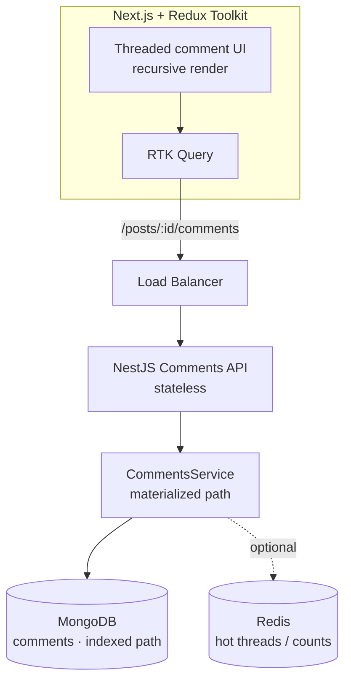
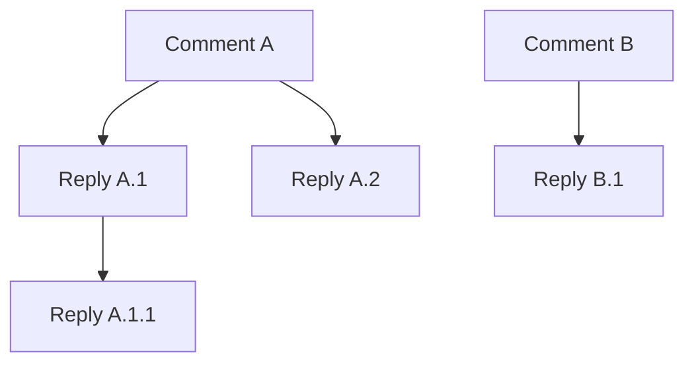
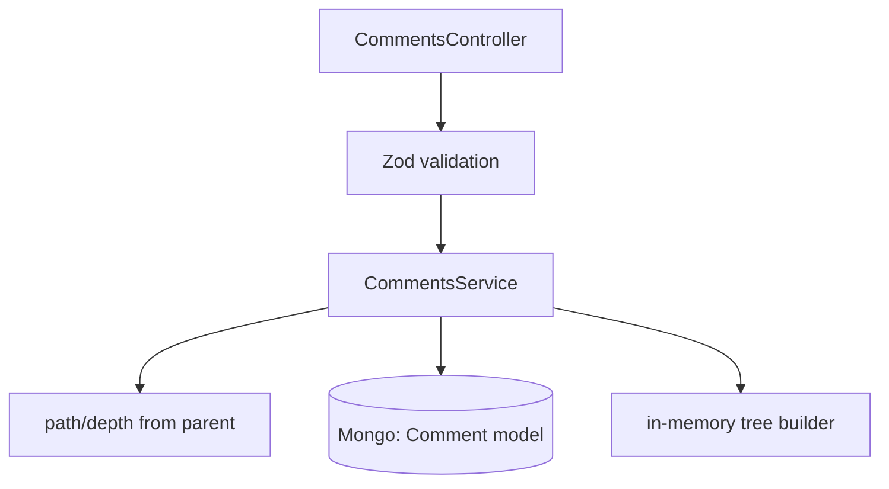
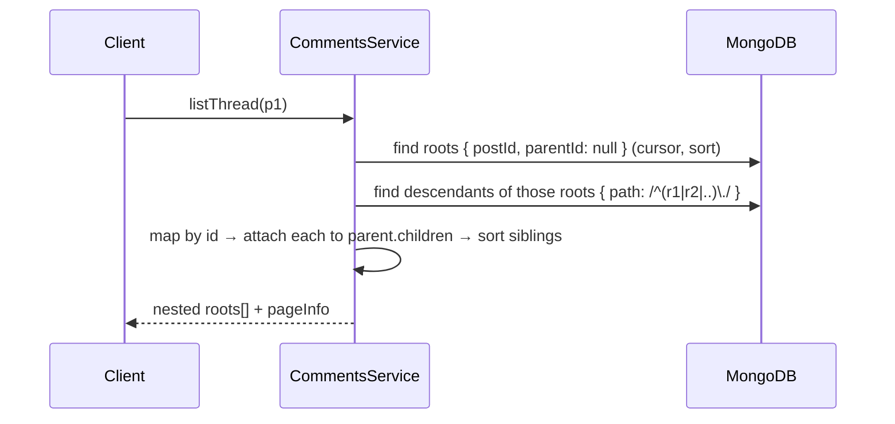

# 6. Design a Comment System

> **In one line:** Design a Reddit-style nested/threaded comment system — how to model the tree
> (adjacency list vs. **materialized path** vs. nested set vs. closure table), fetch and render deep
> threads efficiently, paginate, vote, soft-delete without breaking the tree, and keep it fast and safe
> at scale.

> **Original prompt:** Model a schema for a nested comment thread (Reddit style) using the Materialized Path pattern.

## Overview

Comments look like simple CRUD until you add **replies to replies**. Now you have a *tree*, and the
whole design hinges on how you store and query that tree:

- How do you fetch an entire thread (or a subtree) **without N recursive queries**?
- How deep can nesting go, and how do you **render** it?
- How do you **paginate** — top-level comments *and* long reply chains?
- What happens on **delete** when a comment has children (you can't just remove it)?
- How do you **sort** (new / top / best) and keep **counts** (replies, votes) fast?
- How do you keep it **safe** (XSS, spam) and **fast** (read-heavy) at scale?

The centerpiece is the **tree-modeling choice**. This write-up compares every pattern, then designs
around **materialized path** (the prompt's choice) and ships a runnable full-stack implementation in
[`./implementation/`](./implementation/) — a **NestJS + Mongoose + Zod** API and a
**Next.js + React + Redux Toolkit** threaded UI.

## Functional Requirements

1. Post a **top-level comment** on a resource (e.g. a post) and **reply** to any comment.
2. Fetch a **thread** as a nested tree (comments with their nested replies).
3. **Paginate** top-level comments; lazy-load deep reply subtrees on demand.
4. **Sort** comments (newest, top by score).
5. **Edit** and **delete** your own comment; deleting a comment that has replies leaves a **tombstone**
   so the thread stays intact.
6. **Vote** (up/down) to produce a score.
7. Enforce **ownership** (only the author edits/deletes) and **sanitize** content.

## Non-Functional Requirements

| Attribute | Target / approach |
|---|---|
| **Latency** | Thread read p95 < 150 ms — one indexed query + in-memory tree build |
| **Read/write** | Heavily read-dominated; reads must be cheap and cacheable |
| **Scalability** | Millions of comments; subtree fetch by an indexed path, not recursion |
| **Consistency** | Read-your-write on post; counts may be eventually consistent |
| **Availability** | 99.9%; stateless API + replicated DB |
| **Security** | AuthN upstream, ownership checks, XSS sanitization, rate limiting, spam control |
| **Integrity** | Deleting a parent must never orphan children (tombstone) |

Authentication is assumed solved (see
[Problem 01](../01-user-authentication-system/01-user-authentication-system.md)); every write carries a
verified `authorId`.

## A Realistic Interview Conversation

> **I** = Interviewer, **C** = Candidate.

**I:** Design a comment system with nested replies, like Reddit.

**C:** The heart of it is modeling a **tree** in a database and reading it cheaply. Let me confirm scope:
arbitrary nesting depth? Pagination on both top-level and replies? Voting and sorting? Soft delete?

**I:** Arbitrary depth, pagination yes, voting + sort by top and new, soft delete yes.

**C:** Then the key decision is the tree representation. Four common patterns: **adjacency list**
(each row stores `parentId`), **materialized path** (each row stores the chain of ancestor ids),
**nested set** (left/right bounds), and **closure table** (a separate table of every ancestor→descendant
pair). Adjacency list is simplest to write but needs recursion or `$graphLookup` to read a deep thread.
Nested set makes reads fast but writes are brutal — inserting a comment renumbers half the tree.
Closure table is powerful but adds a row per ancestor pair. **Materialized path** is the sweet spot for
comments: one indexed query fetches an entire subtree, and inserts are cheap.

**I:** How does materialized path fetch a subtree in one query?

**C:** Each comment stores a `path` — the ordered ids of its ancestors plus itself, e.g. `a.b.c`. To
fetch everything under comment `a`, I query `path` with an anchored prefix `^a\.` (or keep an
`ancestors` array and query `{ ancestors: aId }`). Both are a single indexed lookup. I also store
`depth` for rendering and to cap nesting.

**I:** How do you build the nested structure the client renders?

**C:** I fetch the flat list for the post in one query, then assemble the tree **in memory**: map every
comment by id, and attach each to its parent's `children`. O(n) with a hash map — no recursion against
the DB.

**I:** A thread can have 50k comments. You won't return all of them.

**C:** Right. I paginate **top-level** comments with a cursor, and for each root I return only the first
few levels / first N replies, with a "load more replies" that lazy-fetches a **subtree** by path. That
bounds the payload while keeping the one-query-per-fetch property.

**I:** Someone deletes a comment that has 200 replies. What happens?

**C:** I **soft-delete**: mark it deleted and blank the body to `[deleted]`, but keep the node so its
replies stay attached — a **tombstone**. Hard-deleting would orphan the subtree. A background job can
prune fully-dead branches later.

**I:** Sorting by "top" with votes?

**C:** Store a denormalized `score` (up minus down) updated on vote, and sort siblings by score (or a
time-decayed "best" ranking). Counts like `replyCount` are denormalized too so I never `count()` on read.

**I:** Security concerns?

**C:** Comments are user HTML/text — **sanitize** on the way in (or store raw + escape on render) to
prevent XSS. Enforce **ownership** on edit/delete. **Rate limit** posting and run spam/abuse checks.
Return `404` (not `403`) for another user's comment on edit to avoid leaking ids.

## A Mental Model: Four Questions

1. **How is the tree stored?** — adjacency / materialized path / nested set / closure table.
2. **How is a thread read?** — one indexed query + in-memory assembly.
3. **How is it bounded?** — paginate roots, lazy-load reply subtrees, cap depth.
4. **How does it stay correct & fast?** — tombstones on delete, denormalized counts/score, caching.

## High-Level Design (HLD)



Stateless API behind a load balancer; the tree lives in MongoDB with an index on the materialized path.
Hot threads and denormalized counts can be cached
([Cache](../../02-data-and-storage-concepts/08-cache.md),
[Horizontal Scaling](../../01-core-infrastructure-concepts/03-horizontal-scaling.md)).

## The Core Problem: Modeling a Comment Tree



### All Patterns Compared

| Pattern | Stored as | Read subtree | Insert | Best for |
|---|---|---|---|---|
| **Adjacency list** | `parentId` on each row | Recursion / `$graphLookup` | Trivial | Shallow trees, simple needs |
| **Materialized path** | Ancestor id chain (`a.b.c`) or `ancestors[]` | **One indexed prefix query** | Cheap (compute path from parent) | **Comment threads** ✅ |
| **Nested set** | `left`/`right` bounds | One range query | **Expensive** (renumber on insert) | Read-only / rarely-changing trees |
| **Closure table** | Row per ancestor→descendant | One join | Insert N ancestor rows | Complex hierarchies, multi-parent |

> **Choice:** **Materialized path.** For comments (write-often, read-as-subtree, arbitrary depth) it
> gives single-query subtree reads *and* cheap inserts — the best balance. Adjacency `parentId` is kept
> too, purely to make in-memory tree assembly trivial.

## MongoDB Schema (Mongoose)

```typescript
const commentSchema = new Schema(
  {
    postId:   { type: String, required: true, index: true }, // the thing being commented on
    parentId: { type: String, default: null },               // adjacency (for tree build)
    // Materialized path: ancestor ids + self, dot-joined, e.g. "665a.665b.665c".
    path:     { type: String, required: true, index: true },
    depth:    { type: Number, required: true, default: 0 },   // 0 = top level
    authorId: { type: String, required: true },
    body:     { type: String, required: true, maxlength: 10000 },
    score:    { type: Number, default: 0 },                   // denormalized (up - down)
    replyCount:{ type: Number, default: 0 },                  // denormalized
    deleted:  { type: Boolean, default: false },              // tombstone flag
  },
  { timestamps: true },
);

// Fetch a whole post's thread, and paginate top-level newest-first.
commentSchema.index({ postId: 1, parentId: 1, createdAt: -1 });
// Fetch any subtree by anchored path prefix, and sort by score.
commentSchema.index({ postId: 1, path: 1 });
```

- **`path`** is the materialized path — the pattern the prompt asks for. A subtree under comment `X` is
  `{ postId, path: /^<X.path>\./ }` (anchored → uses the index).
- **`parentId`** is redundant with `path` but makes the O(n) in-memory tree build trivial.
- **`depth`** caps nesting and drives indentation on the client.
- **`score` / `replyCount`** are denormalized so reads never aggregate.
- **`deleted`** turns a node into a tombstone instead of removing it.

## Low-Level Design (LLD)



### Service contracts

```text
create(postId, { parentId?, authorId, body })   → Comment          (parent sets path/depth)
listThread(postId, { limit, cursor, sort })      → { roots: Tree[], pageInfo }
getSubtree(commentId)                             → Tree            (one prefix query)
edit(commentId, authorId, body)                   → Comment          (404 if not owner)
softDelete(commentId, authorId)                   → Comment          (tombstone; children kept)
vote(commentId, +1 | -1)                          → { score }
```

### Post-a-reply flow (path derivation)

```mermaid
sequenceDiagram
    participant C as Client
    participant Ctrl as CommentsController
    participant S as CommentsService
    participant DB as MongoDB
    C->>Ctrl: POST /posts/p1/comments { parentId?, body }
    Ctrl->>S: create(...)
    alt reply
      S->>DB: findById(parentId)
      DB-->>S: parent { path, depth }
      S->>S: id = new ObjectId(); path = parent.path + "." + id; depth = parent.depth + 1
      S->>DB: insert child; $inc parent.replyCount
    else top-level
      S->>S: id = new ObjectId(); path = id; depth = 0
      S->>DB: insert root
    end
    S-->>C: 201 comment
```

### Read-a-thread flow (one query + O(n) assembly)



### Suggested project structure

```text
server/src/
├── app.module.ts
├── common/            # zod pipe, tree builder
└── comments/          # comment.schema (path index), service, controller, dto
```

## RESTful API

| Method | Endpoint | Purpose |
|---|---|---|
| `POST` | `/posts/:postId/comments` | Create comment/reply (`parentId?` in body) → `201` |
| `GET` | `/posts/:postId/comments?limit&cursor&sort` | Paginated nested thread → `200` |
| `GET` | `/comments/:id/subtree` | Lazy-load a reply subtree → `200` |
| `PATCH` | `/comments/:id` | Edit own comment → `200` (`404` if not owner) |
| `DELETE` | `/comments/:id` | Soft-delete (tombstone) → `200` |
| `POST` | `/comments/:id/vote` | `{ dir: 1 | -1 }` → `200 { score }` |

## Pagination & Sorting

- **Top-level**: cursor pagination over root comments (see
  [Cursor Pagination](../03-cursor-based-pagination/03-cursor-based-pagination.md)).
- **Replies**: return the first N levels/replies inline; **lazy-load** deeper subtrees via
  `/comments/:id/subtree` so a viral thread never dumps 50k nodes at once.
- **Sort**: `new` (createdAt) or `top` (denormalized `score`); siblings sorted independently.

## Delete, Edit, and Tombstones

```mermaid
flowchart LR
    D[DELETE /comments/:id] --> T{has replies?}
    T -->|yes| TOMB[mark deleted, body = '[deleted]' — keep node]
    T -->|no| TOMB2[mark deleted - branch prunable later]
```

Soft delete preserves the tree. Edits update `body`/`updatedAt` and are owner-only. A background job can
hard-delete branches where every node is a tombstone.

## Security

- **Ownership** — only the author may edit/delete; return `404` for others' comments (no id leak).
- **XSS** — comments are user content: sanitize on input (allowlist) or store raw and escape on render;
  never inject raw HTML.
- **Rate limiting** — throttle posting per user/IP to curb spam
  ([Rate Limiting](../../05-reliability-performance-and-modern-concepts/02-rate-limiting.md)).
- **Spam/abuse** — content filters, shadow-ban, report/flag workflow.
- **Input validation** — cap body length, validate ids (block NoSQL-injection), cap nesting depth.
- **Vote integrity** — one vote per user per comment (a `votes` collection) to stop ballot stuffing.

## Scaling & Performance

- **Read-heavy** → cache hot threads and denormalized counts; invalidate on write
  ([Cache-Aside](../../02-data-and-storage-concepts/09-cache-aside.md)).
- **Denormalize** `score` and `replyCount` so reads never aggregate.
- **Bound payloads** with root pagination + lazy subtrees + a max depth.
- **Index the path** so any subtree is one indexed range scan, not recursion.
- **Shard by `postId`** so an entire thread lives on one shard
  ([Sharding](../../02-data-and-storage-concepts/06-sharding.md)).
- **Hot post** (celebrity thread) → cache the first page at the edge; write-heavy bursts absorbed by a queue.

## All Solution Patterns (summary)

| Concern | Options | Chosen | Why |
|---|---|---|---|
| Tree storage | Adjacency · **Materialized path** · Nested set · Closure table | Materialized path (+parentId) | 1-query subtree reads + cheap inserts |
| Tree assembly | DB recursion/`$graphLookup` · **In-memory map** | In-memory O(n) | Simple, fast, one query |
| Delete | Hard · **Soft (tombstone)** | Tombstone | Never orphans replies |
| Counts | `count()` on read · **Denormalized** | Denormalized | O(1) reads |
| Pagination | Load all · **Roots cursor + lazy subtrees** | Roots + lazy | Bounds huge threads |
| Sort | App sort · **Indexed score/createdAt** | Denormalized score | Cheap "top"/"new" |

## Implementation

A runnable full-stack implementation lives in [`./implementation/`](./implementation/):

| Layer | Stack | Highlights |
|---|---|---|
| **`server/`** | NestJS + Mongoose + Zod | Materialized-path schema, path/depth derivation, one-query thread + O(n) tree build, subtree fetch, tombstone delete, votes, ownership, root pagination |
| **`web/`** | Next.js + React + Redux Toolkit (RTK Query) | Recursive `CommentNode` render, post/reply forms, tag-based cache refresh |

| Design element | Where in the code |
|---|---|
| Materialized path + indexes | `server/src/comments/comment.schema.ts` |
| Path/depth derivation on reply | `server/src/comments/comments.service.ts` |
| One-query thread + in-memory tree | `CommentsService.listThread` + `common/tree.ts` |
| Subtree by path prefix | `CommentsService.getSubtree` |
| Tombstone soft delete | `CommentsService.softDelete` |
| Ownership (404) & votes | `comments.service.ts` |
| Recursive threaded UI | `web/src/components/CommentNode.tsx` |

The backend is verified by an end-to-end test (in-memory MongoDB): nested create with correct
`path`/`depth`, one-query thread assembly, subtree fetch, tombstone-keeps-children, ownership `404`,
vote score, and root pagination.

## Tips

- Model the tree with **materialized path** for comments; keep `parentId` for easy in-memory assembly.
- Fetch a thread in **one indexed query**, then build the tree with an O(n) hash map.
- **Never hard-delete** a comment with replies — tombstone it.
- **Denormalize** `score`/`replyCount`; never `count()` on the read path.
- **Bound** the payload: paginate roots, lazy-load deep subtrees, cap depth.
- **Sanitize** user content and enforce **ownership** on edit/delete.

## Trade-offs & Pitfalls

- **Adjacency-list-only** reads need recursion/`$graphLookup` — fine shallow, painful deep.
- **Nested set** makes reads fast but inserts renumber the tree — wrong for write-often comments.
- **Hard delete** orphans replies — always tombstone.
- **Returning the whole thread** kills payloads on viral posts — paginate + lazy-load.
- **`count()` per comment** for reply/vote counts is a scaling trap — denormalize.
- **Unbounded depth** breaks rendering and payloads — cap it (and flatten beyond a level, Reddit-style).

## System Design Cheat Sheet

```text
1.  SCOPE       Nested depth? Pagination? Votes? Sort? Soft delete?
2.  TREE MODEL  Materialized path (+ parentId) — 1-query subtrees
3.  SCHEMA      postId, parentId, path, depth, score, replyCount, deleted
4.  READ        One indexed query → O(n) in-memory tree build
5.  BOUND       Roots cursor + lazy subtrees + max depth
6.  DELETE      Tombstone (keep children)
7.  COUNTS      Denormalized score/replyCount
8.  SECURITY    Ownership(404) · XSS sanitize · rate limit · 1 vote/user
9.  SCALE       Cache hot threads · shard by postId · index the path
10. TRADE-OFF   Why materialized path over nested set / closure table
```

## Interview Questions & Answers

### A. Requirement Clarification
- **Arbitrary nesting depth?** — Usually yes; cap it and flatten beyond a level for rendering.
- **Paginate replies too?** — Yes: roots by cursor, deep replies lazy-loaded.
- **Votes & sorting?** — Denormalized score; sort by new/top.
- **Soft or hard delete?** — Soft (tombstone) so replies survive.

### B. Tree Modeling
- **Which patterns exist?** — Adjacency list, materialized path, nested set, closure table.
- **Why materialized path for comments?** — 1-query subtree reads + cheap inserts.
- **How do you fetch a subtree?** — Anchored path prefix (or `{ ancestors: id }`) — one indexed query.
- **Why keep parentId too?** — Makes O(n) in-memory tree assembly trivial.
- **When is nested set better?** — Read-heavy, rarely-changing trees; not comments.
- **What is a closure table?** — A row per ancestor→descendant pair; powerful but write-heavy.

### C. Reads & Rendering
- **How do you build the nested structure?** — Map by id, attach to parent's children — O(n).
- **How do you avoid N queries?** — One query for the flat list, assemble in memory.
- **How do you bound a huge thread?** — Paginate roots, lazy-load subtrees, cap depth.
- **How do you sort?** — By denormalized score (top) or createdAt (new), per sibling group.

### D. Mutations
- **Delete with replies?** — Tombstone: mark deleted, blank body, keep the node.
- **How is a reply's path set?** — `parent.path + "." + newId`, `depth = parent.depth + 1`.
- **How are reply/vote counts kept?** — Denormalized `$inc` on write.
- **How do you stop vote stuffing?** — One vote per user per comment (votes collection).

### E. Security & Scaling
- **XSS?** — Sanitize on input or escape on render; never inject raw HTML.
- **Ownership?** — Author-only edit/delete; 404 for others.
- **Spam?** — Rate limit + content filters + report/flag.
- **How does it shard?** — By `postId`, so a whole thread colocates.
- **What do you cache?** — Hot threads' first page + denormalized counts, invalidated on write.
- **Biggest trade-off?** — Tree representation: materialized path balances read/write for comments.
