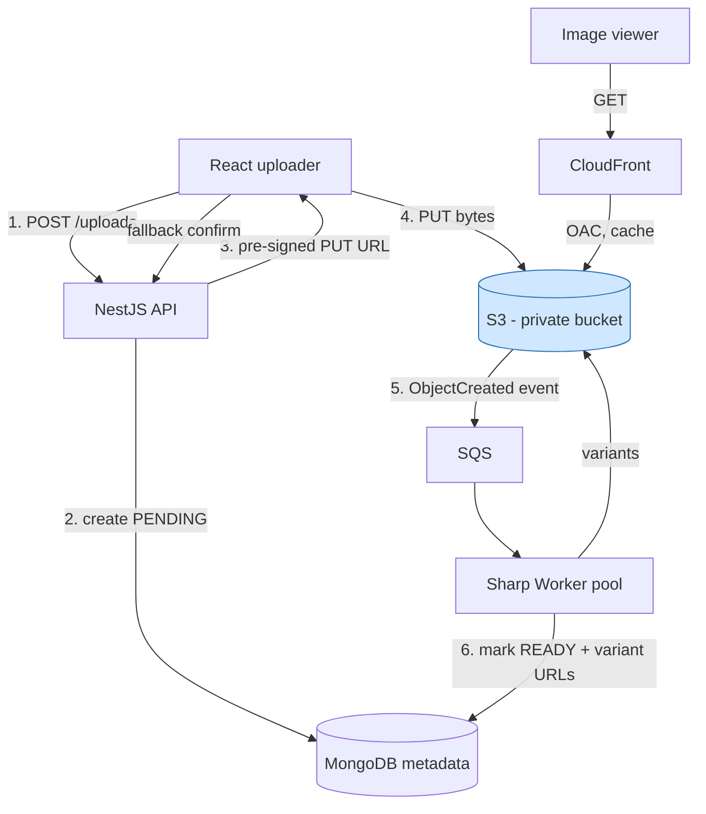

# 7. Image Upload Service

> **In one line:** Design a direct-to-S3 image upload service (Instagram/Imgur-class) using pre-signed
> URLs — the interview conversation, HLD, LLD with real NestJS + S3 + worker code, async processing,
> CDN delivery, and deep scaling + security.

> **Original prompt:** Design the flow for uploading images to S3 using pre-signed URLs from a Node.js backend.

---

## 1. The Interview Conversation

> **Interviewer:** "Design an image upload service. Users upload photos and we display them."
>
> **Candidate:** "First principle: should the file bytes flow through our application servers, or go
> directly to object storage? Proxying uploads through Node wastes bandwidth, ties up the event loop
> buffering large files, and caps throughput. I'd upload client → S3 directly using pre-signed URLs, so
> the backend only issues a signed token and never touches the bytes. Is that acceptable?"
>
> **Interviewer:** "Yes. How does the backend then know the upload happened?"
>
> **Candidate:** "That's the key subtlety of direct upload — I use a two-phase record. I create a metadata
> row as PENDING before issuing the URL, then confirm it via an S3 `ObjectCreated` event (primary,
> reliable) plus a client callback (fallback), flipping it to READY. Anything stuck PENDING is swept. Do we
> need thumbnails/resizing?"
>
> **Interviewer:** "Yes, multiple sizes, and we serve millions of image views."
>
> **Candidate:** "Then processing must be asynchronous — the S3 event enqueues a job, a worker generates
> variants with Sharp and writes them back, so upload latency is just the byte transfer. And since reads
> dominate massively, I serve everything through a CDN, not from the bucket per view. What are the security
> requirements — public or private images?"
>
> **Interviewer:** "Mostly public, some private. And we've been burned by malicious uploads before."
>
> **Candidate:** "So I enforce type and size server-side in the signed policy (not client-side, which is
> bypassable), verify the actual bytes are an image in the worker, strip EXIF, scan for malware, and keep
> the bucket private with CDN/signed reads. Private images get short-lived pre-signed GET URLs. Let me draw
> it."

**Signal:** the candidate leads with "don't proxy bytes," solves the confirmation problem with a two-phase
record + events, makes processing async, serves via CDN, and treats client-side validation as non-security.

---

## 2. Requirements

**Functional**

- Authenticated user uploads an image; later retrieves/displays it.
- Validate type + size; generate multiple sized variants (thumbnail/medium/full).
- Track each file's metadata and lifecycle (PENDING → READY/FAILED).

**Non-functional**

| Requirement | Target |
|---|---|
| **Throughput** | App servers never bottleneck on file bytes; uploads scale with S3 |
| **Read latency** | Images served from CDN edge, p99 < 50 ms globally |
| **Reliability** | Detect/clean abandoned uploads; processing retried with DLQ |
| **Security** | Server-side type/size; no public-bucket leaks; malware/EXIF handling |

**Math:** 1M uploads/day avg ~12/s (peak ~10×), each 3 MB = ~3 TB/day ingress. Proxying that through app
servers would demand huge bandwidth/memory; direct-to-S3 offloads all of it. Views: ~500M/day → CDN-served.

---

## 3. Recommended Tech Stack

| Layer | Choice | Why |
|---|---|---|
| **Framework** | **NestJS** (REST) | Small control-plane API: issue URL, confirm, manage metadata |
| **Object storage** | **AWS S3** | Durable, effectively unlimited concurrent PUTs; pre-signed URLs |
| **Async processing** | **SQS + worker** (or **BullMQ** on Redis) driven by **S3 event → Lambda/SNS** | Decouples processing from upload; retries + DLQ |
| **Image processing** | **Sharp** (libvips) | Fast, low-memory resize/transcode; strip EXIF; re-encode WebP/AVIF |
| **Metadata DB** | **MongoDB** (or Postgres) | Flexible metadata + variant map; lifecycle status |
| **CDN** | **CloudFront** (private bucket via OAC) | Edge-cached delivery; origin stays private |
| **Frontend** | **React** uploader | Requests URL, PUTs directly to S3, polls/subscribes for READY |

> **Why a queue + Sharp worker, not inline processing?** Resizing a 20 MP image is CPU/memory heavy;
> doing it in the request would block and cap throughput. Offloading to autoscaled workers keeps uploads
> instant and lets processing spikes drain from the queue.

---

## 4. High-Level Design (HLD)



**Control plane (NestJS):** issue signed URL, create/confirm metadata — small JSON requests only. **Data
plane:** bytes go client → S3 → workers → S3 → CDN, never through the API. This separation is the design.

---

## 5. Approaches, Patterns & Algorithms

### Approach A — Proxy upload through the API

`client → NestJS (buffer/stream) → S3`. Simple, but every byte transits the app; memory/bandwidth
pressure, poor throughput, event-loop stalls on large files. **Rejected** for anything beyond trivial scale.

### Approach B — Direct upload with pre-signed PUT URL (chosen)

Backend signs a URL scoped to one key/content-type for a few minutes; client PUTs directly to S3.
**Chosen** — offloads bytes, backend keeps control via the signature.

### Approach C — Pre-signed POST policy (chosen for hard limits)

`createPresignedPost` with conditions (`content-length-range`, `Content-Type`) so **S3 itself** rejects
oversized/wrong-type uploads — server-enforced, not client courtesy. Preferred when strict size caps matter.

### Multipart upload (large files)

For very large files/videos, use S3 **multipart upload** with per-part pre-signed URLs so the client can
upload in parallel chunks and resume on failure.

### Confirmation patterns

| Pattern | Reliability | Notes |
|---|---|---|
| Client callback (`/complete` + `headObject`) | depends on client staying online | fallback |
| **S3 event notification** (chosen primary) | reliable, server-driven | flips READY + enqueues processing |

---

## 6. Low-Level Design (LLD)

### 6.1 Module structure (NestJS)

```text
src/
├── uploads/
│   ├── uploads.controller.ts    # POST /uploads, POST /uploads/:id/complete
│   ├── uploads.service.ts       # sign URL, two-phase record
│   ├── s3.service.ts            # presign PUT/POST/GET, headObject
│   └── dto/create-upload.dto.ts
├── processing/
│   ├── processing.consumer.ts   # SQS/BullMQ consumer
│   └── image.processor.ts       # Sharp: variants, EXIF strip, validate bytes
├── images/
│   ├── images.repository.ts
│   └── image.model.ts
└── events/s3-event.controller.ts # S3 ObjectCreated webhook (or Lambda)
```

### 6.2 Metadata schema (MongoDB)

```typescript
const imageSchema = new Schema({
  userId:      { type: Types.ObjectId, ref: "User", required: true, index: true },
  key:         { type: String, required: true, unique: true },  // S3 object key
  bucket:      { type: String, required: true },
  contentType: { type: String, required: true },
  size:        { type: Number, default: 0 },
  status:      { type: String, enum: ["PENDING","READY","FAILED"], default: "PENDING", index: true },
  variants:    { type: Schema.Types.Mixed, default: {} },       // { thumb, medium, full } → CDN URLs
  width: Number, height: Number,
}, { timestamps: true });
```

### 6.3 Issue the pre-signed URL + create PENDING record

```typescript
// uploads.service.ts
const ALLOWED = ["image/jpeg", "image/png", "image/webp", "image/gif"];
const MAX_BYTES = 10 * 1024 * 1024;

async createUpload(user: AuthUser, dto: CreateUploadDto) {
  if (!ALLOWED.includes(dto.contentType)) throw new BadRequestException("Unsupported type");
  await this.quota.assertUnderLimit(user.id);                 // per-user quota

  const ext = extFor(dto.contentType);
  const key = `uploads/${user.id}/${randomUUID()}.${ext}`;    // server-generated key (never client filename)

  // presigned POST enforces max size server-side (S3 rejects oversize)
  const post = await this.s3.presignedPost(key, dto.contentType, MAX_BYTES, 300);
  const image = await this.repo.create({ userId: user.id, key, bucket: BUCKET,
                                         contentType: dto.contentType, status: "PENDING" });
  return { imageId: image.id, upload: post };                 // { url, fields }
}
```

```typescript
// s3.service.ts
presignedPost(key: string, contentType: string, maxBytes: number, expiresIn: number) {
  return createPresignedPost(this.client, {
    Bucket: BUCKET, Key: key, Expires: expiresIn,
    Conditions: [
      ["content-length-range", 1, maxBytes],                  // hard server-side size cap
      ["eq", "$Content-Type", contentType],
    ],
    Fields: { "Content-Type": contentType },
  });
}
```

### 6.4 Confirmation via S3 event (primary) + processing enqueue

```typescript
// events/s3-event.controller.ts  (invoked by S3 → Lambda/SNS/HTTP)
@Post("s3-events")
async onObjectCreated(@Body() evt: S3Event) {
  for (const rec of evt.Records) {
    const key = decodeURIComponent(rec.s3.object.key);
    await this.images.markUploaded(key, rec.s3.object.size);  // PENDING → UPLOADED (idempotent)
    await this.queue.add("process-image", { key });           // enqueue Sharp job
  }
}
```

### 6.5 Async processing worker (Sharp: validate + variants + EXIF strip)

```typescript
// processing/image.processor.ts
@Processor("process-image")
export class ImageProcessor {
  async process(job: Job<{ key: string }>) {
    const buf = await this.s3.getObject(job.data.key);

    const meta = await sharp(buf).metadata();                 // verify it's really an image
    if (!meta.format || !["jpeg","png","webp","gif"].includes(meta.format))
      return this.images.markFailed(job.data.key, "not-an-image");

    const variants: Record<string, string> = {};
    for (const [name, w] of [["thumb",150],["medium",600],["full",1600]] as const) {
      const out = await sharp(buf)
        .rotate()                                             // honor orientation, then...
        .resize({ width: w, withoutEnlargement: true })
        .withMetadata({ exif: {} })                           // STRIP EXIF/GPS (privacy)
        .webp({ quality: 82 })
        .toBuffer();
      const vkey = job.data.key.replace(/\.\w+$/, `_${name}.webp`);
      await this.s3.putObject(vkey, out, "image/webp");
      variants[name] = cdnUrl(vkey);
    }
    await this.images.markReady(job.data.key, { variants, width: meta.width, height: meta.height });
  }
}
```

### 6.6 Sequence diagram

```mermaid
sequenceDiagram
    participant C as React
    participant N as NestJS
    participant DB as MongoDB
    participant S as S3
    participant Q as SQS
    participant W as Sharp Worker
    C->>N: POST /uploads (type, size)
    N->>N: validate + quota + gen key
    N->>DB: create PENDING
    N-->>C: presigned POST (url, fields)
    C->>S: POST bytes directly
    S->>Q: ObjectCreated event
    Q->>W: process-image {key}
    W->>S: getObject; validate bytes
    W->>S: put thumb/medium/full (WebP, EXIF stripped)
    W->>DB: markReady + variant URLs
    C->>N: (fallback) POST /uploads/:id/complete
```


---

## 7. Production-Ready Implementation Notes

- **Two-phase record** (PENDING → READY) makes direct upload observable: the row exists before the bytes,
  confirmation flips it after, and orphans are detectable.
- **Idempotent transitions:** the S3 event and the client callback can both fire; make `markUploaded`/
  `markReady` idempotent (e.g. only advance state forward) so they can't double-process.
- **Serve variants, not originals:** a feed thumbnail should download the 150 px WebP, not a 5 MB original —
  huge bandwidth/latency savings.
- **Store bytes in S3, metadata in the DB** — never the image in the database.

---

## 8. Scaling the System (in detail)

**8.1 Uploads scale with S3, not your fleet.** S3 absorbs effectively unlimited concurrent PUTs, so app
servers — handling only small JSON — never bottleneck on upload bandwidth or size.

**8.2 Workers scale off the queue.** A processing backlog just means adding workers; the queue buffers
spikes and provides retries + DLQ for poison messages.

```typescript
// bounded concurrency per worker; autoscale worker count on queue depth
new Worker("process-image", handler, { concurrency: 5, connection: redis });
// alarm: SQS ApproximateNumberOfMessages high → scale out workers
```

**8.3 CDN for reads (the real traffic).** Reads dwarf uploads; CloudFront caches variants at the edge with
a private-bucket origin (Origin Access Control), so a viral image is served from edge nodes worldwide, not
your origin. See [CDN](../01-core-infrastructure-concepts/07-cdn.md).

**8.4 Multipart + resumable** for large files: per-part pre-signed URLs let the client upload chunks in
parallel and resume after a failure.

**8.5 Storage cost tiering.** S3 lifecycle rules move cold/rarely accessed images to cheaper storage
classes; delete orphaned/expired objects automatically. See
[Object Storage](../02-data-and-storage-concepts/13-object-storage.md) and
[Message Queue](../04-messaging-and-communication-concepts/01-message-queue.md).

**8.6 Cleanup of abandoned uploads.** A scheduled job (or S3 lifecycle rule) removes stale PENDING rows and
any orphaned partial objects past a timeout.

---

## 9. Securing the System (in detail)

**9.1 Server-side type & size (not client-side).** Client checks are trivially bypassed by hitting the
signed URL directly. The presigned POST `content-length-range` + `eq $Content-Type` conditions make **S3**
reject violations, and the worker re-verifies the actual bytes.

**9.2 Verify content, don't trust the declared type.** In the worker, use Sharp/magic-byte detection to
confirm the file really is a supported image; reject spoofed content and guard against **decompression
bombs** (tiny files that expand to gigapixels) with pixel-count limits.

```typescript
const meta = await sharp(buf).metadata();
if ((meta.width ?? 0) * (meta.height ?? 0) > 100_000_000)   // ~100 MP cap
  return this.images.markFailed(key, "image-too-large");
```

**9.3 Never trust the client filename.** Generate the key as a UUID under the user's prefix to prevent path
traversal (`../`), object overwrite, or extension spoofing.

**9.4 Private bucket + CDN/signed reads.** Block public access at the account level; serve public images via
CloudFront with Origin Access Control (bucket stays private). Private images get short-lived pre-signed GET
URLs per authorized request.

```typescript
async viewUrl(image: Image, viewer: AuthUser) {
  if (image.visibility === "PUBLIC") return cdnUrl(image.key);
  if (image.userId !== viewer.id && !viewer.canView(image)) throw new ForbiddenException();
  return this.s3.presignedGet(image.key, 300);              // 5-min signed GET for private
}
```

**9.5 Strip EXIF/GPS** during processing so photos don't leak users' location. **Short URL expiry** (minutes)
limits reuse if a signed URL leaks. **Malware scanning** (ClamAV/managed) for user-facing content.

**9.6 Abuse controls.** Require auth to get a URL; enforce per-user quotas and rate limits (see
[Rate Limiter](./05-rate-limiter-middleware.md)) so no one can flood storage.

---

## 10. Observability & Reliability

- **Metrics:** upload success rate, PENDING→READY latency, processing queue depth + age, worker failure/DLQ
  rate, CDN hit ratio, per-user storage usage.
- **Reliability:** DLQ for poison images; retry with backoff; idempotent state transitions so event +
  callback don't collide; sweep orphaned PENDING rows.
- **Alerts:** queue age rising (workers behind), DLQ growth (bad inputs / worker bug), CDN hit-ratio drop.

---

## 11. Trade-offs & Pitfalls

- **Direct upload = backend never sees bytes** — you *must* confirm (event/callback) or accumulate orphans.
- **Client-side size/type checks are not security** — enforce in the signed policy + re-verify bytes.
- **Trusting the client filename** invites path/extension abuse — generate the key.
- **Public buckets** are a top leak cause — private bucket + CDN OAC / signed GET.
- **Synchronous processing** blocks and caps throughput — offload to workers with retries/DLQ.
- **Trusting declared `Content-Type`** lets non-images/bombs through — validate bytes + pixel caps.
- **Long signed-URL expiry** widens leak window — keep it minutes.

---

## 12. Interview Q&A (detailed)

- **Why not just upload through your API to S3?**
  Because every byte would travel client → app server → S3, doubling bandwidth and forcing the server to
  buffer large files in memory or on disk, which ties up the event loop and sharply limits concurrent
  uploads. With a pre-signed URL the app server only issues a small signed token and the client streams
  bytes straight to S3, which is built for massive concurrent uploads. The app tier stays cheap and
  stateless, and upload throughput scales with S3 rather than with my server fleet.

- **The client uploads directly to S3 — how do you know it succeeded?**
  I use a two-phase record. I create the metadata row as PENDING before issuing the URL, then confirm
  completion primarily via an S3 `ObjectCreated` event notification, which is reliable because it's
  server-driven and doesn't depend on the client staying online, and as a fallback the client calls a
  `complete` endpoint where I `headObject` to verify existence and size. On confirmation I flip the record
  to READY and enqueue processing. Anything left PENDING past a timeout is swept as abandoned. I make these
  transitions idempotent so the event and callback can't double-process.

- **How do you generate thumbnails without slowing uploads, and how does it scale?**
  Asynchronously. The `ObjectCreated` event enqueues a job, and a pool of Sharp workers generates the sized
  variants, strips EXIF, re-encodes to WebP, and validates the bytes, then writes derivatives back to S3 and
  marks the record READY. Upload latency is therefore just the byte transfer. It scales by adding workers:
  the queue buffers spikes and provides retries and a dead-letter queue for poison images, and I autoscale
  worker count on queue depth. This keeps uploads instant while processing catches up independently.

- **How do you serve images efficiently to millions of viewers?**
  Through a CDN. Reads vastly outnumber uploads, so I cache the variants at CloudFront's edge with a private
  S3 origin via Origin Access Control, meaning a viral image is served from edge nodes worldwide instead of
  hitting my origin per view. I serve appropriately sized variants — a feed uses the 150 px WebP thumbnail,
  not the multi-megabyte original — which cuts bandwidth and latency dramatically. Public images get a
  stored CDN URL; private ones get short-lived pre-signed GET URLs.

- **How do you enforce that only valid, safe images under a size limit get in?**
  I don't rely on client-side checks because they're bypassable — a client can hit the signed URL directly.
  I bind the allowed content type and a `content-length-range` into a presigned POST policy so S3 itself
  rejects the wrong type or an oversized file, and then in the worker I verify the actual bytes are a
  supported image via magic-byte detection, cap the pixel count to defeat decompression bombs, strip EXIF/GPS
  for privacy, and scan for malware. I also generate the object key server-side as a UUID rather than
  trusting the client filename, which prevents path traversal and object overwrite.

- **What's your bucket and access-control posture?**
  The bucket is private with public access blocked at the account level — public buckets are one of the most
  common data-leak causes. Public images are delivered through CloudFront with Origin Access Control so the
  bucket stays private; private images require an authorization check and then get a short-lived pre-signed
  GET URL per request. Signed upload URLs expire in minutes to limit reuse if leaked, uploads require
  authentication and are subject to per-user quotas and rate limiting, and I strip location metadata so
  images don't leak where a user was.

- **How do you handle very large files or flaky mobile connections?**
  S3 multipart upload with per-part pre-signed URLs. The client splits the file into chunks and uploads them
  in parallel, and can retry or resume individual parts after a network failure without restarting the whole
  upload. This is essential for video or high-resolution originals and for mobile clients on unreliable
  networks, and it composes with the same two-phase confirmation model.

---

## Cheat Sheet

```text
1. PRINCIPLE   Never proxy bytes — client uploads direct to S3 via pre-signed URL
2. STACK       NestJS + S3 + SQS/BullMQ + Sharp worker + CloudFront(OAC) + Mongo + React
3. FLOW        POST /uploads → PENDING record → presigned POST → client PUTs → confirm → READY
4. CONFIRM     S3 ObjectCreated event (primary) + client callback (fallback), idempotent
5. PROCESS     Async Sharp worker: variants + EXIF strip + validate bytes; retries/DLQ
6. SERVE       CDN (private bucket + OAC) for public; pre-signed GET for private; serve variants
7. SECURITY    Server-side type/size (POST policy); verify bytes + pixel cap; UUID key; no public bucket
8. SCALE       Uploads scale with S3; workers scale on queue; multipart for large files; lifecycle tiering
```

---

_Notes: (add your own content here)_
