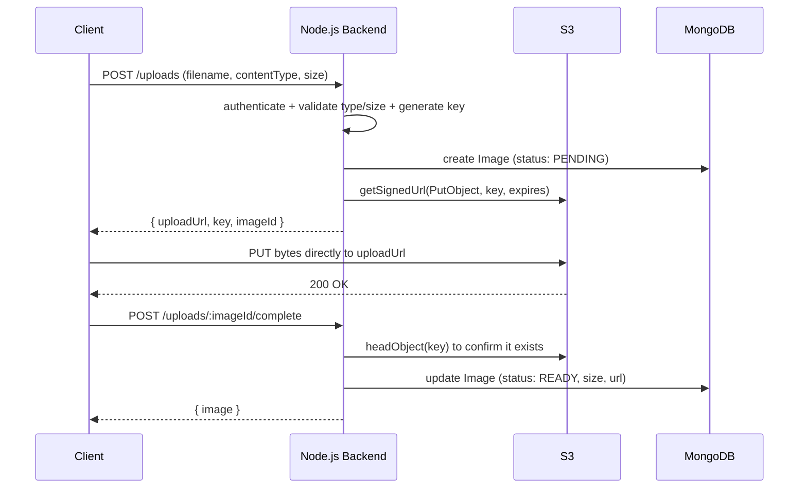

# 7. Image Upload Service

> **In one line:** Design a direct-to-S3 image upload flow using **pre-signed URLs** — so large files
> never pass through your Node.js server, while the backend still controls who can upload what, and
> tracks each file's metadata and lifecycle.

> **Original prompt:** Design the flow for uploading images to S3 using pre-signed URLs from a Node.js backend.

## Overview

The naive design proxies uploads through the API: client → Node → S3. That wastes bandwidth, ties up
Node event-loop/memory on large files, and doesn't scale. The better pattern is **direct upload with
pre-signed URLs**:

1. The client asks the backend for permission to upload.
2. The backend returns a short-lived, cryptographically signed URL scoped to one object.
3. The client uploads the bytes **directly to S3** using that URL.
4. The backend records metadata and confirms the object exists.

The backend stays in control (auth, validation, metadata) without ever touching the file bytes.

## Step 0: Clarify the Problem

- **What files/sizes?** Image types and a max size — enforced in the signed policy, not just client-side.
- **Public or private?** Public read via CDN, or private with signed download URLs?
- **Processing needed?** Thumbnails/resizing/transcoding — sync or async?
- **Who can upload?** Authenticated users only; quotas per user.

## What Is a Pre-Signed URL?

A pre-signed URL embeds temporary, scoped credentials in the query string. It grants a **specific
operation** (`PUT`) on a **specific object key** for a **limited time** — anyone with the URL can
perform exactly that action until it expires. The backend generates it using its AWS credentials; the
client never sees those credentials.

## Upload Flow



Two round trips to the backend (request URL, confirm), but the **heavy byte transfer goes straight to
S3**, bypassing Node entirely.

## Generating the Pre-Signed URL

```typescript
import { S3Client, PutObjectCommand } from "@aws-sdk/client-s3";
import { getSignedUrl } from "@aws-sdk/s3-request-presigner";
import { randomUUID } from "crypto";

const s3 = new S3Client({ region: process.env.AWS_REGION });

async function createUpload(userId: string, filename: string, contentType: string) {
  if (!ALLOWED_TYPES.includes(contentType)) throw new Error("Unsupported type");

  const ext = filename.split(".").pop();
  const key = `uploads/${userId}/${randomUUID()}.${ext}`; // never trust client filename

  const command = new PutObjectCommand({
    Bucket: process.env.S3_BUCKET,
    Key: key,
    ContentType: contentType, // bind the URL to this content type
  });

  const uploadUrl = await getSignedUrl(s3, command, { expiresIn: 300 }); // 5 min
  return { uploadUrl, key };
}
```

For finer control (enforcing a **max size** server-side, required headers), use a **presigned POST
policy** (`createPresignedPost`) whose conditions include `content-length-range` — S3 then rejects
oversized or wrong-type uploads directly.

## Metadata Schema

The object bytes live in [object storage](../02-data-and-storage-concepts/13-object-storage.md); the
**database stores metadata and lifecycle state**, never the image itself.

```typescript
const imageSchema = new Schema(
  {
    userId: { type: Types.ObjectId, ref: "User", required: true, index: true },
    key: { type: String, required: true, unique: true }, // S3 object key
    bucket: { type: String, required: true },
    contentType: { type: String, required: true },
    size: { type: Number, default: 0 },
    status: {
      type: String,
      enum: ["PENDING", "READY", "FAILED"],
      default: "PENDING",
      index: true,
    },
    url: { type: String, default: null },       // CDN/public URL when READY
    width: Number,
    height: Number,
  },
  { timestamps: true },
);
```

The **two-phase status** (`PENDING` → `READY`) matters: the DB row is created *before* the upload, then
confirmed *after*, so you can detect and clean up uploads that were requested but never completed.

## Why the Confirmation Step Matters

Because the client uploads directly to S3, your backend doesn't automatically know the upload
succeeded. Two ways to close the loop:

- **Client confirms:** client calls `POST /uploads/:id/complete`; backend does `headObject` to verify.
- **S3 event notification:** S3 fires an event (via Lambda/SQS/SNS) on `s3:ObjectCreated`, and the
  backend flips the record to `READY`. More reliable — doesn't depend on the client.

Orphaned `PENDING` records (URL issued, upload abandoned) are swept by a background job or a bucket
lifecycle rule.

## Serving Images Back

- **Public images:** serve via a **CDN** in front of the bucket for low latency (see
  [CDN](../01-core-infrastructure-concepts/07-cdn.md)); store the CDN URL on the record.
- **Private images:** generate a short-lived **pre-signed GET URL** on demand so only authorized users
  can view them.

## Post-Processing (Thumbnails, Resizing)

Do it **asynchronously** so the upload path stays fast: the `ObjectCreated` event enqueues a job
([message queue](../04-messaging-and-communication-concepts/01-message-queue.md)); a worker generates
thumbnails/variants, writes them back to S3, and updates the record with dimensions and variant URLs.

## Tips

- Never proxy bytes through Node — issue a **pre-signed URL** and upload **client → S3** directly.
- **Generate the object key server-side** (UUID); never trust the client's filename.
- Bind the URL to a **content type** and short **expiry**; use a **POST policy** to cap size server-side.
- Use a **two-phase record** (`PENDING` → `READY`) and confirm via client callback or **S3 event**.
- Serve public images through a **CDN**; use **pre-signed GET** URLs for private ones.
- Do **thumbnailing/processing asynchronously** off an S3 event.

## Trade-offs & Pitfalls

- **Direct upload means the backend doesn't see the bytes** — you must confirm completion (callback or event) or you'll get orphaned records.
- **Client-side size/type checks are not security** — enforce them in the signed policy so S3 rejects violations.
- **Trusting the client filename** risks path/extension abuse — always generate the key yourself.
- **Long URL expiry** widens the window for a leaked URL to be reused — keep it short (minutes).
- **Public buckets** are a classic misconfiguration/leak source — prefer CDN + private bucket + signed reads.
- **Synchronous image processing** blocks the request and hurts throughput — offload to a worker.

## System Design Cheat Sheet

```text
1. PATTERN     Pre-signed URL: client uploads direct to S3
2. REQUEST     POST /uploads → validate → key(UUID) → signed PUT URL
3. RECORD      DB metadata, status PENDING (bytes live in S3)
4. UPLOAD      Client PUTs bytes straight to S3
5. CONFIRM     Client callback or S3 event → status READY
6. SERVE       CDN for public; pre-signed GET for private
7. PROCESS     Async thumbnails via queue off ObjectCreated
8. CLEANUP     Sweep orphaned PENDING via job / lifecycle rule
```

## Interview Questions & Answers

### A. Core Design

- **Why use pre-signed URLs instead of proxying?** — Bytes go client→S3 directly, saving Node bandwidth/memory and scaling better.
- **What is a pre-signed URL?** — A time-limited, signed URL granting one specific operation on one object.
- **Who generates it and with what?** — The backend, using its AWS credentials; the client never sees them.
- **What does the backend still control?** — Auth, validation, key generation, metadata, and lifecycle.

### B. Flow & Data

- **Walk through the upload flow.** — Request URL → create PENDING record → client PUTs to S3 → confirm → mark READY.
- **What do you store in the database?** — Metadata and status (key, bucket, contentType, size, status, url) — never the bytes.
- **Why a PENDING→READY status?** — To track and clean up uploads that were requested but never finished.
- **How do you generate the object key?** — Server-side UUID under a user prefix; never the client filename.

### C. Validation & Security

- **How do you enforce file type/size?** — Bind content type and use a presigned POST policy with `content-length-range`.
- **Why isn't client-side validation enough?** — It's bypassable; the signed policy makes S3 enforce it.
- **How long should the URL be valid?** — Short (a few minutes) to limit misuse if leaked.
- **Public or private buckets?** — Prefer private bucket + CDN/signed reads; public buckets risk leaks.

### D. Completion, Serving, Processing

- **How does the backend know the upload succeeded?** — A client confirm callback (`headObject`) or an S3 `ObjectCreated` event.
- **Which is more reliable?** — S3 event notifications, since they don't depend on the client.
- **How do you serve images back?** — CDN for public images; short-lived pre-signed GET URLs for private ones.
- **How do you make thumbnails?** — Asynchronously: an S3 event enqueues a job; a worker processes and updates the record.
- **How do you clean up abandoned uploads?** — A background sweep of stale PENDING records or an S3 lifecycle rule.

---

_Notes: (add your own content here)_
