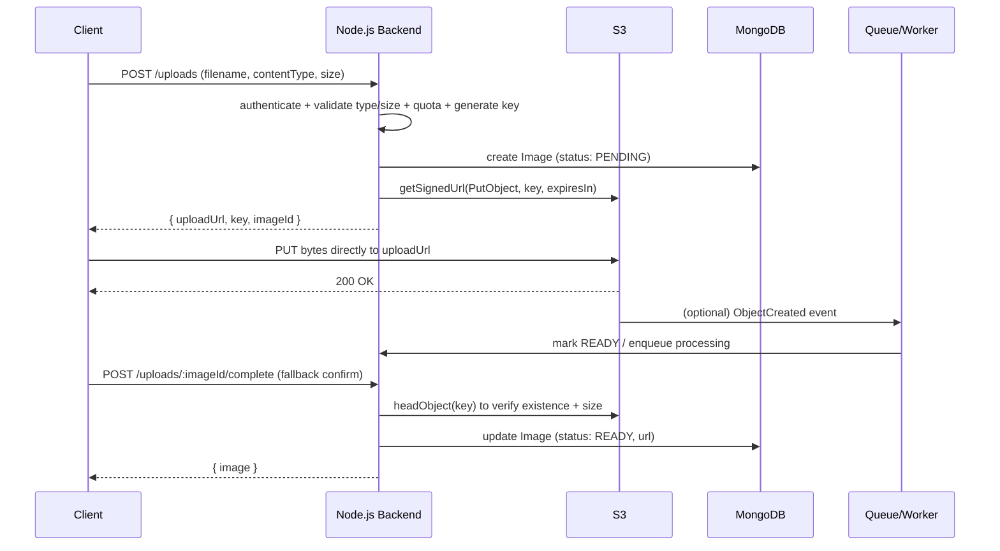

# 7. Image Upload Service

> **In one line:** Design a direct-to-S3 image upload flow using **pre-signed URLs** so large files never
> pass through your Node.js server — and cover the confirmation, processing, CDN delivery, security, and
> scaling that a real service (Instagram/Imgur-style) needs.

> **Original prompt:** Design the flow for uploading images to S3 using pre-signed URLs from a Node.js backend.

## Overview

The naive design proxies uploads through the API: client → Node → S3. That burns bandwidth twice, ties
up the event loop and memory buffering large files, and caps throughput on your servers. The production
pattern is **direct upload with pre-signed URLs**:

1. The client asks the backend for permission to upload.
2. The backend returns a short-lived, cryptographically signed URL scoped to one object.
3. The client uploads the bytes **directly to S3** with that URL.
4. The backend records metadata and confirms the object exists.

The backend keeps full control (auth, validation, metadata, quotas) without ever touching the bytes.

## Real-World Context

- **Instagram, Imgur, Dropbox, Slack** all upload media directly from client to object storage (S3/GCS)
  and process derivatives (thumbnails, transcodes) asynchronously — the app servers never stream the raw
  file.
- **Profile pictures, product images, chat attachments** are the everyday version of this problem; the
  same pre-signed pattern applies whether it's one avatar or a million product photos.
- **CDN delivery** is universal: uploaded images are served from an edge cache, not from the origin bucket
  on every view, because reads vastly outnumber uploads.

The interview signal is knowing *why* you don't proxy bytes through the app, and how you close the loop
(confirm the upload) when the client talks to S3 directly.

## Requirements

**Functional**

- Let an authenticated user upload an image and later retrieve/display it.
- Validate type and size; generate thumbnails/derivatives.
- Track each file's metadata and lifecycle (pending → ready).

**Non-functional**

- **Performance/throughput:** app servers must not bottleneck on file bytes; uploads scale independently.
- **Reliability:** detect and clean up uploads that were requested but never completed.
- **Security:** enforce type/size server-side, prevent unauthorized access and abuse; no public bucket leaks.
- **Cost/scalability:** cheap storage, CDN-served reads, async processing.

## What Is a Pre-Signed URL?

A pre-signed URL embeds temporary, scoped credentials in the query string. It grants a **specific
operation** (e.g. `PUT`) on a **specific object key** for a **limited time** — anyone holding it can do
exactly that until it expires. The backend generates it using its AWS credentials; the client never sees
those credentials, and can't do anything the URL doesn't explicitly permit.

## Upload Flow



Two round trips to the backend (request URL, confirm), but the **heavy byte transfer goes straight to
S3**, bypassing Node entirely.

## Generating the Pre-Signed URL

```typescript
import { S3Client, PutObjectCommand } from "@aws-sdk/client-s3";
import { getSignedUrl } from "@aws-sdk/s3-request-presigner";
import { randomUUID } from "crypto";

const s3 = new S3Client({ region: process.env.AWS_REGION });
const ALLOWED = ["image/jpeg", "image/png", "image/webp", "image/gif"];

async function createUpload(userId: string, filename: string, contentType: string) {
  if (!ALLOWED.includes(contentType)) throw new Error("Unsupported type");

  const ext = filename.split(".").pop();
  const key = `uploads/${userId}/${randomUUID()}.${ext}`; // NEVER trust the client filename

  const command = new PutObjectCommand({
    Bucket: process.env.S3_BUCKET,
    Key: key,
    ContentType: contentType,       // bind the URL to this content type
  });

  const uploadUrl = await getSignedUrl(s3, command, { expiresIn: 300 }); // 5 minutes
  return { uploadUrl, key };
}
```

For stronger server-side enforcement (a hard **max size**, required headers), use a **presigned POST
policy** (`createPresignedPost`) whose conditions include `content-length-range` — S3 then rejects
oversized or wrong-type uploads itself, so the limit isn't just a client-side courtesy.

## Metadata Schema

Bytes live in [object storage](../02-data-and-storage-concepts/13-object-storage.md); the **database
stores metadata and lifecycle state**, never the image.

```typescript
const imageSchema = new Schema(
  {
    userId:      { type: Types.ObjectId, ref: "User", required: true, index: true },
    key:         { type: String, required: true, unique: true }, // S3 object key
    bucket:      { type: String, required: true },
    contentType: { type: String, required: true },
    size:        { type: Number, default: 0 },
    status: {
      type: String,
      enum: ["PENDING", "READY", "FAILED"],
      default: "PENDING",
      index: true,
    },
    url:      { type: String, default: null }, // CDN/public URL once READY
    variants: { type: Schema.Types.Mixed, default: {} }, // thumbnail/medium URLs
    width:  Number,
    height: Number,
  },
  { timestamps: true },
);
```

The **two-phase status** (`PENDING` → `READY`) is the crux: the row is created *before* the upload and
confirmed *after*, so you can detect and sweep uploads that were requested but never completed.

## Closing the Loop: Why Confirmation Is Needed

Because the client uploads straight to S3, your backend doesn't automatically know it succeeded. Two ways
to confirm, best used together:

- **S3 event notification (reliable):** S3 fires `s3:ObjectCreated` (via Lambda/SQS/SNS) when the object
  lands; a handler flips the record to `READY` and enqueues processing. This doesn't depend on the client
  staying online.
- **Client callback (fallback):** the client calls `POST /uploads/:id/complete`; the backend does
  `headObject` to verify the object exists and matches expected size/type.

Orphaned `PENDING` records (URL issued, upload abandoned) are swept by a background job or a bucket
lifecycle rule that also deletes stray objects.

## Post-Processing (Thumbnails, Transcoding)

Do it **asynchronously** so the upload path stays fast: the `ObjectCreated` event enqueues a job on a
[message queue](../04-messaging-and-communication-concepts/01-message-queue.md); a worker generates
thumbnails/variants (and can strip EXIF, re-encode to WebP, scan for malware), writes them back to S3,
and updates the record with dimensions and variant URLs. This decouples upload latency from processing
cost and lets you scale workers independently.

## Serving Images Back

- **Public images:** serve through a **CDN** in front of the bucket for low latency and to offload the
  origin (see [CDN](../01-core-infrastructure-concepts/07-cdn.md)); store the CDN URL on the record.
  Reads dominate, so CDN caching is where most of the cost/latency win is.
- **Private images:** generate a short-lived **pre-signed GET URL** on demand so only authorized users can
  view them; never make the bucket public.

## Performance

- **Offload byte transfer to S3/CDN:** app servers only handle small JSON requests (issue URL, confirm),
  so their throughput isn't tied to image size or count.
- **CDN for reads:** cache derivatives at the edge; a viral image is served from edge nodes, not your origin.
- **Async processing:** thumbnailing off the request path keeps upload latency low and absorbs spikes via
  the queue.
- **Right-size derivatives:** generate and serve appropriately sized variants (thumbnail/medium/full) so
  clients don't download full-resolution images for a list view.

## Scalability

- **Uploads scale with S3, not your fleet** — S3 handles effectively unlimited concurrent PUTs, so you
  don't provision app servers for upload bandwidth.
- **Workers scale horizontally** off the queue; a backlog of processing jobs just adds workers.
- **Storage tiering:** move cold/rarely accessed images to cheaper storage classes via lifecycle rules.
- **Key layout:** randomized/UUID keys under a user prefix distribute well; avoid sequential prefixes that
  can hotspot (less critical on modern S3, but good hygiene).

## Security

- **Enforce type/size on the server, not the client.** Bind `ContentType` in the signed URL and use a
  presigned POST `content-length-range` so S3 rejects violations — client-side checks are trivially
  bypassed by hitting the URL directly.
- **Never trust the client filename** — generate the key yourself (UUID) to prevent path traversal,
  overwriting others' objects, or extension spoofing.
- **Keep the bucket private.** Public buckets are a classic data-leak source; serve via CDN with a signed
  origin or via pre-signed GET URLs. Block public ACLs at the account level.
- **Short URL expiry** (minutes) limits the damage if a signed URL leaks.
- **Validate the content is actually an image** (magic-byte/`Content-Type` sniffing in the worker, not
  just the declared type) and strip EXIF/GPS metadata for privacy.
- **Abuse controls:** per-user upload quotas and rate limiting (see
  [Rate Limiter](./05-rate-limiter-middleware.md)); scan for malware/known-bad hashes; require auth to get
  a URL. Guard against "decompression bomb" images that expand hugely when processed.

## Reliability & Edge Cases

- **Abandoned uploads:** the `PENDING`→`READY` model plus a sweep job / S3 lifecycle rule cleans up rows
  and objects that never completed.
- **Duplicate/retry uploads:** the unique `key` and idempotent confirm endpoint make client retries safe.
- **Processing failure:** mark `FAILED`, retry with backoff via the queue's retry/DLQ; don't leave the
  record stuck in `PENDING`.
- **Event vs callback race:** design the transition to `READY` to be idempotent so the S3 event and the
  client callback can't double-process.

## Tips

- Never proxy bytes through Node — issue a **pre-signed URL** and upload **client → S3** directly.
- **Generate the object key server-side** (UUID); never trust the client's filename.
- Bind the URL to a **content type** and short **expiry**; use a **POST policy** to cap size server-side.
- Use a **two-phase record** (`PENDING`→`READY`) and confirm via **S3 event** (primary) + client callback.
- Serve public images via **CDN**; use **pre-signed GET** for private ones; keep the bucket private.
- Do **thumbnailing/scanning asynchronously** off an S3 event, with retries/DLQ.

## Trade-offs & Pitfalls

- **Direct upload means the backend never sees the bytes** — you *must* confirm completion (event or
  callback) or you accumulate orphaned records.
- **Client-side size/type checks are not security** — enforce them in the signed policy.
- **Trusting the client filename** invites path/extension abuse — always generate the key.
- **Long URL expiry** widens the reuse window if a URL leaks — keep it short.
- **Public buckets** are a top misconfiguration/leak cause — private bucket + CDN/signed reads.
- **Synchronous image processing** blocks the request and caps throughput — offload to workers.
- **Trusting the declared `Content-Type`** lets a non-image (or malicious payload) through — verify bytes.

## System Design Cheat Sheet

```text
1. PATTERN     Pre-signed URL: client uploads direct to S3 (no proxy)
2. REQUEST     POST /uploads → auth + validate + quota → key(UUID) → signed PUT URL
3. RECORD      DB metadata, status PENDING (bytes live in S3)
4. UPLOAD      Client PUTs bytes straight to S3
5. CONFIRM     S3 ObjectCreated event (primary) + client callback (fallback)
6. PROCESS     Async worker off a queue: thumbnails, EXIF strip, malware scan
7. SERVE       CDN for public; pre-signed GET for private; private bucket
8. SECURITY    Server-side type/size (POST policy); no client filename; short expiry
9. CLEANUP     Sweep orphaned PENDING via job / S3 lifecycle rule
```

## Interview Questions & Answers

### A. Core Design

- **Why use pre-signed URLs instead of proxying the upload through your API?**
  Proxying means every byte travels client → app server → S3, doubling bandwidth, and the app server has to
  buffer large files in memory or on disk, which ties up the event loop and caps how many concurrent
  uploads it can handle. With a pre-signed URL the app server only issues a small signed token and the
  client streams bytes straight to S3, which is built for massive concurrent uploads. So the app tier stays
  cheap and stateless while upload throughput scales with S3, not with my fleet.

- **What is a pre-signed URL and what stops it being abused?**
  It's a URL with temporary, signed credentials in the query string that authorize exactly one operation on
  one object key for a short time. The client can only do what the URL permits — a `PUT` to that key — and
  nothing else, and it expires in minutes. The backend generates it with its own AWS credentials, which the
  client never sees, so I keep control of who can upload and where while delegating only the byte transfer.

- **The client uploads directly to S3 — how does your backend know it succeeded?**
  I use a two-phase record: I create the DB row as `PENDING` before handing out the URL, then move it to
  `READY` on confirmation. Confirmation comes primarily from an S3 `ObjectCreated` event notification,
  which is reliable because it doesn't depend on the client staying online, and as a fallback the client
  calls a `complete` endpoint where I do a `headObject` to verify the object exists and matches the
  expected size. Anything left `PENDING` past a timeout is swept as an abandoned upload.

### B. Data & Processing

- **What do you store in the database versus S3?**
  S3 stores the actual bytes; the database stores only metadata and lifecycle — the object key, bucket,
  content type, size, status, the CDN URL once ready, variant URLs, and dimensions. The database should
  never hold the image itself; it's the index and state machine over objects that live in cheap, scalable
  object storage.

- **How do you generate thumbnails without slowing the upload?**
  Asynchronously. The `ObjectCreated` event enqueues a job on a message queue, and a pool of workers
  generates the thumbnail and other variants, strips EXIF, optionally re-encodes to WebP and scans for
  malware, writes the derivatives back to S3, and updates the record. This keeps upload latency to just the
  byte transfer, lets processing spikes be absorbed by the queue, and lets me scale workers independently
  from the API.

- **How do you serve the images back efficiently?**
  Through a CDN. Reads vastly outnumber uploads, so I cache images (and their sized variants) at the edge,
  which cuts latency for users worldwide and offloads the origin bucket. Public images get a stored CDN
  URL; private images get a short-lived pre-signed GET URL generated per authorized request, and the bucket
  itself stays private so nothing is exposed directly.

### C. Security

- **How do you enforce that only valid images under a size limit get uploaded?**
  I don't rely on client-side checks because a client can bypass them by hitting the pre-signed URL
  directly. Instead I bind the allowed `Content-Type` into the signed URL and use a presigned POST policy
  with a `content-length-range` condition, so S3 itself rejects a wrong type or an oversized file. Then in
  the async worker I verify the actual bytes are an image (magic-byte sniffing, not just the declared type)
  and reject anything suspicious, including decompression-bomb images.

- **Why not trust the client's filename, and how do you name objects?**
  A client-supplied filename can contain path traversal (`../`), collide with or overwrite another user's
  object, or spoof an extension. I generate the object key server-side as a UUID under the user's prefix
  (`uploads/<userId>/<uuid>.<ext>`), so keys are unique, unpredictable, and safely scoped per user. The
  original filename, if I need it, is stored as metadata, not used as the key.

- **What bucket-level and access protections do you apply?**
  The bucket is private with public access blocked at the account level — public buckets are one of the
  most common data-leak causes. Reads go through a CDN with a signed/authorized origin or through
  short-lived pre-signed GET URLs. Signed upload URLs expire in minutes to limit reuse if leaked, uploads
  require authentication and are subject to per-user quotas and rate limiting to prevent abuse, and the
  worker strips GPS/EXIF metadata to protect user privacy.

### D. Reliability & Scale

- **How do you handle uploads that are started but never finished?**
  They stay as `PENDING` records with no corresponding confirmed object. A background sweep job (or an S3
  lifecycle rule) deletes stale `PENDING` rows past a timeout and cleans up any orphaned partial objects.
  Because the transition to `READY` is idempotent, a late client callback after the S3 event has already
  marked it ready is harmless.

- **How does this architecture scale, and where are the bottlenecks?**
  Uploads scale with S3, which absorbs effectively unlimited concurrent PUTs, so my app servers — handling
  only small JSON requests — never bottleneck on file size or count. Processing scales by adding workers
  off the queue, so a backlog just means more workers, not slower uploads. Reads scale via the CDN. The
  bottlenecks I'd watch are the processing worker pool during upload spikes (handled by the queue buffering
  and autoscaling workers) and storage cost, which I manage with lifecycle rules that tier cold images to
  cheaper storage classes.

---

_Notes: (add your own content here)_
