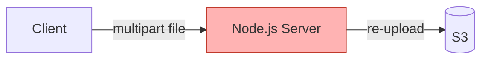
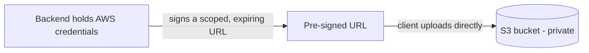
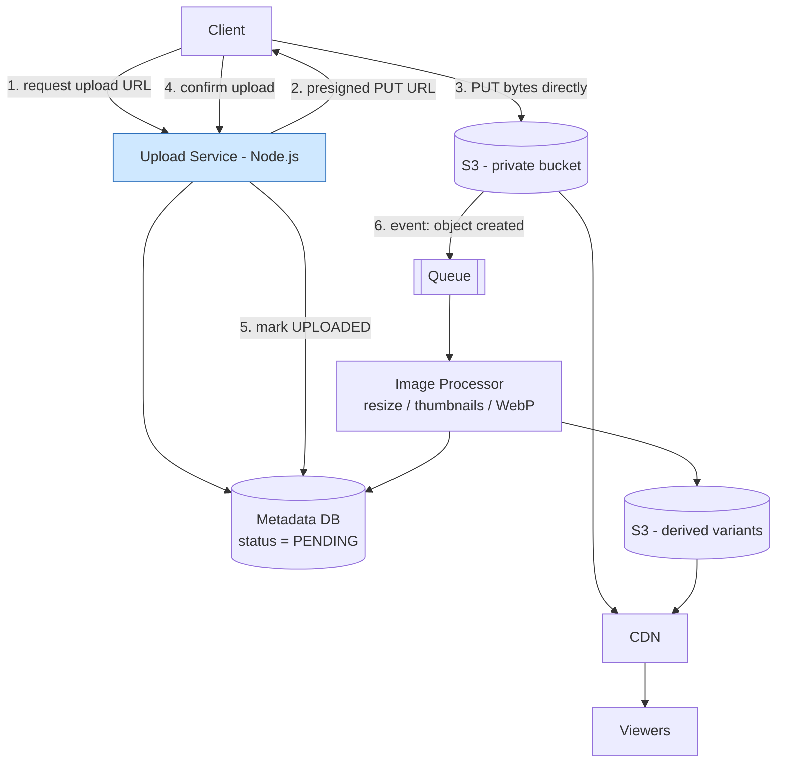
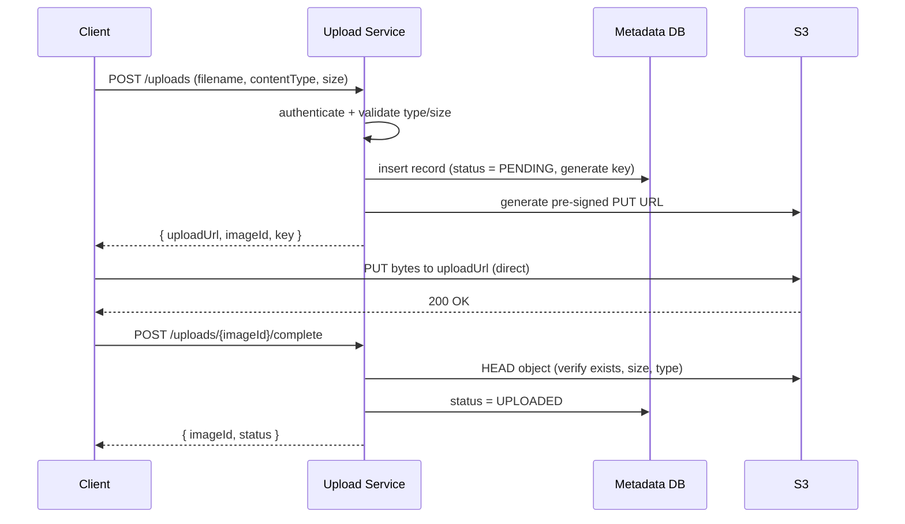
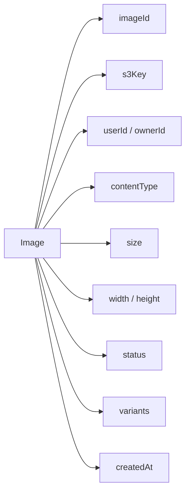
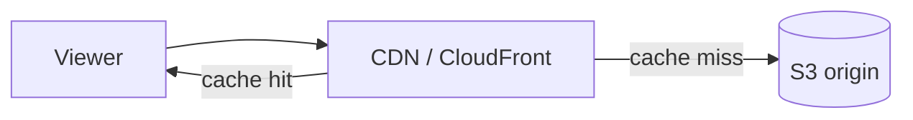
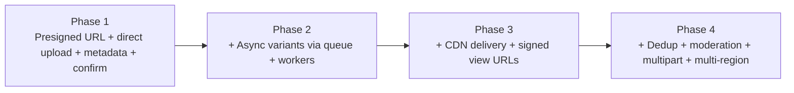

# 7. Design an Image Upload Service

> **In one line:** Design a service that lets clients upload images directly to object storage (S3) via
> **pre-signed URLs** issued by a Node.js backend — covering the upload flow, metadata schema,
> validation, async processing (thumbnails/variants), CDN delivery, security, and the trade-offs behind
> each choice.

> **Original prompt:** Design the flow for uploading images to S3 using pre-signed URLs from a Node.js backend.

## Overview

"Just accept a file and save it" hides a surprising amount of system design. At a Senior/Lead level the
interviewer uses this to see whether you can reason about a *system* rather than a `multer` handler:

- Should bytes flow **through** your Node.js server, or **directly** to storage?
- What exactly is a **pre-signed URL**, and why does it change the architecture?
- Where does **metadata** live, and how do you keep it consistent with the bytes in S3?
- How do you **validate** size/type when the client uploads straight to S3?
- How do you generate **thumbnails/variants** without blocking the upload?
- How do you **serve** images fast and cheaply to a global audience?
- What happens on **partial failures** — an upload that never finishes, or metadata without bytes?

The goal is not to memorize one pipeline. It is to explain *why each component exists, what problem it
solves, what happens when it fails, and what trade-off it introduces.*

## Step 0: Start With Requirements, Not Technology

The common mistake is opening with *"I'll use multer and upload to S3."* Scope first.

**Functional questions worth asking:**

- What file types and **max size** (profile avatar vs multi-MB photo vs large asset)?
- Do we need **derived variants** — thumbnails, resized versions, WebP/AVIF conversion?
- Do we need **metadata** (owner, dimensions, EXIF, alt text)?
- Is **authentication** required to upload? Who can **view** — public or private/authorized?
- Do we need **deduplication**, **moderation**, or **virus scanning**?
- Can users **replace/delete** images?

**Non-functional questions worth asking:**

- Expected **upload volume** and **read/view ratio** (usually read-heavy)?
- Target **latency** and **availability**? Are users **global**?
- **Durability** expectations for the stored bytes?

**Assumed requirements for this design** (a reasonable interview baseline):

| Dimension | Assumption |
|---|---|
| Types | JPEG / PNG / WebP images |
| Max size | ~10 MB per image |
| Variants | Thumbnail + a few resized versions, generated async |
| Metadata | Owner, size, dimensions, content type, status |
| Auth | Required to upload; viewing may be public or signed |
| Workload | Read-heavy (views ≫ uploads) |
| Storage | Durable object storage (S3), served via CDN |

## The Key Decision: Don't Proxy Bytes Through Your Server

The naive design routes the file through the app server:



This is the classic anti-pattern. Every byte hits your server, consuming:

- **Memory / buffering** — large files pressure the Node.js process and event loop.
- **Bandwidth** — you pay for ingress *and* egress to S3, doubling traffic.
- **Scaling** — upload throughput is now bottlenecked by your app tier, not by S3.

**Better: let the client upload directly to S3**, and use the server only to *authorize* the upload by
issuing a **pre-signed URL**. Your server stays stateless and lightweight; S3 handles the bytes and the
durability. Related: [Object Storage](../../02-data-and-storage-concepts/13-object-storage.md).

## What Is a Pre-Signed URL?

A pre-signed URL is a **temporary, cryptographically signed URL** that grants a specific, time-limited
permission (e.g. "PUT this one object") to whoever holds it — **without** exposing your AWS credentials.



Properties that make it the right tool:

- **Scoped** — bound to a specific bucket, object key, and HTTP method (`PUT`).
- **Time-limited** — expires (e.g. 5 minutes), shrinking the abuse window.
- **Credential-free for the client** — the browser never sees your secret keys.
- **Constrainable** — can pin content-type and size limits (especially with a *pre-signed POST policy*).

The bucket itself stays **private**; nobody can read or write except via signed URLs or the CDN.

## High-Level Architecture



The upload service stays **stateless** and horizontally scalable
([Horizontal Scaling](../../01-core-infrastructure-concepts/03-horizontal-scaling.md),
[Load Balancer](../../01-core-infrastructure-concepts/04-load-balancer.md)); bytes never flow through it.

## The Upload Flow (Three Steps)

The direct-upload pattern splits one "upload" into three interactions. Understanding *why* there are
three is the crux of the answer.



**Why the separate "complete/confirm" step?** Because the client uploads *directly* to S3, your backend
doesn't automatically know when (or whether) the upload succeeded. The confirm call — or an
S3 event notification — is what transitions the record from `PENDING` to `UPLOADED`. Without it you get
**orphaned metadata** (a row with no bytes) or **orphaned objects** (bytes with no row).

## API Design

```text
POST   /api/v1/uploads                     # request a pre-signed upload URL
POST   /api/v1/uploads/{imageId}/complete  # confirm the upload finished
GET    /api/v1/images/{imageId}            # fetch metadata + delivery URLs
DELETE /api/v1/images/{imageId}            # delete / soft-delete
```

**Request an upload URL:**

```json
// POST /api/v1/uploads
{ "filename": "beach.jpg", "contentType": "image/jpeg", "size": 2483221 }

// 201 Created
{
  "imageId": "img_9f2c...",
  "uploadUrl": "https://bucket.s3.amazonaws.com/uploads/img_9f2c...?X-Amz-Signature=...",
  "expiresIn": 300
}
```

The client then `PUT`s the raw bytes to `uploadUrl`, and finally calls `/complete`.

## Generating the Pre-Signed URL (Node.js)

Using the AWS SDK v3, the backend signs a scoped, expiring `PutObject` URL. Note it never streams the
file — it only produces a URL.

```typescript
import { S3Client, PutObjectCommand } from "@aws-sdk/client-s3";
import { getSignedUrl } from "@aws-sdk/s3-request-presigner";
import { randomUUID } from "crypto";

const s3 = new S3Client({ region: process.env.AWS_REGION });

const ALLOWED = new Set(["image/jpeg", "image/png", "image/webp"]);
const MAX_BYTES = 10 * 1024 * 1024; // 10 MB

export async function createUploadUrl(userId: string, contentType: string, size: number) {
  if (!ALLOWED.has(contentType)) throw new BadRequest("Unsupported content type");
  if (size <= 0 || size > MAX_BYTES) throw new BadRequest("File too large");

  const imageId = `img_${randomUUID()}`;
  // Namespacing the key by user keeps ownership clear and listing efficient.
  const key = `uploads/${userId}/${imageId}`;

  const command = new PutObjectCommand({
    Bucket: process.env.UPLOAD_BUCKET,
    Key: key,
    ContentType: contentType,   // client must send this exact header
  });

  const uploadUrl = await getSignedUrl(s3, command, { expiresIn: 300 }); // 5 min

  await Image.create({ imageId, key, userId, contentType, size, status: "PENDING" });
  return { imageId, uploadUrl, expiresIn: 300 };
}
```

> **Tip:** For stricter server-side enforcement of size/type at upload time, use a **pre-signed POST
> policy** (`createPresignedPost`) with `content-length-range` and content-type conditions. S3 itself
> then rejects an oversized or wrong-type upload — you're not just trusting the client.

## Metadata Schema

The bytes live in S3; the **metadata** lives in a database and is the source of truth for *what exists
and its lifecycle*. Related: [Database](../../02-data-and-storage-concepts/01-database.md).



A Mongoose schema (matching this repo's Node.js stack):

```typescript
import { Schema, model } from "mongoose";

const imageSchema = new Schema(
  {
    imageId:    { type: String, required: true, unique: true, index: true },
    s3Key:      { type: String, required: true },
    userId:     { type: Schema.Types.ObjectId, ref: "User", index: true },
    contentType:{ type: String, required: true },
    size:       { type: Number, required: true },
    width:      { type: Number },
    height:     { type: Number },
    checksum:   { type: String, index: true }, // for dedup (content hash)
    status: {
      type: String,
      enum: ["PENDING", "UPLOADED", "PROCESSING", "READY", "FAILED"],
      default: "PENDING",
      index: true,
    },
    // Derived renditions produced asynchronously.
    variants: [
      {
        label: String,   // "thumb" | "medium" | "webp"
        s3Key: String,
        width: Number,
        height: Number,
      },
    ],
  },
  { timestamps: true },
);

export const Image = model("Image", imageSchema);
```

The **status lifecycle** is the backbone of correctness:

```text
PENDING → UPLOADED → PROCESSING → READY
                     └──────────→ FAILED
```

A background sweep can delete `PENDING` rows (and any stray S3 objects) older than the URL expiry —
that's how you reclaim orphans.

## Validation — Trust Nothing From the Client

Because the client uploads directly to S3, validate at **both ends**:

| Stage | Check | How |
|---|---|---|
| **Before signing** | Content-type in allow-list, size within limit | App logic on `POST /uploads` |
| **At upload (S3)** | Enforce content-type & size | Pre-signed POST policy `content-length-range` |
| **After upload** | Verify the object really exists, real dimensions, real MIME | `HEAD` object on confirm; inspect magic bytes during processing |

> Never trust the declared `contentType` or extension alone — a `.jpg` can contain anything. During
> async processing, inspect the actual file signature (magic bytes) and re-derive real dimensions.

## Asynchronous Image Processing

Generating thumbnails/variants is CPU-heavy and must **not** block the upload path. Trigger it off an
S3 event and process it on workers.

```mermaid
flowchart LR
    S3[S3 object created] -->|event notification| Q[[Queue / SQS]]
    Q --> W[Worker<br/>sharp / libvips]
    W --> R1[thumb 150px]
    W --> R2[medium 800px]
    W --> R3[WebP/AVIF]
    R1 & R2 & R3 --> S3D[(S3 derived)]
    W --> DB[(status = READY, variants[])]
    Q -.poison msg.-> DLQ[[Dead Letter Queue]]
```

- Use a [message queue](../../04-messaging-and-communication-concepts/01-message-queue.md) (SQS/Kafka) so
  spikes don't overwhelm workers; apply [backpressure](../../04-messaging-and-communication-concepts/04-backpressure.md).
- Send repeatedly-failing jobs to a
  [dead-letter queue](../../04-messaging-and-communication-concepts/03-dead-letter-queue.md).
- Make processing **idempotent** ([Idempotency](../../03-distributed-systems-concepts/07-idempotency.md)) —
  the same S3 event may be delivered more than once, so re-processing must be safe (overwrite the same
  derived keys).
- Workers use `sharp`/libvips (or Lambda) to resize, strip EXIF, and transcode. On success, flip status
  to `READY` and record the `variants`.

**If the processing pipeline is down, the original upload still succeeds** — variants are
eventually-consistent derived data, not part of the critical write.

## Serving Images

Views vastly outnumber uploads, so optimize delivery.



- Put a **[CDN](../../01-core-infrastructure-concepts/07-cdn.md)** in front of S3 so images are cached at
  the edge, cutting [latency](../../01-core-infrastructure-concepts/05-latency.md) and origin load.
- For **public** images, serve via the CDN with long cache TTLs and content-hashed keys for cache-busting.
- For **private** images, serve via **signed CDN URLs / signed cookies** (short-lived), so only
  authorized viewers get access while still benefiting from edge caching.
- Return the right variant per context (thumbnail in a list, medium in a detail view) to save bandwidth.

## Security

- **Private bucket** — no public read/write; access only via pre-signed URLs (upload) and CDN (view).
- **Short URL expiry** — pre-signed URLs live minutes, not hours.
- **Scope the key** — namespace by `userId` and authorize that the caller owns the resource on every op.
- **Enforce type & size at S3** — via the POST policy, not just app-side hints.
- **Strip EXIF/metadata** during processing to avoid leaking GPS/PII.
- **[Rate limit](../../05-reliability-performance-and-modern-concepts/02-rate-limiting.md)** URL issuance to
  curb abuse (Redis counters, keyed by user/IP).
- **Content moderation / virus scanning** — for user-generated content, run async scanning (e.g.
  Rekognition / ClamAV) before marking `READY`; quarantine on failure.

## Advanced: Large Files, Dedup, and Resumability

- **Multipart upload** — for very large files, S3 multipart uploads split bytes into parts (each with its
  own pre-signed URL), enabling parallel and resumable uploads. Beyond the ~10 MB image baseline, but
  worth naming.
- **Deduplication** — compute a content hash (checksum) and, if it already exists, point the new
  metadata row at the existing object instead of storing duplicate bytes. Decide ownership semantics.
- **Idempotent create** — an [`Idempotency-Key`](../../03-distributed-systems-concepts/08-idempotency-key.md)
  on `POST /uploads` prevents duplicate records when a client retries after a network blip.

## Failure Scenarios

| Failure | Behavior | Mitigation |
|---|---|---|
| Client gets URL but never uploads | Orphaned `PENDING` row, no bytes | Sweep expired `PENDING` records |
| Bytes uploaded but `/complete` never called | Orphaned S3 object | Reconcile via S3 event → mark `UPLOADED` |
| Processing worker crashes | Stuck in `PROCESSING` | Retries + DLQ; timeout → `FAILED`, allow reprocess |
| S3 event delivered twice | Duplicate processing | Idempotent workers (same derived keys) |
| Metadata DB down | Can't issue URLs / confirm | Fail fast; bytes already in S3 remain durable |
| CDN/S3 read spike on one image | Hot object | Edge caching absorbs it; S3 scales reads |

> Prefer the **S3 event notification** as the authoritative "upload happened" signal over the client
> `/complete` call — the event fires even if the client disconnects after a successful PUT.

## MVP First — Avoid Over-Engineering



Don't build multipart resumability, dedup, and moderation until the product needs them. The pre-signed
direct-upload core is the part that must be right from day one.

## Suggested Node.js Project Structure (LLD)

```text
src/
├── modules/
│   ├── upload/
│   │   ├── upload.controller.ts   # POST /uploads, /complete
│   │   ├── upload.service.ts      # presign, validate, lifecycle
│   │   └── upload.validation.ts
│   └── image/
│       ├── image.controller.ts    # GET/DELETE metadata + delivery URLs
│       └── image.service.ts
├── models/
│   └── image.model.ts             # schema + status lifecycle
├── workers/
│   └── imageProcessor.ts          # queue consumer: resize/transcode (sharp)
├── lib/
│   ├── s3.ts                      # presign helpers
│   └── cdn.ts                     # signed view URLs
├── middleware/
│   └── rateLimiter.ts
└── app.ts
```

## What the Interviewer Is Really Testing

- **Architecture instinct** — knowing *not* to proxy bytes through the app server.
- **Pre-signed URLs** — what they are, how they're scoped, why they keep credentials safe.
- **Consistency** — keeping metadata and stored bytes in sync (the confirm/event step, orphan cleanup).
- **Async decoupling** — offloading CPU-heavy processing to workers.
- **Delivery** — CDN caching and public vs signed access.
- **Failure handling** — orphans, duplicate events, stuck jobs, idempotency.
- **Trade-offs** — *why* each component, and what it costs.

## Interview Strategy

Scope first, go breadth-first, deepen only where pushed:

```text
Requirements → Why direct-to-S3 → Presigned URL Flow → API → Metadata + Lifecycle →
Validation → Async Processing → CDN Delivery → Security → Failure Scenarios → Trade-offs
```

## Tips

- **Never stream bytes through Node.js** — issue a pre-signed URL and let the client upload to S3 directly.
- Keep the bucket **private**; use short-lived, scoped pre-signed URLs for writes and CDN/signed URLs for reads.
- Model an explicit **status lifecycle** (`PENDING → UPLOADED → PROCESSING → READY`) and sweep orphans.
- Prefer the **S3 event notification** as the authoritative upload signal over the client confirm call.
- Validate type/size **before signing, at S3 (POST policy), and after upload** — trust nothing.
- Generate variants **asynchronously**; a processing outage must never fail the upload.
- Serve through a **CDN**; strip EXIF and use signed URLs for private content.
- Make create and processing **idempotent** to survive retries and duplicate events.

## Trade-offs & Pitfalls

- **Proxying uploads through the app server** wastes memory/bandwidth and caps throughput — the single
  biggest mistake in this design.
- **No confirm/event step** leaves orphaned metadata or orphaned objects — always reconcile.
- **Trusting client-declared type/size** — enforce at S3 and re-verify after upload.
- **Synchronous thumbnail generation** blocks uploads and couples availability — process async.
- **Public buckets** are a common security disaster — keep them private and gate access explicitly.
- **Ignoring duplicate S3 events** double-processes — make workers idempotent.
- **Over-engineering the MVP** — multipart, dedup, and moderation are add-ons, not the foundation.

## System Design Cheat Sheet

When you hear *"Design an Image Upload Service,"* walk this mental map (the interviewer may only push on
a few branches):

```text
1.  WHAT?        Types, size limits, variants, public vs private?
2.  SCALE        Upload volume vs view volume (read-heavy)?
3.  PATH         Direct-to-S3 (presigned) vs proxy — and why?
4.  PRESIGN      Scoped, expiring, credential-free URL?
5.  FLOW         Request URL → PUT to S3 → confirm/event?
6.  STORE        Metadata schema + status lifecycle?
7.  VALIDATE     Before sign / at S3 / after upload?
8.  PROCESS      Async resize/thumbnail/transcode via queue + workers?
9.  DELIVER      CDN + public vs signed view URLs?
10. SECURE       Private bucket / expiry / rate limit / EXIF / moderation?
11. FAIL         Orphans / duplicate events / stuck jobs / idempotency?
12. TRADE-OFF    Why this design?
```

Six-layer mental model:

```text
1. AUTHORIZE  backend signs a scoped, expiring URL
2. UPLOAD     client → S3 directly (bytes never touch the app)
3. CONFIRM    confirm call / S3 event → metadata lifecycle
4. PROCESS    async variants (queue → workers)
5. DELIVER    CDN + signed URLs for private content
6. PROTECT    private bucket + validation + moderation + rate limit
```

## Interview Questions & Answers

A structured question bank — the kind an interviewer asks (and that you should ask *them*), grouped by
theme, each with a short answer.

### A. Requirement Clarification

- **What file types and max size?** — Drives validation, the POST policy, and whether multipart is needed.
- **Do we need thumbnails/variants?** — If yes, add an async processing pipeline off an S3 event.
- **Public or private images?** — Public → CDN + long TTL; private → signed CDN URLs/cookies.
- **Is auth required to upload?** — Yes for the baseline; authorize ownership on every operation.
- **Do we need dedup/moderation/virus scan?** — Add-ons that run async before marking `READY`.
- **What's the read/write ratio?** — Usually read-heavy, which is why CDN delivery matters most.

### B. Architecture

- **Should bytes flow through the server?** — No — proxying wastes memory/bandwidth and caps throughput.
- **How do clients upload without your credentials?** — Via a pre-signed URL the backend signs for them.
- **Is the upload service stateful?** — No — it only issues URLs and tracks metadata; S3 holds the bytes.
- **Where's the source of truth for "what exists"?** — The metadata DB and its status lifecycle.
- **Where do the bytes live?** — Durable object storage (S3), fronted by a CDN for reads.

### C. Pre-Signed URLs

- **What is a pre-signed URL?** — A temporary, signed URL granting one scoped operation without exposing credentials.
- **What does it scope?** — Bucket, object key, HTTP method, expiry, and (via POST policy) type/size.
- **How long should it live?** — Minutes — long enough to upload, short enough to limit abuse.
- **PUT presigned URL vs POST policy?** — PUT is simplest; POST policy lets S3 enforce size/type limits.
- **Does the client ever see AWS keys?** — No — that's the whole point.

### D. Upload Flow & Consistency

- **Walk through the flow.** — Request URL → record `PENDING` → client PUTs to S3 → confirm/event → `UPLOADED`.
- **Why a separate confirm step?** — The server doesn't otherwise know the direct upload succeeded.
- **What if confirm never arrives?** — Reconcile via the S3 event; sweep stale `PENDING` rows.
- **What if bytes are uploaded but no metadata?** — Orphaned object; a reconcile/cleanup job handles it.
- **Which signal is authoritative?** — Prefer the S3 event notification over the client confirm.

### E. Validation & Processing

- **How do you validate type/size?** — Before signing, at S3 via POST policy, and after upload (HEAD + magic bytes).
- **Can you trust the file extension?** — No — inspect the real content signature during processing.
- **How are thumbnails generated?** — Async workers (sharp/libvips or Lambda) triggered by an S3 event.
- **Why process asynchronously?** — CPU-heavy work must not block uploads or couple availability.
- **What if a worker fails repeatedly?** — Retries then a dead-letter queue; timeout → `FAILED`, allow reprocess.
- **What about duplicate S3 events?** — Make processing idempotent (write the same derived keys).

### F. Delivery & Security

- **How do you serve images fast?** — Through a CDN caching S3 objects at the edge.
- **How do you serve private images?** — Signed CDN URLs/cookies with short TTLs.
- **How do you keep the bucket safe?** — Keep it private; access only via pre-signed URLs and the CDN.
- **How do you prevent abuse?** — Rate-limit URL issuance; enforce size/type; scan/moderate content.
- **What about EXIF/PII?** — Strip metadata during processing to avoid leaking location data.

### G. Advanced / Lead-level

- **How do you handle very large files?** — S3 multipart upload with per-part pre-signed URLs (parallel/resumable).
- **How do you deduplicate?** — Content hash (checksum); reuse existing object, add a new metadata row.
- **How do you make create idempotent?** — Accept an `Idempotency-Key` and return the existing record on retry.
- **How would you scale globally?** — Multi-region buckets/replication + a global CDN.
- **What are the biggest trade-offs?** — Direct-to-S3 complexity (confirm/orphans) vs the throughput/cost it buys, and eventual-consistency of derived variants.
