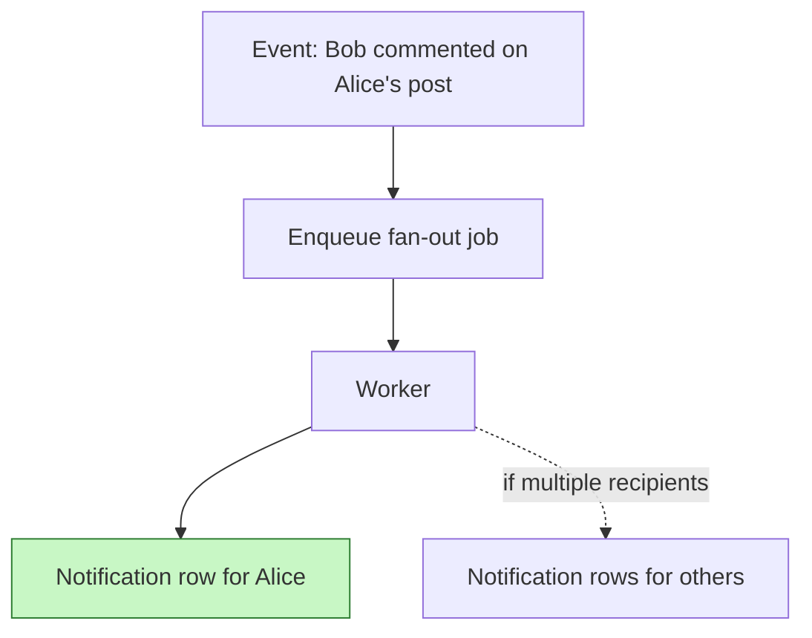
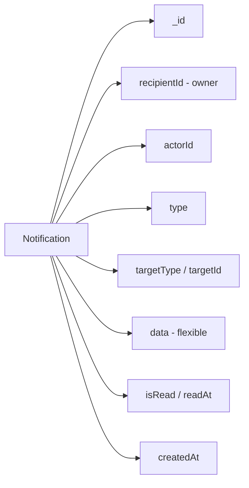

# 8. Design a Notification Feed

> **In one line:** Design the schema and API for a per-user notification feed — storing notifications,
> listing them efficiently, tracking unread counts, and marking them read (single, bulk, and all).

> **Original prompt:** Create a schema to store user notifications and an API to mark them as "read".

## Overview

A notification feed shows each user a reverse-chronological list of events relevant to them ("Alice
liked your post", "Bob commented", "Your order shipped"), with an **unread badge** and the ability to
**mark things read**. The design questions are:

- What does a notification document look like, and how do you keep it flexible across many event types?
- How do you list a user's feed efficiently (it's read often)?
- How do you compute the **unread count** without scanning everything?
- How do you mark **one / many / all** as read?
- How do notifications get *created* — write on every event (fan-out) or compute on read?

## Step 0: Clarify the Problem

- **How are notifications delivered?** In-app feed only, or also push/email? (This problem = in-app feed.)
- **Do we group/aggregate?** "5 people liked your post" vs 5 separate rows.
- **Retention?** Keep forever, or expire after N days (TTL)?
- **Scale?** A celebrity with millions of followers changes the write strategy (fan-out trade-offs).

## Fan-out: Where Notifications Come From

When an event happens, you either **write a row per recipient now** (fan-out on write) or **assemble the
feed at read time** (fan-out on read).

| Approach | When notifications are created | Pros | Cons |
|---|---|---|---|
| **Fan-out on write** | One row per recipient at event time | Fast reads, simple feed query | Write amplification for huge audiences |
| **Fan-out on read** | Computed from source events on request | Cheap writes | Expensive, complex reads |

For a per-user notification feed, **fan-out on write** is the standard choice — reads dominate, and a
notification is naturally a per-recipient record. (For a *social timeline* with celebrities, a hybrid is
used — see [Notification Feed vs. timelines] discussions and
[Message Queue](../04-messaging-and-communication-concepts/01-message-queue.md) for async fan-out.)



Doing fan-out **asynchronously** via a queue keeps the triggering request fast and absorbs spikes.

## Schema (Mongoose)

A notification belongs to one **recipient**, references the **actor** and **target**, carries a **type**
and a flexible **data** blob, and tracks **read state**.



```typescript
import { Schema, model, Types } from "mongoose";

const notificationSchema = new Schema(
  {
    recipientId: { type: Types.ObjectId, ref: "User", required: true },
    actorId: { type: Types.ObjectId, ref: "User", default: null },

    type: {
      type: String,
      required: true, // e.g. LIKE, COMMENT, FOLLOW, ORDER_SHIPPED
      enum: ["LIKE", "COMMENT", "FOLLOW", "MENTION", "ORDER_SHIPPED", "SYSTEM"],
    },
    // What the notification is about (polymorphic reference).
    targetType: { type: String, default: null }, // POST, COMMENT, ORDER...
    targetId: { type: Types.ObjectId, default: null },

    // Flexible payload for rendering without extra lookups (denormalized).
    data: { type: Schema.Types.Mixed, default: {} },

    isRead: { type: Boolean, default: false },
    readAt: { type: Date, default: null },

    // Optional auto-expiry, e.g. 90 days.
    expiresAt: { type: Date, default: null },
  },
  { timestamps: true },
);

// The core feed query: a user's notifications, newest first.
notificationSchema.index({ recipientId: 1, createdAt: -1 });
// Fast unread count / unread-only filter.
notificationSchema.index({ recipientId: 1, isRead: 1, createdAt: -1 });
// Optional TTL cleanup.
notificationSchema.index({ expiresAt: 1 }, { expireAfterSeconds: 0 });

export const Notification = model("Notification", notificationSchema);
```

Interview points:

- **Denormalize a `data` blob** (actor name, post title, thumbnail) so rendering the feed needs no joins
  — feeds are read-heavy and latency-sensitive.
- **Compound index `{ recipientId, createdAt }`** backs the main feed query;
  `{ recipientId, isRead, createdAt }` backs the unread filter and count. See
  [Index](../02-data-and-storage-concepts/05-index.md).

## API Design

| Method | Endpoint | Purpose |
|---|---|---|
| `GET` | `/notifications` | List the user's feed (paginated) |
| `GET` | `/notifications?unread=true` | Unread only |
| `GET` | `/notifications/unread-count` | Badge count |
| `PATCH` | `/notifications/:id/read` | Mark one as read |
| `PATCH` | `/notifications/read` | Mark many (by ids) or **all** as read |
| `DELETE` | `/notifications/:id` | Dismiss/delete one |

Every query is scoped by `recipientId` from the authenticated token (see
[User Authentication System](./01-user-authentication-system.md)) — a user only sees their own feed.

### Listing the Feed

Paginate with cursors so infinite scroll stays fast regardless of history size (see
[Cursor-Based Pagination](./03-cursor-based-pagination.md)):

```typescript
const items = await Notification.find({
  recipientId: req.user.id,
  ...(unreadOnly && { isRead: false }),
  ...(cursor && { _id: { $lt: decodeCursor(cursor) } }),
})
  .sort({ _id: -1 })
  .limit(limit + 1)
  .lean();
```

### Unread Count (the badge)

For modest feeds, a filtered `countDocuments` on the indexed field is fine:

```typescript
const unread = await Notification.countDocuments({
  recipientId: req.user.id,
  isRead: false,
});
```

At large scale, maintain a **denormalized counter** (in the user doc or Redis) that increments on
create and decrements on read — so the badge is O(1) instead of a count query on every page load.

### Marking as Read

The core requirement — support one, many, and all, using a bulk update so "mark all read" is a single
operation, not N writes:

```typescript
// Mark one:
await Notification.updateOne(
  { _id: id, recipientId: req.user.id, isRead: false },
  { $set: { isRead: true, readAt: new Date() } },
);

// Mark all (or a set of ids):
await Notification.updateMany(
  { recipientId: req.user.id, isRead: false, ...(ids && { _id: { $in: ids } }) },
  { $set: { isRead: true, readAt: new Date() } },
);
```

Scoping the filter by `recipientId` is what enforces authorization — a user can't mark someone else's
notifications read. Filtering on `isRead: false` keeps the counter decrement accurate.

## Aggregation / Grouping (optional)

To show "5 people liked your post" instead of five rows, either:

- **Aggregate on write:** if a recent unread notification with the same `type`+`target` exists, update
  it (bump a count and append the actor) instead of inserting a new row; or
- **Aggregate on read:** group by `type`+`target` when assembling the feed.

## Real-Time Delivery (optional)

To update the badge live, push new notifications over
[WebSocket](../04-messaging-and-communication-concepts/05-websocket.md) or
[Server-Sent Events](../04-messaging-and-communication-concepts/06-server-sent-events.md) after the row
is written, so the client doesn't have to poll.

## Tips

- **Fan-out on write** (async, via a queue) so reads are a simple indexed query.
- **Denormalize a `data` payload** so rendering the feed needs no joins.
- Back the feed with `{ recipientId, createdAt }` and unread with `{ recipientId, isRead, createdAt }`.
- Use **`updateMany`** for "mark all read" — one write, not N.
- Keep a **denormalized unread counter** (Redis/user doc) at scale instead of counting each load.
- **Cursor-paginate** the feed; optionally **TTL-expire** old notifications.
- Scope every read/update by `recipientId` to enforce ownership.

## Trade-offs & Pitfalls

- **Fan-out on write vs on read:** write is fast to read but amplifies writes for huge audiences; read is
  cheap to write but expensive/complex to read — pick per audience size (hybrid for celebrities).
- **Counting unread on every page load** doesn't scale — denormalize the counter, but then keep it in
  sync (increment on create, decrement on read) or it drifts.
- **Not scoping updates by `recipientId`** is an authorization hole.
- **Synchronous fan-out** on the triggering request adds latency and fails under spikes — do it async.
- **Unbounded retention** grows the collection forever — use TTL or archival.
- **Over-normalizing** forces joins to render each notification — denormalize the display payload instead.

## System Design Cheat Sheet

```text
1. SOURCE      Fan-out on write (async via queue) vs on read
2. SCHEMA      recipient + actor + type + target + data + isRead
3. RENDER      Denormalize display payload (no joins on read)
4. INDEX       {recipientId, createdAt} feed; {recipientId, isRead, createdAt} unread
5. LIST        Cursor pagination; unread filter
6. COUNT       Denormalized unread counter at scale
7. READ-STATE  updateOne / updateMany (one, set, or all)
8. EXTRAS      Grouping/aggregation; real-time via WS/SSE; TTL cleanup
```

## Interview Questions & Answers

### A. Requirements & Fan-out

- **How are notifications created?** — Fan-out on write: an event creates a per-recipient row (async via a queue).
- **Fan-out on write vs on read?** — Write = fast reads, more writes; read = cheap writes, costly reads. Write is standard for feeds.
- **Why do fan-out asynchronously?** — Keeps the triggering request fast and absorbs spikes.
- **How would a celebrity with millions of followers change it?** — Use a hybrid (write for most, compute for hot fan-outs).

### B. Schema

- **What does a notification store?** — recipient, actor, type, target (type+id), a flexible `data` payload, and read state.
- **Why denormalize a `data` blob?** — So the feed renders without joins; feeds are read-heavy.
- **How do you support many notification types?** — A `type` enum plus a polymorphic `targetType`/`targetId` and flexible `data`.
- **How do you auto-expire old notifications?** — A TTL index on `expiresAt`.

### C. Listing & Counting

- **How do you list the feed efficiently?** — Cursor pagination on an index over `{ recipientId, createdAt }`.
- **How do you compute the unread count?** — A filtered count on `{ recipientId, isRead }`, or a denormalized counter at scale.
- **Why denormalize the unread counter?** — To make the badge O(1) instead of a count query on every load.
- **How do you keep the counter accurate?** — Increment on create, decrement on read; filter reads on `isRead: false`.

### D. Marking Read & Authorization

- **How do you mark one as read?** — `updateOne` filtered by `_id` + `recipientId`, setting `isRead`/`readAt`.
- **How do you mark all as read?** — A single `updateMany` over the user's unread notifications.
- **How do you enforce a user can't read others' notifications?** — Scope every filter by `recipientId` from the token.
- **How do you mark a specific set read?** — `updateMany` with `_id: { $in: ids }` plus the recipient filter.

### E. Extras

- **How do you group "5 people liked your post"?** — Aggregate on write (bump an existing unread row) or on read (group by type+target).
- **How do you push updates in real time?** — WebSocket/SSE after writing the row, avoiding polling.
- **How do you manage retention?** — TTL expiry or archival of old notifications.
- **What are the main trade-offs?** — Fan-out strategy and denormalized counter consistency.

---

_Notes: (add your own content here)_
