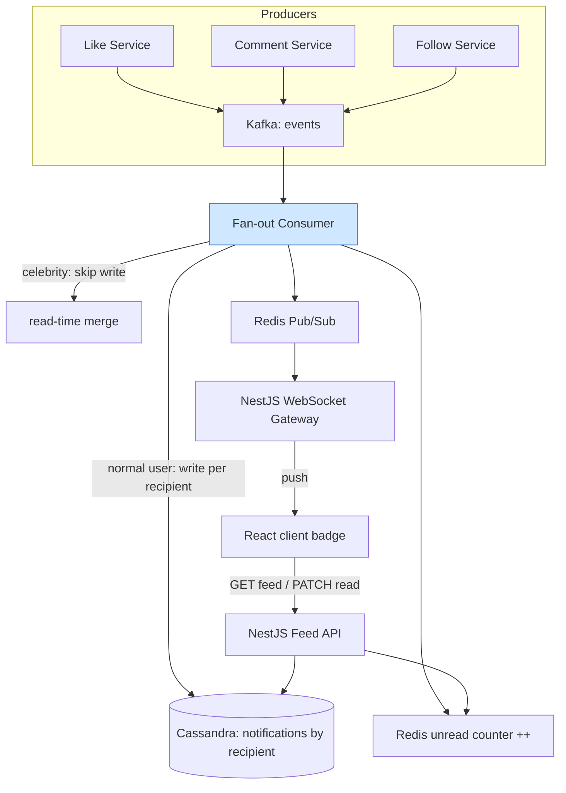
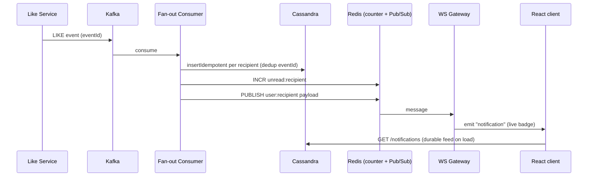

# 8. Design a Notification Feed

> **In one line:** Design a per-user notification feed (Facebook/GitHub-class) — the interview
> conversation, HLD, LLD with real NestJS + Kafka + Redis + WebSocket code, fan-out strategies, real-time
> delivery, and deep scaling + security.

> **Original prompt:** Create a schema to store user notifications and an API to mark them as "read".

---

## 1. The Interview Conversation

> **Interviewer:** "Design the notification feed — the bell icon. Users get notified of likes, comments,
> follows, and can mark them read."
>
> **Candidate:** "The central design decision is how notifications are *created*: fan-out on write (write a
> row per recipient when an event happens) or fan-out on read (compute the feed from source events on
> request). For a per-user feed that's read constantly, I'd default to fan-out on write so reads are a
> trivial indexed query. Are notifications in-app only, or also push/email?"
>
> **Interviewer:** "In-app feed with a real-time unread badge; push/email later."
>
> **Candidate:** "Then the unread *count* is critical — it's hit on every page load, so it must not be a
> `COUNT` scan; I'll keep a denormalized counter in Redis. For real-time I'll push over WebSocket/SSE after
> writing the durable row. What scale — and are there celebrity accounts with millions of followers?"
>
> **Interviewer:** "Yes, some accounts have tens of millions of followers."
>
> **Candidate:** "That's the classic fan-out problem — a single action from a celebrity would generate tens
> of millions of writes. I'll use a hybrid: fan-out on write for normal accounts, but for celebrity sources
> skip the write storm and merge their activity at read time. I'll do the fan-out asynchronously through
> Kafka so the triggering action stays fast and spikes are absorbed. Do we need grouping like '5 people
> liked your post'?"
>
> **Interviewer:** "Yes, and it must not lose notifications."
>
> **Candidate:** "Grouping I'll do by upserting an aggregate row per (type, target). 'Must not lose' means
> at-least-once delivery with idempotent creation via a dedup key so retries don't duplicate. Let me lay it
> out."

**Signal:** the candidate frames the fan-out trade-off, pre-empts the celebrity problem with a hybrid,
insists the unread count be O(1), and plans idempotent at-least-once delivery.

---

## 2. Requirements

**Functional**

- Create notifications from events (like, comment, follow, mention, system, order…).
- List a user's feed (paginated), filter unread, show an unread badge.
- Mark one / a set / all as read; dismiss.
- Grouping ("N people liked…"); real-time delivery; (later) multi-channel push/email.

**Non-functional**

| Requirement | Target |
|---|---|
| **Read performance** | Feed listing + unread count are O(indexed/O(1)), not scans |
| **Scalability** | High write fan-out; read-heavy feeds; survive celebrity fan-out |
| **Delivery** | At-least-once, no lost notifications; idempotent (no duplicates) |
| **Real-time** | Badge updates within ~1s over WebSocket/SSE |
| **Security** | A user sees/mutates only their own notifications |

---

## 3. Recommended Tech Stack

| Layer | Choice | Why |
|---|---|---|
| **Framework** | **NestJS** | Modules for producer, consumer, feed API, and a WebSocket gateway |
| **Fan-out bus** | **Kafka** (or SQS/SNS) | Durable, high-throughput, replayable event fan-out; decouples producers from consumers |
| **Feed store** | **Cassandra** (or MongoDB) | Per-user partition, write-optimized, huge volume; feed = one partition read |
| **Unread counter + real-time** | **Redis** (counters + Pub/Sub) | O(1) badge; Pub/Sub bridges WebSocket instances |
| **Real-time transport** | **WebSocket (Socket.IO)** or **SSE** | Push badge/feed updates; SSE is ideal for one-way server→client |
| **Frontend** | **React** + Socket.IO/EventSource client | Live badge; `fetchMore` for feed pagination |

> **Why Cassandra for the feed?** A notification feed is a per-user, append-heavy, time-ordered list read
> as a single partition (`recipientId`) — exactly Cassandra's sweet spot at scale. MongoDB is fine at
> smaller scale with a `{recipientId, createdAt}` index; the access pattern is identical.

---

## 4. High-Level Design (HLD)



**Write:** event → Kafka → fan-out consumer writes per-recipient rows (normal) or skips (celebrity), bumps
the Redis unread counter, and publishes to Redis Pub/Sub → WebSocket gateway pushes the live badge. **Read:**
feed API reads the recipient's partition + merges celebrity activity; unread badge is an O(1) Redis read.

---

## 5. Approaches, Patterns & Algorithms (fan-out)

| Approach | Rows created | Read cost | Best for |
|---|---|---|---|
| **Fan-out on write (push)** | one per recipient at event time | trivial (one partition) | normal users; read-heavy feeds |
| **Fan-out on read (pull)** | none; compute per request | expensive (merge many sources) | inactive/celebrity sources |
| **Hybrid (chosen)** | push for normal, pull for celebrities | balanced | mixed audiences at scale |

**Chosen: hybrid.** Fan-out on write makes the common read a single partition scan; but pushing to tens of
millions of followers for one celebrity post is a write storm, so for high-follower sources we *don't*
write — we merge their recent activity into the feed at read time. This is the standard timeline-scaling
pattern (Twitter's "fan-out" vs "fan-in").

**Grouping algorithm:** for aggregatable types, upsert an aggregate per `(recipientId, type, targetId)`:
if a recent unread aggregate exists, increment its `count` and append the actor; else insert. This yields
"5 people liked your post" as one row and keeps the unread count meaningful.

**Delivery semantics:** Kafka gives at-least-once, so creation must be idempotent — a dedup key
`(eventId, recipientId)` (unique constraint / conditional write) makes redelivery a no-op.

---

## 6. Low-Level Design (LLD)

### 6.1 Module structure (NestJS)

```text
src/
├── events/notification.producer.ts     # publish domain events to Kafka
├── fanout/fanout.consumer.ts           # consume events, fan out, count, publish RT
├── feed/
│   ├── feed.controller.ts              # GET /notifications, unread-count, PATCH read
│   ├── feed.service.ts
│   └── feed.repository.ts              # Cassandra/Mongo
├── realtime/notifications.gateway.ts   # WebSocket gateway (Socket.IO)
├── counters/unread.service.ts          # Redis unread counter
└── models/notification.model.ts
```

### 6.2 Feed store schema (Cassandra; Mongo shown too)

```sql
-- Cassandra: partition by recipient, clustered by time (newest first) → one-partition feed read
CREATE TABLE notifications (
  recipient_id  bigint,
  created_at    timeuuid,
  id            uuid,
  actor_id      bigint,
  type          text,          -- LIKE, COMMENT, FOLLOW, MENTION, SYSTEM
  target_type   text,
  target_id     bigint,
  data          text,          -- denormalized JSON payload for rendering (no joins)
  is_read       boolean,
  PRIMARY KEY ((recipient_id), created_at, id)
) WITH CLUSTERING ORDER BY (created_at DESC);
```

```javascript
// MongoDB equivalent
db.notifications.createIndex({ recipientId: 1, createdAt: -1 });          // feed
db.notifications.createIndex({ recipientId: 1, isRead: 1, createdAt: -1 });// unread filter
db.notifications.createIndex({ eventId: 1, recipientId: 1 }, { unique: true }); // idempotency
```

### 6.3 Producer + fan-out consumer (async, idempotent, hybrid)

```typescript
// events/notification.producer.ts
async emitLike(actorId: bigint, postId: bigint, ownerId: bigint) {
  await this.kafka.emit("notifications", {
    eventId: randomUUID(), type: "LIKE",
    actorId, targetType: "POST", targetId: postId, recipientId: ownerId,
  });
}

// fanout/fanout.consumer.ts
@EventPattern("notifications")
async handle(evt: NotificationEvent) {
  const recipients = await this.audience.resolve(evt);      // followers / owner
  for (const recipientId of recipients) {
    if (await this.audience.isCelebritySource(evt.actorId)) continue; // pull at read-time instead

    const created = await this.repo.insertIdempotent({      // dedup on (eventId, recipientId)
      ...evt, recipientId, isRead: false,
    });
    if (!created) continue;                                 // duplicate delivery → no-op

    await this.unread.increment(recipientId);               // O(1) Redis counter
    await this.pubsub.publish(`user:${recipientId}`, created); // → WebSocket
  }
}
```

### 6.4 Grouping (aggregate-on-write)

```typescript
async fanOutAggregated(evt: NotificationEvent, recipientId: bigint) {
  const existing = await this.repo.findRecentUnreadAggregate(recipientId, evt.type, evt.targetId);
  if (existing) {
    await this.repo.bumpAggregate(existing.id, evt.actorId); // count++, append actor, refresh time
  } else {
    await this.repo.insertIdempotent({ ...evt, recipientId, count: 1, isRead: false });
  }
}
```

### 6.5 Feed API — list, unread count, mark read

```typescript
// feed.service.ts
async list(userId: bigint, cursor?: string, unreadOnly = false, limit = 20) {
  const rows = await this.repo.page(userId, cursor, unreadOnly, limit + 1); // cursor pagination
  const hasMore = rows.length > limit;
  const items = hasMore ? rows.slice(0, limit) : rows;
  return { items, pageInfo: { nextCursor: hasMore ? encode(items.at(-1)) : null, hasMore } };
}

async unreadCount(userId: bigint) {
  return this.unread.get(userId);            // O(1) Redis read — NOT a COUNT scan
}

async markRead(userId: bigint, ids?: bigint[]) {
  const modified = await this.repo.markRead(userId, ids); // updateMany scoped by recipient
  if (modified > 0) await this.unread.decrementBy(userId, modified); // keep counter accurate
  return modified;
}
```

### 6.6 Real-time gateway (WebSocket, Redis Pub/Sub bridge)

```typescript
// realtime/notifications.gateway.ts
@WebSocketGateway({ cors: true })
export class NotificationsGateway implements OnGatewayConnection {
  @WebSocketServer() server: Server;

  async handleConnection(socket: Socket) {
    const user = await this.auth.verify(socket.handshake.auth.token); // authenticate the socket
    if (!user) return socket.disconnect();
    socket.join(`user:${user.id}`);                                    // only own room
  }

  // Redis Pub/Sub → push to the right room across all gateway instances
  onMessage(channel: string, payload: Notification) {
    const userId = channel.split(":")[1];
    this.server.to(`user:${userId}`).emit("notification", payload);
  }
}
```

### 6.7 Sequence diagram




---

## 7. Production-Ready Implementation Notes

- **Durable rows are the source of truth; real-time is an enhancement.** If a WebSocket push is missed
  (offline client), the user still sees everything on next feed load — never rely on the socket for delivery.
- **Denormalize the display payload** (`data`) so rendering needs no joins — feeds are read-heavy and you
  want the actor name/avatar as of the event anyway.
- **Idempotent creation** via `(eventId, recipientId)` makes Kafka's at-least-once safe — redelivery is a no-op.
- **Unread counter is O(1)** in Redis; the DB `COUNT` is only a reconciliation fallback.

---

## 8. Scaling the System (in detail)

**8.1 Async fan-out via Kafka.** The triggering action just publishes one event and returns; the consumer
does the fan-out work, so producers stay fast and traffic spikes buffer in Kafka rather than the request path.

**8.2 The celebrity / hybrid model.** Fan-out on write for a 50M-follower account = 50M inserts per post — a
write storm. So for high-follower sources we **don't** fan out; we store their activity once and **merge it
at read time** into each follower's feed. Normal accounts stay push-based.

```typescript
// read-time merge for followed celebrities (fan-in)
async list(userId: bigint, cursor?: string) {
  const own = await this.repo.page(userId, cursor);                  // pushed rows (one partition)
  const celebs = await this.repo.recentFromCelebs(this.follows.celebritiesOf(userId), cursor);
  return mergeByTimeDesc(own, celebs);                               // merge two sorted streams
}
```

**8.3 Feed store partitioning.** Cassandra partitions by `recipientId`, so a user's feed is one contiguous
partition read; writes distribute across the ring. In MongoDB, shard by `recipientId`. See
[Sharding](../02-data-and-storage-concepts/06-sharding.md).

**8.4 Real-time at scale.** Many WebSocket gateway instances can't all hold every user's socket, so Redis
Pub/Sub (or Kafka) bridges them: the fan-out consumer publishes to `user:<id>`, and whichever gateway holds
that socket delivers it. See [WebSocket](../04-messaging-and-communication-concepts/05-websocket.md) and
[Server-Sent Events](../04-messaging-and-communication-concepts/06-server-sent-events.md).

**8.5 Retention.** Feeds grow unbounded — cap with a TTL (Cassandra `default_time_to_live` / Mongo TTL index)
and/or keep only the most recent N per user; archive the rest.

**8.6 Unread counter.** A single Redis `INCR`/`DECR` per event/read keeps the badge O(1); reconcile against
the DB periodically to correct drift. See [Cache](../02-data-and-storage-concepts/08-cache.md).

---

## 9. Securing the System (in detail)

**9.1 Ownership on every operation.** Scope all reads and updates by `recipientId` from the verified token —
never a client-supplied id — so a user can't list or mark another user's notifications.

```typescript
// feed.repository.ts — recipient scoping is the authorization
async markRead(recipientId: bigint, ids?: bigint[]) {
  return this.db.updateMany(
    { recipientId, isRead: false, ...(ids && { _id: { $in: ids } }) },  // recipientId from JWT
    { $set: { isRead: true, readAt: new Date() } });
}
```

**9.2 Authenticate the real-time channel.** Verify the JWT on WebSocket/SSE connect and join the socket only
to its **own** `user:<id>` room, so a user can't subscribe to someone else's stream (§6.6).

**9.3 No leakage in the payload.** The denormalized `data` is sent to the recipient — don't embed anything
the recipient shouldn't see (e.g. the actor's private email); include only display-safe fields.

**9.4 Anti-abuse / notification spam.** Rate-limit notification-generating actions (mass likes/follows) so a
bad actor can't flood a victim's feed (see [Rate Limiter](./05-rate-limiter-middleware.md)); verify the actor
is actually permitted to trigger the notification (e.g. can't notify a user who blocked them).

**9.5 Idempotency = integrity.** The `(eventId, recipientId)` dedup key prevents duplicate notifications from
at-least-once redelivery, which also stops an attacker replaying an event to spam a feed.

---

## 10. Observability & Reliability

- **Metrics:** fan-out lag (event → row written), Kafka consumer lag, per-recipient fan-out size, unread
  counter drift, WebSocket connected clients + delivery latency, feed read p99.
- **Reliability:** at-least-once + idempotent creation (no loss, no dupes); dead-letter for poison events;
  durable rows mean a WebSocket outage never loses a notification; reconcile unread counters on a schedule.
- **Alerts:** consumer lag rising (fan-out falling behind), counter drift beyond threshold, WebSocket
  disconnection storms.

---

## 11. Trade-offs & Pitfalls

- **Fan-out on write vs read:** write = fast reads, heavy writes for big audiences; read = cheap writes,
  costly reads. Hybrid balances them but adds complexity — the right call at celebrity scale.
- **Counting unread on every load doesn't scale** — denormalize in Redis, then keep it in sync or it drifts.
- **Not scoping by `recipientId`** is an authorization hole (feed + real-time channel).
- **Synchronous fan-out** adds latency and fails under spikes — do it async via Kafka.
- **At-least-once without idempotency** creates duplicate notifications — dedup on `(eventId, recipientId)`.
- **Unbounded retention** grows storage forever — TTL / archive.
- **Trusting the socket for delivery** loses notifications for offline users — durable rows are truth.

---

## 12. Interview Q&A (detailed)

- **Fan-out on write or on read — which and why?**
  For a per-user notification feed I default to fan-out on write: when an event happens I write one row per
  recipient, so each user's feed is a trivial single-partition read. Feeds are read far more than written,
  so paying at write time to make every read cheap is the right trade. I do the fan-out asynchronously
  through Kafka so the triggering action returns immediately and spikes buffer in the log. The exception is
  huge audiences, which pushes me to a hybrid — I'll come back to that.

- **How do you handle a celebrity with tens of millions of followers?**
  Naive fan-out on write would generate tens of millions of inserts for a single action — a write storm that
  overwhelms the store. So I use a hybrid: normal accounts are push-based (fan-out on write), but for
  high-follower sources I skip the per-recipient writes and instead store their activity once and merge it
  into each follower's feed at read time (fan-in). A follower's feed read then merges their pushed rows with
  the recent activity of the few celebrities they follow — two sorted streams merged by time. This caps
  write amplification while keeping the common read fast.

- **The unread badge is hit on every page load — how do you make it cheap?**
  I never run a `COUNT` on every load; that would be one of the hottest, most expensive queries. I keep a
  denormalized unread counter per user in Redis, incremented when a notification is created and decremented
  by the number of rows actually modified when notifications are marked read, so reading the badge is an O(1)
  Redis GET. The trade-off is keeping the counter consistent, which I handle by decrementing by the real
  modified count and running a periodic reconciliation against the database to correct any drift.

- **How do you deliver in real time without losing notifications?**
  After writing the durable row, the fan-out consumer publishes to a Redis Pub/Sub channel keyed by user id,
  and whichever WebSocket gateway instance holds that user's socket pushes the update — the Pub/Sub bridge is
  needed because with many gateway instances no single one holds every socket. Crucially, the durable rows
  are the source of truth: if the user is offline or a push is missed, they still see everything on the next
  feed load. Real-time is an enhancement layered on top of durable storage, not the delivery mechanism, so a
  WebSocket hiccup never loses a notification.

- **Your queue is at-least-once — how do you avoid duplicate notifications?**
  I make creation idempotent with a dedup key of `(eventId, recipientId)` enforced by a unique constraint or
  conditional write, so if Kafka redelivers the same event the second insert is a no-op rather than a
  duplicate row. The producer stamps each event with a UUID `eventId`. This also hardens the system against
  an attacker replaying an event to spam a feed, and it means the fan-out consumer can safely retry on
  transient failures.

- **How do you group notifications like "5 people liked your post"?**
  With aggregate-on-write: for aggregatable types I look for a recent unread aggregate keyed by
  `(recipientId, type, targetId)`; if one exists I increment its count, append the actor, and refresh its
  timestamp; otherwise I insert a new aggregate. That keeps the feed compact and the unread count meaningful
  (one entry, not five), at the cost of an upsert-style write path. Non-aggregatable types (like a direct
  mention) are written individually.

- **How do you secure the feed and the real-time channel?**
  Every read and update is scoped by `recipientId` taken from the verified token, never from the request
  body, so even if a user guesses another notification's id the update matches nothing and the read returns
  nothing. For real-time, I authenticate the JWT on WebSocket/SSE connect and join the socket only to its own
  `user:<id>` room, so a user can't subscribe to another user's stream. I keep the denormalized payload
  display-safe (no private fields of the actor), rate-limit notification-generating actions so no one can
  flood a victim's feed, and the idempotency key doubles as replay protection.

---

## Cheat Sheet

```text
1. FAN-OUT     On write (push) default; HYBRID (pull for celebrities) at scale; async via Kafka
2. STACK       NestJS + Kafka + Cassandra/Mongo + Redis(counter+PubSub) + WebSocket/SSE + React
3. SCHEMA      recipient partition + actor + type + target + denormalized data + isRead
4. READ        One-partition feed read + cursor pagination; merge celeb activity at read time
5. UNREAD      O(1) Redis counter (INCR/DECR by modified); reconcile periodically
6. MARK READ   updateMany scoped by recipientId; decrement counter by modified count
7. REALTIME    Redis Pub/Sub → WS gateway room per user; durable rows are source of truth
8. DELIVERY    At-least-once + idempotent (eventId, recipientId) dedup
9. SECURITY    Scope by recipientId; auth the socket to own room; rate-limit sources
10. SCALE      Partition/shard by recipientId; TTL retention; hybrid fan-out
```

---

_Notes: (add your own content here)_
