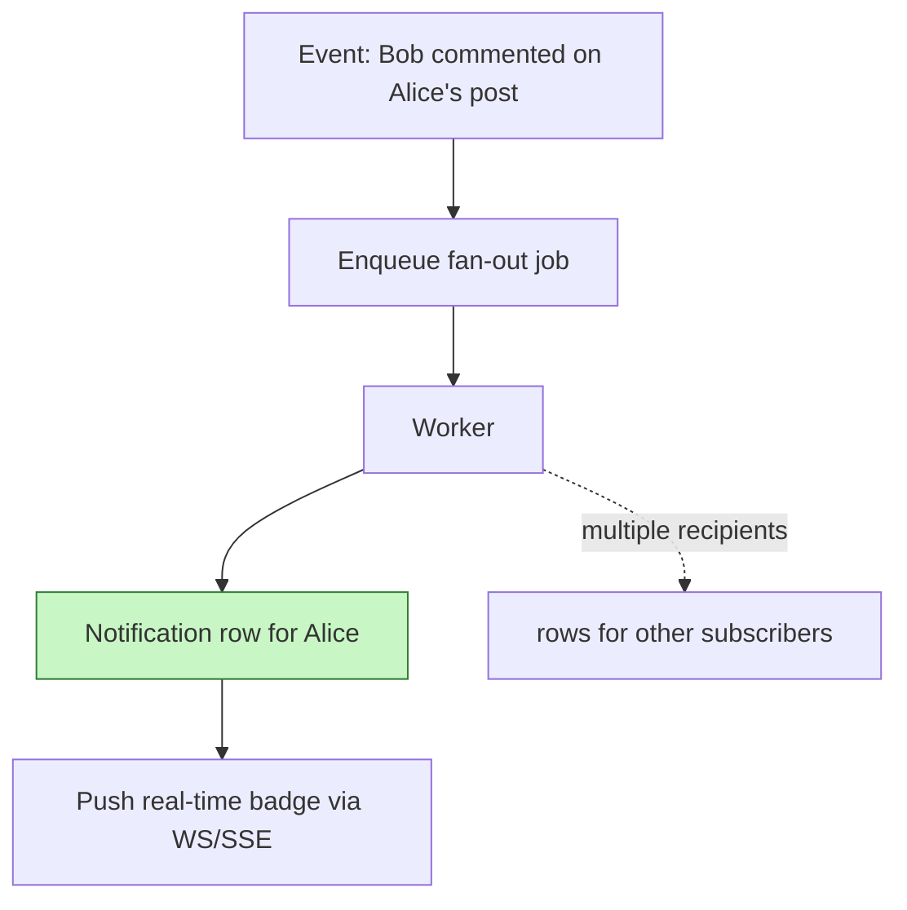
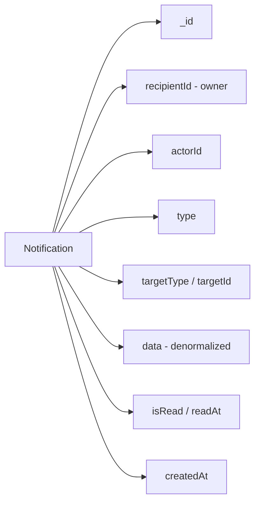

# 8. Design a Notification Feed

> **In one line:** Design the schema and API for a per-user notification feed (Facebook/GitHub-style) —
> the fan-out strategy, efficient listing and unread counts, mark-as-read, real-time delivery, and how it
> holds up under celebrity-scale fan-out.

> **Original prompt:** Create a schema to store user notifications and an API to mark them as "read".

## Overview

A notification feed shows each user a reverse-chronological list of events relevant to them ("Alice liked
your post", "Bob commented", "Your order shipped"), with an **unread badge** and the ability to **mark
things read**. The interesting design questions are:

- How are notifications *created* — write a row per recipient on each event (fan-out on write) or compute
  the feed on read (fan-out on read)?
- How do you list a user's feed and compute the unread badge cheaply, given it's read constantly?
- How do you mark **one / a set / all** as read efficiently?
- How do you deliver in real time, and how does it survive a celebrity with millions of followers?

## Real-World Context

- **Facebook, GitHub, LinkedIn** notification bells are per-user feeds backed by fan-out-on-write: when
  something happens, a row is written for each recipient so their feed is a simple, fast query.
- **The "celebrity problem"** (a user with 50M followers) is where naive fan-out-on-write explodes into
  tens of millions of writes per action; large systems use a **hybrid** (fan-out for normal users,
  compute-on-read for hot fan-outs).
- **Real-time badges** (the number that appears without refresh) are pushed over WebSocket/SSE, not
  polled, at scale.

The interview signal is articulating the fan-out trade-off and knowing that the unread *count* — hit on
every page load — must not be a scan.

## Requirements

**Functional**

- Create notifications from events (like, comment, follow, system, order update…).
- List a user's feed (paginated), filter to unread, and show an unread count.
- Mark one, a set, or all notifications as read; dismiss/delete.
- Optional: grouping ("5 people liked your post"), real-time delivery, multi-channel (push/email).

**Non-functional**

- **Performance:** feed listing and unread count are O(indexed lookup), not scans.
- **Scalability:** handle high write fan-out and read-heavy feeds; degrade gracefully for huge audiences.
- **Reliability:** notifications aren't silently lost; delivery is at-least-once.
- **Security:** a user sees and mutates only their own notifications.

## Fan-out: Where Notifications Come From

When an event happens, you either **write a row per recipient now** (fan-out on write) or **assemble the
feed at read time** (fan-out on read).

| Approach | When rows are created | Pros | Cons |
|---|---|---|---|
| **Fan-out on write** | One row per recipient at event time | Fast, simple reads | Write amplification for huge audiences |
| **Fan-out on read** | Computed from source events per request | Cheap writes | Expensive, complex reads |
| **Hybrid** | Write for most; compute for celebrities | Balances both | More moving parts |

For a per-user notification feed, **fan-out on write** is the standard default — reads dominate and a
notification is naturally a per-recipient record. Do the fan-out **asynchronously** via a queue so the
triggering request stays fast and spikes are absorbed.



## Schema (Mongoose)

A notification belongs to one **recipient**, references the **actor** and **target**, carries a **type**
and a flexible denormalized **data** blob, and tracks **read state**.



```typescript
import { Schema, model, Types } from "mongoose";

const notificationSchema = new Schema(
  {
    recipientId: { type: Types.ObjectId, ref: "User", required: true },
    actorId:     { type: Types.ObjectId, ref: "User", default: null },

    type: {
      type: String,
      required: true, // LIKE, COMMENT, FOLLOW, MENTION, ORDER_SHIPPED, SYSTEM
      enum: ["LIKE", "COMMENT", "FOLLOW", "MENTION", "ORDER_SHIPPED", "SYSTEM"],
    },
    targetType: { type: String, default: null }, // POST, COMMENT, ORDER...
    targetId:   { type: Types.ObjectId, default: null },

    // Denormalized payload so rendering needs no joins (actor name, thumbnail, etc.).
    data: { type: Schema.Types.Mixed, default: {} },

    isRead: { type: Boolean, default: false },
    readAt: { type: Date, default: null },
    expiresAt: { type: Date, default: null }, // optional TTL cleanup
  },
  { timestamps: true },
);

notificationSchema.index({ recipientId: 1, createdAt: -1 });          // main feed query
notificationSchema.index({ recipientId: 1, isRead: 1, createdAt: -1 });// unread filter/count
notificationSchema.index({ expiresAt: 1 }, { expireAfterSeconds: 0 }); // TTL cleanup

export const Notification = model("Notification", notificationSchema);
```

Interview points:

- **Denormalize the display payload** (`data`) so rendering the feed needs no joins — feeds are
  read-heavy and latency-sensitive, and the actor's name/avatar at the time of the event is what you want
  to show anyway. See [Index](../02-data-and-storage-concepts/05-index.md).
- **Two compound indexes** back the two hot queries: the feed (`recipientId + createdAt`) and the unread
  filter/count (`recipientId + isRead + createdAt`).

## API Design

| Method | Endpoint | Purpose |
|---|---|---|
| `GET` | `/notifications` | List the user's feed (cursor-paginated) |
| `GET` | `/notifications?unread=true` | Unread only |
| `GET` | `/notifications/unread-count` | Badge count |
| `PATCH` | `/notifications/:id/read` | Mark one read |
| `PATCH` | `/notifications/read` | Mark a set (by ids) or **all** read |
| `DELETE` | `/notifications/:id` | Dismiss/delete one |

Every query is scoped by `recipientId` from the authenticated token (see
[User Authentication System](./01-user-authentication-system.md)).

### Listing the Feed

Cursor-paginate so infinite scroll stays fast regardless of history size (see
[Cursor-Based Pagination](./03-cursor-based-pagination.md)):

```typescript
const items = await Notification.find({
  recipientId: req.user.id,
  ...(unreadOnly && { isRead: false }),
  ...(cursor && { _id: { $lt: decodeCursor(cursor) } }),
})
  .sort({ _id: -1 })
  .limit(limit + 1)
  .lean();
```

### Unread Count (the badge)

For modest feeds, a filtered count on the indexed field is fine:

```typescript
const unread = await Notification.countDocuments({ recipientId: req.user.id, isRead: false });
```

**At scale this is the trap:** the badge is requested on *every* page load, so a count query per load is
expensive. Maintain a **denormalized counter** (in the user document or Redis) — increment on create,
decrement on read — so the badge is an O(1) read. The trade-off is keeping that counter in sync.

### Marking as Read

Support one, a set, and all — using a bulk update so "mark all read" is a single operation, not N writes:

```typescript
// One:
await Notification.updateOne(
  { _id: id, recipientId: req.user.id, isRead: false },
  { $set: { isRead: true, readAt: new Date() } },
);

// A set, or all:
await Notification.updateMany(
  { recipientId: req.user.id, isRead: false, ...(ids && { _id: { $in: ids } }) },
  { $set: { isRead: true, readAt: new Date() } },
);
// Then decrement the denormalized unread counter by the number actually modified.
```

Scoping the filter by `recipientId` enforces authorization; filtering on `isRead: false` keeps the
counter decrement accurate (only actually-unread rows are counted).

## Grouping / Aggregation (optional)

To show "5 people liked your post" instead of five rows:

- **Aggregate on write:** if a recent unread notification with the same `type`+`target` exists, update it
  (bump a count, append the actor) instead of inserting a new row.
- **Aggregate on read:** group by `type`+`target` when assembling the feed.

Aggregation-on-write keeps the feed compact and the unread count meaningful, at the cost of an
upsert-style write path.

## Real-Time Delivery

To update the badge/feed live, after writing the row push it to the user's connected clients over
[WebSocket](../04-messaging-and-communication-concepts/05-websocket.md) or
[Server-Sent Events](../04-messaging-and-communication-concepts/06-server-sent-events.md) — SSE is a great
fit for one-directional server→client notification streams. Clients that are offline simply see the
notifications next time they load the feed (the durable rows are the source of truth); real-time is an
enhancement layered on top, not the storage mechanism.

## Performance

- **Indexed feed & unread queries:** both hot paths are backed by compound indexes, so they're index scans
  over one recipient's rows, never collection scans.
- **Denormalized unread counter:** turns the per-page-load badge into an O(1) read.
- **Denormalized `data` payload:** no joins to render each notification.
- **Cursor pagination + `.lean()`:** keeps feed reads fast and cheap at any history depth.

## Scalability

- **Async fan-out via a queue** absorbs write spikes and keeps the triggering action fast.
- **The celebrity problem:** fan-out-on-write for a user with tens of millions of followers means tens of
  millions of inserts per action — a write storm. The standard fix is a **hybrid**: fan out to normal
  followers on write, but for celebrity sources, don't fan out — pull those into the recipient's feed on
  read from the source's activity. This bounds write amplification.
- **Sharding:** shard by `recipientId` so a user's notifications colocate and their feed query hits one
  shard (see [Sharding](../02-data-and-storage-concepts/06-sharding.md)).
- **Retention:** feeds grow unbounded; use a TTL index or archival to cap the collection, and often only
  keep the most recent N per user.

## Security

- **Ownership on every operation:** scope all reads and updates by `recipientId` from the token, so a user
  can never list or mark another user's notifications. This is the single most important control here.
- **No leakage in the payload:** the denormalized `data` is sent to the recipient, so don't embed anything
  the recipient shouldn't see (e.g. a private email of the actor).
- **Delivery abuse:** rate-limit notification-generating actions (spam likes/follows) so a bad actor can't
  flood someone's feed; validate/enforce that the actor is allowed to trigger the notification.
- **Real-time channel auth:** authenticate and authorize the WebSocket/SSE connection so users only
  subscribe to their own notification stream.

## Reliability & Edge Cases

- **At-least-once fan-out:** the queue may deliver a job more than once; make notification creation
  idempotent (e.g. a dedupe key per `event+recipient`) so retries don't create duplicates.
- **Counter drift:** the denormalized unread counter can drift if a write partially fails; reconcile it
  periodically against the actual unread count, and update it by the *number of rows actually modified* on
  mark-read, not by an assumed value.
- **Mark-all race:** a notification arriving during a "mark all read" is fine — it stays unread, which is
  correct.
- **Offline recipients:** durable rows are the source of truth; missed real-time pushes are recovered on
  next feed load.

## Tips

- **Fan-out on write** (async via a queue) so reads are a simple indexed query; go **hybrid** for
  celebrity-scale audiences.
- **Denormalize the `data` payload** so rendering needs no joins.
- Back the feed with `{ recipientId, createdAt }` and unread with `{ recipientId, isRead, createdAt }`.
- Keep a **denormalized unread counter** (Redis/user doc) at scale; reconcile periodically.
- Use **`updateMany`** for "mark all read"; decrement the counter by rows actually modified.
- **Cursor-paginate**, **TTL-expire** old rows, and **scope every query by `recipientId`**.

## Trade-offs & Pitfalls

- **Fan-out on write vs on read:** write = fast reads, heavy writes for big audiences; read = cheap writes,
  expensive reads. Hybrid balances them but adds complexity.
- **Counting unread on every load doesn't scale** — denormalize the counter, then keep it in sync or it
  drifts.
- **Not scoping updates by `recipientId`** is an authorization hole.
- **Synchronous fan-out** on the triggering request adds latency and fails under spikes — do it async.
- **Unbounded retention** grows the collection forever — TTL or archive.
- **Over-normalizing** forces joins to render each row — denormalize the display payload instead.
- **At-least-once queues** can create duplicate notifications — dedupe with an idempotency key.

## System Design Cheat Sheet

```text
1. SOURCE      Fan-out on write (async) — hybrid for celebrities
2. SCHEMA      recipient + actor + type + target + denormalized data + isRead
3. RENDER      Denormalize display payload (no joins on read)
4. INDEX       {recipientId, createdAt} feed; {recipientId, isRead, createdAt} unread
5. LIST        Cursor pagination; unread filter
6. COUNT       Denormalized unread counter (O(1)); reconcile periodically
7. READ-STATE  updateOne / updateMany (one, set, all); decrement by modified count
8. REALTIME    Push via WS/SSE; durable rows are source of truth
9. SECURITY    Scope by recipientId; auth the real-time channel; rate-limit sources
10. SCALE      Shard by recipientId; TTL retention; idempotent (at-least-once) fan-out
```

## Interview Questions & Answers

### A. Fan-out & Creation

- **How are notifications created — fan-out on write or on read?**
  For a per-user notification feed I default to fan-out on write: when an event happens, I write one
  notification row per recipient, so each user's feed is a trivial, fast indexed query. Feeds are read far
  more than they're written, so it's worth paying at write time to make every read cheap. I do the fan-out
  asynchronously through a queue so the action that triggered it (the like, the comment) returns
  immediately and traffic spikes are absorbed by the queue rather than the request path.

- **What's the "celebrity problem" and how do you handle it?**
  Fan-out on write breaks down when one action has a huge audience — a celebrity with 50 million followers
  would generate 50 million inserts per post, a write storm that overwhelms the database. The standard fix
  is a hybrid model: fan out on write for normal-sized audiences, but for celebrity sources skip the
  fan-out and instead pull their activity into a follower's feed at read time. That caps write amplification
  while keeping reads fast for the common case. It's more complex, so I only reach for it when audience size
  actually demands it.

- **Why do the fan-out asynchronously?**
  Because the number of rows to write scales with the audience, and doing that inline would make the
  triggering request slow and fragile under load. Enqueuing a fan-out job lets the user's action complete in
  milliseconds, lets me smooth spikes by draining the queue at a controlled rate, and lets me retry on
  failure. The trade-off is eventual consistency — the notification appears a moment later — which is
  perfectly acceptable for a notification feed.

### B. Schema & Rendering

- **What does a notification document store, and why denormalize?**
  It stores the recipient, the actor, a type, a polymorphic target (type + id), a flexible `data` payload,
  and read state. I denormalize the display data — the actor's name and avatar, the post title, a thumbnail
  — directly into the row so rendering the feed needs zero joins. Feeds are extremely read-heavy and
  latency-sensitive, and semantically you want to show what things were called at the time of the event, so
  denormalization is both a performance win and arguably more correct.

- **How do you support many different notification types?**
  A `type` enum classifies the event, a polymorphic `targetType`/`targetId` points at whatever the
  notification is about (post, comment, order), and the flexible `data` blob carries whatever that specific
  type needs to render. The client renders per type using the `data`. This keeps one collection and one
  query path while supporting an open-ended set of notification kinds.

### C. Listing & Counting

- **How do you list the feed and paginate it?**
  A find scoped by `recipientId`, sorted newest-first, backed by a `{ recipientId, createdAt }` compound
  index, and cursor-paginated so infinite scroll stays constant-time no matter how much history the user
  has. I fetch `limit + 1` to know if there's a next page without a count, and use `.lean()` to skip
  document hydration.

- **How do you compute the unread badge, and why is the naive way a problem?**
  The naive way is a `countDocuments({ recipientId, isRead: false })` on every page load — and because the
  badge is requested constantly, that count query becomes one of your hottest, most expensive operations. At
  scale I maintain a denormalized unread counter, in the user document or Redis, that I increment when a
  notification is created and decrement when notifications are marked read, so reading the badge is O(1).
  The cost is keeping the counter in sync, which I handle by decrementing by the number of rows actually
  modified and reconciling periodically against the true count.

### D. Mark-as-Read & Security

- **How do you implement mark-one, mark-set, and mark-all?**
  Mark-one is an `updateOne` filtered by `_id` and `recipientId`. Mark-set and mark-all are a single
  `updateMany` over the user's unread notifications, optionally constrained by `_id: { $in: ids }` — so
  "mark all read" is one database operation, not N writes. I filter on `isRead: false` so I only touch
  actually-unread rows, and I decrement the unread counter by the number the update reports as modified so
  it stays accurate.

- **How do you ensure a user can't read or modify someone else's notifications?**
  Every query and update is scoped by `recipientId` taken from the authenticated token, never from the
  request body. So even if a user guesses another notification's id, the `recipientId` filter means the
  update matches zero documents and the read returns nothing. That server-side ownership scoping is the core
  authorization control, and I apply the same principle to the real-time channel by authenticating the
  WebSocket/SSE subscription so a user can only receive their own stream.

### E. Real-Time, Reliability & Scale

- **How do you deliver notifications in real time?**
  After the durable row is written, I push it to the user's connected clients over WebSocket or SSE — SSE is
  a natural fit since notifications are one-directional server→client. The durable database rows remain the
  source of truth, so real-time is purely an enhancement: if a user is offline or the push is missed, they
  still see everything on their next feed load. That separation keeps the system correct even when the
  real-time layer has hiccups.

- **Your fan-out queue is at-least-once — how do you avoid duplicate notifications?**
  I make notification creation idempotent with a dedupe key derived from the event and recipient (e.g.
  `event_id + recipient_id`), enforced by a unique index or an upsert. So if the queue delivers the same
  fan-out job twice, the second insert is a no-op rather than a duplicate row. I apply the same idempotency
  thinking to the read-state transitions so retries and the real-time path can't double-count.

- **How do you keep the feed from growing forever?**
  Notification history is rarely useful beyond a window, so I cap it — a TTL index expires rows after, say,
  90 days, and/or I retain only the most recent N per user and archive the rest. This bounds collection
  size and keeps indexes small and fast. Combined with sharding by `recipientId`, each user's feed stays on
  one shard and remains a cheap, local query even as the overall system grows.

---

_Notes: (add your own content here)_
