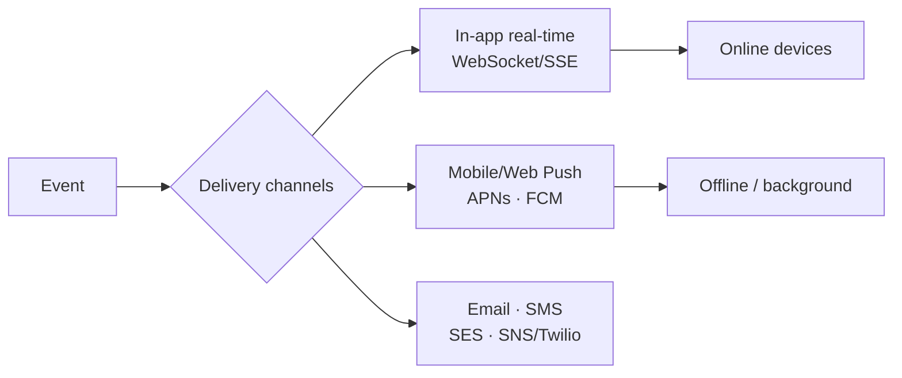
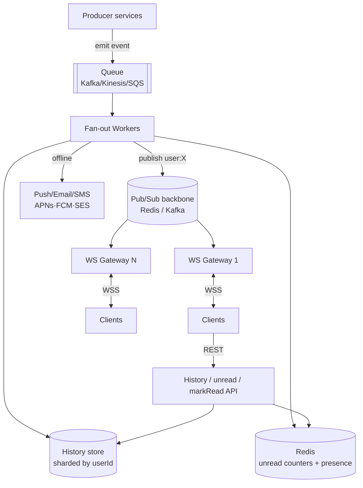
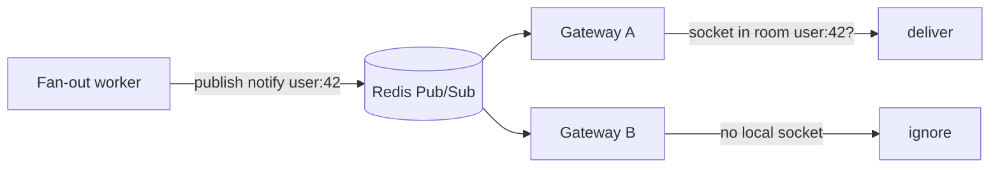
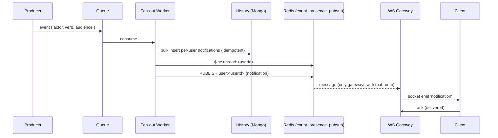
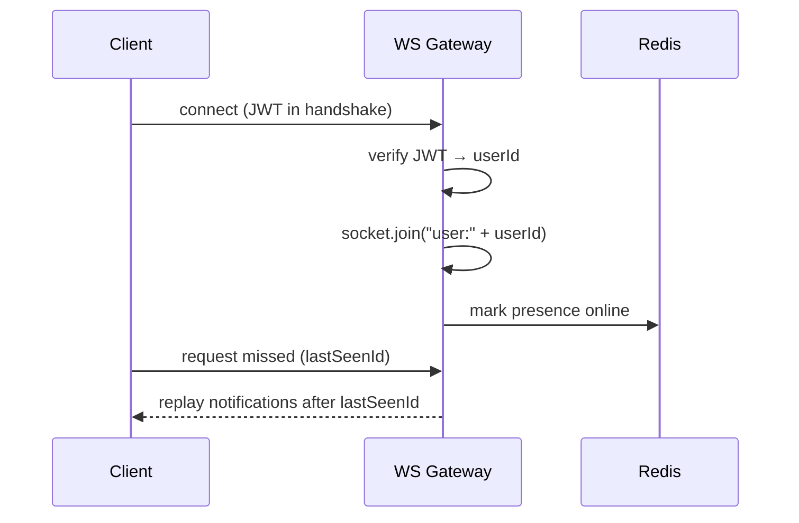
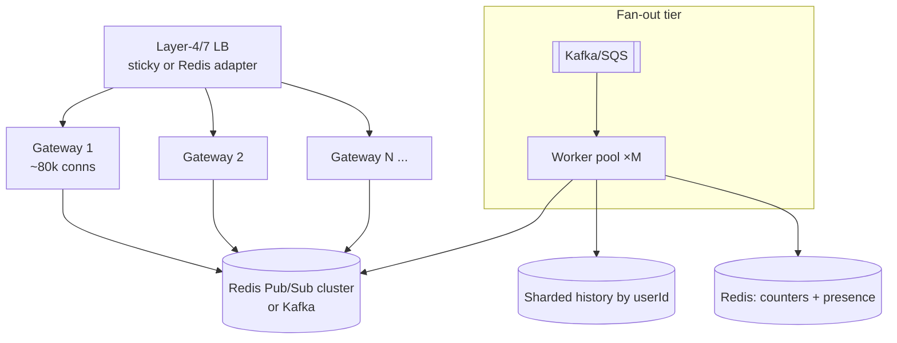

# 8. Design a Real-Time Notification System

> **In one line:** Design a **real-time notification system** — the schema, the delivery channels
> (in-app WebSocket, mobile/web push, email, SMS), fan-out strategies, delivery guarantees, and
> **how to scale it to millions of concurrent users** getting notifications at the same time.

> **Original prompt:** Create a schema to store user notifications and an API to mark them as "read" —
> then grow it into a large-scale, real-time system.

## Overview

"Store a notification and mark it read" is the easy 10%. The real problem is **delivery**: getting an
event to the right users **instantly**, across web and mobile, for **millions of concurrently connected
clients**, without losing messages or melting the database.

This write-up answers the questions an interviewer actually probes:

- How does a notification reach a user in **real time** — WebSocket, SSE, long-poll, or push?
- How do you **fan out** one event to many recipients (and survive the *celebrity* case)?
- How do you keep **millions of open connections** alive across many servers?
- What are the **delivery guarantees** (at-least-once, dedup, ordering, offline catch-up)?
- Which **AWS** building blocks map to each piece?
- How do you keep it **secure**, **cheap**, and **fast** (unread counts, batching, coalescing)?

It ships a runnable full-stack implementation in [`./implementation/`](./implementation/): a
**NestJS + WebSocket (Socket.IO) + Mongoose + Zod** backend and a
**Next.js + React + Redux Toolkit (RTK Query) + socket.io-client** UI with a live unread badge.

## Functional Requirements

1. **Emit** a notification to a single user or to many users (fan-out) for an event.
2. **Deliver in real time** to any device the user has open (in-app), and optionally via **push /
   email / SMS** when offline.
3. Store a per-user **notification history** with **cursor pagination**.
4. Track and expose an **unread count**; **mark one/all as read**.
5. **User preferences**: mute types/channels; **coalesce** noisy notifications ("3 new likes").
6. **Offline catch-up**: deliver what was missed on reconnect.

## Non-Functional Requirements

| Attribute | Target / approach |
|---|---|
| **Scale** | **10M+ concurrently connected** clients; 100k+ notifications/sec bursts |
| **Delivery latency** | Real-time (in-app) p99 < 1s from emit to client |
| **Availability** | 99.99% — stateless gateways, replicated stores, multi-AZ |
| **Delivery guarantee** | At-least-once + client-side **dedup** (idempotency key) |
| **Durability** | History persisted; unread counts recoverable |
| **Ordering** | Best-effort per-user ordering (monotonic ids) |
| **Cost** | Fan-out and connection cost dominate — batch, coalesce, cache counts |
| **Security** | Authenticated socket handshake, per-user channels, WSS/TLS |

## A Realistic Interview Conversation

> **I** = Interviewer, **C** = Candidate.

**I:** Design a real-time notification system for, say, 10 million concurrent users.

**C:** Let me split it into three planes: **ingestion** (events come in), **fan-out** (decide who gets
what), and **delivery** (push to devices). The hard parts at 10M scale are keeping millions of live
connections and fanning out efficiently. I'd also separate **in-app real-time** (WebSocket) from
**push/email/SMS** (via providers), since they scale differently.

**I:** Start with real-time delivery. WebSocket, SSE, or polling?

**C:** **WebSocket** for bidirectional, low-latency in-app delivery. SSE is fine for one-way server→client
and is simpler, but WebSocket handles presence/acks better. Long-polling is a fallback. The catch:
a single server holds maybe 50–100k connections, so for 10M I need **hundreds of gateway instances**,
and a way to route "notify user X" to whichever instance holds X's socket.

**I:** How do you route to the right instance?

**C:** Each connected user joins a **room / channel keyed by userId**. The gateways share a **pub/sub
backbone** (Redis Pub/Sub, or the Socket.IO Redis adapter / a Kafka topic). When a worker wants to
notify user X, it publishes to the backbone; every gateway subscribed forwards to any local socket in
X's room. So I don't need to know *which* server holds X — the fan-out layer broadcasts and the owning
server delivers. Presence (who's online, on which instance) lives in Redis.

**I:** Now fan-out. A user with 10M followers posts. How do you notify everyone?

**C:** That's the classic **fan-out-on-write vs fan-out-on-read** trade-off, same as feeds.
**Fan-out-on-write (push)**: when the event happens, write a notification row per recipient — great for
reads (each user's feed is precomputed) but a write storm for celebrities. **Fan-out-on-read (pull)**:
store the event once, assemble each user's notifications at read time — cheap writes, expensive reads.
The practical answer is **hybrid**: fan-out-on-write for normal users, and for celebrities/huge
audiences, don't write 10M rows synchronously — enqueue the fan-out and process it in **batches via a
queue + workers**, and/or pull for very large followings.

**I:** Won't writing 10M rows still be huge?

**C:** Yes, so it's **asynchronous and batched**. The event goes onto a queue (Kafka/Kinesis/SQS); a
pool of workers expands the audience in chunks, writes per-user records in bulk, updates unread
counters, and publishes real-time events only to the subset currently **online** (from presence). Users
who are offline just get the persisted row + a push notification; they see it on next open.

**I:** Delivery guarantees?

**C:** **At-least-once.** The client acks delivery; unacked messages are retried on reconnect. Each
notification carries an **idempotency id** so the client dedupes. Ordering is best-effort per user via a
monotonic id. Failed push jobs go to a **DLQ**. Offline users are handled by persistence: on reconnect
the client fetches everything after its last-seen id.

**I:** Unread count for millions — you won't `count()` the collection each time.

**C:** No. I keep a **denormalized unread counter per user in Redis** (and a durable copy), `$inc` on
new, decrement/reset on read. The badge reads Redis — O(1).

**I:** How does this look on AWS?

**C:** Connections terminate at **API Gateway WebSocket** or an **ALB → ECS/EKS** fleet of gateways;
**ElastiCache Redis** for pub/sub + presence + unread counts; **SQS/SNS/Kinesis** for the fan-out
pipeline; **DynamoDB** (or sharded Mongo) for history; **SNS Mobile Push / Pinpoint** for APNs/FCM;
**SES** for email. Autoscale gateways on connection count.

**I:** Security?

**C:** The WebSocket **handshake is authenticated** (JWT), the socket may only subscribe to **its own**
user channel (server enforces the room = authenticated userId), everything is **WSS/TLS**, and I
**rate-limit** emits and connections to prevent abuse.

## Notification Types & Channels



- **In-app real-time** — the focus here (WebSocket); requires an open connection.
- **Push** — for offline/background; goes through OS providers (APNs/FCM).
- **Email/SMS** — digest or high-importance; async, provider-based.

## A Mental Model: Three Planes

1. **Ingestion** — events arrive (from services) and hit a durable queue.
2. **Fan-out** — workers expand the audience, persist per-user records, update counters.
3. **Delivery** — a pub/sub backbone routes to the gateway holding each online socket; push for offline.

## High-Level Design (HLD)



Two independent scaling axes: the **connection tier** (gateways, scaled by open connections) and the
**fan-out tier** (workers, scaled by event volume). They communicate only through the **pub/sub
backbone**, so neither needs to know the other's topology
([Pub/Sub](../../04-messaging-and-communication-concepts/02-pub-sub.md),
[Message Queue](../../04-messaging-and-communication-concepts/01-message-queue.md),
[WebSocket](../../04-messaging-and-communication-concepts/05-websocket.md)).

## Real-Time Delivery: Transport Choices

| Transport | Direction | Pros | Cons | Use |
|---|---|---|---|---|
| **WebSocket** | Bi-directional | Low latency, acks, presence | Stateful conns, needs scaling | **In-app real-time** ✅ |
| **SSE** | Server→client | Simple, HTTP, auto-reconnect | One-way, connection limits | Read-only streams |
| **Long polling** | Client pulls | Works everywhere | Latency + overhead | Fallback |
| **Mobile/Web Push** | Server→device | Works when app closed | Provider limits, opt-in | Offline/background |

### Connection routing (the key to scale)



A user's socket joins **room `user:<id>`**. Workers never track which gateway owns a user — they
**publish** and the owning gateway delivers. This decouples fan-out from connection placement, so both
scale independently.

## Fan-Out Patterns (the core trade-off)

| Pattern | When event happens | Read cost | Write cost | Best for |
|---|---|---|---|---|
| **Fan-out-on-write (push)** | Write a row per recipient | Cheap (precomputed) | Heavy for big audiences | Normal users |
| **Fan-out-on-read (pull)** | Store event once | Heavy (assemble on read) | Cheap | Celebrities / huge fanout |
| **Hybrid** | Push for most, pull for celebrities | Balanced | Balanced | **Real systems** ✅ |

For huge audiences, fan-out is **asynchronous + batched** through a queue so a viral event never blocks
the producer or writes 10M rows synchronously.

## Low-Level Design (LLD)

### Schema

```typescript
// Per-user notification record (fan-out-on-write).
const notificationSchema = new Schema({
  userId:   { type: String, required: true, index: true },  // recipient
  type:     { type: String, required: true },               // LIKE | COMMENT | FOLLOW | SYSTEM
  actorId:  { type: String },                                // who triggered it
  entityId: { type: String },                                // the thing (post/comment)
  payload:  { type: Object, default: {} },                   // render data
  dedupeKey:{ type: String, index: true },                   // idempotency (at-least-once)
  read:     { type: Boolean, default: false },
}, { timestamps: true });

// Feed query + cursor pagination, newest-first.
notificationSchema.index({ userId: 1, createdAt: -1, _id: -1 });
// Idempotent fan-out: never create the same notification twice.
notificationSchema.index({ userId: 1, dedupeKey: 1 }, { unique: true, sparse: true });
```

Unread counts are **denormalized in Redis** (`unread:<userId>`), with a durable fallback — never
`count()` on the read path.

### Service contracts

```text
emitToUser(userId, notif)         → persist (idempotent) + $inc unread + publish user:<id>
emitToMany(userIds[], notif)      → batched bulk insert + counters + publish to online subset
list(userId, { limit, cursor })   → cursor-paginated history
unreadCount(userId)               → O(1) from Redis
markRead(userId, ids[] | 'all')   → set read + decrement/reset counter + publish 'read'
```

### Emit + deliver flow



### Connect / subscribe flow



### Project structure

```text
server/src/
├── main.ts                       # bootstrap + (optional) Redis WS adapter
├── config.ts
├── common/ zod pipe, cursor
└── notifications/
    ├── notification.schema.ts     # per-user record + indexes
    ├── notifications.gateway.ts    # Socket.IO: auth handshake, rooms, emit
    ├── notifications.service.ts    # persist, fan-out, unread, markRead
    ├── notifications.controller.ts # REST: history / unread / markRead / emit(demo)
    └── notifications.dto.ts
```

## Scaling to Millions of Concurrent Users



Techniques that make 10M+ work:

- **Horizontal gateways** — each holds ~50–100k connections; scale out on connection count. Use
  **sticky sessions** (LB) or the **Redis adapter** so any gateway can deliver.
- **Pub/sub backbone** — Redis Pub/Sub or Kafka fans a "notify user:X" to all gateways; the owner
  delivers. This is what lets connection placement and fan-out scale **independently**.
- **Async, batched fan-out** — queue + worker pool; bulk-insert per-user rows; only push real-time to
  the **online** subset (from presence).
- **Denormalized unread counters** in Redis — O(1) badge reads
  ([Cache](../../02-data-and-storage-concepts/08-cache.md)).
- **Shard history by `userId`** so each user's data colocates
  ([Sharding](../../02-data-and-storage-concepts/06-sharding.md),
  [Consistent Hashing](../../02-data-and-storage-concepts/12-consistent-hashing.md)).
- **Backpressure & coalescing** — drop/merge duplicate notifications ("5 new likes"); apply
  [backpressure](../../04-messaging-and-communication-concepts/04-backpressure.md) so a spike can't
  overwhelm gateways.
- **Rate limiting** emits/connections
  ([Rate Limiting](../../05-reliability-performance-and-modern-concepts/02-rate-limiting.md)).

## Should We Use AWS? Cloud Mapping

Yes — managed services remove most of the operational load. A pragmatic mapping:

| Concern | AWS service |
|---|---|
| WebSocket connections | **API Gateway (WebSocket)** or **ALB → ECS/EKS** gateway fleet |
| Compute | **ECS Fargate / EKS** (gateways + workers), **Lambda** for light fan-out |
| Pub/sub + presence + counters | **ElastiCache for Redis** (adapter, presence, unread) |
| Event ingestion / fan-out | **Kinesis / SQS / MSK (Kafka)** + **SNS** for topics |
| History store | **DynamoDB** (PK `userId`, SK `createdAt`) or sharded DocumentDB |
| Mobile/web push | **SNS Mobile Push** / **Pinpoint** (APNs, FCM) |
| Email / SMS | **SES** / **SNS / Pinpoint** |
| Edge / static | **CloudFront** |
| DLQ / retries | **SQS DLQ**, Lambda destinations |

> API Gateway WebSocket is fully managed (no connection servers to run) but has per-message cost and
> limits; a self-managed ECS/EKS fleet with the Redis adapter gives more control at high, steady scale.
> Choose based on connection volume and cost profile.

## Delivery Guarantees & Reliability

- **At-least-once + dedup** — every notification has a `dedupeKey`/id; a unique index prevents double
  writes and the client dedupes on id ([Idempotency](../../03-distributed-systems-concepts/07-idempotency.md)).
- **Offline catch-up** — persistence is the safety net; on reconnect the client asks for everything
  after its `lastSeenId`.
- **Retries + DLQ** — failed push/fan-out jobs retry with backoff, then land in a
  [dead-letter queue](../../04-messaging-and-communication-concepts/03-dead-letter-queue.md).
- **Ordering** — best-effort per user via monotonic ids; the client sorts by id.
- **Graceful degradation** — if the real-time plane is down, notifications still persist and show on
  next fetch; the badge is eventually consistent.

## Security

- **Authenticated handshake** — verify a JWT on the WebSocket connection; reject otherwise (401).
- **Channel authorization** — a socket may only join **its own** `user:<id>` room; the server sets the
  room from the *authenticated* id, never from a client-supplied one.
- **WSS/TLS** everywhere; **rate-limit** connections and emits; cap payload size.
- **No sensitive data** in the notification payload — send ids/rendering data, fetch details over authed REST.
- **Abuse controls** — per-actor emit limits, mute/block, spam detection.

## All Solution Patterns (summary)

| Concern | Options | Chosen | Why |
|---|---|---|---|
| Transport | **WebSocket** · SSE · long-poll · push | WebSocket (+push offline) | Bi-directional, low-latency, acks |
| Cross-instance routing | Sticky-only · **Pub/sub backbone** | Redis Pub/Sub adapter | Decouples fan-out from connection placement |
| Fan-out | On-write · On-read · **Hybrid** | Hybrid + async batched | Handles normal + celebrity |
| Unread count | `count()` · **Redis counter** | Redis counter | O(1) badge |
| Guarantee | At-most · **At-least-once + dedup** | At-least-once + dedup | No lost notifications |
| Offline | Ignore · **Persist + replay** | Persist + replay on reconnect | Reliable across devices |

## Implementation

A runnable full-stack implementation lives in [`./implementation/`](./implementation/):

| Layer | Stack | Highlights |
|---|---|---|
| **`server/`** | NestJS + Socket.IO + Mongoose + Zod | Authed WS handshake, `user:<id>` rooms, emit-to-user/many, idempotent persistence, Redis-adapter-ready fan-out, unread counter, cursor history, markRead |
| **`web/`** | Next.js + React + Redux Toolkit (RTK Query) + socket.io-client | Live bell + unread badge, list, mark-all-read, socket updates merged into the RTK cache |

| Design element | Where in the code |
|---|---|
| WebSocket gateway (rooms, auth) | `server/src/notifications/notifications.gateway.ts` |
| Emit + fan-out + idempotency | `server/src/notifications/notifications.service.ts` |
| Unread counter + markRead | `notifications.service.ts` |
| Cursor history + schema/indexes | `notification.schema.ts` + `notifications.service.ts` |
| Optional Redis adapter (scale-out) | `server/src/main.ts` (config-gated) |
| Live client (socket + RTK cache) | `web/src/hooks/useNotificationsSocket.ts` + `store/notificationsApi.ts` |

The backend is verified by an **end-to-end test** using a real `socket.io-client`: a client connects and
joins its room, an emit is delivered **over the socket in real time**, history + unread count reflect
it, and `markRead` clears the count — plus idempotent (deduped) emits.

## Tips

- Separate the **connection tier** from the **fan-out tier**; connect them via a **pub/sub backbone**.
- Route by **`user:<id>` rooms** so workers publish without knowing which gateway owns a user.
- Make fan-out **async + batched**; only push real-time to **online** users, persist for the rest.
- Keep **unread counts in Redis** (O(1)); never `count()` on read.
- Guarantee **at-least-once + client dedup**; replay missed notifications on reconnect.
- **Authenticate the handshake** and pin each socket to its **own** channel.

## Trade-offs & Pitfalls

- **Sticky-only routing** (no pub/sub) can't deliver to a user whose socket is on another instance —
  add a backbone.
- **Fan-out-on-write for celebrities** is a write storm — go async/batched or pull for huge audiences.
- **`count()` for unread** doesn't scale — denormalize in Redis.
- **At-most-once delivery** loses notifications on disconnect — use at-least-once + dedup + replay.
- **Trusting client-supplied channel/userId** is an authz hole — derive it from the token.
- **Fat payloads** over the socket waste bandwidth — send ids, hydrate over REST.

## System Design Cheat Sheet

```text
1.  CHANNELS     In-app (WS) + push (APNs/FCM) + email/SMS
2.  PLANES       Ingestion → Fan-out → Delivery
3.  TRANSPORT    WebSocket (+SSE/poll fallback, push offline)
4.  ROUTING      user:<id> rooms + Pub/Sub backbone (Redis adapter/Kafka)
5.  FAN-OUT      Hybrid: on-write for most, async/batched/pull for celebrities
6.  STORE        Per-user history sharded by userId; cursor pagination
7.  COUNTS       Denormalized unread counter in Redis (O(1))
8.  GUARANTEE    At-least-once + dedup + offline replay; DLQ
9.  SCALE        Horizontal gateways (~80k conns) + worker pool + Redis/Kafka
10. AWS          API GW WS/ALB+ECS · ElastiCache · SQS/Kinesis/MSK · DynamoDB · SNS Push/SES
11. SECURITY     Authed WSS handshake · own-channel authz · rate limit
12. TRADE-OFF    Push vs pull fan-out; managed API GW vs self-managed gateways
```

## Interview Questions & Answers

### A. Requirements
- **Which channels?** — In-app real-time (WS) + push for offline + email/SMS for digests.
- **How many concurrent users?** — Design for millions; drives the connection tier + pub/sub.
- **Delivery guarantee?** — At-least-once with client dedup; persist for offline.
- **Do we need unread counts?** — Yes, denormalized in Redis.

### B. Real-Time Transport
- **WebSocket vs SSE vs polling?** — WS for bidirectional low-latency; SSE one-way; polling fallback.
- **How many connections per server?** — ~50–100k; scale horizontally.
- **How do you route to the right server?** — `user:<id>` rooms + pub/sub backbone; owner delivers.
- **What is presence?** — Who's online + on which instance, tracked in Redis.

### C. Fan-Out & Scale
- **Fan-out-on-write vs on-read?** — Write = cheap reads/heavy writes; read = opposite; use hybrid.
- **The celebrity problem?** — Async, batched fan-out via a queue; pull for huge audiences.
- **How do you notify only online users in real time?** — Publish to their rooms; persist + push for offline.
- **How do you keep unread O(1)?** — Redis counter, `$inc`/reset; never `count()`.
- **How do you shard history?** — By `userId`.

### D. Reliability & Security
- **How do you avoid duplicates?** — Idempotency `dedupeKey` + unique index + client dedup.
- **How do offline users catch up?** — Persist; replay after `lastSeenId` on reconnect.
- **What about failures?** — Retries with backoff → DLQ; system degrades to persisted + fetch.
- **How do you secure the socket?** — Authenticated JWT handshake; socket joins only its own channel; WSS.
- **AWS building blocks?** — API GW WS/ALB+ECS, ElastiCache, SQS/Kinesis/MSK, DynamoDB, SNS Push/SES.
- **Biggest trade-offs?** — Push vs pull fan-out, and managed API Gateway WS vs a self-managed gateway fleet.
