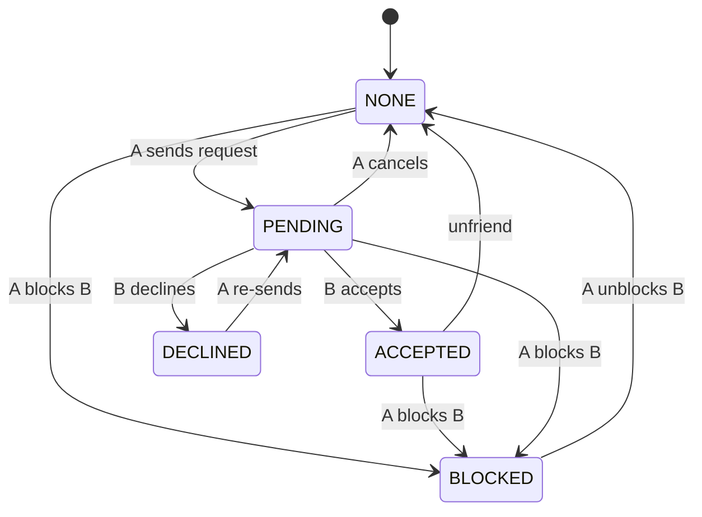
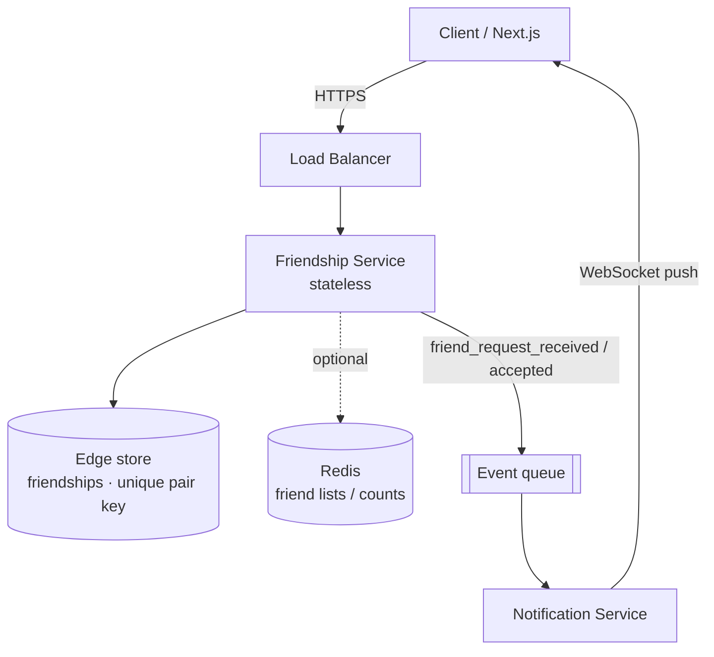
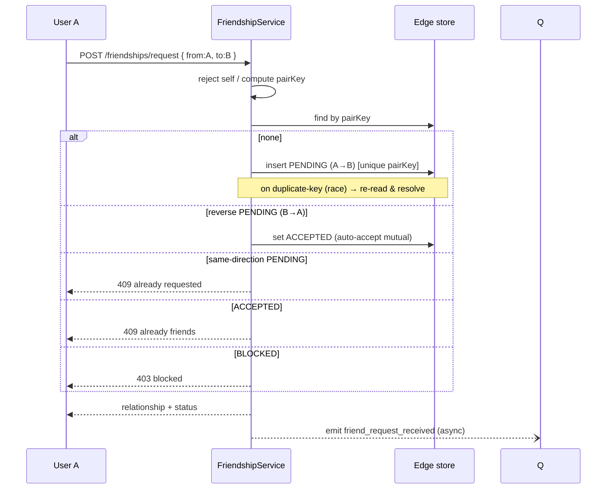
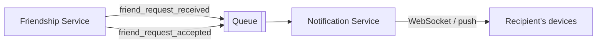

# 9. Design a Friend Request System

> **In one line:** Design the relationship graph and state machine behind friend requests — send /
> accept / decline / cancel / unfriend / **block** — modeled so status checks and friend-list reads are
> fast, correct under concurrency, safe against abuse, and scalable to a huge social graph, with
> real-time notifications when a request arrives.

> **Original prompt:** Design the data model to handle `friend_request_sent`, `accepted`, and `blocked` states.

## Overview

A friend system looks like a couple of buttons, but underneath it's a **relationship graph with a state
machine**, and the modeling choice decides whether it stays correct and fast:

- How do you store a relationship so **"are we friends?"** and **"list my friends"** are both cheap?
- What are the **states and transitions** (none → pending → friends / declined; blocked overrides)?
- What happens when **A and B send a request at the same time**?
- How do you enforce **blocking** (a blocked user can't request or see you)?
- How do you stop **spam** friend requests, and keep users' actions **authorized**?
- How does the recipient get a **real-time notification** when a request arrives?
- How does it scale to a **billion-edge** social graph?

This write-up covers the requirements, every relationship-modeling pattern, the state machine, the high-
and low-level design, concurrency, security, scaling, real-time notification integration, and a runnable
full-stack implementation in [`./implementation/`](./implementation/): a **NestJS + Mongoose + Zod** API
and a **Next.js + React + Redux Toolkit (RTK Query)** UI.

## Functional Requirements

1. **Send** a friend request from A to B.
2. **Accept** / **decline** an incoming request; **cancel** an outgoing request.
3. **Unfriend** an existing friend.
4. **Block** / **unblock** a user (blocking removes any friendship/pending request and prevents new ones).
5. List **friends**, **incoming** requests, and **outgoing** requests.
6. Query the **relationship status** between the current user and another.
7. **Notify** the recipient in real time when they receive (or someone accepts) a request.

## Non-Functional Requirements

| Attribute | Target / approach |
|---|---|
| **Latency** | Status check & friend-list read p99 < 100 ms (indexed) |
| **Read/write** | Read-heavy (status checks, friend lists) — index + cache |
| **Scale** | Hundreds of millions of users, billions of edges |
| **Consistency** | A friendship is symmetric and must never be half-created |
| **Concurrency** | Simultaneous A→B and B→A must resolve deterministically (no duplicates) |
| **Security** | Only act on your own relationships; enforce blocks; rate-limit requests |
| **Availability** | 99.9%; stateless services + replicated store |

## A Realistic Interview Conversation

> **I** = Interviewer, **C** = Candidate.

**I:** Design a friend request system with sent / accepted / blocked states.

**C:** The core is modeling a **relationship between two users** with a **state machine**. First
question: is friendship **symmetric** (Facebook-style "friends") or **asymmetric** (Twitter-style
"follow")? This is symmetric, so once accepted, A and B are mutually friends.

**I:** Symmetric. How do you store it?

**C:** The cleanest source of truth is **one row per pair** with a `status` — `PENDING`, `ACCEPTED`,
`DECLINED`, `BLOCKED` — plus who initiated it (requester/addressee) so I know the *direction* of a
pending request or a block. To guarantee there's never a duplicate or a "half friendship", I compute a
**canonical pair key** = the two ids sorted and joined, with a **unique index** on it. One pair, one row.

**I:** Won't "list my friends" be slow if it's one row per pair?

**C:** For moderate scale it's fine: index on `(requester, status)` and `(addressee, status)`, or a
single `participants` array field indexed, so I can query "rows where I'm a participant and status =
ACCEPTED". For very large scale (billions of edges) I'd **denormalize into a mirrored adjacency list** —
two rows per friendship (A→B and B→A) — so each user's friends are a single-partition scan, sharded by
userId. That trades write amplification (2 writes) for O(1) friend-list reads.

**I:** A and B both hit "Add friend" at the same instant. What happens?

**C:** Without care you'd get two `PENDING` rows (A→B and B→A). The **canonical pair key + unique index**
prevents the duplicate: the second insert fails, and I handle it — if there's already a **reverse
pending** request, the sensible UX is to **auto-accept** (both wanted to be friends). So a simultaneous
mutual request becomes a friendship, not two dangling requests.

**I:** Blocking?

**C:** `BLOCKED` is a state on the same pair row, with `requester` = the blocker. Blocking **removes**
any friendship/pending and prevents new requests. On send, I check: if a block exists in either
direction, reject (403). A blocked user shouldn't even see the block — from their side status is just
"can't add".

**I:** How does the recipient know they got a request instantly?

**C:** The friend service **emits an event** ("friend_request_received") to the **notification system**
(see [Problem 08](../08-notification-feed/08-notification-feed.md)) — a queue → fan-out → WebSocket push.
The friend service doesn't own real-time delivery; it publishes, and the notification service delivers.
Same on accept ("X accepted your request").

**I:** Security / abuse?

**C:** Authorize every action against the **authenticated** user (you can only accept a request that's
addressed to *you*, cancel one *you* sent). **Rate-limit** outgoing requests to stop spam/harvesting.
Enforce blocks server-side. Validate ids and reject **self-requests**.

**I:** Scale to a billion edges?

**C:** Shard the edge store by `userId` (mirrored adjacency list), cache hot friend lists and
denormalized **friend counts**, and for mutual-friends / suggestions use a **graph database** or an
offline graph pipeline rather than live joins.

## The State Machine



A **simultaneous reverse request** while `PENDING` short-circuits to `ACCEPTED` (mutual intent = friends).

## Relationship-Modeling Patterns

| Pattern | Storage | "Are we friends?" | "List my friends" | Best for |
|---|---|---|---|---|
| **Single edge + status** (canonical pair) | 1 row per pair | Index on pair key — O(1) | Scan rows where I'm a participant | **Baseline / correctness** ✅ |
| **Mirrored adjacency list** | 2 rows per friendship | Lookup by (me, other) | Single-partition scan by me | Huge graphs, read-heavy |
| **Separate requests + friendships tables** | request rows + friend rows | Check friendships | Scan friendships | Clear separation of concerns |
| **Graph database** (Neo4j) | nodes + edges | Edge traversal | Neighbor traversal | Mutual friends / suggestions |
| **Wide-column adjacency** (Cassandra) | partition per user | Row lookup | Partition scan | Web-scale social graph |

> **Choice:** **single edge + status with a canonical pair key** as the source of truth (correct,
> duplicate-proof, handles all states in one row). Add a **mirrored adjacency list** (or cache) for
> O(1) friend-list reads once the graph gets large. This reference implementation ships the single-edge
> model and documents the mirrored-list migration.

## High-Level Design (HLD)



Stateless service; the relationship graph in a store with a **unique pair-key index**; hot friend lists
cached; real-time delivery delegated to the **notification service** via an event
([Load Balancer](../../01-core-infrastructure-concepts/04-load-balancer.md),
[Message Queue](../../04-messaging-and-communication-concepts/01-message-queue.md),
[Pub/Sub](../../04-messaging-and-communication-concepts/02-pub-sub.md)).

## Low-Level Design (LLD)

### Schema

```typescript
// One document per pair (canonical). Direction is preserved for PENDING & BLOCKED.
const friendshipSchema = new Schema({
  requesterId: { type: String, required: true }, // initiator (or blocker for BLOCKED)
  addresseeId: { type: String, required: true }, // recipient  (or blocked user)
  status: { type: String, enum: ['PENDING','ACCEPTED','DECLINED','BLOCKED'], required: true },
  pairKey: { type: String, required: true, unique: true }, // sorted "min:max" — dedupe guard
}, { timestamps: true });

friendshipSchema.index({ requesterId: 1, status: 1 });
friendshipSchema.index({ addresseeId: 1, status: 1 });
```

`pairKey = [a, b].sort().join(':')`. The **unique index** makes a duplicate relationship impossible even
under concurrency — the second writer collides and we resolve the state.

### Service contracts

```text
sendRequest(from, to)          → PENDING (or auto-ACCEPT if reverse pending; 403 if blocked)
respond(userId, otherId, act)  → ACCEPTED | DECLINED   (must be the addressee of a PENDING)
cancel(userId, otherId)        → NONE                  (requester cancels own PENDING)
unfriend(userId, otherId)      → NONE                  (from ACCEPTED)
block(userId, otherId)         → BLOCKED               (removes friendship/pending)
unblock(userId, otherId)       → NONE                  (blocker only)
overview(userId)               → { friends, incoming, outgoing, blocked, blockedBy }
status(userId, otherId)        → NONE | REQUEST_SENT | REQUEST_RECEIVED | FRIENDS | BLOCKED | BLOCKED_BY
```

### Send-request flow (with concurrency + auto-accept)



### Project structure

```text
server/src/
├── app.module.ts · config.ts
├── common/ zod pipe
├── users/       # user.schema (handle) · seed · list
└── friendships/ # friendship.schema (pair key) · service (state machine) · controller · dto
```

## Concurrency & Correctness

- **Canonical pair key + unique index** — one row per pair; concurrent creates can't duplicate.
- **Duplicate-key resolution** — on an insert collision, re-read the row and apply the state machine
  (e.g. a reverse pending becomes `ACCEPTED`).
- **Auto-accept on mutual pending** — simultaneous A→B and B→A resolve to friendship, not two requests.
- **Idempotent-ish sends** — re-sending an existing same-direction request returns the current state
  rather than erroring hard (client-friendly).
- **Symmetric truth** — because a friendship is a single row (or a consistently mirrored pair), it's
  never half-created.

## Real-Time Notifications (integration)

The friend service **does not** own WebSockets. It **publishes events** that the
[real-time notification system](../08-notification-feed/08-notification-feed.md) delivers:



This keeps the friend service focused on the graph while reusing the notification system for real-time
delivery, push, and history. In the implementation this is a thin publisher hook (logged) that would
enqueue to the notification service in production.

## Security

- **Authorization** — every action is checked against the **authenticated** user: you can only accept a
  request addressed to you, cancel one you sent, unblock someone *you* blocked. Never trust a client-
  supplied "acting user".
- **Block enforcement** — a block prevents new requests in both directions and hides the blocker; checked
  server-side on every send.
- **Rate limiting** — cap outgoing requests per user/time to stop spam and friend-harvesting
  ([Rate Limiting](../../05-reliability-performance-and-modern-concepts/02-rate-limiting.md)).
- **Validation** — reject self-requests, validate ids (block NoSQL-injection), enum-check actions.
- **Privacy** — don't leak whether a non-friend blocked you vs. simply hasn't added you.

## Scaling & Performance

- **Index the access paths** — `(requester, status)`, `(addressee, status)`, unique `pairKey`, so status
  checks and list queries never scan ([Index](../../02-data-and-storage-concepts/05-index.md)).
- **Mirrored adjacency list** at large scale — two rows per friendship, **sharded by userId**
  ([Sharding](../../02-data-and-storage-concepts/06-sharding.md)), so a friend list is one partition read.
- **Cache friend lists & denormalized counts** in Redis; invalidate on change
  ([Cache-Aside](../../02-data-and-storage-concepts/09-cache-aside.md)).
- **Mutual friends / suggestions** — a **graph DB** or an offline graph pipeline, not live joins on the
  request path.
- **Stateless services** behind a load balancer scale horizontally
  ([Horizontal Scaling](../../01-core-infrastructure-concepts/03-horizontal-scaling.md)).

## All Solution Patterns (summary)

| Concern | Options | Chosen | Why |
|---|---|---|---|
| Relationship storage | **Single edge + status** · mirrored adjacency · separate tables · graph DB · wide-column | Single edge (+ mirror at scale) | Correct, duplicate-proof, all states in one row |
| Duplicate prevention | App check · **unique canonical pair key** | Unique pair key | Correct under concurrency |
| Mutual pending | Two requests · **auto-accept** | Auto-accept | Matches user intent |
| Friend-list reads | Participant scan · **mirrored/sharded** · cache | Mirror/cache at scale | O(1) reads |
| Real-time | In-service WS · **publish to notification service** | Publish event | Separation of concerns |
| Suggestions | Live joins · **graph DB / offline** | Graph/offline | Avoids request-path joins |

## Implementation

A runnable full-stack implementation lives in [`./implementation/`](./implementation/):

| Layer | Stack | Highlights |
|---|---|---|
| **`server/`** | NestJS + Mongoose + Zod | Single-edge model + canonical pair key, full state machine, auto-accept on mutual pending, block enforcement, overview + status, event publisher hook |
| **`web/`** | Next.js + React + Redux Toolkit (RTK Query) | People directory with contextual actions + Friends / Incoming / Outgoing tabs |

| Design element | Where in the code |
|---|---|
| Canonical pair key + unique index | `server/src/friendships/friendship.schema.ts` |
| State machine (send/respond/cancel/unfriend/block) | `server/src/friendships/friendships.service.ts` |
| Auto-accept on mutual pending + dup-key resolution | `friendships.service.ts` (`sendRequest`) |
| Overview + status | `friendships.service.ts` |
| Real-time event publisher (stub) | `friendships.service.ts` (`publish`) |
| People directory + actions | `web/src/components/*` + `store/friendsApi.ts` |

The backend is verified by an **end-to-end test** (in-memory MongoDB): send → PENDING, duplicate send,
**mutual pending auto-accepts to FRIENDS**, accept/decline, cancel, unfriend, **block removes friendship
& prevents new requests (403)**, unblock, self-request `400`, and correct overview/status.

## Tips

- Model the relationship as **one row per pair** with a **canonical pair key + unique index**.
- Keep **direction** (requester/addressee) so pending requests and blocks are unambiguous.
- **Auto-accept** simultaneous mutual requests instead of leaving two dangling `PENDING` rows.
- Authorize every action against the **authenticated** user; enforce **blocks** server-side.
- For huge graphs, **mirror + shard by userId** and **cache** friend lists/counts.
- Deliver real-time updates by **publishing to the notification service**, not by owning WebSockets here.

## Trade-offs & Pitfalls

- **Two un-canonicalized rows per pair** → duplicate/half friendships and race bugs; use a pair key.
- **Storing friendship as asymmetric follows** when it should be symmetric confuses the model.
- **App-level duplicate checks** race under concurrency — rely on the unique index.
- **Leaving mutual pending as two requests** is a confusing UX — auto-accept.
- **Single-edge friend-list scans** get slow at web scale — mirror + shard.
- **Owning WebSockets in the friend service** duplicates the notification system — publish events instead.
- **Not enforcing blocks server-side** lets blocked users keep messaging/adding — check on every send.

## System Design Cheat Sheet

```text
1.  SYMMETRY     Symmetric (friends) vs asymmetric (follow)?
2.  MODEL        Single edge + status, canonical pair key (unique)
3.  STATES       NONE → PENDING → ACCEPTED/DECLINED; BLOCKED overrides
4.  DIRECTION    Keep requester/addressee for pending & block
5.  CONCURRENCY  Unique pair key + auto-accept on mutual pending
6.  READS        Index (participant,status); mirror+shard+cache at scale
7.  BLOCK        Removes friendship/pending; prevents new; server-enforced
8.  REALTIME     Publish event → notification service (WS push)
9.  SECURITY     Authz to authenticated user · rate limit · no self-request
10. SUGGESTIONS  Mutual friends via graph DB / offline, not live joins
11. TRADE-OFF    Single edge (correct) vs mirrored (fast reads at scale)
```

## Interview Questions & Answers

### A. Requirements & Modeling
- **Symmetric or asymmetric?** — Friends are symmetric; follows are asymmetric — clarify first.
- **How do you store a friendship?** — One row per pair with a status and a canonical pair key.
- **Why a canonical pair key?** — A unique index on it makes duplicate/half relationships impossible.
- **Do you keep direction?** — Yes — requester/addressee disambiguate pending requests and blocks.
- **How would you scale friend-list reads?** — Mirrored adjacency list sharded by userId + cache.

### B. State Machine & Concurrency
- **What are the states?** — NONE, PENDING, ACCEPTED, DECLINED, BLOCKED.
- **A and B request simultaneously?** — Unique pair key blocks the dup; reverse pending → auto-accept.
- **Re-send after decline?** — Allowed: transition DECLINED → PENDING.
- **How do you resolve an insert race?** — Catch the duplicate-key error, re-read, apply the state machine.
- **Is a friendship ever half-created?** — No — it's a single row (or consistently mirrored).

### C. Blocking & Security
- **How does blocking work?** — A BLOCKED row (blocker = requester); removes friendship/pending; prevents new.
- **Can a blocked user tell?** — No — surface a generic "can't add", don't reveal the block.
- **How do you authorize actions?** — Against the authenticated user (accept only requests addressed to you).
- **How do you prevent spam?** — Rate-limit outgoing requests; validate; reject self-requests.

### D. Real-Time & Scale
- **How is the recipient notified instantly?** — The friend service publishes an event; the notification service pushes over WebSocket.
- **Why not do WebSockets here?** — Separation of concerns; reuse the notification system.
- **Mutual friends / suggestions?** — Graph DB or offline graph pipeline, not live joins.
- **How does it scale to a billion edges?** — Shard by userId, mirror adjacency, cache lists/counts.
- **Biggest trade-off?** — Single-edge correctness vs mirrored-adjacency read speed at web scale.
