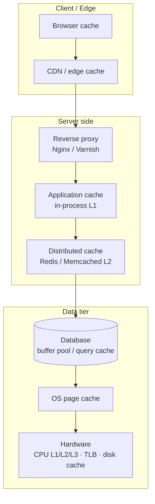
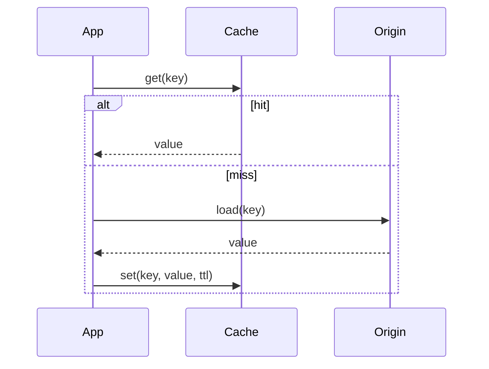
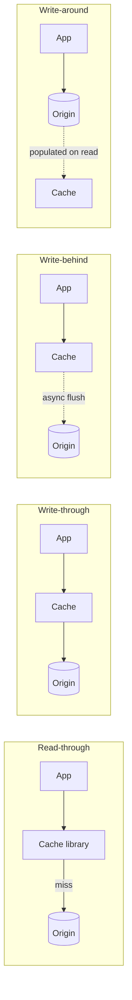
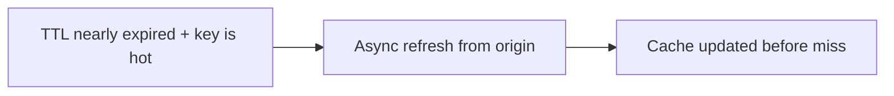
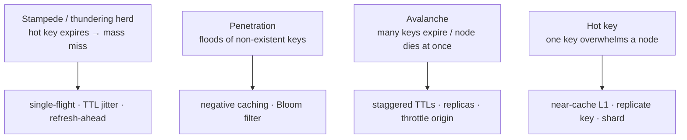
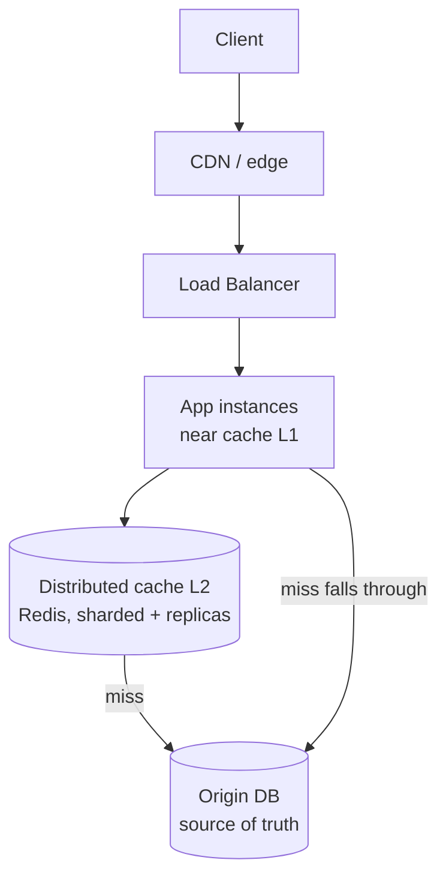
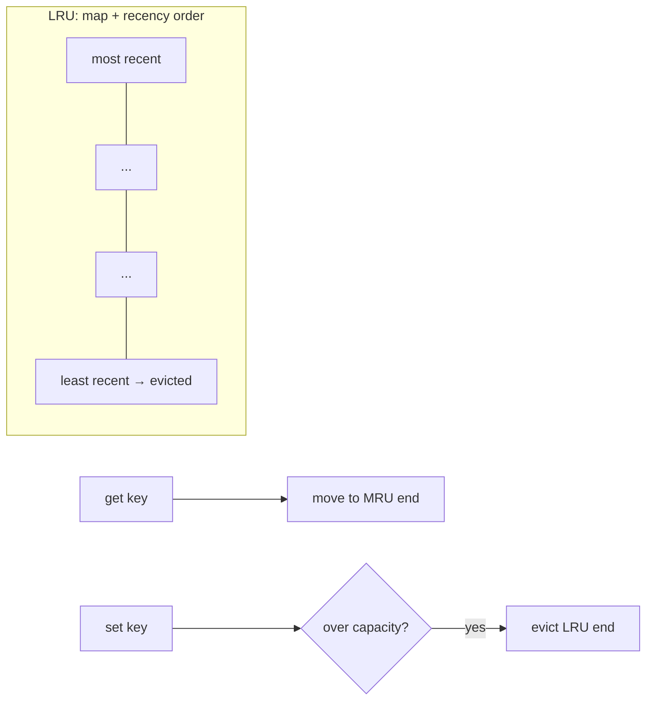
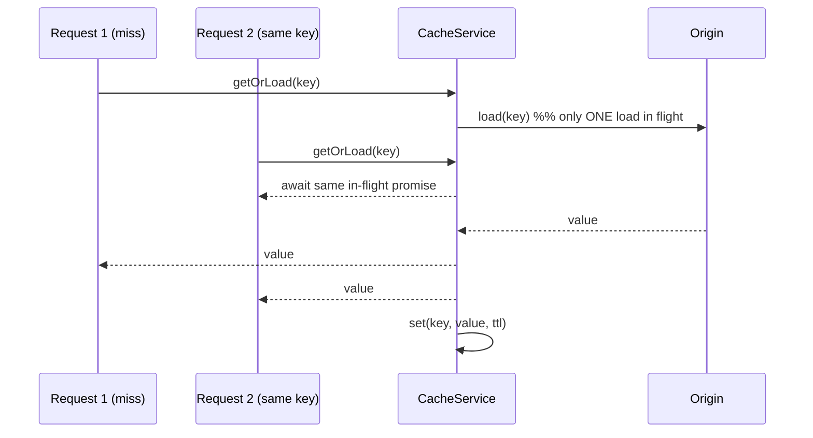

# 10. Design a Caching Layer System

> **In one line:** Design a caching layer — where caches live (from CPU registers to the CDN edge), the
> read/write patterns (cache-aside, read/write-through, write-behind, write-around, refresh-ahead),
> eviction policies, the classic failure modes (stampede, penetration, avalanche), consistency, and how
> to scale it — with a runnable implementation.

> **Original prompt:** Write a function that checks a Redis cache before querying MongoDB for a specific
> resource — then grow it into a proper caching layer.

## Overview

Caching is the single highest-leverage performance tool in a system: keep a copy of expensive-to-produce
data close to where it's needed so most requests never pay the full cost. "Check Redis before Mongo" is
the tip of the iceberg. A real caching layer forces you to answer:

- **Where** should the cache sit (there are caches at *every* layer of the stack)?
- **Which pattern** (who writes/reads the cache, and when)?
- **How do you evict** when it's full (LRU/LFU/TTL/…)?
- **How do you stay correct** (invalidation, consistency, staleness)?
- **What breaks under load** (stampede, penetration, avalanche, hot keys) — and how do you defend?
- **How do you scale** it (distributed cache, sharding, multi-tier)?

This write-up covers all of that and ships a runnable implementation in
[`./implementation/`](./implementation/): a **NestJS + Zod** service with an **LRU+TTL cache**,
**cache-aside with single-flight** (stampede protection) and live **hit/miss metrics**, plus a
**Next.js + React + Redux Toolkit** dashboard that visualizes hits, misses, and the latency difference.

## Functional Requirements

1. **Read** a resource through the cache: return the cached copy on a hit, load from the origin on a miss
   and populate the cache.
2. **Write** a resource and keep the cache correct (write-through or invalidate).
3. **Expire** entries by **TTL** and **evict** under memory pressure (bounded capacity).
4. Expose **metrics**: hit/miss counts, hit ratio, size, evictions.
5. **Invalidate / flush** entries explicitly.
6. Protect the origin from **cache stampede** (coalesce concurrent misses).

## Non-Functional Requirements

| Attribute | Target / approach |
|---|---|
| **Latency** | Cache hit p99 sub-millisecond (in-process) / low-ms (distributed) |
| **Hit ratio** | High (e.g. > 90%) for hot data — the metric that matters most |
| **Availability** | Cache down must **degrade** to the origin, never hard-fail |
| **Consistency** | Bounded staleness (TTL) or strong (write-through/invalidate) per use case |
| **Scalability** | Distributed + sharded; add nodes without rehashing everything |
| **Memory** | Bounded capacity + eviction; no unbounded growth |
| **Correctness** | No serving of stale-after-write data beyond the agreed window |

## A Realistic Interview Conversation

> **I** = Interviewer, **C** = Candidate.

**I:** Add a caching layer in front of a slow data source. Where do you start?

**C:** With *what* to cache and *where*. Caching only helps data that's **read far more than it's
written** and is **expensive to produce**. Then the question is which layer — there are caches
everywhere: CPU caches, the OS page cache, an in-process app cache, a distributed cache like Redis, the
database's own buffer pool, a reverse proxy, and the CDN edge. Each trades **speed for shared-ness**:
the closer to the CPU, the faster but less shared; the closer to the edge, the more shared but coarser.

**I:** Let's focus on the application. Which read pattern?

**C:** The default is **cache-aside** (lazy loading): the app checks the cache; on a miss it loads from
the origin and populates the cache. It's simple and resilient — if the cache is down you still hit the
origin. The alternatives are **read-through** (the cache library loads on miss), **write-through** (write
cache + origin synchronously — strong consistency, slower writes), **write-behind** (write cache now,
flush to origin async — fast writes, risk of loss), and **write-around** (write only the origin, let
reads populate — good when written data isn't read soon).

**I:** How do you keep it consistent after a write?

**C:** Two families: **TTL** (accept bounded staleness — simplest, self-healing) and **explicit
invalidation** (delete/update the key on write — fresher, but you must catch every write path). I usually
combine: write-through or invalidate on the write path *plus* a TTL as a safety net. For tricky cases,
**versioned keys** (`item:42:v7`) make invalidation atomic — bump the version, old entries age out.

**I:** A popular key expires and 10,000 requests miss at once.

**C:** **Cache stampede** (thundering herd). I coalesce concurrent misses with **single-flight**: the
first request loads from the origin, the rest await the same in-flight promise. Plus **TTL jitter** so
keys don't all expire together, and **refresh-ahead** for the hottest keys (refresh before expiry). For
floods of *non-existent* keys (**cache penetration**) I use **negative caching** and/or a **Bloom
filter**. If a whole cache node dies and everything misses at once (**avalanche**), staggered TTLs,
replicas, and request throttling protect the origin.

**I:** It's full. What do you evict?

**C:** Depends on access patterns. **LRU** (evict least-recently-used) is the sane default and matches
temporal locality. **LFU** favors frequently-used items; **FIFO** is simplest; **TTL** expires by time;
**ARC** adapts between recency and frequency. I'd start with **LRU + TTL**.

**I:** How does this scale?

**C:** A **distributed cache** (Redis/Memcached) shared across app instances, **sharded** by key
(consistent hashing so adding a node only remaps a slice), with **replicas** for availability. For the
lowest latency I add a **near cache** — a small in-process L1 in front of the distributed L2 — so the
hottest keys never leave the process. Size the cache to hold the **working set**, and watch the **hit
ratio** as the north-star metric.

**I:** If Redis goes down?

**C:** Degrade to the origin (cache-aside makes this natural), protect the origin with a **circuit
breaker** and throttling, and rebuild the cache lazily. The cache is an optimization, never the source
of truth.

## What & Why: the Latency Gap

Caching exists because storage layers differ by **orders of magnitude** in speed. Rough "latency numbers
every engineer should know":

```text
L1 cache        ~1 ns
L2 cache        ~4 ns
Main memory     ~100 ns
Redis (LAN)     ~0.5 ms   (500,000 ns)
SSD read        ~150 µs
Network RTT DC  ~0.5 ms
Disk seek       ~10 ms
Cross-region    ~100 ms
```

Each cache layer's job is to answer from a faster tier so you rarely fall through to the slow one.

## Caching at Every Level (the Hierarchy)

Caches form a layered hierarchy from the CPU out to the client. A read tries the fastest layer first and
falls through on a miss:



| Level | Example | Scope / speed | Notes |
|---|---|---|---|
| **Hardware** | CPU L1/L2/L3, TLB, disk controller cache | Fastest, per-core/per-machine | Managed by hardware; you optimize via locality |
| **OS / kernel** | Page cache, dentry/inode cache | Per machine | Free file caching; `mmap`, buffered I/O |
| **Application (L1)** | In-process map / LRU (this impl) | Per process, ~ns–µs | No network hop; not shared across instances |
| **Distributed (L2)** | Redis, Memcached | Shared across instances, ~ms | The workhorse "caching layer" |
| **Database** | Buffer pool, query/plan cache, materialized views | Inside the DB | Cheap wins before adding external caches |
| **Server / proxy** | Nginx, Varnish, API-gateway cache | In front of the app | Caches whole responses |
| **CDN / edge** | CloudFront, Cloudflare, Fastly | Global, closest to users | Static assets + cacheable API responses |
| **Client / browser** | HTTP cache, `Cache-Control`, service worker | Per user | Zero server cost on a hit |

> **Principle:** cache **as close to the consumer as correctness allows**. Edge/browser caches are the
> cheapest hit but the hardest to invalidate; app/distributed caches are easier to control.

## Caching Patterns (read & write)

### Cache-aside (lazy loading) — the default



App owns the logic; resilient (cache down → origin still works); only requested data is cached.

### Read-through / Write-through / Write-behind / Write-around



| Pattern | Who loads/writes | Pros | Cons | Use when |
|---|---|---|---|---|
| **Cache-aside** | App checks; loads on miss | Simple, resilient | First read is a miss; write path must invalidate | **Default reads** ✅ |
| **Read-through** | Cache loads on miss | App code stays clean | Couples to a cache library | Uniform read caching |
| **Write-through** | Write cache + origin sync | Cache always fresh | Slower writes | Read-after-write consistency |
| **Write-behind** | Write cache, flush async | Very fast writes | Risk of loss; complex | Write-heavy, loss-tolerant |
| **Write-around** | Write origin only | Avoids caching cold writes | Recently-written reads miss | Write-once/read-later |
| **Refresh-ahead** | Proactively refresh hot keys | No expiry stampede | Wasted refresh if unused | Predictable hot keys |

### Refresh-ahead



## Eviction Policies

| Policy | Evicts | Best for |
|---|---|---|
| **LRU** (least recently used) | Coldest by recency | General purpose (temporal locality) ✅ |
| **LFU** (least frequently used) | Coldest by frequency | Stable popularity skew |
| **FIFO** | Oldest inserted | Simplicity |
| **TTL** | By expiry time | Time-bounded freshness |
| **Random** | Random victim | Very cheap, surprisingly OK |
| **ARC** | Adaptive recency+frequency | Mixed workloads |

The implementation uses **LRU + per-entry TTL** (evict on capacity, expire on time).

## Cache Failure Modes (and defenses)



- **Stampede** → **single-flight** (coalesce concurrent misses into one origin load) + **TTL jitter** +
  **refresh-ahead**.
- **Penetration** → **negative caching** (cache "not found" briefly) + a **Bloom filter** to reject
  unknown keys.
- **Avalanche** → stagger TTLs, replicate, and protect the origin with a
  [circuit breaker](../../05-reliability-performance-and-modern-concepts/01-circuit-breaker.md) + throttling.
- **Hot key** → an in-process **near cache (L1)** and/or replicate the key across nodes.

## Consistency & Invalidation

> "There are only two hard things in computer science: cache invalidation and naming things."

- **TTL** — accept **bounded staleness**; entries self-heal on expiry. Simplest, most robust.
- **Explicit invalidation** — delete/update the key on every write path (fresher; you must cover *all*
  writers).
- **Write-through** — update the cache as part of the write (read-after-write consistency).
- **Versioned keys** — `item:42:v7`; bump the version to invalidate atomically, old versions age out.
- **Event-based** — publish change events; subscribers invalidate (works across services).

Combine **write-through/invalidate + a TTL safety net** for the best of both.

## High-Level Design (HLD)



Multi-tier: **L1 near cache** (per instance, fastest) → **L2 distributed cache** (shared) → **origin**.
Related: [Cache](../../02-data-and-storage-concepts/08-cache.md),
[Cache-Aside](../../02-data-and-storage-concepts/09-cache-aside.md),
[Write-Through](../../02-data-and-storage-concepts/10-write-through.md),
[Write-Behind](../../02-data-and-storage-concepts/11-write-behind.md),
[CDN](../../01-core-infrastructure-concepts/07-cdn.md).

## Low-Level Design (LLD)

### The cache data structure (LRU + TTL)

An LRU cache is a **hash map + doubly-linked list** (or an insertion-ordered map): O(1) get/set, move
touched entries to the "most recently used" end, evict from the "least recently used" end when over
capacity; each entry carries an `expiresAt` for TTL.



### getOrLoad with single-flight (stampede protection)



### Service contracts

```text
cache.get(key)                         → value | undefined     (counts hit/miss)
cache.set(key, value, ttlMs?)          → void                  (LRU insert, may evict)
cache.getOrLoad(key, loader, ttlMs?)   → value                 (cache-aside + single-flight)
cache.del(key) / cache.clear()         → void
cache.stats()                          → { hits, misses, hitRatio, size, evictions }
items.get(id)                          → cache-aside read
items.update(id, patch)                → write-through (or invalidate)
```

### Project structure

```text
server/src/
├── cache/
│   ├── lru-cache.ts        # map + recency order + TTL + eviction
│   ├── cache.service.ts    # getOrLoad (single-flight) + metrics  ← the core
│   └── cache.controller.ts # GET /cache/stats · POST /cache/flush
└── items/
    ├── slow-store.ts       # origin with artificial latency (the "slow DB")
    ├── items.service.ts    # cache-aside read · write-through update · invalidate
    └── items.controller.ts # GET /items/:id (cached? + ms) · PUT · DELETE
```

## Scaling & Performance

- **Distributed cache** (Redis/Memcached) shared across instances; **shard by key** with
  [consistent hashing](../../02-data-and-storage-concepts/12-consistent-hashing.md) so adding a node
  remaps only a slice; **replicas** for availability.
- **Multi-tier (near cache)** — a small in-process **L1** in front of the distributed **L2** kills the
  network hop for the hottest keys.
- **Size for the working set** — too small = thrash (low hit ratio); too big = wasted memory. Watch
  **hit ratio**, evictions, and p99.
- **Cache warming** — preload known-hot keys on deploy to avoid a cold-start miss storm.
- **Degrade gracefully** — cache down ⇒ fall through to origin behind a circuit breaker; the cache is
  never the source of truth.

## Should We Use AWS? Cloud Mapping

| Concern | AWS service |
|---|---|
| Distributed cache | **ElastiCache** (Redis / Memcached) |
| DynamoDB acceleration | **DAX** (in-front-of-DynamoDB cache) |
| Edge / CDN | **CloudFront** (+ Lambda@Edge for logic) |
| Static origin | **S3** behind CloudFront |
| API response cache | **API Gateway caching** |
| Managed near-cache | app-local LRU + ElastiCache as L2 |

## Security

- **No sensitive data in shared caches** without care — cache poisoning and cross-tenant leakage are
  real; **namespace keys per tenant/user** and encrypt sensitive values.
- **Cache poisoning** — validate/normalize cache keys (esp. for proxy/CDN caches keyed on headers/query)
  so an attacker can't seed a bad response.
- **Key injection** — sanitize inputs used in keys; avoid unbounded key cardinality (a DoS vector).
- **Auth-aware caching** — never serve a cached authenticated response to another user; vary by identity.
- **TTL on secrets/derived data** — bound how long anything sensitive can live.

## All Solution Patterns (summary)

| Concern | Options | Chosen here | Why |
|---|---|---|---|
| Read pattern | **Cache-aside** · read-through | Cache-aside | Simple, resilient |
| Write pattern | **Write-through** · write-behind · write-around · invalidate | Write-through/invalidate | Read-after-write |
| Eviction | **LRU** · LFU · FIFO · ARC | LRU + TTL | Temporal locality + freshness |
| Stampede | none · **single-flight** · TTL jitter · refresh-ahead | Single-flight | Coalesce misses |
| Penetration | none · **negative caching** · Bloom filter | Negative caching | Cheap origin protection |
| Topology | single · **multi-tier L1+L2** · distributed sharded | L1 (impl) → L2 (doc) | Fast + shared |

## Implementation

A runnable full-stack implementation lives in [`./implementation/`](./implementation/):

| Layer | Stack | Highlights |
|---|---|---|
| **`server/`** | NestJS + Zod | LRU+TTL cache, `getOrLoad` **single-flight**, hit/miss/eviction **metrics**, a slow origin store, cache-aside read + write-through/invalidate |
| **`web/`** | Next.js + React + Redux Toolkit (RTK Query) | Fetch items showing **hit/miss + latency**, live **cache stats** panel, flush + update (invalidation) |

| Design element | Where in the code |
|---|---|
| LRU + TTL structure | `server/src/cache/lru-cache.ts` |
| getOrLoad single-flight + metrics | `server/src/cache/cache.service.ts` |
| Slow origin (latency) | `server/src/items/slow-store.ts` |
| Cache-aside + write-through | `server/src/items/items.service.ts` |
| Stats / flush | `server/src/cache/cache.controller.ts` |
| Hit/miss + latency UI | `web/src/components/*` + `store/cacheApi.ts` |

The backend is verified by an **end-to-end test**: first read is a **miss** (slow), second is a **hit**
(fast); stats reflect hits/misses/ratio; update **invalidates**; **LRU eviction** drops the coldest key;
**TTL expiry** forces a reload; concurrent cold reads trigger **one** origin load (single-flight); flush
empties the cache.

## Tips

- Cache what's **read-heavy and expensive**; measure the **hit ratio** (the number that matters).
- Default to **cache-aside**; combine **write-through/invalidate** with a **TTL** safety net.
- Always **bound** the cache (capacity + TTL) and pick an **eviction** policy (LRU is a fine default).
- Add **single-flight** to prevent stampedes and **negative caching** to prevent penetration.
- Add a **near cache (L1)** in front of the distributed **L2** for the hottest keys.
- Treat the cache as an **optimization** — degrade to the origin when it's down.

## Trade-offs & Pitfalls

- **Unbounded caches** leak memory — always cap + evict.
- **No stampede protection** turns one expiry into an origin-crushing miss storm.
- **Invalidation gaps** (a write path that forgets to invalidate) serve stale data — TTL is the backstop.
- **Caching low-hit-ratio data** wastes memory and can be *slower* (extra lookups) — measure first.
- **Storing the source of truth only in cache** = data loss; the cache is derived data.
- **Per-user data in a shared cache without namespacing** leaks across tenants.
- **Caching everything at the edge** is cheap but the hardest to invalidate — reserve for immutable/stable data.

## System Design Cheat Sheet

```text
1.  WHAT?        Read-heavy + expensive to produce; measure hit ratio
2.  WHERE?       HW → OS → app(L1) → distributed(L2) → DB → proxy → CDN → browser
3.  READ         Cache-aside (default) / read-through
4.  WRITE        Write-through / write-behind / write-around / invalidate
5.  EVICT        LRU (default) / LFU / FIFO / TTL / ARC
6.  CONSISTENCY  TTL (bounded staleness) + invalidation/versioned keys
7.  STAMPEDE     single-flight + TTL jitter + refresh-ahead
8.  PENETRATION  negative caching + Bloom filter
9.  SCALE        distributed + consistent-hash shard + replicas + near cache
10. FAIL         degrade to origin (circuit breaker); cache ≠ source of truth
11. AWS          ElastiCache · DAX · CloudFront · API GW cache
12. TRADE-OFF    speed vs freshness vs memory vs invalidation complexity
```

## Interview Questions & Answers

### A. Fundamentals
- **What should you cache?** — Read-heavy, expensive-to-produce data with a high hit ratio.
- **Where can caches live?** — CPU, OS page cache, app (L1), distributed (L2), DB buffer pool, proxy, CDN, browser.
- **What's the key metric?** — Hit ratio (plus latency and evictions).
- **Why is cache-aside the default?** — Simple and resilient: a cache outage still serves from the origin.

### B. Patterns & Eviction
- **Cache-aside vs read-through?** — Who loads on miss: the app vs the cache library.
- **Write-through vs write-behind?** — Sync write to origin (fresh, slower) vs async flush (fast, loss risk).
- **When write-around?** — When just-written data isn't read soon.
- **Which eviction policy?** — LRU by default; LFU for stable popularity; TTL for time-bounded freshness.
- **What is refresh-ahead?** — Proactively refresh hot keys before they expire.

### C. Consistency & Failure
- **How do you invalidate?** — TTL, explicit delete on write, write-through, versioned keys, or events.
- **How do you handle a stampede?** — Single-flight + TTL jitter + refresh-ahead.
- **Cache penetration?** — Negative caching + Bloom filter for unknown keys.
- **Cache avalanche?** — Staggered TTLs, replicas, throttle the origin.
- **Hot key?** — Near cache (L1) and/or replicate the key across nodes.
- **What if the cache is down?** — Degrade to the origin behind a circuit breaker; never treat cache as truth.

### D. Scaling & Security
- **How do you scale a distributed cache?** — Shard by key (consistent hashing) + replicas.
- **What is a near cache?** — An in-process L1 in front of the distributed L2 to skip the network hop.
- **How do you size it?** — To hold the working set; watch hit ratio and evictions.
- **Security concerns?** — Namespace per tenant, avoid caching sensitive data unencrypted, prevent cache poisoning, vary by identity.
- **Biggest trade-off?** — Speed vs freshness vs memory vs invalidation complexity.
