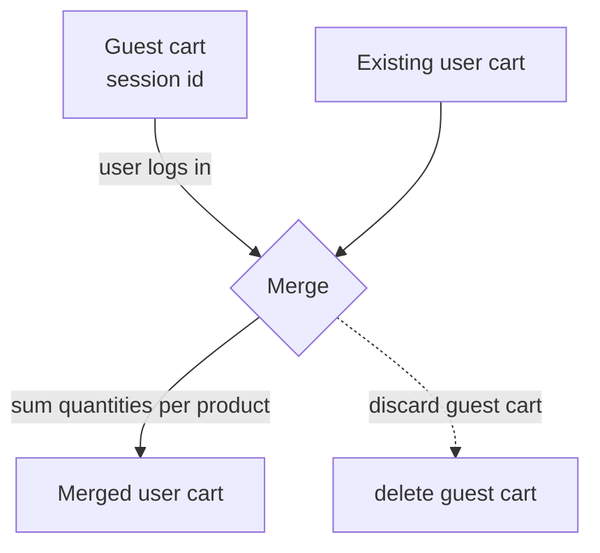
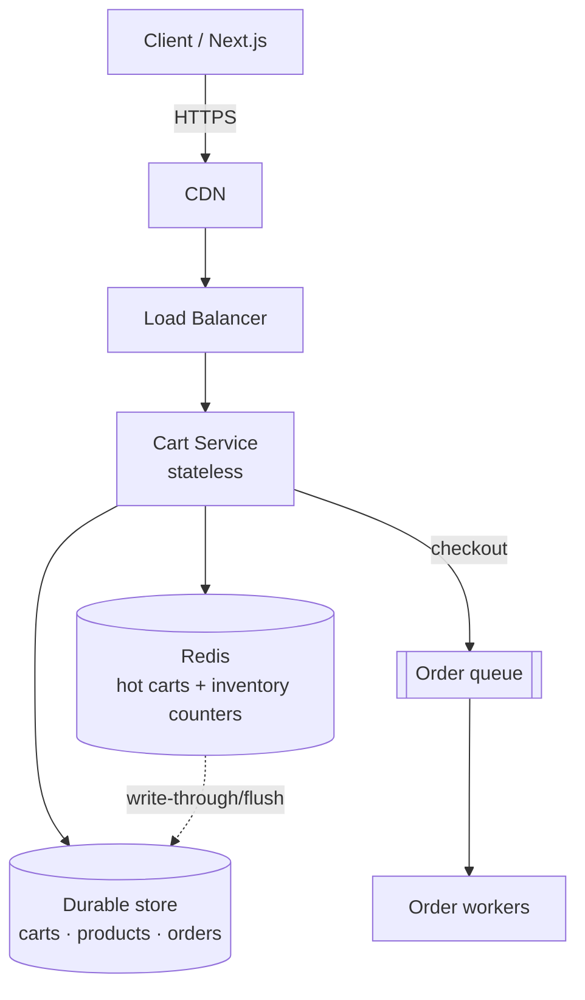
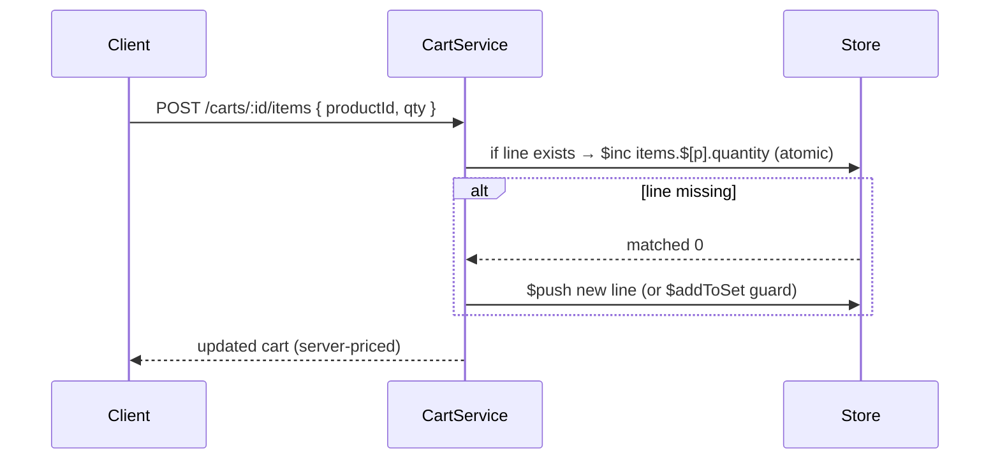
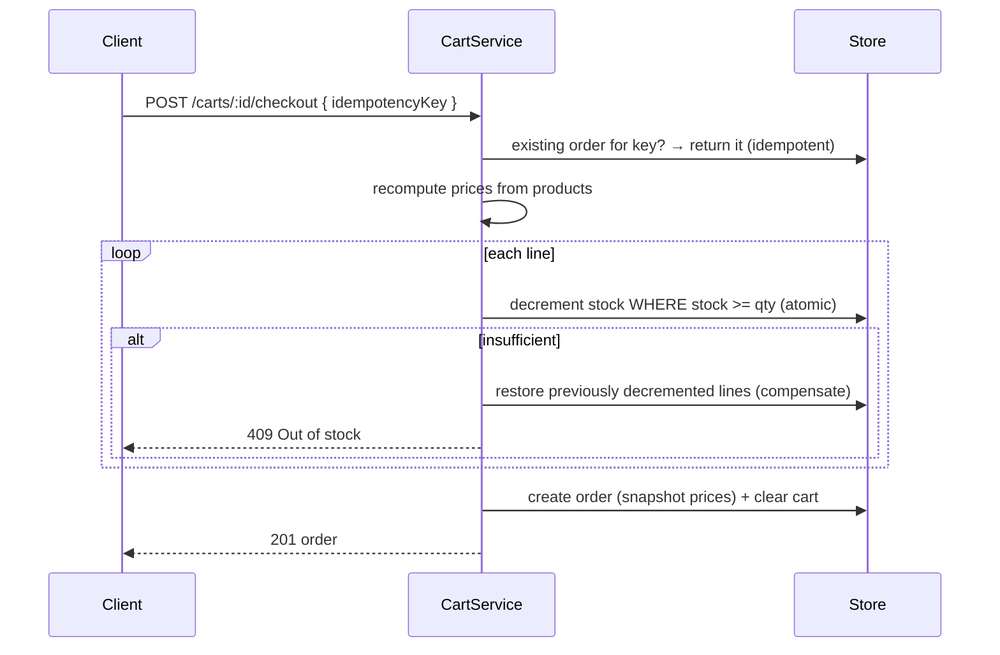

# 11. Design a Shopping Cart System

> **In one line:** Design a shopping cart that works for **guests and logged-in users**, stays correct
> under concurrent edits, computes prices safely on the server, reserves inventory without overselling,
> and **handles millions of concurrent requests** with a cache-first, horizontally-scaled architecture.

> **Original prompt:** Create the session-based or database-backed schema for a guest vs. logged-in user cart.

## Overview

"Add to cart, view cart" is the easy part. The interview (and production) difficulty is everything
around it at scale:

- Where does the cart **live** — client, Redis, or a database — for guests *and* logged-in users?
- What happens when the same cart is edited from **two tabs/devices at once**?
- How do you stop the client from **spoofing prices**?
- How do you **reserve inventory** so a flash sale doesn't **oversell**?
- How do you serve **millions of concurrent** add-to-cart requests with low latency?
- How do you **merge** a guest cart into the user's cart on login?

This write-up covers the requirements, the storage/merge/concurrency/inventory **patterns**, the high-
and low-level design, scaling to millions, an AWS mapping, security, and a runnable full-stack
implementation in [`./implementation/`](./implementation/): a **NestJS + Mongoose + Zod** API and a
**Next.js + React + Redux Toolkit (RTK Query)** storefront.

## Functional Requirements

1. Add an item to the cart; **increment** quantity if it's already there.
2. **Update** quantity (0 removes) and **remove** an item.
3. **View** the cart with **server-computed** unit prices, line subtotals, and a total.
4. Support both a **guest cart** (anonymous session) and a **logged-in cart**.
5. **Merge** the guest cart into the user's cart on login.
6. **Checkout**: validate, recompute prices, **reserve inventory** (no oversell), create an order, clear the cart.
7. Be **idempotent** on add and checkout (retries/double-clicks don't duplicate).

## Non-Functional Requirements

| Attribute | Target / approach |
|---|---|
| **Scale** | Millions of concurrent users; add-to-cart is very high volume |
| **Latency** | Cart read/update p99 < 50–100 ms — cache-first (Redis) |
| **Availability** | 99.99% on cart ops; cart must survive an instance dying |
| **Consistency** | Cart: read-your-write per user; **checkout/inventory: strong** (no oversell) |
| **Durability** | Logged-in carts persisted; guest carts may be ephemeral (TTL) |
| **Concurrency** | Correct under simultaneous edits (atomic ops / optimistic version) |
| **Security** | Own-cart authorization, **server-side pricing**, rate limiting, idempotency |

## A Realistic Interview Conversation

> **I** = Interviewer, **C** = Candidate.

**I:** Design a shopping cart for a large e-commerce site.

**C:** First scope: do we support guests, or only logged-in users? Merge on login? And is this
handling flash-sale-level concurrency, or steady traffic? Those change the storage and inventory design.

**I:** Both guests and users, merge on login, and yes — assume flash sales with millions of concurrent
add-to-cart and checkout requests.

**C:** Then two things dominate: **where the cart lives** (for speed at that scale) and **inventory
correctness** (no overselling). For the cart itself, add/update are extremely high volume and the data
is small and per-user, so I'd keep the hot cart in **Redis** (a hash per cart, O(1) field updates),
backed by a durable store (DynamoDB/Mongo) for logged-in users. Guests get a cart keyed by an anonymous
**session id** in a cookie, with a TTL.

**I:** Why not just a database row per cart?

**C:** A DB works, but at millions of concurrent updates the cart's read/write path is better served by
an in-memory store — Redis gives O(1) `HINCRBY` on a line item and easy TTLs for guest carts. The DB is
the durable backstop and the source of truth for logged-in users; I write-through or periodically flush.

**I:** Two tabs edit the same cart at once. How do you avoid lost updates?

**C:** Make item mutations **atomic** rather than read-modify-write. In Redis that's `HINCRBY`; in a
document store it's an atomic `$inc` with an array filter, so concurrent increments compose instead of
clobbering. If I expose whole-cart replaces, I add an **optimistic version** and reject stale writes.

**I:** The client sends the price. Do you trust it?

**C:** Never. The cart stores only `productId` + `quantity`. Prices are **recomputed on the server** from
the product catalog on every read and, critically, **snapshotted at checkout**. Trusting a client price
is a classic vulnerability (pay ₹1 for a laptop).

**I:** Flash sale: 100k people check out 10k units. How do you not oversell?

**C:** Inventory is the strongly-consistent part. On checkout I do an **atomic conditional decrement**:
`decrement stock by qty WHERE stock >= qty`. If it returns "no document updated", there wasn't enough —
that user gets a 409. This is a single atomic op per item, so even under massive concurrency the DB
serializes them and the count never goes negative. For extreme scale I'd pre-load stock counters into
Redis and decrement there (atomic), reconciling to the DB asynchronously.

**I:** A checkout touches several items. What if item 3 is out of stock after you decremented 1 and 2?

**C:** Either use a **transaction** (if the store supports multi-doc ACID) or, without one, **compensate**:
roll back the decrements I already made (increment them back) and fail the checkout — a mini **saga**.

**I:** Double-click on "Place order"?

**C:** **Idempotency key** on checkout. The order is created with a unique key; a retry with the same key
returns the existing order instead of charging/decrementing twice.

**I:** How does this scale to millions?

**C:** Stateless cart services behind a load balancer; the cart in a **Redis cluster** (sharded by
cartId); product/price data cached; checkout/order creation offloaded to a **queue + workers**; DB
**sharded by userId**. Add-to-cart is cheap and cacheable; the contended resource — inventory — is
handled with atomic counters.

**I:** AWS?

**C:** ElastiCache Redis for carts + inventory counters, DynamoDB for durable carts/orders (atomic
`UpdateItem` with a condition for stock), ALB → ECS/EKS for stateless services, SQS for order
processing, CloudFront for the storefront.

## A Mental Model: Four Questions

1. **Where does the cart live?** — client / Redis / DB / hybrid, for guest vs. user.
2. **How do concurrent edits stay correct?** — atomic ops or optimistic version.
3. **How are prices trusted?** — recomputed server-side; snapshotted at checkout.
4. **How is inventory protected?** — atomic conditional decrement + compensation + idempotency.

## Cart Storage Patterns

| Pattern | Where | Pros | Cons | Use |
|---|---|---|---|---|
| **Client-side** | Cookie / localStorage | Zero server cost; instant | Not cross-device; spoofable; size limits | Guests, MVP |
| **Server session** | Redis by session id | Fast, TTL, cross-tab | Ephemeral unless persisted | **Guest carts** ✅ |
| **Database** | Row/doc per user | Durable, queryable | Slower under huge write load | Logged-in durability |
| **Hybrid** | **Redis (hot) + DB (durable)** | Fast *and* durable | More moving parts | **Real systems** ✅ |

> **Choice:** hybrid. Guests → Redis (or a durable store) keyed by session id with TTL; logged-in →
> durable store as source of truth, Redis as the hot cache. This reference implementation persists to
> **MongoDB** (so it runs/tests without Redis) and documents the Redis hot-path.

## Guest → User Merge on Login



On login, **merge** the guest cart into the user cart: union the items, **summing quantities** for
products present in both (capped at stock/limits), then discard the guest cart. Conflicts are resolved by
addition (or "max"), never by silently dropping items.

## High-Level Design (HLD)



The cart tier is **stateless** and scales horizontally; the cart data lives in Redis (hot) + a durable
store. Checkout hands off to a queue so order processing (payment, fulfillment) doesn't block the request
([Load Balancer](../../01-core-infrastructure-concepts/04-load-balancer.md),
[Cache](../../02-data-and-storage-concepts/08-cache.md),
[Message Queue](../../04-messaging-and-communication-concepts/01-message-queue.md)).

## Low-Level Design (LLD)

### Schema

```typescript
// One cart per owner (userId or guest sessionId). Items embedded; version for OCC.
const cartSchema = new Schema({
  ownerKey: { type: String, required: true, unique: true }, // "user:42" | "guest:sess_abc"
  items: [{ productId: String, quantity: Number }],          // price NOT stored here
  version: { type: Number, default: 0 },                     // optimistic concurrency
}, { timestamps: true });

const productSchema = new Schema({
  name: String, priceCents: Number, currency: String,
  stock: { type: Number, default: 0 },                       // the contended resource
});

const orderSchema = new Schema({
  ownerKey: String,
  lines: [{ productId: String, name: String, unitPriceCents: Number, quantity: Number }],
  totalCents: Number,
  idempotencyKey: { type: String, index: true },             // unique+sparse → dedupe checkout
}, { timestamps: true });
```

Prices are **derived** (from `product.priceCents`) on read and **snapshotted** into the order at checkout.

### Service contracts

```text
addItem(ownerKey, productId, qty)     → atomic upsert/increment of the line
setQty(ownerKey, productId, qty)      → set (0 removes); optimistic version
removeItem(ownerKey, productId)       → pull the line
getCart(ownerKey)                     → items + server-computed prices + total
merge(toOwnerKey, fromOwnerKey)       → sum quantities, discard source
checkout(ownerKey, idempotencyKey)    → reserve stock + create order + clear cart
```

### Add-to-cart (atomic, concurrency-safe)



Using atomic `$inc` (not read-modify-write) means two simultaneous "add 1" requests result in **+2**, not
a lost update.

### Checkout (reserve inventory + compensate + idempotent)



### Project structure

```text
server/src/
├── app.module.ts
├── common/ zod pipe
├── products/  product.schema · service · controller (+ seed)
└── carts/     cart.schema · order.schema · service (atomic ops, merge, checkout) · controller · dto
```

## Concurrency & Inventory (the crux at scale)

- **Atomic item mutations** — `$inc` / `HINCRBY`, never read-modify-write, so concurrent edits compose.
- **Optimistic concurrency** — a `version` on whole-cart replaces; reject stale writes with `409`.
- **Atomic conditional decrement** for stock — `decrement WHERE stock >= qty`; the store serializes it,
  so it can't go negative even under a flash-sale stampede. Related:
  [Idempotency](../../03-distributed-systems-concepts/07-idempotency.md).
- **Compensation (saga)** — without multi-doc transactions, roll back partial decrements on failure.
- **Idempotency key** on checkout — a retry returns the same order (no double decrement / double charge).
- **Reserve vs check-at-checkout** — high-contention items can be *soft-reserved* with a TTL when added
  to cart (hold stock for N minutes), released if not purchased; simpler systems just check at checkout.

## Scaling to Millions of Concurrent Requests

- **Stateless cart services** behind a load balancer → scale horizontally
  ([Horizontal Scaling](../../01-core-infrastructure-concepts/03-horizontal-scaling.md)).
- **Redis for hot carts** (a hash per cart) → O(1) updates, TTL for guests; **Redis cluster** sharded by
  cartId for capacity.
- **Cache the catalog/prices** so cart reads don't hammer the product DB
  ([Cache-Aside](../../02-data-and-storage-concepts/09-cache-aside.md)).
- **Inventory counters in Redis** for flash sales (atomic `DECRBY` with a floor), reconciled to the DB
  asynchronously — the DB is not the per-request bottleneck.
- **Offload checkout** to a [queue + workers](../../04-messaging-and-communication-concepts/01-message-queue.md)
  (payment, fulfillment, emails) so the request returns fast.
- **Shard the durable store by `userId`** ([Sharding](../../02-data-and-storage-concepts/06-sharding.md)).
- **Rate limit** add-to-cart/checkout per user/IP
  ([Rate Limiting](../../05-reliability-performance-and-modern-concepts/02-rate-limiting.md)) and shed load
  under extreme spikes.

## Should We Use AWS? Cloud Mapping

| Concern | AWS service |
|---|---|
| Hot carts + inventory counters | **ElastiCache for Redis** |
| Durable carts / products / orders | **DynamoDB** (atomic `UpdateItem` with condition) or Aurora |
| Stateless services | **ECS Fargate / EKS** behind **ALB / API Gateway** |
| Checkout / order pipeline | **SQS** (+ **Step Functions** for the order saga) |
| Storefront / static | **CloudFront + S3** |
| Search / catalog | **OpenSearch** |
| Idempotency / dedupe | DynamoDB conditional writes on the idempotency key |

> DynamoDB's conditional `UpdateItem` (`stock >= qty`) is a natural fit for oversell-safe decrements at
> scale; ElastiCache handles the extreme add-to-cart read/write volume.

## Security

- **Own-cart authorization** — a user may only touch their own cart; derive `ownerKey` from the
  session/JWT, never trust a client-supplied one for logged-in users.
- **Server-side pricing** — store only `productId` + `quantity`; recompute prices server-side; snapshot
  at checkout. Never trust a client price or total.
- **Idempotency** — dedupe add/checkout to prevent duplicate orders on retries.
- **Rate limiting & abuse** — cap add-to-cart/checkout; detect scalping/bots on flash sales.
- **Validation** — validate productId (block NoSQL-injection), quantity bounds (positive, max-per-item).
- **Stock integrity** — never let the client decide stock; the atomic conditional decrement is the guard.

## All Solution Patterns (summary)

| Concern | Options | Chosen | Why |
|---|---|---|---|
| Storage | Client · Session(Redis) · DB · **Hybrid** | Hybrid (Redis hot + durable) | Fast *and* durable |
| Guest identity | Cookie session id | Cookie session id + merge on login | Cross-device after login |
| Concurrency | Read-modify-write · **Atomic $inc** · OCC version | Atomic + version | No lost updates |
| Pricing | Trust client · **Server recompute + snapshot** | Server-side | Prevents price spoofing |
| Inventory | Check-only · **Atomic conditional decrement** · soft-reserve TTL | Atomic decrement (+ compensation) | No oversell under load |
| Multi-item checkout | Transaction · **Compensation (saga)** | Compensation | Works without multi-doc ACID |
| Retries | None · **Idempotency key** | Idempotency key | No duplicate orders |

## Implementation

A runnable full-stack implementation lives in [`./implementation/`](./implementation/):

| Layer | Stack | Highlights |
|---|---|---|
| **`server/`** | NestJS + Mongoose + Zod | Atomic add/increment, optimistic version, server-side pricing, guest→user merge, checkout with atomic stock decrement + compensation + idempotency |
| **`web/`** | Next.js + React + Redux Toolkit (RTK Query) | Product grid, cart with qty controls, server-computed totals, checkout with out-of-stock handling |

| Design element | Where in the code |
|---|---|
| Cart schema + version | `server/src/carts/cart.schema.ts` |
| Atomic add / set / remove | `server/src/carts/carts.service.ts` |
| Server-side pricing on read | `carts.service.ts` (`getCart`) |
| Guest → user merge | `carts.service.ts` (`merge`) |
| Oversell-safe checkout + compensation | `carts.service.ts` (`checkout`) |
| Idempotent orders | `order.schema.ts` (unique key) + `checkout` |
| Product/inventory | `server/src/products/*` |
| Storefront + cart UI | `web/src/components/*` + `store/cartApi.ts` |

The backend is verified by an **end-to-end test** (in-memory MongoDB): atomic add/increment, server-side
pricing (client price ignored), quantity update/remove, guest→user merge (summed quantities), checkout
that **decrements stock + clears the cart**, **oversell → 409 with stock restored**, and **idempotent
checkout** (same key → same order, no double decrement).

## Tips

- Store only **productId + quantity** in the cart; **recompute prices server-side**, snapshot at checkout.
- Mutate items **atomically** (`$inc`/`HINCRBY`); add an **optimistic version** for whole-cart writes.
- Keep hot carts in **Redis** (hash per cart, TTL for guests); use a durable store as source of truth.
- Prevent oversell with an **atomic conditional decrement** (`stock >= qty`); **compensate** on partial failure.
- Make checkout **idempotent** with a key so double-clicks don't create duplicate orders.
- **Merge** guest → user carts by summing quantities on login.

## Trade-offs & Pitfalls

- **Trusting client prices/totals** is a critical vulnerability — always recompute server-side.
- **Read-modify-write on quantities** loses concurrent updates — use atomic ops.
- **Checking stock then decrementing in two steps** races under load — make it one atomic conditional op.
- **No idempotency** → double-submit creates duplicate orders and double-decrements stock.
- **Cart only in the DB** can bottleneck under flash-sale write volume — front it with Redis.
- **Multi-item checkout without transactions or compensation** leaves inventory inconsistent on partial failure.
- **Guest carts with no TTL** accumulate forever — expire them.

## System Design Cheat Sheet

```text
1.  SCOPE        Guest + user? Merge? Flash-sale concurrency?
2.  STORAGE      Hybrid: Redis hot (hash/cart, TTL) + durable store
3.  IDENTITY     Guest = cookie session id; user = auth; merge on login
4.  ITEMS        Store productId + qty only (no price)
5.  CONCURRENCY  Atomic $inc/HINCRBY + optimistic version
6.  PRICING      Recompute server-side; snapshot at checkout
7.  INVENTORY    Atomic conditional decrement (stock >= qty)
8.  MULTI-ITEM   Transaction or compensation (saga) on partial failure
9.  IDEMPOTENCY  Key on checkout → no duplicate orders
10. SCALE        Stateless services · Redis cluster · queue checkout · shard by userId
11. AWS          ElastiCache · DynamoDB (conditional writes) · ALB+ECS · SQS · CloudFront
12. SECURITY     Own-cart authz · server pricing · rate limit · validation
```

## Interview Questions & Answers

### A. Requirements
- **Guest and logged-in carts?** — Both; guest keyed by session id, merged on login.
- **What scale?** — Millions concurrent; drives Redis + atomic inventory.
- **Do we store prices in the cart?** — No — only productId + qty; recompute server-side.
- **Strong or eventual consistency?** — Cart eventual/read-your-write; inventory strong.

### B. Storage & Identity
- **Where does the cart live?** — Hybrid: Redis hot + durable store; client only for MVP/guests.
- **Why Redis for carts?** — O(1) field updates, TTL for guests, handles huge write volume.
- **How do guests get a cart?** — An anonymous session id in a cookie.
- **How do you merge on login?** — Sum quantities per product; discard the guest cart.

### C. Concurrency & Pricing
- **Two tabs edit the cart — lost updates?** — Use atomic `$inc`/`HINCRBY`, not read-modify-write.
- **Whole-cart replace conflicts?** — Optimistic `version`; reject stale writes with 409.
- **Do you trust client prices?** — Never; recompute from the catalog, snapshot at checkout.
- **Where is the price snapshot stored?** — On the order line at checkout time.

### D. Inventory & Checkout
- **How do you prevent overselling?** — Atomic conditional decrement `stock >= qty`.
- **Multi-item checkout, item 3 fails?** — Transaction, or compensate by restoring earlier decrements.
- **Double-click checkout?** — Idempotency key returns the existing order.
- **Flash sale of 10k units to 100k users?** — Atomic decrement serializes; extras get 409; counters in Redis.

### E. Scale & Security
- **How does it scale to millions?** — Stateless services, Redis cluster, cached catalog, queued checkout, sharded DB.
- **AWS building blocks?** — ElastiCache, DynamoDB (conditional writes), ALB+ECS, SQS, CloudFront.
- **How do you secure the cart?** — Own-cart authz, server-side pricing, idempotency, rate limiting, validation.
- **Biggest trade-offs?** — Cart storage (client/Redis/DB/hybrid) and inventory (check vs reserve vs atomic decrement).
