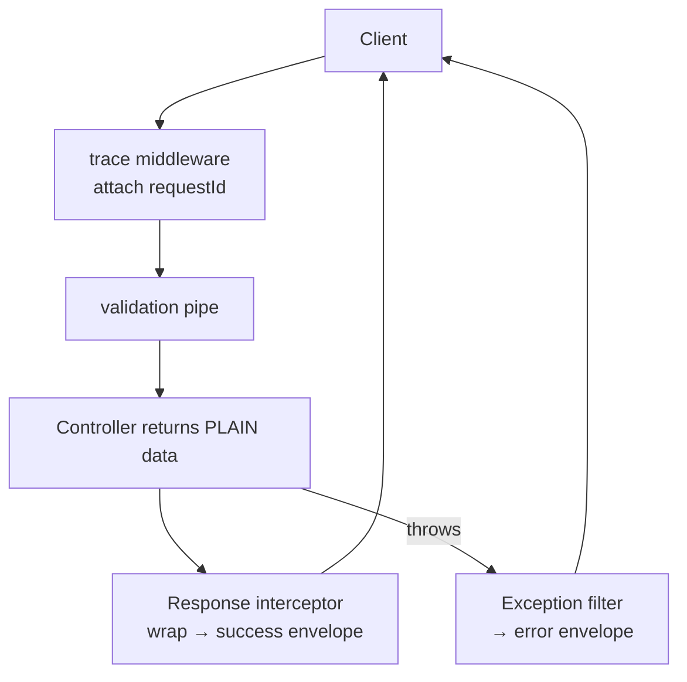
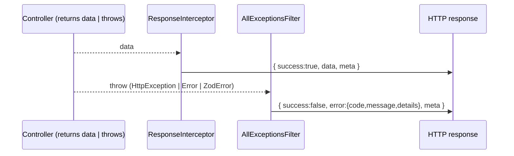

# 12. API Response Standardization

> **In one line:** Design a single, consistent shape for **every** API response — success and error —
> so clients can parse predictably, errors are machine-readable, and cross-cutting metadata (request id,
> version, pagination) rides along on every payload.

> **Original prompt:** Design a standard JSON error response class/interface for an Express application.

> **Part of a shared "production-ready API platform"** implemented once in
> [`./implementation/`](./implementation/) and referenced by
> [API Versioning](../19-api-versioning-strategy/19-api-versioning-strategy.md) and
> [API Request Tracing](../27-api-request-tracing/27-api-request-tracing.md).

## Overview

If every endpoint invents its own response shape — some return the raw object, some `{ data }`, some
`{ result }`, errors sometimes a string and sometimes `{ message }` — clients drown in special-casing.
**Response standardization** fixes the *contract*: one **envelope** for success, one for errors, both
carrying **meta** (request id, timestamp, API version, pagination). It's the cheapest thing you can do to
make an API feel production-grade, and it pairs naturally with versioning and tracing.

Questions this problem forces:

- What's the **success envelope**? The **error envelope**?
- How do errors become **machine-readable** (stable `code`s, not just prose)?
- How do you enforce it **globally** (not per-controller) — interceptors + exception filters?
- How do **pagination**, **validation errors**, and **request ids** fit the envelope?
- How does this stay consistent as the API **scales** and **versions**?

## Functional Requirements

1. **Every** success response uses one envelope: `{ success, data, meta }`.
2. **Every** error uses one envelope: `{ success:false, error: { code, message, details? }, meta }`.
3. Errors carry a **stable, machine-readable `code`** (e.g. `USER_NOT_FOUND`) + HTTP status.
4. **Validation errors** report **field-level** details in a consistent shape.
5. **Meta** always includes `requestId`, `timestamp`, and API `version`; list endpoints add pagination.
6. It is enforced **globally** — controllers return plain data; the platform wraps it.

## Non-Functional Requirements

| Attribute | Target / approach |
|---|---|
| **Consistency** | 100% of responses (incl. errors, 404s, 500s) use the envelope |
| **Compatibility** | Envelope is versioned; changes are additive within a version |
| **Latency** | Wrapping is O(1) — a global interceptor, negligible overhead |
| **Debuggability** | Every response carries a `requestId` (correlates with logs/traces) |
| **DX** | Clients parse one shape; SDKs/codegen rely on it |
| **Security** | Errors never leak stack traces / internals in production |

## A Realistic Interview Conversation

> **I** = Interviewer, **C** = Candidate.

**I:** Design a standard response format for a REST API.

**C:** I'd define **two envelopes** — one for success, one for errors — and enforce them globally.
Success is `{ success: true, data, meta }`; error is `{ success: false, error: { code, message,
details? }, meta }`. `meta` always carries a `requestId`, `timestamp`, and the API `version`. The key
move is **enforcement**: controllers return plain domain objects, and a global **response interceptor**
wraps them, while a global **exception filter** turns any thrown error into the error envelope. No
endpoint hand-rolls its shape.

**I:** Why a `code` in errors, not just a message?

**C:** Messages are for humans and change with copy edits/i18n; **codes are for machines**. A client
should branch on `error.code === 'INSUFFICIENT_STOCK'`, not string-match the message. Codes are a stable
part of the contract.

**I:** Validation errors?

**C:** Same envelope, `code: 'VALIDATION_ERROR'`, with `details` as a field→messages map. With Zod I
flatten the issues into `{ fieldErrors }` so the client can highlight inputs.

**I:** Pagination?

**C:** It goes in `meta` (or a `pageInfo` block) so the envelope stays uniform: `data` is the array,
`meta.pagination` holds `nextCursor`/`hasMore`. The shape never changes between a single item and a list
beyond `data` being object vs array.

**I:** How does this interact with errors like 404 or an unhandled 500?

**C:** The exception filter catches **everything** — known `HttpException`s map to their status + a code;
unknown errors become a `500 INTERNAL` with a generic message (no stack trace leaked) but still the same
envelope and a `requestId` so we can find it in the logs.

**I:** Does the envelope hurt versioning?

**C:** No — it *helps*. The envelope is part of the versioned contract; within a version changes are
additive (new optional `meta` fields). Breaking envelope changes go in a new version. And because every
response has `meta.version` and `meta.requestId`, versioning and tracing compose cleanly.

## The Envelope

### Success

```json
{
  "success": true,
  "data": { "id": "42", "name": "Ada" },
  "meta": { "requestId": "req_9f...", "timestamp": "2026-...Z", "version": "2" }
}
```

### Error

```json
{
  "success": false,
  "error": {
    "code": "USER_NOT_FOUND",
    "message": "User 42 was not found",
    "details": null
  },
  "meta": { "requestId": "req_9f...", "timestamp": "2026-...Z", "version": "2" }
}
```

### Validation error

```json
{
  "success": false,
  "error": {
    "code": "VALIDATION_ERROR",
    "message": "Validation failed",
    "details": { "fieldErrors": { "email": ["Invalid email"], "age": ["Expected number"] } }
  },
  "meta": { "requestId": "req_9f...", "timestamp": "2026-...Z", "version": "2" }
}
```

### List / pagination

```json
{
  "success": true,
  "data": [ { "id": "1" }, { "id": "2" } ],
  "meta": {
    "requestId": "req_9f...", "timestamp": "...", "version": "2",
    "pagination": { "nextCursor": "eyJ...", "hasMore": true, "limit": 20 }
  }
}
```

## High-Level Design (HLD)

Standardization is a **cross-cutting concern** applied at the edge of the app, not inside handlers:



The controller stays clean; the **interceptor** and **exception filter** own the shape. This is the same
pattern regardless of framework (NestJS interceptors/filters, Express middleware, a gateway response
transform).

## Low-Level Design (LLD)

### Contracts

```text
ApiSuccess<T> = { success: true;  data: T;  meta: Meta }
ApiError      = { success: false; error: { code: string; message: string; details?: unknown }; meta: Meta }
Meta          = { requestId: string; timestamp: string; version: string; pagination?: PageInfo }
```

### Where it lives (NestJS)



- **`ResponseInterceptor`** — wraps every successful return value in the success envelope and injects
  `meta` (requestId from the trace context, version from the route, timestamp).
- **`AllExceptionsFilter`** — catches `HttpException` (→ its status + a derived code), Zod/validation
  errors (→ `VALIDATION_ERROR` + field details), and anything else (→ `500 INTERNAL`, generic message).
- **Typed domain errors** — an `AppError` base with a `code` so services throw semantic errors that map
  cleanly onto the envelope.

## Patterns for Standardization

| Concern | Options | Chosen | Why |
|---|---|---|---|
| Success shape | raw · `{data}` · **`{success,data,meta}`** | Enveloped | Uniform, room for meta |
| Error shape | string · `{message}` · **`{code,message,details}`** | Coded envelope | Machine-readable |
| Enforcement | per-controller · **global interceptor + filter** | Global | Impossible to forget |
| Error identity | HTTP status only · **status + stable `code`** | Status + code | Clients branch on code |
| Validation | ad-hoc · **`VALIDATION_ERROR` + fieldErrors** | Structured | Consistent client handling |
| Pagination | separate shape · **`meta.pagination`** | In meta | Envelope stays uniform |

## Scaling & Production APIs

Standardization is what lets an API **scale organizationally and operationally**:

- **Uniform errors → uniform client handling** across web/mobile/SDKs; less bespoke code, fewer bugs.
- **`requestId` in every response** correlates a client-reported issue to server logs/traces instantly.
- **Stateless wrapping** adds negligible latency, so it doesn't affect the "scale Node/Nest to millions"
  story (that's about horizontal scaling, caching, and connection limits — see the versioning doc).
- **Codegen / typed SDKs** can rely on the fixed envelope, reducing integration friction as usage grows.

## Security

- **Never leak internals** — the exception filter maps unknown errors to a generic `500 INTERNAL`; stack
  traces and DB errors stay in logs (keyed by `requestId`), never in the response.
- **Don't over-share in `details`** — field-level validation info is fine; internal identifiers, SQL, or
  file paths are not.
- **Consistent auth errors** — `401`/`403` use the same envelope with generic messages to avoid
  enumeration.
- **Stable codes are a contract** — treat renaming an error `code` as a breaking change (version it).

## Implementation

The shared **production-ready API platform** in [`./implementation/`](./implementation/) demonstrates all
three concerns together (this problem + versioning + tracing):

| Layer | Stack | Highlights |
|---|---|---|
| **`server/`** | NestJS + Zod | Global **response interceptor** (success envelope) + **exception filter** (error envelope: HttpException, Zod validation, unknown→500), typed `AppError` codes, pagination in `meta` |
| **`web/`** | Next.js + React + Redux Toolkit (RTK Query) | An API console that renders the envelope, the `code`, and `meta` (version + requestId) |

| Design element | Where in the code |
|---|---|
| Success envelope | `server/src/common/response.interceptor.ts` |
| Error envelope (all exceptions) | `server/src/common/all-exceptions.filter.ts` |
| Typed domain errors + codes | `server/src/common/app-error.ts` |
| Zod validation → `VALIDATION_ERROR` | `server/src/common/zod-validation.pipe.ts` |
| Envelope + meta types | `server/src/common/envelope.ts` |

The backend is verified by an end-to-end test asserting the success envelope shape, the error envelope
for 404 and validation, machine-readable `code`s, and `meta.requestId`/`version` on every response.

## Tips

- Define **two envelopes** (success + error) and enforce them **globally**, never per-controller.
- Give errors a **stable machine-readable `code`** plus a human message.
- Put **`requestId`, `timestamp`, `version`** in `meta` on *every* response; pagination goes in `meta`.
- Report **validation errors** as a structured `fieldErrors` map.
- Map **unknown errors** to a generic `500` — never leak stack traces.
- Treat the envelope + error codes as a **versioned contract**.

## Trade-offs & Pitfalls

- **Per-endpoint shapes** force clients into special-casing — standardize globally.
- **String-only errors** can't be branched on reliably — add codes.
- **Leaking internals in errors** is a security bug — generic 500 + logged details.
- **Deeply nested envelopes** annoy clients — keep it flat: `success`, `data`/`error`, `meta`.
- **Forgetting non-2xx paths** (404/500/validation) breaks the contract — the exception filter must cover all.
- **Changing an error `code`** silently breaks clients — version it.

## System Design Cheat Sheet

```text
1.  SHAPE       success {success,data,meta} · error {success,error{code,message,details},meta}
2.  ENFORCE     global interceptor (success) + exception filter (errors)
3.  CODES       stable machine-readable error codes + human message
4.  VALIDATION  VALIDATION_ERROR + fieldErrors map
5.  META        requestId + timestamp + version (+ pagination for lists)
6.  ERRORS      map unknown → generic 500; never leak internals
7.  CONTRACT    envelope + codes are versioned; additive within a version
8.  COMPOSES    with versioning (meta.version) + tracing (meta.requestId)
```

## Interview Questions & Answers

- **What's a good response envelope?** — `{ success, data, meta }` for success; `{ success:false, error:{code,message,details}, meta }` for errors.
- **Why error codes?** — Machine-readable, stable; clients branch on code, not message text.
- **How do you enforce it?** — Globally: a response interceptor + an exception filter, so controllers return plain data.
- **How do validation errors look?** — Same envelope, `VALIDATION_ERROR`, `details.fieldErrors`.
- **Where does pagination go?** — In `meta` (e.g. `meta.pagination`) so the envelope stays uniform.
- **How do you handle unknown errors?** — Generic `500 INTERNAL`, no stack trace, but still enveloped + `requestId`.
- **How does it help debugging at scale?** — `requestId` in every response ties a report to logs/traces.
- **Is the envelope versioned?** — Yes; additive within a version, breaking changes go to a new version.
