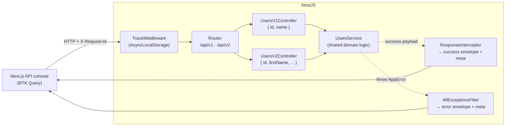

# Production API Platform — shared implementation

One small full-stack app that demonstrates **three production API concerns at once**, because in a
real service they are the same middleware stack, not three separate projects:

| Concern | Problem | Where it lives |
| --- | --- | --- |
| Standardized response envelope | [12 · API response standardization](../README.md) | `server/src/common/response.interceptor.ts`, `all-exceptions.filter.ts`, `envelope.ts` |
| API versioning | [19 · API versioning strategy](../../19-api-versioning-strategy/README.md) | `server/src/main.ts`, `users/users.v1.controller.ts`, `users.v2.controller.ts`, `common/deprecation.interceptor.ts` |
| Request tracing | [27 · API request tracing](../../27-api-request-tracing/README.md) | `server/src/common/trace.middleware.ts`, `trace-context.ts`, `logger.ts` |

- **`server/`** — NestJS (TypeScript, CommonJS) API. No database; users are in-memory so the whole
  thing runs with just `npm install`.
- **`web/`** — Next.js 14 (App Router) + Redux Toolkit **RTK Query** "API console" that calls the
  API and visualizes the envelope, the version, and the request id for every call.

## Architecture



The request id set by the middleware is available to the service, the logger, the response
interceptor, and the exception filter **without being passed as a parameter** — that is the whole
point of `AsyncLocalStorage`.

## The response envelope

Every response — success or error, v1 or v2 — has the same top-level shape:

```jsonc
// success
{ "success": true, "data": <payload>, "meta": { "requestId": "...", "version": "2", "timestamp": "...", "pagination": { ... } } }
// error
{ "success": false, "error": { "code": "USER_NOT_FOUND", "message": "..." }, "meta": { "requestId": "...", "version": "2", "timestamp": "..." } }
```

Clients branch on the stable, machine-readable `error.code` — never on the human `message`.

## Endpoints

| Method | Path | Notes |
| --- | --- | --- |
| GET | `/api/health` | Version-neutral health check (still enveloped). |
| GET | `/api/v1/users` | **Deprecated.** Old shape `{ id, name }`; sends `Deprecation` + `Sunset` headers. |
| GET | `/api/v2/users` | Current shape; `meta.pagination` present. |
| GET | `/api/v2/users/trace-demo` | Calls a simulated downstream service that echoes the propagated request id. |
| GET | `/api/v2/users/:id` | `404` with `USER_NOT_FOUND` when missing. |
| POST | `/api/v2/users` | Zod-validated body; invalid input → `400 VALIDATION_ERROR` with `fieldErrors`. |

## Run it

Two terminals. **npm is under nvm** in this environment — if `npm` is not found, prefix commands with
`export PATH="/root/.nvm/versions/node/v22.23.2/bin:$PATH"`.

```bash
# 1) API
cd server
cp .env.example .env         # optional; defaults are fine
npm install
npm run build && npm start   # http://localhost:3008
# or: npm run start:dev

# 2) Web console
cd ../web
cp .env.example .env.local   # NEXT_PUBLIC_API_BASE_URL=http://localhost:3008
npm install
npm run dev                  # http://localhost:3000
```

### Try it with curl

```bash
# v2 success envelope + pagination meta
curl -s http://localhost:3008/api/v2/users | jq

# v1 deprecated shape + headers
curl -sD - http://localhost:3008/api/v1/users -o /dev/null | grep -i -E 'deprecation|sunset'

# standardized error envelope
curl -s http://localhost:3008/api/v2/users/999 | jq

# validation error with field-level messages
curl -s -X POST http://localhost:3008/api/v2/users -H 'content-type: application/json' -d '{"firstName":"","email":"nope"}' | jq

# tracing: send your own id and watch it come back + propagate downstream
curl -s -H 'X-Request-Id: my-trace-1' http://localhost:3008/api/v2/users/trace-demo | jq
```

See [`server/README.md`](./server/README.md) and [`web/README.md`](./web/README.md) for details.
