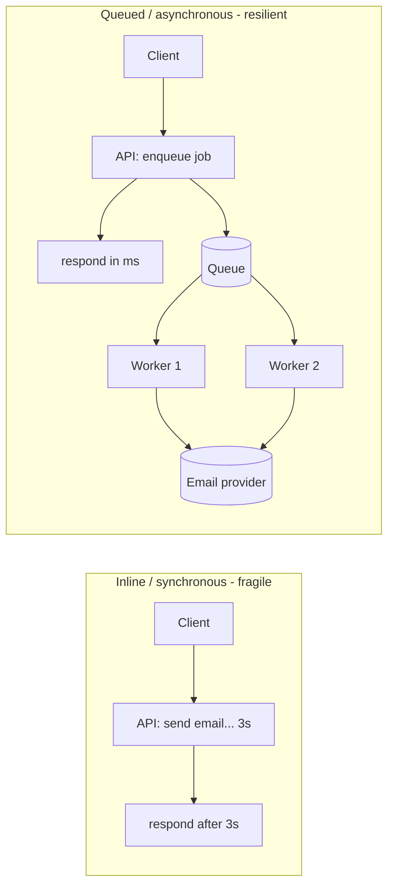
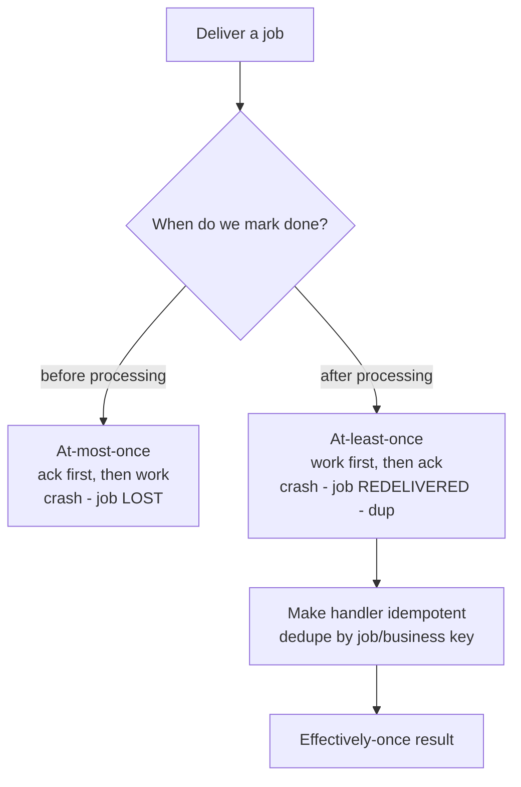
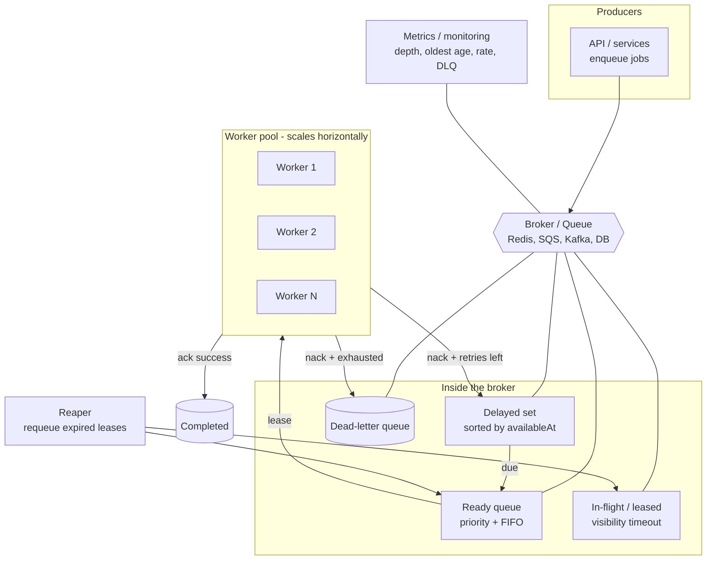
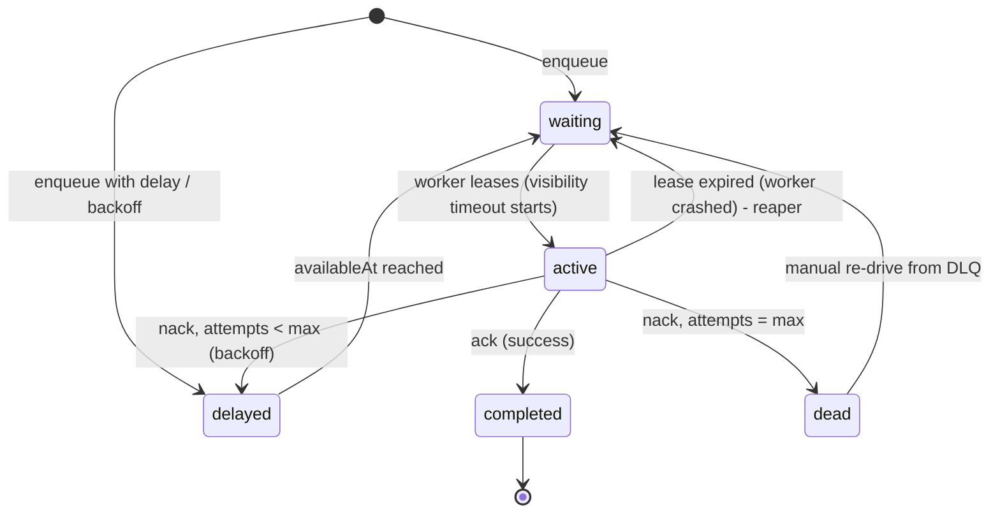
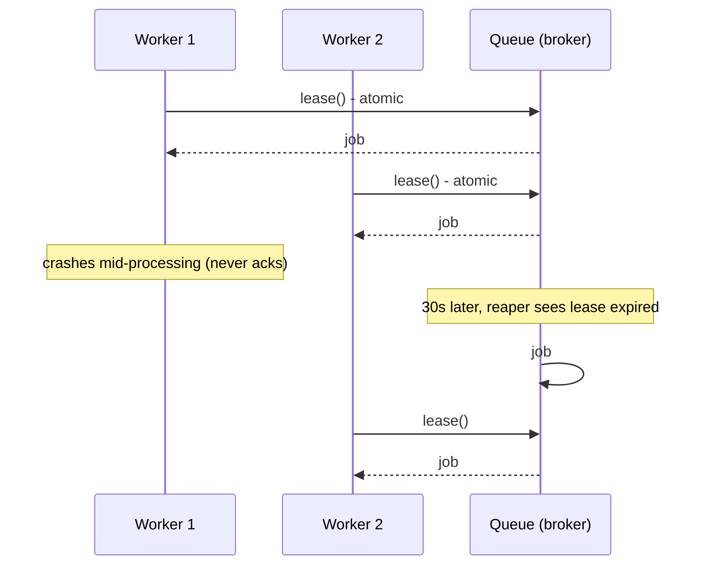

# 13. Design a Job / Task Queue

> **In one line:** Design a queue that accepts background jobs and hands them to workers **exactly the
> right number of times** — surviving crashes, retrying failures with backoff, isolating poison jobs in a
> dead-letter queue, honoring priority and delay, and scaling from one worker to thousands — with a
> runnable implementation.

> **Original prompt:** Implement a basic queue (a JS array or a Redis list) to process background tasks —
> then grow it into a production-grade job queue.

## Overview

A **job/task queue** decouples *accepting* work from *doing* work. Instead of a web request performing a
slow task inline (sending an email, transcoding a video, generating a report), it **enqueues a job** and
returns immediately; a pool of **workers** consumes jobs asynchronously. This gives you:

- **Responsiveness** — the API answers in milliseconds; heavy work happens off the request path.
- **Load smoothing** — a traffic spike becomes a longer queue, not a fallen-over service (backpressure).
- **Reliability** — a job that fails or a worker that crashes is **retried**, not lost.
- **Elastic throughput** — add workers to drain the backlog faster; the queue is the buffer between them.

The "array or Redis list" is the tip of the iceberg. A real queue forces you to answer:

- **Delivery semantics** — at-most-once, at-least-once, or exactly-once? (Spoiler: at-least-once + idempotency.)
- **Crash safety** — a worker dies mid-job; how does the job get reprocessed instead of vanishing?
- **Failure handling** — retries, **exponential backoff**, and a **dead-letter queue** for poison jobs.
- **Ordering & fairness** — FIFO, **priority**, **delayed/scheduled** jobs, per-tenant fairness.
- **Scale** — one process → many workers → many queues → millions of jobs/day.

This write-up covers all of that and ships a runnable implementation in
[`./implementation/`](./implementation/): a **NestJS + Zod** queue engine (leases with a **visibility
timeout**, retries with **exponential backoff + jitter**, a **dead-letter queue**, **priorities**,
**delayed jobs**, concurrent **workers**, and a crash-recovery **reaper**) plus a **Next.js + React +
Redux Toolkit** dashboard that enqueues jobs and visualizes them flowing through every state live.

## Functional Requirements

1. **Enqueue** a job: a `type` (which handler runs it) + a JSON `payload`, with options: `priority`,
   `delayMs` (run later), and `maxAttempts`.
2. **Process** jobs: workers pull jobs and run the registered handler for that `type`.
3. **Retry on failure** with **exponential backoff**; after `maxAttempts`, move the job to a
   **dead-letter queue (DLQ)**.
4. **Survive worker crashes** — a job leased by a worker that dies must become available again
   (visibility timeout + reaper).
5. **Delayed / scheduled** jobs — a job with `delayMs` is invisible until its run time.
6. **Priority** — higher-priority jobs are dequeued first (ties broken by FIFO).
7. **Introspect** — list jobs by state, fetch one job, and expose **stats** (counts per state, throughput).
8. **Operate** — pause/resume workers, tune concurrency, and **retry** or drain the DLQ.

## Non-Functional Requirements

| Attribute | Target / approach |
|---|---|
| **Durability** | An acknowledged (enqueued) job is **never lost**, even across worker/broker restarts |
| **Delivery** | **At-least-once** by default; handlers are **idempotent** so re-delivery is safe |
| **Latency** | Enqueue is O(1) and fast; pickup latency low for ready jobs |
| **Throughput** | Scales horizontally by adding workers / partitions to millions of jobs/day |
| **Fairness** | No queue or tenant starves others; priority respected without starvation |
| **Availability** | Broker is HA (replicated); a worker dying only delays, never drops, a job |
| **Observability** | Queue depth, age of oldest job, processing rate, failure rate, DLQ size |
| **Backpressure** | Producers are slowed/shed when the backlog grows unbounded |

## A Realistic Interview Conversation

> **I** = Interviewer, **C** = Candidate.

**I:** Design a background job queue. Where do you start?

**C:** With the contract. A **producer** enqueues a job — a `type` plus a `payload` — and gets an id back
immediately. A pool of **workers** later pulls jobs and runs the handler registered for that type. The
queue is the **buffer** between them, which is what gives us responsiveness and load smoothing. The first
big decision is **delivery semantics**.

**I:** Go on — which semantics?

**C:** Three choices. **At-most-once** (fire and forget) can *lose* jobs — unacceptable for, say, "charge
the customer." **Exactly-once** is impossible in the strict sense across a network — you can't atomically
"do the side effect" and "mark done" on two systems. So the practical answer is **at-least-once**: we
guarantee delivery and accept occasional **duplicates**, then make handlers **idempotent** so a duplicate
is a no-op. That's how SQS, Kafka consumers, and Sidekiq/BullMQ all work in practice.

**I:** How does a worker "take" a job without two workers grabbing the same one?

**C:** The dequeue must be **atomic**. The worker doesn't *delete* the job — it **leases** it: atomically
move it from `waiting` to `active` and stamp a **visibility timeout** (say 30s). While leased, it's
invisible to other workers. On success the worker **acks** (deletes it). If the worker crashes, it never
acks — so when the visibility timeout lapses, a **reaper** makes the job visible again and another worker
retries it. That's the crux of crash safety. In Redis it's an atomic `BRPOPLPUSH` from the queue to a
per-worker "processing" list (or `ZADD` to a sorted set keyed by lease-expiry); in SQS it's the built-in
visibility timeout; a SQL version is `SELECT … FOR UPDATE SKIP LOCKED`.

**I:** A job keeps failing. What happens?

**C:** Retry with **exponential backoff + jitter**: attempt 1 waits ~1s, then ~2s, ~4s, ~8s… with random
jitter so a batch of failures doesn't retry in lockstep (a thundering herd). Backoff is implemented by
re-enqueuing the job as a **delayed** job. After `maxAttempts` we stop and move it to a **dead-letter
queue** — a poison job (bad data, a permanent bug) shouldn't retry forever and block the line. The DLQ is
inspected by humans/alerts; once fixed you can **re-drive** those jobs back onto the main queue.

**I:** How do delayed and priority jobs work?

**C:** A **delayed** job carries an `availableAt` timestamp and isn't eligible until then — naturally a
**min-heap / sorted set by time**; a scheduler promotes due jobs to the ready queue. **Priority** means
the ready queue is ordered by `(priority desc, enqueuedAt asc)` — a heap keyed on that tuple — so
high-priority jobs jump ahead but same-priority jobs stay FIFO. To avoid starving low priority, you can
age jobs (bump priority with wait time) or use **weighted fair queuing** across classes.

**I:** How do you scale to millions of jobs a day?

**C:** The queue is embarrassingly horizontal on the **consumer** side — add workers until the broker or
the downstream (DB, third-party API) is the bottleneck. Beyond that: **partition** the work across many
queues/streams (e.g. Kafka partitions, or a queue per job type / per tenant) so consumers scale
independently; use a **HA broker** (Redis Cluster/Sentinel, SQS, Kafka) so it isn't a single point of
failure; and apply **backpressure** — bound the queue and slow or shed producers when the backlog and
oldest-job-age blow past thresholds, rather than melting the downstream.

**I:** What do you monitor?

**C:** **Queue depth** and **age of the oldest job** (the real "are we behind?" signal), **processing
rate** vs **arrival rate**, **failure rate**, **retry rate**, and **DLQ size** (a spike means something's
broken). Alert on oldest-age and DLQ growth.

**I:** Exactly-once — really impossible?

**C:** In the strict distributed sense, yes — you can't atomically commit a side effect and the ack across
two systems. What people call "exactly-once" is **at-least-once delivery + idempotent processing** (dedupe
by a job/business key), which gives *effectively-once* results. That's the pragmatic target.

## What & Why: sync vs. queued



Inline work ties request latency to the slowest dependency and drops work if the process dies mid-request.
Queuing returns instantly, absorbs spikes as backlog, and retries failed work.

## Core Concepts & Vocabulary

| Term | Meaning |
|---|---|
| **Job / task / message** | A unit of work: `{ id, type, payload, priority, attempts, maxAttempts, state }` |
| **Producer** | Enqueues jobs (usually the API) |
| **Worker / consumer** | Pulls and processes jobs; runs the handler for the job's `type` |
| **Broker / queue** | Stores jobs and hands them out (Redis, SQS, RabbitMQ, Kafka, a DB table) |
| **Lease / reservation** | A worker temporarily owns a job; others can't see it |
| **Visibility timeout** | How long a lease lasts before the job becomes visible again |
| **Ack / nack** | Acknowledge success (remove) / negative-ack (fail → retry or DLQ) |
| **Backoff** | Growing delay between retries (exponential + jitter) |
| **Dead-letter queue (DLQ)** | Where jobs go after exhausting retries — for inspection, not reprocessing loops |
| **Idempotency** | Running a job twice has the same effect as once — makes at-least-once safe |

## Delivery Semantics (the central trade-off)



- **At-most-once** — ack *before* doing the work. Fast, but a crash between ack and completion **loses**
  the job. Only for truly disposable work.
- **At-least-once** ✅ — ack *after* the work succeeds. A crash before the ack means the job is
  **redelivered** (a duplicate). This is the default for reliable systems.
- **Exactly-once** — not achievable across systems; **emulated** by at-least-once + **idempotent**
  handlers (dedupe on a job id or a natural business key like `order:42:receipt`).

## High-Level Design (HLD)



Related concepts: [Message Queue](../../04-messaging-and-communication-concepts/01-message-queue.md),
[Pub/Sub](../../04-messaging-and-communication-concepts/02-pub-sub.md),
[Dead-Letter Queue](../../04-messaging-and-communication-concepts/03-dead-letter-queue.md),
[Backpressure](../../04-messaging-and-communication-concepts/04-backpressure.md),
[Idempotency](../../03-distributed-systems-concepts/07-idempotency.md),
[Idempotency Key](../../03-distributed-systems-concepts/08-idempotency-key.md).

## Job Lifecycle (state machine)



## Low-Level Design (LLD)

### The job record

```text
Job {
  id: string                 // ULID/UUID — also the idempotency key
  type: string               // which handler runs it (e.g. "email.send")
  payload: unknown           // JSON args
  priority: number           // higher = sooner (default 0)
  state: waiting|delayed|active|completed|failed|dead
  attempts: number           // how many times tried
  maxAttempts: number        // give up after this many
  availableAt: number        // epoch ms; > now ⇒ delayed
  leaseExpiresAt: number|null// epoch ms while active; null otherwise
  lastError?: string         // why the last attempt failed
  enqueuedAt, updatedAt: number
}
```

### Atomic lease with a visibility timeout (the heart of crash-safety)

A worker **does not delete** a job to take it. It **atomically** moves the job `waiting → active` and
stamps `leaseExpiresAt = now + visibilityTimeout`. Only then does it start work.



- **Atomicity** is what prevents two workers from getting the same job. Options: a Redis Lua script /
  `BRPOPLPUSH` into a per-consumer processing list; a sorted set keyed by `leaseExpiresAt`; SQS's native
  visibility timeout; or SQL `SELECT ... FOR UPDATE SKIP LOCKED`.
- **The reaper** periodically scans in-flight jobs whose `leaseExpiresAt < now` and returns them to
  `waiting`. This is how a crashed worker's job gets reprocessed — the source of at-least-once (and thus
  the need for idempotency).
- **Long jobs** must **extend the lease** (heartbeat) so the reaper doesn't reclaim a job that's still
  being worked.

### Retry with exponential backoff + jitter

On failure, if attempts remain, re-enqueue as a **delayed** job; otherwise dead-letter it.

```text
backoffMs(attempt) = min(cap, base * 2^(attempt-1)) ± random jitter
  attempt 1 → ~1s     attempt 3 → ~4s
  attempt 2 → ~2s     attempt 4 → ~8s   (capped)
```

Jitter spreads a batch of simultaneous failures so they don't all retry at the same instant.

### Priority + delay ordering

- **Ready set** ordered by `(priority DESC, enqueuedAt ASC)` — a heap/sorted-set. High priority first,
  FIFO within a priority.
- **Delayed set** ordered by `availableAt ASC` — a scheduler pops due jobs into the ready set.
- **Anti-starvation** — age low-priority jobs (raise effective priority as they wait) or use weighted fair
  queuing across job classes.

### Service contracts (implemented here)

```text
queue.enqueue(type, payload, { priority?, delayMs?, maxAttempts? })  → Job
queue.lease(workerId)                → Job | null   (atomic; sets visibility timeout)
queue.ack(jobId)                     → void         (success → completed)
queue.nack(jobId, error)             → void         (retry w/ backoff, or → DLQ)
queue.extendLease(jobId, ms)         → void         (heartbeat for long jobs)
queue.reapExpired()                  → number       (requeue crashed leases; promote due delayed)
queue.retryDead(jobId)               → Job          (re-drive from DLQ)
queue.stats()                        → counts per state + throughput
worker.pause()/resume()/setConcurrency(n)
```

### Project structure

```text
server/src/
├── queue/
│   ├── job.types.ts        # Job, JobState, options, Zod schemas
│   ├── job-queue.ts        # the engine: enqueue/lease/ack/nack/backoff/DLQ/reaper  ← core
│   ├── queue.service.ts    # Nest wrapper + registers processors + stats
│   ├── queue.controller.ts # POST /jobs · GET /jobs · GET /jobs/:id · GET /stats · retry · reset
│   └── processors.ts       # demo handlers (configurable success/failure/latency)
├── worker/
│   ├── worker.service.ts   # concurrent poll-lease-process-ack/nack loop; pause/resume; heartbeat
│   └── worker.controller.ts# POST /workers/pause|resume · concurrency
├── common/zod-validation.pipe.ts
├── config.ts               # Zod-validated env (PORT, visibility timeout, backoff, concurrency)
└── main.ts
```

## Scaling & Performance (to millions of jobs/day)

- **Add workers (scale consumers).** The queue decouples arrival from processing; add worker processes
  until the **broker** or the **downstream** (DB, external API) is the limit. Tune per-worker
  **concurrency** for I/O-bound jobs.
- **Partition the work.** Split into **many queues** (per job type, per priority class, per tenant) or
  **Kafka partitions / SQS queues** so hot job types scale independently and one slow type can't block
  others. Keep a **separate queue per priority** rather than one giant sorted set at extreme scale.
- **HA broker.** Redis **Cluster/Sentinel**, **SQS** (managed, effectively infinite), **RabbitMQ**
  quorum queues, or **Kafka** — so the broker isn't a single point of failure. Enable **persistence**
  (Redis AOF/RDB) so enqueued jobs survive a restart.
- **Batching.** Fetch/ack in batches to amortize round-trips; write results in bulk.
- **Backpressure & load shedding.** Bound the queue; when depth / oldest-age exceed thresholds, slow or
  reject producers (429) and shed low-value work — protect the downstream instead of melting it. See
  [Backpressure](../../04-messaging-and-communication-concepts/04-backpressure.md),
  [Rate Limiting](../../05-reliability-performance-and-modern-concepts/02-rate-limiting.md),
  [Load Shedding](../../05-reliability-performance-and-modern-concepts/03-load-shedding.md).
- **Isolate failures.** A [circuit breaker](../../05-reliability-performance-and-modern-concepts/01-circuit-breaker.md)
  around flaky downstreams stops workers from hammering a dead dependency; **DLQ** keeps poison jobs from
  clogging the line.
- **Right-size retries.** Cap attempts and backoff; a retry storm on a downstream outage can be worse than
  the outage.

### The math (why decoupling matters)

```text
Arrival:    2,000 jobs/s peak
Processing: 50 jobs/s per worker  →  need ~40 workers to keep up at peak
Off-peak the backlog drains; the queue absorbs the spike as depth, not dropped work.
Alert signal: age of oldest job climbing = arrival > processing = add workers or shed load.
```

## Delivery, Ordering & Idempotency

- **At-least-once + idempotent handlers** is the pragmatic "exactly-once." Dedupe using the **job id** or
  a **business key** (e.g. skip if `payment:order-42` already recorded).
- **Ordering is not free.** A plain multi-worker queue does **not** guarantee global order (jobs finish out
  of order). If you need per-entity order, **partition by key** so all jobs for one entity go to one
  ordered lane (Kafka partition, or a FIFO queue with a `MessageGroupId`).
- **Poison messages** — a job that always fails must be capped and dead-lettered, or it retries forever.

## Solution Patterns for the Broker

| Backing store | Take/lease mechanism | Pros | Cons | Use when |
|---|---|---|---|---|
| **In-memory** (this impl) | Array/heap + lease map | Zero deps, fast, great for learning | Lost on restart; single process | Demos, tests, single-node caches |
| **Redis list** (`BRPOPLPUSH`) | Atomic move to processing list | Simple, fast, ubiquitous | Manual retry/DLQ plumbing | Lightweight queues |
| **Redis + BullMQ** | Lua scripts, sorted sets | Batteries included: retries, delay, priority, DLQ, UI | Redis-bound; ordering caveats | **Node default** ✅ |
| **RabbitMQ** | ack/nack, prefetch | Rich routing, mature | Ops overhead | Complex routing/topologies |
| **AWS SQS** | Visibility timeout + DLQ | Managed, scales infinitely, built-in DLQ | At-least-once only; ~vis-timeout semantics | Cloud, hands-off |
| **Kafka** | Consumer groups, offsets, partitions | Huge throughput, ordered per partition, replay | Not a "task queue" per se; no per-message ack/delay | Event streams, ordering, replay |
| **DB table** (`FOR UPDATE SKIP LOCKED`) | Row lock | Transactional with your data; no new infra | Polling load; lower throughput | Small scale, strong txn coupling |

This implementation models the **generic algorithm** (lease + visibility timeout + backoff + DLQ) that all
of these share, so the concepts transfer directly to BullMQ/SQS/RabbitMQ.

## Security

- **Authenticate producers** — only authorized callers can enqueue; validate/normalize the `type` against
  an allowlist so a caller can't invoke an arbitrary handler.
- **Validate the payload** (Zod here) — jobs are executed later by trusted workers; never `eval` payloads
  or interpolate them into shell/SQL. Treat payload as untrusted input.
- **Authorize at execution** — carry the acting principal on the job and re-check permissions when the
  worker runs it (permissions may have changed since enqueue).
- **Multi-tenant isolation** — namespace queues per tenant and enforce **fair scheduling** so one tenant
  can't starve others (a noisy-neighbor DoS).
- **Don't put secrets in payloads** — store a reference (id) and fetch the secret at run time; payloads may
  be logged or persisted.
- **Bound everything** — max payload size, max attempts, max queue depth — to resist resource-exhaustion
  attacks. Cap DLQ growth and alert on it.
- **Poison-pill protection** — a malformed job must fail into the DLQ, never crash the worker loop.

## All Solution Patterns (summary)

| Concern | Options | Chosen here | Why |
|---|---|---|---|
| Delivery | at-most-once · **at-least-once** · exactly-once | At-least-once + idempotency | Never lose work; dedupe |
| Take mechanism | delete-on-read · **lease + visibility timeout** | Lease + visibility timeout | Crash-safe redelivery |
| Retry | none · fixed · **exponential backoff + jitter** | Exponential backoff + jitter | Avoid retry storms |
| Poison jobs | retry forever · **DLQ** | Dead-letter after maxAttempts | Don't block the line |
| Ordering | FIFO · **priority + FIFO** · partitioned | Priority + FIFO | Urgency without losing fairness |
| Scheduling | immediate · **delayed set** | Delayed set (availableAt) | Backoff + scheduled jobs |
| Scale | one worker · **worker pool** · partitioned queues | Worker pool (+ doc on partitioning) | Horizontal consumers |
| Backpressure | unbounded · **bounded + shed** | Bounded + shed (doc) | Protect the downstream |

## Implementation

A runnable full-stack implementation lives in [`./implementation/`](./implementation/):

| Layer | Stack | Highlights |
|---|---|---|
| **`server/`** | NestJS + Zod | In-memory queue **engine**: enqueue (priority/delay/maxAttempts), atomic **lease + visibility timeout**, ack/nack, **exponential backoff + jitter**, **DLQ**, crash-recovery **reaper**, delayed-job scheduler, live **stats**; concurrent **worker pool** with pause/resume and lease heartbeats; configurable demo processors (success/failure/latency) |
| **`web/`** | Next.js + React + Redux Toolkit (RTK Query) | Enqueue form, live **stats** per state, job table with **state + attempts** badges, **worker controls** (pause/resume, concurrency), **DLQ** panel with re-drive, reset |

| Design element | Where in the code |
|---|---|
| Job record + states + Zod schemas | `server/src/queue/job.types.ts` |
| Engine: lease/visibility/backoff/DLQ/reaper | `server/src/queue/job-queue.ts` |
| Nest wrapper + processors + stats | `server/src/queue/queue.service.ts` |
| Demo handlers (success/fail/latency) | `server/src/queue/processors.ts` |
| Concurrent poll-lease-process loop | `server/src/worker/worker.service.ts` |
| REST surface | `server/src/queue/queue.controller.ts`, `worker/worker.controller.ts` |
| Dashboard UI | `web/src/components/*` + `store/queueApi.ts` |

The backend is verified by an **end-to-end test**: enqueue → job is `waiting`; a worker processes it →
`completed`; a job configured to fail **retries with backoff** and lands in the **DLQ** after
`maxAttempts`; a **priority** job is dequeued before an earlier low-priority one; a **delayed** job isn't
picked up before its delay; an abandoned lease is **reaped** and redelivered; and DLQ **re-drive**
re-enqueues a dead job.

## Tips

- Return the **job id** on enqueue; make handlers **idempotent** on it (or a business key).
- Always **lease** (visibility timeout), never delete-on-read — that's your crash safety.
- **Exponential backoff + jitter**, a **retry cap**, and a **DLQ** are non-negotiable in production.
- Alert on **age of the oldest job** and **DLQ size**, not just queue depth.
- Keep payloads **small** (ids, not blobs) and **secret-free**; validate them.
- Separate queues by **type/priority/tenant** so one hot or slow path can't block the rest.

## Trade-offs & Pitfalls

- **Ack-before-work** loses jobs on crash; **work-then-ack** duplicates on crash — pick at-least-once and
  add idempotency.
- **No visibility timeout / reaper** → a crashed worker's jobs vanish (or are stuck `active` forever).
- **No backoff** → a failing downstream gets hammered; **no retry cap / DLQ** → poison jobs loop forever.
- **Unbounded queue** → memory blowup and ever-growing latency; add backpressure.
- **Assuming global ordering** from a multi-worker queue — you don't get it; partition by key if you need it.
- **Fat payloads** (files, secrets) bloat the broker and leak in logs — pass references.
- **One giant queue** couples unrelated workloads; a slow job type starves the rest.

## System Design Cheat Sheet

```text
1.  CONTRACT?    enqueue(type, payload, {priority, delayMs, maxAttempts}) → id;  workers run handlers
2.  DELIVERY?    at-least-once + idempotent handlers (dedupe by id/business key)
3.  TAKE?        atomic LEASE + visibility timeout (not delete-on-read) → crash-safe
4.  CRASH?       reaper requeues expired leases → redelivery (hence idempotency)
5.  FAILURE?     retry w/ exponential backoff + jitter; cap attempts → DLQ (poison jobs)
6.  ORDER?       priority + FIFO; global order NOT guaranteed → partition by key if needed
7.  SCHEDULE?    delayed set by availableAt (also powers backoff)
8.  SCALE?       add workers; partition queues (type/priority/tenant); HA broker; batch
9.  PROTECT?     bounded queue + backpressure + load shedding + circuit breaker downstream
10. OBSERVE?     depth, OLDEST-AGE, arrival vs processing rate, failure/retry rate, DLQ size
11. SECURE?      authn producers, validate payload, authz at run time, no secrets, bound sizes
```
