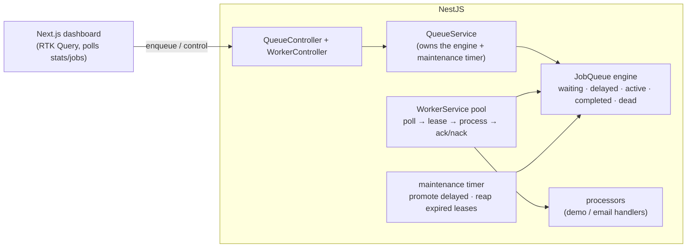

# Job / Task Queue — full-stack implementation

A runnable job queue that demonstrates the mechanics from the
[design write-up](../13-simple-job-queue.md): jobs are **leased** (not deleted) with a **visibility
timeout**, failures **retry with exponential backoff** and end up in a **dead-letter queue**, and a
concurrent **worker pool** drains the backlog while honoring **priority** and **delayed** jobs.

- **`server/`** — NestJS + Zod. A broker-agnostic in-memory queue **engine** plus a worker pool. No
  database, so it runs with just `npm install`.
- **`web/`** — Next.js 14 (App Router) + Redux Toolkit **RTK Query** dashboard: enqueue jobs and watch
  them flow through every state live.

> The store is in-memory so the algorithm is the star; the same lease + visibility-timeout + backoff +
> DLQ mechanics map directly onto Redis/BullMQ, SQS, or RabbitMQ (see the write-up's patterns table).

## Architecture



## Job lifecycle

`waiting → active → completed` on success. On failure: `active → delayed` (backoff) and back to
`waiting`, until attempts run out → `dead`. A worker that crashes mid-job leaves an expired lease that the
reaper returns to `waiting` (at-least-once redelivery).

## Endpoints

| Method | Path | Purpose |
| --- | --- | --- |
| POST | `/jobs` | Enqueue `{ type, payload, priority?, delayMs?, maxAttempts? }` (Zod-validated). |
| GET | `/jobs` | List jobs; `?state=waiting|delayed|active|completed|failed|dead` to filter. |
| GET | `/jobs/:id` | Fetch one job. |
| POST | `/jobs/:id/retry` | Re-drive a dead-lettered job back onto the queue. |
| GET | `/stats` | Counts per state, cumulative totals, oldest-waiting age, backlog. |
| POST | `/queue/reset` | Clear the queue (demo convenience). |
| GET | `/workers` | Worker pool status (paused, concurrency, in-flight, processed/failed). |
| POST | `/workers/pause` · `/workers/resume` | Stop/start consuming. |
| POST | `/workers/concurrency` | `{ concurrency }` — scale the pool at runtime. |

## Run it

Two terminals. **npm is under nvm** here — if `npm` isn't found, prefix commands with
`export PATH="/root/.nvm/versions/node/v22.23.2/bin:$PATH"`.

```bash
# 1) API
cd server
cp .env.example .env          # optional; defaults are fine
npm install
npm run build && npm start    # http://localhost:3009
# or: npm run start:dev

# 2) Web dashboard
cd ../web
cp .env.example .env.local    # NEXT_PUBLIC_API_BASE_URL=http://localhost:3009
npm install
npm run dev                   # http://localhost:3000
```

### Try it with curl

```bash
# a normal job (a worker completes it)
curl -s -X POST http://localhost:3009/jobs -H 'content-type: application/json' \
  -d '{"type":"demo","payload":{"latencyMs":300}}' | jq

# fails once then succeeds on retry (watch attempts go to 2)
curl -s -X POST http://localhost:3009/jobs -H 'content-type: application/json' \
  -d '{"type":"demo","payload":{"failTimes":1}}' | jq

# a poison job → dead-letter after 2 attempts
curl -s -X POST http://localhost:3009/jobs -H 'content-type: application/json' \
  -d '{"type":"demo","payload":{"alwaysFail":true},"maxAttempts":2}' | jq

# high-priority job jumps the line; delayed job runs later
curl -s -X POST http://localhost:3009/jobs -H 'content-type: application/json' -d '{"type":"demo","priority":10}' | jq
curl -s -X POST http://localhost:3009/jobs -H 'content-type: application/json' -d '{"type":"demo","delayMs":5000}' | jq

curl -s http://localhost:3009/stats | jq
curl -s 'http://localhost:3009/jobs?state=dead' | jq
```

## Where each design element lives

| Design element | Code |
| --- | --- |
| Job record + states + Zod schema | `server/src/queue/job.types.ts` |
| Engine: atomic lease + visibility timeout | `server/src/queue/job-queue.ts` (`lease`) |
| Retry with exponential backoff + jitter | `server/src/queue/job-queue.ts` (`nack`, `backoffMs`) |
| Dead-letter after maxAttempts + re-drive | `server/src/queue/job-queue.ts` (`nack`, `retryDead`) |
| Crash recovery (reaper) + delayed promotion | `server/src/queue/job-queue.ts` (`runMaintenance`) |
| Backpressure (bounded queue) | `server/src/queue/job-queue.ts` (`QueueFullError`) → 503 in `queue.controller.ts` |
| Concurrent worker pool + lease heartbeat | `server/src/worker/worker.service.ts` |
| Demo handlers (success/fail/latency) | `server/src/queue/processors.ts` |
| Dashboard + polling | `web/src/components/*` + `web/src/store/queueApi.ts` |

The backend is covered by an end-to-end test (engine mechanics + the full HTTP surface with the worker
pool actually processing jobs). See [`server/README.md`](./server/README.md) and
[`web/README.md`](./web/README.md).
