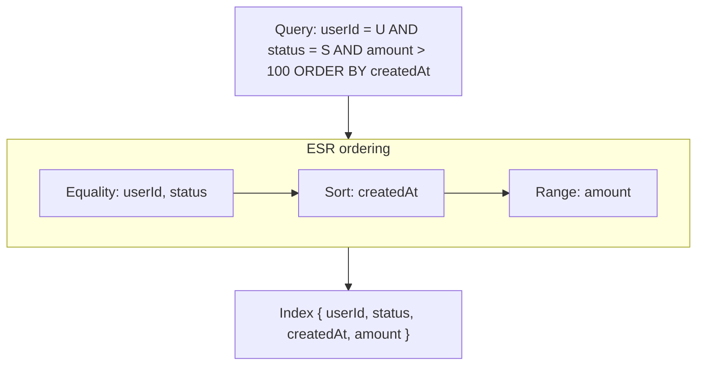
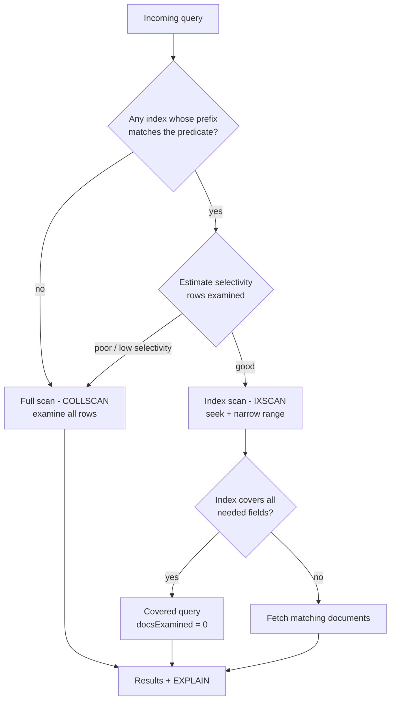
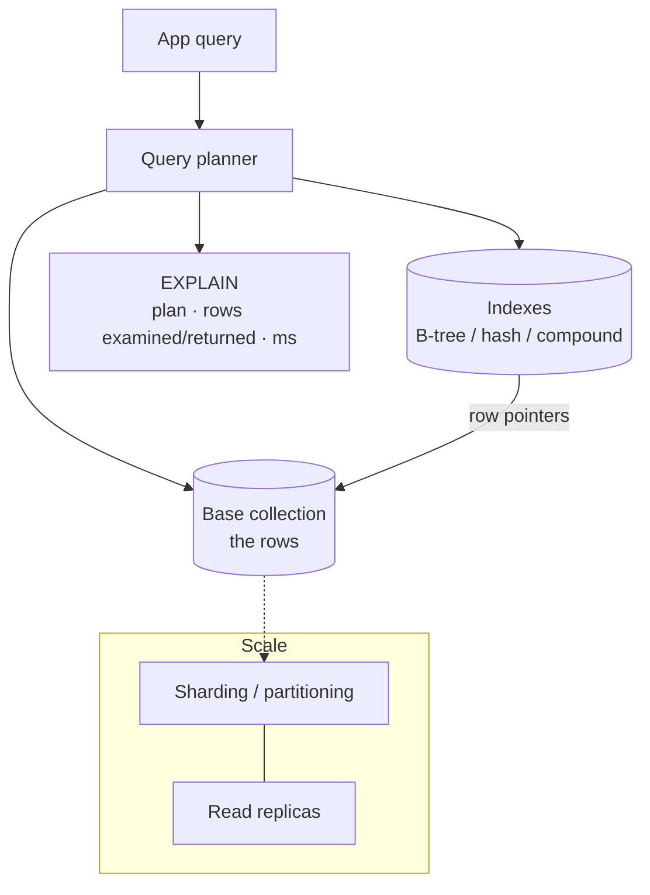
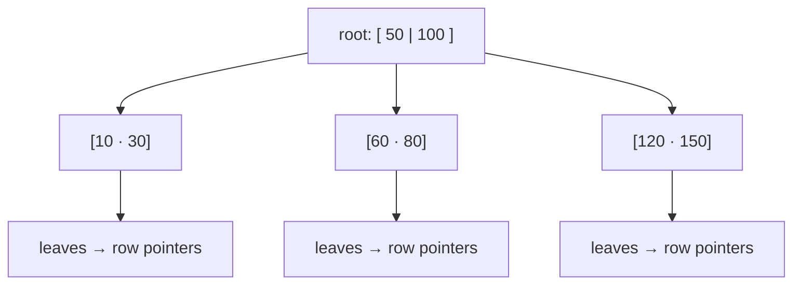

# 14. Database Indexing

> **In one line:** Given a query pattern, decide which fields to index and *how* — turning an
> O(n) full-collection scan into an O(log n) index seek — while understanding the write/storage cost,
> compound-index ordering, covering indexes, and selectivity, with a runnable implementation that shows
> the latency gap.

> **Original prompt:** Given a query pattern, identify which fields in a MongoDB collection need
> (compound) indexes.

## Overview

An **index** is a secondary data structure that lets the database *find* rows without *reading* every
row. Without one, a query like `find({ email: 'x@y.com' })` must **scan the whole collection** (O(n)); an
index on `email` turns that into a **seek** (O(log n) for a B-tree). Indexing is the single biggest lever
for read performance — and the most common thing missing when "the database is slow."

But indexes aren't free: every index must be **updated on every write**, it **consumes storage/memory**,
and a *wrong* index (low selectivity, wrong column order) is dead weight. So the real skill is choosing
the **minimum set of indexes that serves your query patterns**.

This write-up answers:

- **When** does a query need an index, and **which fields**?
- **What kind** — single-field, **compound** (and in what order), **covering**, unique, partial, text?
- **How** does the planner decide between an **index scan** and a **full scan**?
- **What's the cost** — write amplification, storage, memory — and when should you *not* index?
- **How** do you measure it (`EXPLAIN`, rows examined vs returned)?

It ships a runnable implementation in [`./implementation/`](./implementation/): a **NestJS + Zod** service
holding an in-memory dataset with **hash**, **sorted (B-tree-like)**, and **compound** indexes plus a
tiny **query planner** that picks an index or falls back to a scan and returns an **EXPLAIN** (index used,
rows examined vs returned, latency) — and a **Next.js + React + Redux Toolkit** console that runs queries
and shows the **full-scan vs index-scan** latency gap live.

## Functional Requirements

1. Store a dataset of records and run **queries** with equality, range, and multi-field predicates.
2. Create/drop **indexes**: single-field, **compound** (ordered), and **unique**.
3. A **query planner** picks the best available index (or a full scan) for a given query.
4. Return an **EXPLAIN**: which index was used, **rows examined**, **rows returned**, and time.
5. Support **sorting** and demonstrate an index serving `ORDER BY` without a separate sort.
6. Enforce **uniqueness** via a unique index (reject duplicates).

## Non-Functional Requirements

| Attribute | Target / approach |
|---|---|
| **Read latency** | Indexed point/range lookups sub-linear (O(log n) / O(1)); avoid full scans on hot paths |
| **Selectivity** | Index high-selectivity fields; a low-selectivity index barely beats a scan |
| **Write cost** | Bounded index count — each write updates every index (write amplification) |
| **Storage/memory** | Indexes fit in RAM for hot data; track index size vs collection size |
| **Correctness** | Unique indexes enforce constraints; planner never returns wrong rows |
| **Observability** | `EXPLAIN` exposes plan, rows examined/returned ratio, index hit/miss |

## A Realistic Interview Conversation

> **I** = Interviewer, **C** = Candidate.

**I:** Our query `orders.find({ userId, status }).sort({ createdAt: -1 })` is slow. What do you do?

**C:** First I'd `EXPLAIN` it to confirm it's doing a **COLLSCAN** (full scan). The query filters on
`userId` and `status` and sorts by `createdAt`, so the fix is a **compound index**. The key question is
**field order**.

**I:** So what order?

**C:** The rule of thumb is **ESR: Equality, Sort, Range**. Equality-matched fields first (`userId`,
`status`), then the **sort** field (`createdAt`), then any range fields. So
`{ userId: 1, status: 1, createdAt: -1 }`. That lets the index narrow to the user's orders of that
status *and* return them already ordered by `createdAt`, so there's **no separate in-memory sort**. Order
matters because a compound index is like a phone book sorted by (lastName, firstName): great for "all
Smiths" or "Smith, John," useless for "everyone named John."

**I:** Why not just index every field?

**C:** Because indexes have a **cost**. Every `insert`/`update`/`delete` must update **every** index that
covers the changed fields — that's **write amplification**. Indexes also consume **storage and RAM**
(they're most useful when resident in memory). And a **low-selectivity** index (e.g. a boolean, or a
`status` with two values) barely helps — the planner may ignore it and scan anyway. So I index for the
**actual query patterns**, not "just in case," and I periodically drop **unused** indexes.

**I:** What is a covering index?

**C:** One that contains **all** the fields a query needs — both the filter *and* the projected fields —
so the database answers entirely **from the index** and never touches the documents. In `EXPLAIN` you see
`totalDocsExamined: 0`. For `find({ userId }, { status: 1, _id: 0 })`, an index on
`{ userId: 1, status: 1 }` is covering.

**I:** How do you know an index is actually helping?

**C:** The **rows examined vs rows returned** ratio. Ideal is ~1:1 — the index led almost straight to the
matching rows. If you examine 1,000,000 to return 10, the index is poor (or missing) for that query. I
also watch the planner's chosen plan and whether it needed an in-memory **SORT** stage.

**I:** What kinds of indexes exist beyond single-field?

**C:** **Compound** (multi-field, ordered), **unique** (enforces no duplicates), **partial/filtered**
(index only rows matching a predicate — smaller, cheaper), **multikey** (indexes array elements),
**text** (full-text search), **geospatial**, and **hashed** (for hash-based sharding / equality only, no
ranges). The underlying structure is usually a **B-tree/B+-tree**; hash indexes give O(1) equality but
can't do ranges or sorts.

**I:** B-tree vs hash — when each?

**C:** **B-tree** is the default: it keeps keys **sorted**, so it serves equality, **range**
(`>`, `<`, `between`), **prefix**, and **ORDER BY**. **Hash** is O(1) for **exact equality** only — no
ranges, no ordering. Most databases default to B-tree for exactly this flexibility.

**I:** How does this scale?

**C:** Indexes are the first tool, but for huge datasets you combine them with **partitioning/sharding**
(the shard key is itself an index decision), **read replicas** to spread read load, and keeping the
**working set + its indexes in RAM**. You also avoid anti-patterns: leading wildcards (`%foo`),
functions on indexed columns (`WHERE lower(email) = …` unless you index the expression), and
low-selectivity leading columns.

## What & Why: the latency gap

```text
Collection: 1,000,000 rows
Full scan  (COLLSCAN):  examine 1,000,000 rows  →  O(n)
B-tree seek (IXSCAN):   examine ~20 rows         →  O(log n)   (log2(1e6) ≈ 20)
```

An index trades **write cost + storage** for a massive **read** win. The whole game is picking indexes
that pay for themselves on your real query mix.

## Index Types

| Type | Structure | Serves | Notes |
|---|---|---|---|
| **Single-field** | B-tree | equality, range, sort on one field | The basic building block |
| **Compound** | B-tree (ordered keys) | multi-field filters + sort (prefix rules) | Order matters — ESR rule |
| **Covering** | (any index containing all needed fields) | filter + projection from index alone | `docsExamined: 0` |
| **Unique** | B-tree + constraint | equality + enforces no duplicates | Rejects dup inserts |
| **Partial / filtered** | B-tree over a subset | queries matching the filter | Smaller, cheaper writes |
| **Hash** | hash table | **equality only** | O(1) point; no ranges/sort |
| **Multikey** | B-tree over array elements | membership in arrays | One value per element |
| **Text / geo** | inverted / R-tree | full-text / spatial | Specialized |

## Compound Indexes & the ESR Rule

A compound index `{ a, b, c }` is sorted by `a`, then `b`, then `c` — like a dictionary. It can serve a
query that uses a **left-to-right prefix** of its keys:

```text
Index { userId, status, createdAt }
✅ userId                          (prefix)
✅ userId + status                 (prefix)
✅ userId + status + createdAt     (full)
✅ userId + status  ORDER BY createdAt   (filter + ordered scan, no sort stage)
❌ status alone                    (skips the leading key → can't use it)
❌ createdAt alone                 (not a prefix)
```

**ESR — Equality, Sort, Range** — is the ordering recipe:

1. **Equality** fields first (`field = value`) — they pin the index to a narrow slice.
2. **Sort** fields next — so the slice is already in `ORDER BY` order (no in-memory sort).
3. **Range** fields last (`>`, `<`, `between`) — they widen the scan, so they go at the end.



## The Query Planner (index vs scan)

The planner enumerates candidate plans, estimates their cost from index **selectivity**, and picks the
cheapest — falling back to a **full scan** when no index applies.



## High-Level Design (HLD)



Related concepts: [Index](../../02-data-and-storage-concepts/05-index.md),
[Database](../../02-data-and-storage-concepts/01-database.md),
[SQL Database](../../02-data-and-storage-concepts/02-sql-database.md),
[Sharding](../../02-data-and-storage-concepts/06-sharding.md),
[Data Partitioning](../../02-data-and-storage-concepts/14-data-partitioning.md).

## Low-Level Design (LLD)

### The B-tree (why sorted keys win)

A B-tree/B+-tree keeps keys **sorted** in a shallow, high-fan-out tree, so a lookup touches only
`O(log n)` nodes, and because leaves are **ordered**, a **range** query is a seek to the start plus a
sequential walk — and an `ORDER BY` on the index key needs **no sort**.



### Index structures in the implementation

```text
HashIndex(field)              → Map<value, id[]>            O(1) equality; no range/sort
SortedIndex(field)            → [{ key, id }] sorted        O(log n) equality + range + ORDER BY
CompoundIndex([f1, f2, ...])  → sorted by composite key     prefix-matched (ESR)
UniqueIndex(field)            → Map + constraint            rejects duplicates
```

### Planner contract

```text
plan(query)      → { strategy: 'index'|'scan', indexName?, reason }
run(query)       → { rows, explain }
explain(query)   → { strategy, indexUsed, rowsExamined, rowsReturned, sorted, coveredHint, ms }
createIndex(spec) / dropIndex(name) / listIndexes()
```

### Project structure

```text
server/src/
├── engine/
│   ├── indexes.ts        # HashIndex, SortedIndex, CompoundIndex, UniqueIndex
│   ├── dataset.ts        # in-memory rows + deterministic seed generator
│   ├── planner.ts        # choose index vs scan; ESR prefix matching; selectivity ← the core
│   └── engine.ts         # ties dataset + indexes + planner; run + EXPLAIN
├── catalog/              # REST: seed, query, indexes CRUD, explain, reset
└── common/zod-validation.pipe.ts
```

## Scaling & Performance

- **Index the query, not the table.** Start from your top queries; build the minimal compound index per
  pattern (ESR). Drop **unused** indexes (they only cost writes).
- **Selectivity first.** A leading column with few distinct values (e.g. a boolean) is a poor index; put
  high-selectivity equality fields first.
- **Covering indexes** for hot read paths → answer from the index, skip document fetches.
- **Keep indexes in RAM.** Index efficiency collapses if the B-tree spills to disk; size memory for the
  working set + indexes.
- **Write amplification.** N indexes ≈ N+1 structures to update per write; on write-heavy tables keep the
  index count lean.
- **Partition / shard** for volume; the **shard key** is an index decision (and affects every query).
  Add **read replicas** to spread read load. See
  [Sharding](../../02-data-and-storage-concepts/06-sharding.md),
  [Replication](../../02-data-and-storage-concepts/07-replication.md).
- **Avoid index-defeating queries:** leading wildcards (`LIKE '%x'`), functions on indexed columns,
  implicit type coercions, `OR` across unindexed fields, and huge `IN` lists.

## Security

- **Injection defeats indexes and safety.** Use parameterized queries / the driver's query builder;
  never build predicates by string concatenation (NoSQL injection can also force scans → DoS).
- **Unindexed user-controlled filters** are a **DoS vector** — an attacker sends a query that forces a
  full scan on a huge collection. Allowlist filterable/sortable fields and require an index for them; cap
  result size and add query timeouts.
- **Unique indexes as constraints.** Enforce uniqueness (emails, usernames) in the DB via a unique index,
  not just in app code, to avoid race-condition duplicates.
- **Don't leak via error messages.** A unique-violation error can reveal that an email exists (user
  enumeration) — return a generic message on sensitive uniqueness checks.

## All Solution Patterns (summary)

| Concern | Options | Chosen here | Why |
|---|---|---|---|
| Equality lookup | scan · **hash** · B-tree | Hash (+ B-tree) | O(1) point lookups |
| Range / sort | scan · **B-tree** | Sorted B-tree-like | Ordered keys serve ranges + ORDER BY |
| Multi-field | multiple single · **compound** | Compound (ESR) | One seek narrows + orders |
| Read-only projection | fetch docs · **covering** | Covering hint | Answer from index, `docsExamined:0` |
| Uniqueness | app check · **unique index** | Unique index | Race-safe constraint |
| Big volume | index only · **index + shard/replica** | Index (+ doc on sharding) | Scale reads + storage |

## Implementation

A runnable full-stack implementation lives in [`./implementation/`](./implementation/):

| Layer | Stack | Highlights |
|---|---|---|
| **`server/`** | NestJS + Zod | In-memory dataset + **hash / sorted / compound / unique** indexes, a **query planner** (ESR prefix match + selectivity) that picks index vs full scan, and an **EXPLAIN** (index used, rows examined vs returned, sorted, ms). Unique-index enforcement. |
| **`web/`** | Next.js + React + Redux Toolkit (RTK Query) | Seed N rows, a **query builder** (field / operator / value / sort), a create-index panel, and side-by-side **full-scan vs index-scan** latency + rows-examined comparison. |

| Design element | Where in the code |
|---|---|
| Index structures | `server/src/engine/indexes.ts` |
| Dataset + seed | `server/src/engine/dataset.ts` |
| Planner (index vs scan, ESR) | `server/src/engine/planner.ts` |
| Engine (run + EXPLAIN) | `server/src/engine/engine.ts` |
| Query builder + EXPLAIN UI | `web/src/components/*` + `store/indexApi.ts` |

The backend is verified by an **end-to-end test**: an unindexed query does a **full scan** (rows examined
= dataset size); after creating an index the same query does an **index scan** (rows examined ≈ rows
returned) and is faster; a **compound** index serves a two-field filter + sort with no sort stage; a
**covering** query reports `docsExamined: 0`; and a **unique** index rejects duplicates.

## Tips

- Always `EXPLAIN` before and after — confirm `IXSCAN` (not `COLLSCAN`) and a low examined:returned ratio.
- Build **compound** indexes with **ESR** (Equality, Sort, Range); a query can only use a **prefix**.
- Index for **selectivity**; skip low-cardinality leading columns.
- Prefer a **covering** index on hot read paths.
- Every index is a **write tax** — keep the set minimal and drop unused ones.

## Trade-offs & Pitfalls

- **Too many indexes** slow writes and waste RAM — index the queries you actually run.
- **Wrong compound order** makes an index unusable for a query (not a prefix).
- **Low-selectivity index** (booleans, 2-value enums as leading key) barely beats a scan.
- **Functions/casts on indexed columns** (`lower(email)`, `date(ts)`) bypass the index unless you index
  the expression.
- **Leading wildcards** (`LIKE '%x'`) and negations (`!=`, `NOT IN`) can't use a B-tree efficiently.
- **Unindexed user filters** on big tables are a **DoS** risk — allowlist + require indexes + timeouts.

## System Design Cheat Sheet

```text
1.  SLOW?        EXPLAIN → is it COLLSCAN? examined:returned ratio?
2.  WHICH FIELD? index the filter/sort fields of your top queries (not everything)
3.  COMPOUND?    ESR order: Equality, then Sort, then Range; queries use a left prefix
4.  KIND?        B-tree default (range+sort); hash for equality-only; unique for constraints
5.  COVERING?    include projected fields → answer from index (docsExamined=0)
6.  COST?        every write updates every index; indexes eat RAM → keep minimal
7.  SELECTIVITY? high-cardinality leading columns; skip low-value indexes
8.  SCALE?       indexes + shard/partition (shard key = index) + read replicas + RAM
9.  AVOID?       leading wildcards, fn(col), casts, OR on unindexed, huge IN
10. SECURE?      parameterize; allowlist filter/sort fields; cap rows + timeouts (anti-DoS)
```
