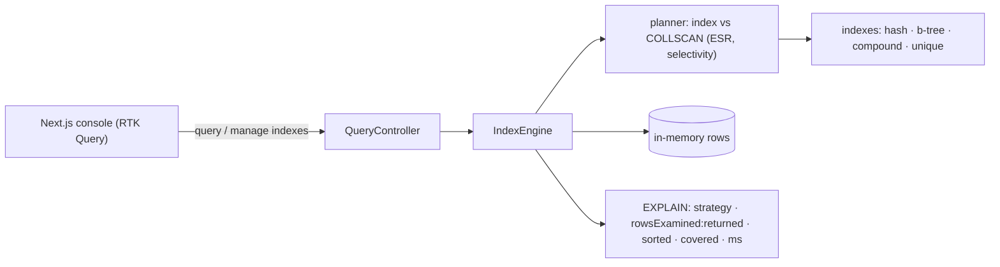

# Database Indexing — full-stack implementation

A runnable demo of the ideas in the [design write-up](../14-database-indexing.md): run a query against
an in-memory collection and read its **EXPLAIN** — with no index the planner does a **full scan
(COLLSCAN)** that examines every row; add a matching **b-tree / hash / compound** index and the same
query becomes an **index scan (IXSCAN)** examining far fewer rows.

- **`server/`** — NestJS + Zod. An in-memory dataset, hash / B-tree / compound / unique indexes, and a
  cost-based **query planner** that picks the access path and reports an EXPLAIN. No database.
- **`web/`** — Next.js 14 + Redux Toolkit **RTK Query** console: query builder, index manager, and the
  full-scan-vs-index-scan comparison.

## Architecture



## Endpoints

| Method | Path | Purpose |
| --- | --- | --- |
| POST | `/query` | Run `{ where[], sort?, project?, limit? }` → rows + EXPLAIN. |
| POST | `/seed` | `{ size }` — regenerate the dataset (rebuilds indexes). |
| GET | `/indexes` | List indexes. |
| POST | `/indexes` | Create `{ fields[], kind: 'btree'\|'hash', unique?, name? }` (unique dup → 409). |
| DELETE | `/indexes/:name` | Drop an index. |
| GET | `/stats` | Row + index counts. |
| POST | `/reset` | Fresh dataset, drop all indexes. |

## Run

**npm is under nvm** here — if `npm` isn't found, prefix with `export PATH="/root/.nvm/versions/node/v22.23.2/bin:$PATH"`.

```bash
cd server && cp .env.example .env && npm install && npm run build && npm start   # :3010
cd ../web && cp .env.example .env.local && npm install && npm run dev            # :3000
```

### Try it with curl

```bash
# full scan (no index) — rowsExamined == dataset size
curl -s -X POST :3010/query -H 'content-type: application/json' -d '{"where":[{"field":"city","op":"eq","value":"London"}]}' | jq .explain
# add an index, then the same query is an IXSCAN examining far fewer rows
curl -s -X POST :3010/indexes -H 'content-type: application/json' -d '{"fields":["city"],"kind":"btree"}'
curl -s -X POST :3010/query -H 'content-type: application/json' -d '{"where":[{"field":"city","op":"eq","value":"London"}]}' | jq .explain
```

## Where each design element lives

| Element | Code |
| --- | --- |
| Hash / B-tree / compound / unique indexes | `server/src/engine/indexes.ts` |
| Deterministic dataset + seed | `server/src/engine/dataset.ts` |
| Cost-based planner (ESR, selectivity, index vs scan) | `server/src/engine/planner.ts` |
| Engine: run + EXPLAIN | `server/src/engine/engine.ts` |
| Query builder + EXPLAIN badges | `web/src/components/QueryConsole.tsx` |
| Index manager | `web/src/components/IndexManager.tsx` |

Verified end-to-end (engine mechanics + HTTP): COLLSCAN vs IXSCAN row counts, hash chosen for equality,
compound ESR serving filter+sort with no sort stage, covered queries, and unique-index enforcement.
