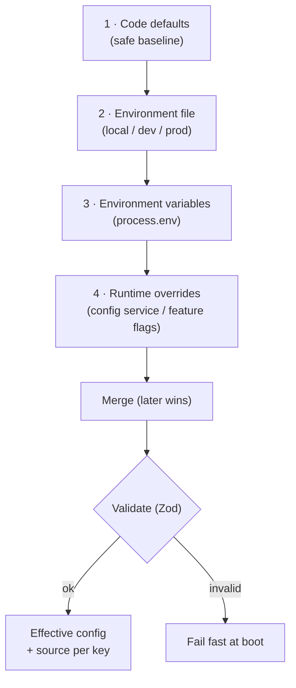
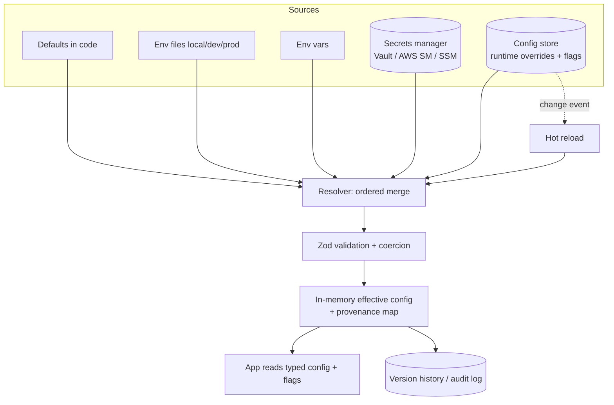

# 15. Config Management

> **In one line:** Design a system that resolves configuration from **layered sources**
> (defaults → per-environment → environment variables → runtime overrides), **validates** it at boot,
> keeps **secrets** out of code, exposes **feature flags**, and supports **hot reload with an audit
> trail** — with a runnable implementation that shows which layer won each key.

> **Original prompt:** Design a secure way to manage environment variables (secrets) across local, dev,
> and prod environments.

## Overview

Configuration is everything that changes **between environments or over time** without changing code:
ports, database URLs, feature flags, timeouts, third-party keys. Do it badly and you get the classic
failures — a secret committed to git, "works on my machine," a prod outage because an env var was a
typo'd string `"false"` that's truthy, or a feature that can't be turned off without a redeploy.

Good config management answers:

- **Layering** — where does a value come from, and who **wins** when several sources set the same key?
- **Validation** — how do we **fail fast** on a missing/malformed value instead of crashing at 3am?
- **Secrets** — how do we keep them **out of the codebase** and out of logs?
- **Feature flags** — how do we toggle behavior **without a deploy**?
- **Change safety** — hot reload, **versioning**, and an **audit trail** of who changed what.

This follows the **12-Factor** principle of strict config/code separation. It ships a runnable
implementation in [`./implementation/`](./implementation/): a **NestJS + Zod** config service that merges
ordered layers, tracks the **winning source per key**, validates against a schema, **masks secrets**,
serves **feature flags**, and keeps a **version history** — plus a **Next.js + React + Redux Toolkit**
console that shows the resolved config with a **source badge** on every key.

## Functional Requirements

1. **Resolve** effective config by merging ordered layers (later layers override earlier).
2. Track **provenance** — for each key, which layer supplied the winning value.
3. **Validate** the resolved config against a **Zod schema**; reject invalid config with clear errors.
4. Manage **secrets**: mark keys secret, **mask** them in responses/logs, never commit them.
5. **Feature flags**: read and toggle boolean/variant flags at runtime.
6. **Runtime overrides**: set/clear a value at the highest-priority layer without a redeploy.
7. **Versioning & audit**: every change creates a version with a diff and who/when; support rollback.

## Non-Functional Requirements

| Attribute | Target / approach |
|---|---|
| **Fail fast** | Invalid/missing required config aborts **boot**, not a live request |
| **Security** | Secrets never in code/logs/responses (masked); least-privilege access |
| **Consistency** | One deterministic resolution order; same inputs → same output |
| **Auditability** | Every change versioned with actor, timestamp, and diff |
| **Availability** | Config store outage must degrade to last-known-good, not hard-fail |
| **Latency** | Resolved config cached in memory; reads are O(1) |
| **Type safety** | Coerced + typed values (no stringly-typed `"true"`/`"false"` bugs) |

## A Realistic Interview Conversation

> **I** = Interviewer, **C** = Candidate.

**I:** How do you manage config across local, dev, and prod?

**C:** I separate **config from code** (12-Factor) and resolve it from **ordered layers**, lowest to
highest precedence: (1) **code defaults**, (2) **per-environment** files (`local`/`dev`/`prod`), (3)
**environment variables**, (4) **runtime overrides** (a config service / flags). Later layers override
earlier ones, so prod overrides defaults, and an env var overrides the file. The effective config is the
**merge**, and I track **which layer won each key** so it's debuggable.

**I:** How do you avoid the "env var typo" class of bugs?

**C:** **Validate at boot** with a schema (Zod here). Env vars are always strings, so I **coerce** and
type them — `PORT` becomes a positive int, `DEBUG` a real boolean — and if anything required is missing or
malformed, the process **fails fast** on startup with a precise error, instead of a truthy `"false"`
silently enabling something in prod.

**I:** Where do secrets live?

**C:** **Never in the repo.** Locally, an untracked `.env` (with a committed `.env.example` template). In
real environments, a **secrets manager** — AWS Secrets Manager / SSM Parameter Store, Vault, or the
platform's encrypted secrets — injected at deploy/runtime. Secrets are **marked** so they're **masked**
in any config dump, API response, or log line. Access is least-privilege and audited, and secrets are
**rotatable**.

**I:** Feature flags — why and how?

**C:** To **decouple deploy from release**: ship code dark, turn it on with a flag, and **kill it
instantly** if it misbehaves — no redeploy. Flags also enable gradual rollouts and A/B tests. A flag is
just a high-priority config key; I keep them in the runtime layer so they can change live, with the same
audit trail.

**I:** How do you change config without a redeploy — safely?

**C:** A **runtime override** layer backed by a config store, with **hot reload** (poll or subscribe to
changes). Safety comes from: **validation on write** (reject a change that fails the schema), **versioning**
(every change is a new immutable version with a diff + actor), **rollback** to any prior version, and
**last-known-good** caching so a store outage doesn't take the app down.

**I:** How do you make sure two instances agree?

**C:** A **central source of truth** (the config service/store) plus a resolution order that's
**deterministic**. Instances converge on reload; for changes that must be atomic across the fleet you
version the whole config and flip a pointer, rather than editing keys one at a time.

**I:** What about config that's wrong but valid?

**C:** Schema validation catches *shape* errors, not *semantic* ones. Mitigations: **canary** the change
to one instance, **gradual rollout** of flags, dashboards/alerts on the effective values, and easy
**rollback** — treat config changes with the same care as code deploys, because they *are* deploys.

## What & Why: config as layers



Precedence, low → high: **defaults < environment file < env vars < runtime overrides**. Each key's value
comes from the **highest** layer that set it.

## Core Concepts

| Term | Meaning |
|---|---|
| **Layer / source** | An ordered provider of key→value (defaults, env file, env vars, runtime) |
| **Resolution / merge** | Combine layers so the highest-precedence value wins per key |
| **Provenance** | Which layer supplied a key's winning value (for debugging) |
| **Schema validation** | Coerce + type-check the merged config; fail fast on error |
| **Secret** | A sensitive value that must be masked and kept out of code/logs |
| **Feature flag** | A runtime-toggleable switch that gates behavior without a deploy |
| **Version / audit** | An immutable snapshot + diff of a change, with actor and time |

## High-Level Design (HLD)



Related concepts: [Idempotency](../../03-distributed-systems-concepts/07-idempotency.md),
[Graceful Shutdown](../29-graceful-shutdown/29-graceful-shutdown.md),
[Rate Limiting](../../05-reliability-performance-and-modern-concepts/02-rate-limiting.md).

## Low-Level Design (LLD)

### Resolution algorithm

```text
resolve(layers[]):                       # layers ordered low → high precedence
  effective = {}
  source    = {}                          # key → winning layer name
  for layer in layers:                    # later overrides earlier
     for (key, value) in layer.entries:
        effective[key] = value
        source[key]    = layer.name
  validated = schema.parse(coerce(effective))   # fail fast on error
  return { effective: validated, source }
```

### Secret masking

```text
render(config, { reveal=false }):
  for key in config:
     if isSecret(key) and not reveal:
        out[key] = mask(value)            # e.g. "sk_live_…last4" or "••••"
     else:
        out[key] = value
```

Secrets are declared in the schema (a `secret` marker); the renderer masks them everywhere by default,
revealing only for an explicitly authorized request.

### Feature flags

```text
flag(name)            → boolean | variant           # read from the runtime layer
setFlag(name, value)  → new version                 # validated + audited
```

### Versioning & audit

```text
setOverride(key, value, actor):
   validate(candidate)                    # reject if the change breaks the schema
   version = snapshot(effective) + diff(prev, next)
   history.push({ version, actor, at, diff })
rollback(version) → restore that snapshot
```

### Service contracts (implemented here)

```text
getConfig({ reveal? })          → { config (masked), source, environment, version }
getLayers()                     → per-layer key/values (provenance breakdown)
setOverride(key, value, actor)  → validated + versioned
clearOverride(key)              → remove from the runtime layer
validate(candidate)             → { ok, errors? }
flags() / setFlag(name, value)  → feature flags
versions() / rollback(v)        → audit history + restore
```

### Project structure

```text
server/src/
├── engine/
│   ├── schema.ts        # Zod schema: types, defaults, secret markers, coercion
│   ├── layers.ts        # defaults, env-file (local/dev/prod), env-vars, runtime layers
│   ├── resolver.ts      # ordered merge + provenance + validation  ← the core
│   └── history.ts       # versioning, diff, audit, rollback
├── config-api/          # REST: config, layers, overrides, flags, validate, versions
└── common/zod-validation.pipe.ts
```

## Scaling & Performance

- **Resolve once, cache in memory.** Config reads are hot; merge + validate on boot/reload and serve from
  an in-memory snapshot (O(1) reads). Never hit the store per request.
- **Central store, many readers.** A config service/store (or a KV like etcd/Consul, or AWS
  AppConfig/SSM) is the source of truth; instances subscribe or poll and **hot reload**.
- **Last-known-good.** If the store is unreachable, keep serving the last valid snapshot — config outages
  must **degrade**, not crash the fleet.
- **Atomic fleet changes.** Version the whole config and flip a pointer so all instances move together;
  avoid partially-applied edits.
- **Flag evaluation is local.** Pull flag definitions and evaluate in-process for zero per-check latency;
  gradual rollout by hashing a stable key (user id) into buckets.

## Security

- **Never commit secrets.** `.gitignore` the real `.env`; commit only `.env.example`. Scan the repo/CI
  for leaked keys (git hooks / secret scanners).
- **Secrets manager, not env text** in real environments — AWS Secrets Manager / SSM / Vault, injected at
  runtime with **least-privilege** IAM and **rotation**.
- **Mask everywhere.** Secrets masked in API responses, logs, error messages, and crash dumps; reveal
  only via an explicitly authorized, audited path.
- **Least privilege + audit.** Who can read/change which keys is authorized and logged; every change is
  attributable (the version history).
- **Validate on write.** Reject config changes that fail the schema *before* they take effect, so a bad
  change can't brick the app.
- **Separate secrets by environment.** Prod secrets are never available to dev; no shared master keys.

## All Solution Patterns (summary)

| Concern | Options | Chosen here | Why |
|---|---|---|---|
| Precedence | flat file · **ordered layers** | Ordered layers (defaults→env→envvars→runtime) | Deterministic, debuggable |
| Validation | none · runtime checks · **schema at boot** | Zod schema, fail fast | Catches typos before serving |
| Secrets | in code · env text · **secrets manager + masking** | Marked + masked (doc: SM) | Out of code, out of logs |
| Flags | redeploy · **runtime flags** | Runtime flag layer | Decouple deploy from release |
| Change safety | edit in place · **version + audit + rollback** | Versioned history | Safe, attributable, reversible |
| Distribution | per-instance files · **central store + hot reload** | Central store (doc) + cache | Fleet consistency |

## Implementation

A runnable full-stack implementation lives in [`./implementation/`](./implementation/):

| Layer | Stack | Highlights |
|---|---|---|
| **`server/`** | NestJS + Zod | Ordered-layer resolver (**defaults → environment → env-vars → runtime**) with **per-key provenance**, **Zod** validation + coercion (fail fast), **secret masking**, **feature flags**, and a **version history** with diff + rollback. |
| **`web/`** | Next.js + React + Redux Toolkit (RTK Query) | Environment selector, resolved config with a **source badge** per key, **reveal/mask** secrets toggle, feature-flag switches, a runtime-override editor with validation errors, and a version-history/rollback panel. |

| Design element | Where in the code |
|---|---|
| Schema + defaults + secret markers | `server/src/engine/schema.ts` |
| Layer providers | `server/src/engine/layers.ts` |
| Ordered merge + provenance + validation | `server/src/engine/resolver.ts` |
| Versioning + diff + rollback | `server/src/engine/history.ts` |
| Config console (source badges, flags) | `web/src/components/*` + `store/configApi.ts` |

The backend is verified by an **end-to-end test**: layer precedence resolves correctly (runtime overrides
env overrides file overrides defaults) and **provenance** reports the winning layer per key; **invalid**
config is rejected; **secrets** are masked unless explicitly revealed; a **feature flag** toggles;
setting a **runtime override** creates a new **version**; and **rollback** restores a prior snapshot.

## Tips

- Separate **config from code**; the same artifact runs in every environment with different config.
- **Coerce + validate at boot** — never trust a raw env string; fail fast on bad config.
- **Never commit secrets**; use a secrets manager and mask everywhere.
- Track **provenance** (which layer won) — it turns "why is this value X?" into a one-line answer.
- Treat config changes like deploys: **validate, version, canary, roll back**.

## Trade-offs & Pitfalls

- **Stringly-typed env vars** (`"false"` is truthy) — always coerce and type.
- **Secrets in the repo or logs** — the #1 config incident; mask + secrets manager + scanning.
- **No validation** → the app boots with bad config and fails on a live request instead of at startup.
- **Config drift** between instances/environments — centralize the source of truth.
- **Unversioned live edits** — no way to see what changed or roll back; always audit.
- **Valid-but-wrong** config — schema can't catch semantics; canary and monitor effective values.

## System Design Cheat Sheet

```text
1.  SEPARATE?    config out of code (12-Factor); one artifact, many environments
2.  LAYERS?      defaults < env file < env vars < runtime overrides (later wins)
3.  PROVENANCE?  track which layer won each key (debuggability)
4.  VALIDATE?    Zod coerce + type at BOOT; fail fast on missing/malformed
5.  SECRETS?     never in repo; secrets manager; mask in responses/logs; rotate
6.  FLAGS?       runtime-toggleable switches → decouple deploy from release
7.  CHANGE?      validate on write, version + audit + diff, rollback, last-known-good
8.  DISTRIBUTE?  central store + hot reload; cache in memory (O(1) reads)
9.  ATOMIC?      version whole config + flip pointer for fleet-wide changes
10. TREAT AS?    a config change is a deploy — canary + monitor + revert
```
