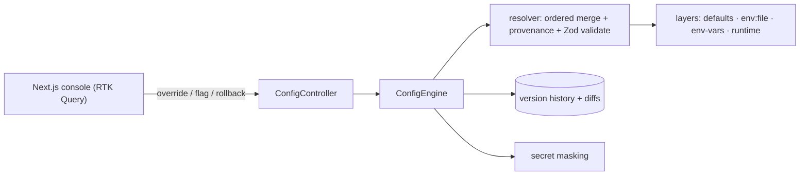

# Config Management — full-stack implementation

A runnable demo of the [design write-up](../15-config-management.md): configuration resolved from
**ordered layers** (defaults → environment file → env vars → runtime overrides) with **per-key
provenance**, **schema validation**, **secret masking**, **feature flags**, and a **versioned, reversible
audit trail**.

- **`server/`** — NestJS + Zod. The layered resolver, validation, secret masking, flags, and version
  history. No database.
- **`web/`** — Next.js 14 + Redux Toolkit **RTK Query** console: resolved config with a source badge per
  key, secret reveal, override editor, flags, layer breakdown, and version history with rollback.

## Architecture



## Endpoints

| Method | Path | Purpose |
| --- | --- | --- |
| GET | `/config?reveal=` | Resolved config + `source` per key (secrets masked unless `reveal=true`). |
| GET | `/config/layers?reveal=` | Per-layer contributions. |
| GET | `/config/meta` | Key metadata (type, secret) for the UI. |
| POST | `/config/overrides` | `{ key, value }` — validated before it takes effect (bad → 400). |
| DELETE | `/config/overrides/:key` | Remove a runtime override. |
| POST | `/config/validate` | Dry-run validate `{ overrides }` without persisting. |
| POST | `/config/environment` | `{ environment: local\|dev\|prod }`. |
| GET / POST | `/flags` | Read / toggle `{ name, value }` feature flags. |
| GET | `/versions` | Audit history (newest first). |
| POST | `/versions/:version/rollback` | Restore a prior snapshot. |
| POST | `/reset` | Clear overrides + flags to defaults. |

## Run

**npm is under nvm** — prefix with `export PATH="/root/.nvm/versions/node/v22.23.2/bin:$PATH"` if needed.

```bash
cd server && cp .env.example .env && npm install && npm run build && npm start   # :3011
cd ../web && cp .env.example .env.local && npm install && npm run dev            # :3000
```

### Try it with curl

```bash
curl -s :3011/config | jq                     # PORT=9090 (env var wins + coerced to number), secrets masked
curl -s ':3011/config?reveal=true' | jq       # secrets revealed
curl -s -X POST :3011/config/overrides -H 'content-type: application/json' -d '{"key":"LOG_LEVEL","value":"error"}' | jq .source
curl -s -X POST :3011/config/overrides -H 'content-type: application/json' -d '{"key":"PORT","value":-5}'   # 400 with errors
```

## Where each design element lives

| Element | Code |
| --- | --- |
| Schema, defaults, secret markers, coercion | `server/src/engine/schema.ts` |
| Layer providers (defaults/env/env-vars/runtime) | `server/src/engine/layers.ts` |
| Ordered merge + provenance + validation | `server/src/engine/resolver.ts` |
| Versioning, diffs, rollback | `server/src/engine/history.ts` |
| Orchestration | `server/src/engine/engine.ts` |
| Config table with source badges + editor | `web/src/components/ConfigTable.tsx` |
| Flags + version history | `web/src/components/SidePanels.tsx` |

Verified end-to-end (engine + HTTP): layer precedence + provenance, env-var string coerced to number,
secret masking/reveal, validation rejects bad overrides, flags toggle, versioning + rollback.
