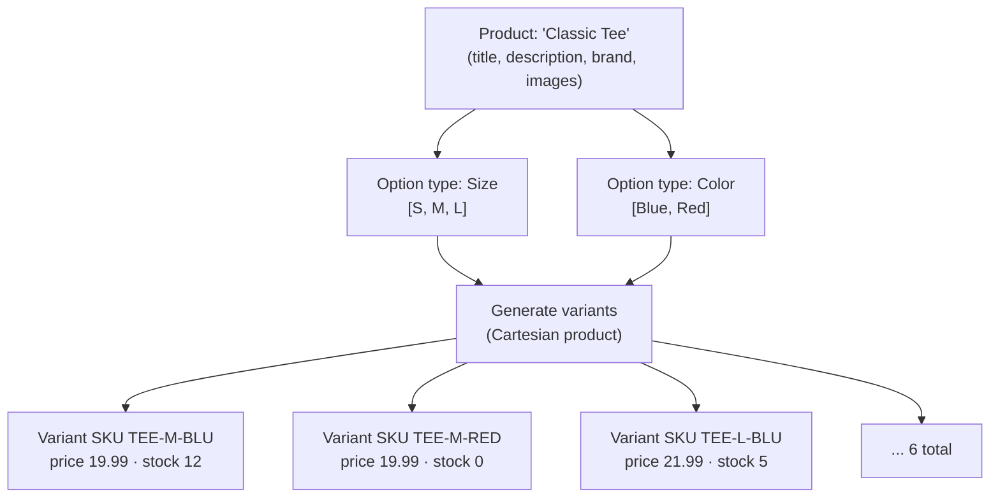
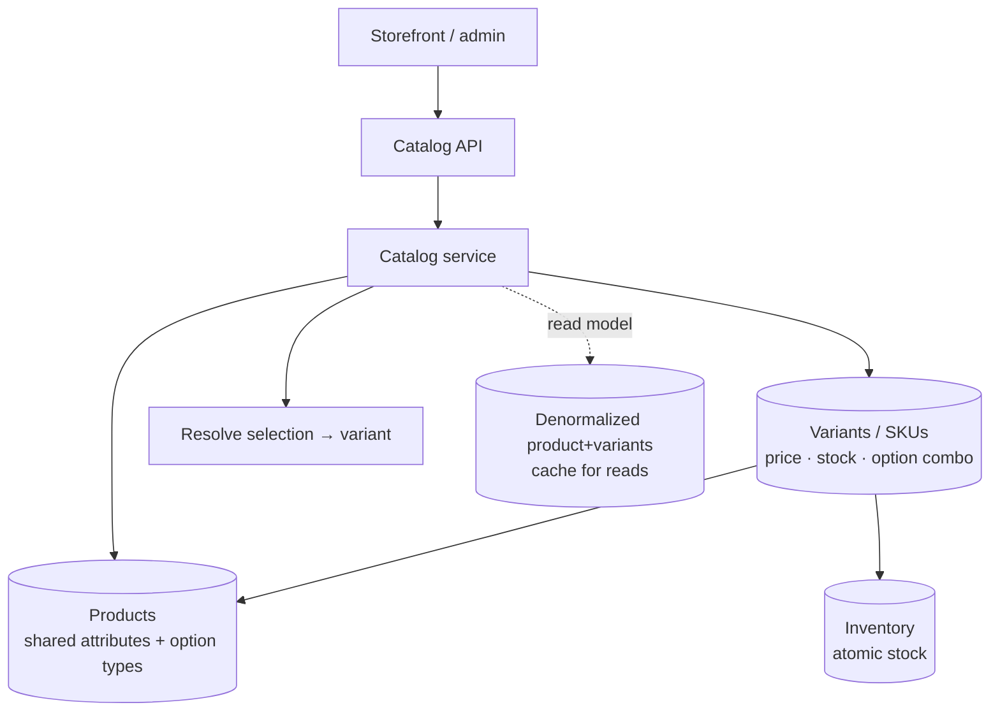

# 17. Model a Product Catalog with Variants

> **In one line:** Design a schema where a **product** (the marketing concept) owns a set of **option
> types** (size, color…), whose combinations generate concrete, sellable **variants/SKUs** — each with
> its own price, inventory, and identifier — so you can list products, resolve an option selection to a
> SKU, and track stock, without duplicating shared data.

> **Original prompt:** Design a schema to handle products with multiple sizes, colors, and prices
> efficiently.

## Overview

A T-shirt isn't one thing you sell — it's a *family*. "Classic Tee" is the **product** (shared name,
description, images, brand); "Classic Tee / **M** / **Blue**" is the **variant** you actually put in a
cart, price, and decrement from inventory. Getting this two-level model right is the core of every
e-commerce catalog.

The naive approaches both fail:

- **One row per variant, flattened** — you duplicate the product's name/description/brand across every
  size×color row; editing the title means updating dozens of rows, and "list products" needs a `DISTINCT`.
- **Everything in one product row with arrays of sizes and colors** — you can't price or stock an
  individual combination, and you can't reference "M/Blue" as a line item.

The right model separates **Product → Option types → Variants (SKUs)**. This write-up covers the schema,
how variants are generated from option combinations (a **Cartesian product**), where price and inventory
live, how to resolve a customer's selection to a SKU, and how it scales. It ships a runnable
implementation in [`./implementation/`](./implementation/): a **NestJS + Zod** catalog service that
models products + options, **generates the variant matrix**, tracks per-SKU price/stock, and resolves an
option selection to a variant — plus a **Next.js + React + Redux Toolkit** storefront that renders the
option pickers and updates price/availability as you choose.

## Functional Requirements

1. **Create a product** with shared attributes (title, description, brand) and **option types** (e.g.
   Size: S/M/L, Color: Blue/Red).
2. **Generate variants** — the Cartesian product of option values — each a **SKU** with its own price and
   stock.
3. **List** products (catalog view) and **fetch** a product with all its variants.
4. **Resolve** a selection of option values (e.g. Size=M, Color=Blue) to the matching **variant**.
5. **Manage inventory & price** per SKU (adjust stock, change price).
6. **Filter/search** products by option (e.g. all products available in "Red").
7. Enforce a **unique SKU** and prevent duplicate/invalid option combinations.

## Non-Functional Requirements

| Attribute | Target / approach |
|---|---|
| **No duplication** | Shared product data stored once; variants reference the product |
| **Correctness** | Every variant maps to a valid, unique option combination + unique SKU |
| **Read performance** | Product listing and product-detail reads are fast (indexed, denormalized read model) |
| **Inventory integrity** | Stock decrements are atomic; no overselling; per-SKU tracking |
| **Extensibility** | Add a new option type/value without a schema migration per product |
| **Consistency** | Price/stock edits reflected on read; variant set stays in sync with options |
| **Scale** | Millions of SKUs; catalog reads dominate → cache/denormalize |

## A Realistic Interview Conversation

> **I** = Interviewer, **C** = Candidate.

**I:** Model products that come in multiple sizes and colors. Where do you start?

**C:** By separating the **product** from the **variant**. The product holds everything shared — title,
description, brand, images. The **variant** (a **SKU**) is a specific combination of option values —
"M / Blue" — and it's what actually has a **price**, **inventory**, and a **barcode/SKU code**. So the
model is `Product 1—* Variant`, with the product also declaring its **option types** (Size, Color) and
their allowed **values**.

**I:** Why not just store sizes and colors as arrays on the product?

**C:** Because price and stock are **per combination**. A Small might cost less than an XXL; Blue might be
out of stock while Red isn't. Arrays can't attach a price/quantity to the *pair* (M, Blue), and you can't
reference that pair as a cart line item or order line. You need a first-class **variant** entity.

**I:** And why not one flat table, one row per variant with all the product fields repeated?

**C:** Duplication. The product title/description/brand would repeat on every size×color row — updating
the title touches N rows, "list products" needs `DISTINCT`, and the data can drift. Normalize: product
data once, variant data per SKU.

**I:** How are variants created?

**C:** The **Cartesian product** of the option values. Size {S,M,L} × Color {Blue,Red} → 6 variants. On
product creation (or when options change) I generate the matrix, each with a default price/stock, and let
the merchant adjust or disable specific combinations. I guard the count — options multiply fast
(**combinatorial explosion**): 5 options with 5 values each is 3,125 SKUs.

**I:** How do you resolve what the customer picked?

**C:** The customer selects one value per option type; that map (`{Size: M, Color: Blue}`) resolves to
exactly **one** variant. I store each variant's option selection as a normalized key (e.g. sorted
`optionType:value` pairs) so resolution is a direct lookup, and the UI disables value combinations that
have no variant or zero stock.

**I:** Where do price and inventory live, and how do you avoid overselling?

**C:** On the **variant**. Inventory is a per-SKU counter; decrements must be **atomic** (a conditional
update `stock = stock - qty WHERE stock >= qty`, or a reservation/ledger) so two shoppers can't buy the
last unit. For high scale you separate an **inventory service** with reservations and treat the catalog
as read-mostly.

**I:** How does this scale to millions of SKUs?

**C:** Reads dominate (browsing ≫ buying), so I **denormalize a read model** — a product-detail document
with its variants embedded — and cache it; writes (price/stock) update the source of truth and invalidate
the cache. Index the common query paths (product listing, filter-by-option, SKU lookup). Inventory is the
hot write path, so it often gets its own store/service.

**I:** SQL or document DB?

**C:** Both work. **Relational**: `products`, `option_types`, `option_values`, `variants`,
`variant_option_values` (the join capturing each variant's combination) — clean and constraint-friendly.
**Document**: a product document embedding its options and variants — great for read-heavy detail pages,
at the cost of manual integrity. I'd pick based on the access pattern; often relational source of truth +
a denormalized document/cache for reads.

## What & Why: product vs variant



Shared data lives on the **product** (stored once); price/stock/identity live on each **variant** (the
sellable unit).

## Core Concepts

| Term | Meaning |
|---|---|
| **Product** | The marketing concept; shared attributes (title, description, brand, media) |
| **Option type** | A dimension of choice (Size, Color, Material) |
| **Option value** | An allowed value of an option type (M; Blue) |
| **Variant / SKU** | A concrete sellable combination of one value per option type; has price + stock |
| **SKU code** | The unique stock-keeping identifier for a variant |
| **Variant matrix** | The Cartesian product of all option values → the full variant set |
| **Selection** | The customer's chosen value per option type; resolves to one variant |

## High-Level Design (HLD)



Related concepts: [Database](../../02-data-and-storage-concepts/01-database.md),
[SQL Database](../../02-data-and-storage-concepts/02-sql-database.md),
[NoSQL Database](../../02-data-and-storage-concepts/03-nosql-database.md),
[Index](../../02-data-and-storage-concepts/05-index.md),
[Cache](../../02-data-and-storage-concepts/08-cache.md).

## Low-Level Design (LLD)

### Relational schema (normalized source of truth)

```text
products(id, title, description, brand, created_at)
option_types(id, product_id → products, name, position)          -- Size, Color
option_values(id, option_type_id → option_types, value, position)-- S/M/L, Blue/Red
variants(id, product_id → products, sku UNIQUE, price, stock)    -- the sellable unit
variant_option_values(variant_id → variants,
                      option_value_id → option_values)           -- combo (one row per chosen value)
   UNIQUE(variant_id, option_type)   -- one value per type per variant
```

`variant_option_values` is the join that captures **which values make up each variant**. A variant for
"M/Blue" has two rows here (→ M, → Blue). To find "all Red variants," join through this table.

### Document model (denormalized read view)

```json
{
  "id": "prod_tee",
  "title": "Classic Tee",
  "brand": "Acme",
  "optionTypes": [
    { "name": "Size",  "values": ["S", "M", "L"] },
    { "name": "Color", "values": ["Blue", "Red"] }
  ],
  "variants": [
    { "sku": "TEE-M-BLU", "options": { "Size": "M", "Color": "Blue" }, "price": 1999, "stock": 12 },
    { "sku": "TEE-M-RED", "options": { "Size": "M", "Color": "Red" },  "price": 1999, "stock": 0 }
  ]
}
```

### Variant generation (Cartesian product)

```text
generateVariants(optionTypes):
   combos = [ {} ]
   for type in optionTypes:                 # e.g. Size, then Color
      next = []
      for combo in combos:
         for value in type.values:
            next.push({ ...combo, [type.name]: value })
      combos = next
   return combos.map(combo => ({
      sku: skuCode(product, combo),
      options: combo,
      price: product.basePrice,
      stock: 0,
   }))
# guard: reject if ∏|values| exceeds MAX_VARIANTS (combinatorial explosion)
```

### Selection resolution

```text
resolve(product, selection):               # selection = { Size: 'M', Color: 'Blue' }
   key = normalize(selection)               # sorted "type:value" pairs → stable key
   return product.variants.find(v => normalize(v.options) === key) ?? null
```

Prices are stored as **integer minor units** (cents) to avoid floating-point money bugs.

### Service contracts (implemented here)

```text
createProduct({ title, brand, optionTypes, basePrice }) → product + generated variants
listProducts()                         → catalog view (title, price range, in-stock?)
getProduct(id)                         → product + option types + variants
resolveVariant(id, selection)          → the matching variant | null
updateVariant(sku, { price?, stock? }) → price / inventory edit
adjustStock(sku, delta)                → atomic stock change (no negative)
filterByOption(type, value)            → products offering that option value
```

### Project structure

```text
server/src/
├── engine/
│   ├── catalog.types.ts   # Product, OptionType, Variant + Zod schemas (cents pricing)
│   ├── variants.ts        # Cartesian generation, SKU codes, selection resolution  ← the core
│   └── catalog.ts         # in-memory store: products/variants, CRUD, stock, filter, seed
├── catalog/               # REST: products, variants, resolve, stock, filter, reset
└── common/zod-validation.pipe.ts
```

## Scaling & Performance

- **Reads dominate** (browse ≫ buy). Keep a **denormalized read model** (product + embedded variants) and
  **cache** it; writes update the source of truth and invalidate/refresh the cache. See
  [Cache](../../02-data-and-storage-concepts/08-cache.md).
- **Index the query paths** — listing, filter-by-option (`variant_option_values`), and SKU lookup
  (unique). See [Index](../../02-data-and-storage-concepts/05-index.md).
- **Bound the matrix.** Guard total SKUs (`∏` option values) to avoid combinatorial explosion; allow
  disabling combinations that don't exist.
- **Inventory is the hot write path.** Atomic decrements (conditional update / reservation ledger) to
  prevent overselling; often a **separate inventory service** at scale.
- **Media on a CDN / object storage**, referenced by id — never store blobs in the catalog row.
- **Search** offloaded to a search engine (Elasticsearch/OpenSearch) for facets/filters at scale, fed
  from the catalog.

## Security

- **Validate input** (Zod): option values against the product's declared types; reject selections that
  don't correspond to a real variant.
- **Authorize writes** — only admins/merchants can create products or edit price/stock; customers can
  only read and select.
- **Price integrity** — the server is the source of truth for price; never trust a price sent by the
  client. Recompute totals server-side at checkout.
- **Inventory abuse** — rate-limit and reserve stock server-side; don't expose exact quantities if that
  enables scalping/scraping (show "in stock / low / out").
- **Prevent negative/oversold stock** with atomic conditional updates.
- **SKU/enumeration** — avoid leaking internal counts; use opaque product ids in public URLs if needed.

## All Solution Patterns (summary)

| Concern | Options | Chosen here | Why |
|---|---|---|---|
| Product vs variant | flat rows · arrays on product · **product + variants** | Product + variants | No dup, per-SKU price/stock |
| Variant set | manual · **Cartesian generation** | Generated matrix (+ guard) | Complete, consistent |
| Option storage | denormalized only · **normalized + read model** | Normalized SoT (+ doc read model) | Integrity + fast reads |
| Pricing | float · **integer minor units** | Cents (int) | No float money bugs |
| Resolution | scan · **normalized key lookup** | Normalized selection key | O(1) selection→SKU |
| Inventory | app check · **atomic conditional update** | Atomic, no-negative | No overselling |
| Reads at scale | query joins · **denormalized + cache** | Read model + cache (doc) | Read-heavy catalogs |

## Implementation

A runnable full-stack implementation lives in [`./implementation/`](./implementation/):

| Layer | Stack | Highlights |
|---|---|---|
| **`server/`** | NestJS + Zod | Product + option-type model, **Cartesian variant generation** with SKU codes (guarded against explosion), per-SKU **price (cents) + stock**, **selection → variant** resolution, **atomic** stock adjust (no negative), filter-by-option, and a seed catalog. |
| **`web/`** | Next.js + React + Redux Toolkit (RTK Query) | Catalog grid (title + price range + availability), a product detail page with **option pickers** that resolve to a live SKU (price/stock update as you choose, unavailable combos disabled), a create-product form that generates variants, and an inventory/price editor. |

| Design element | Where in the code |
|---|---|
| Types + Zod schemas (cents pricing) | `server/src/engine/catalog.types.ts` |
| Cartesian generation + SKU + resolution | `server/src/engine/variants.ts` |
| Store: CRUD + stock + filter + seed | `server/src/engine/catalog.ts` |
| Storefront + variant picker | `web/src/components/*` + `store/catalogApi.ts` |

The backend is verified by an **end-to-end test**: creating a product with Size×Color **generates the
full variant matrix** with unique SKUs; a **selection resolves** to the correct variant; **updating**
price/stock persists; an **atomic stock adjust** never goes negative (rejects overselling);
**filter-by-option** returns matching products; and the matrix **guard** rejects an over-large option set.

## Tips

- Separate **product** (shared, stored once) from **variant/SKU** (price, stock, identity).
- Generate the **variant matrix** from option types; guard the total count.
- Store money as **integer minor units** (cents), never floats.
- Normalize each variant's option combination into a **stable key** for O(1) selection resolution.
- Make inventory decrements **atomic**; the server owns price and stock.
- Denormalize + cache a **read model** for read-heavy catalog/detail pages.

## Trade-offs & Pitfalls

- **Flat one-row-per-variant** duplicates product data and drifts on edits.
- **Arrays of sizes/colors on the product** can't price or stock a combination.
- **Combinatorial explosion** — many option types × values → thousands of SKUs; bound it.
- **Float prices** cause rounding bugs — use integer cents.
- **Trusting client price** — always recompute server-side.
- **Non-atomic stock** → overselling under concurrency.
- **Over-normalizing reads** — great for integrity, slow for detail pages; add a denormalized read model.

## System Design Cheat Sheet

```text
1.  SPLIT?       Product (shared attrs) 1—* Variant/SKU (price + stock + combo)
2.  OPTIONS?     option types (Size, Color) → allowed values; declared on the product
3.  GENERATE?    variants = Cartesian product of option values (guard the count)
4.  IDENTITY?    each variant has a UNIQUE SKU code
5.  MONEY?       integer minor units (cents), never float
6.  RESOLVE?     selection {Size:M, Color:Blue} → normalized key → one variant
7.  INVENTORY?   per-SKU stock; atomic conditional decrement (no overselling)
8.  SCHEMA?      normalized SoT (products/option_types/option_values/variants/join)
9.  READS?       denormalize product+variants read model + cache (browse ≫ buy)
10. SECURE?      validate selections, authorize writes, server owns price, atomic stock
```
