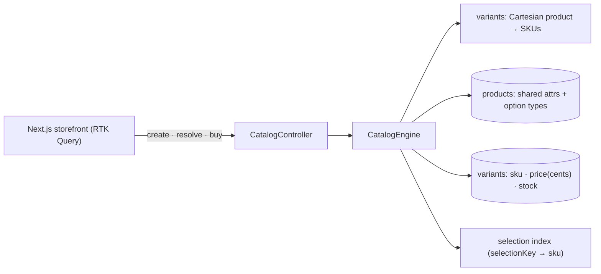

# Product Catalog with Variants — full-stack implementation

A runnable demo of the [design write-up](../17-product-catalog-with-variants.md): a **product** owns
option types (Size, Color); their combinations generate concrete **variants (SKUs)**, each with its own
price and stock. Pick options to resolve a live SKU, edit inventory, or create a product and watch its
variant matrix generate.

- **`server/`** — NestJS + Zod. Product/variant model, Cartesian SKU generation, selection resolution,
  and atomic inventory. No database.
- **`web/`** — Next.js 14 + Redux Toolkit **RTK Query** storefront: catalog grid, variant picker, and
  inventory editor.

## Architecture



## Endpoints

| Method | Path | Purpose |
| --- | --- | --- |
| POST | `/products` | Create `{ title, brand, basePrice(cents), optionTypes[] }` → product + generated variants (explosion → 400). |
| GET | `/products` | Catalog list (price range, in-stock, variant count). |
| GET | `/products/:id` | Product + variant matrix. |
| POST | `/products/:id/resolve` | `{ selection }` → the matching variant (or null). |
| PATCH | `/variants/:sku` | Update `{ price?, stock? }`. |
| POST | `/variants/:sku/adjust` | `{ delta }` — atomic stock change (oversell → 409). |
| GET | `/filter?type=&value=` | Products offering an option value. |
| POST | `/reset` | Reseed the demo catalog. |

## Run

**npm is under nvm** — prefix with `export PATH="/root/.nvm/versions/node/v22.23.2/bin:$PATH"` if needed.

```bash
cd server && cp .env.example .env && npm install && npm run build && npm start   # :3012
cd ../web && cp .env.example .env.local && npm install && npm run dev            # :3000
```

### Try it with curl

```bash
curl -s :3012/products | jq                                   # seeded catalog (Tee, Mug)
TEE=$(curl -s :3012/products | jq -r '.[] | select(.title=="Classic Tee").id')
curl -s :3012/products/$TEE | jq '.variants[0]'               # a generated SKU
curl -s -X POST :3012/products/$TEE/resolve -H 'content-type: application/json' -d '{"selection":{"Size":"M","Color":"Blue"}}' | jq
```

## Where each design element lives

| Element | Code |
| --- | --- |
| Cartesian generation, SKU code, selection key | `server/src/engine/variants.ts` |
| Catalog store: products/variants, resolve, atomic stock | `server/src/engine/catalog.ts` |
| Types + Zod schemas (cents pricing) | `server/src/engine/catalog.types.ts` |
| Variant picker → live SKU + matrix editor | `web/src/components/ProductPanel.tsx` |
| Create product (dynamic option types) | `web/src/components/CreateProductForm.tsx` |
| Catalog grid | `web/src/components/Catalog.tsx` |

Verified end-to-end (engine + HTTP): full matrix generation with unique SKUs, selection resolution,
price/stock updates, atomic stock (no oversell → 409), filter-by-option, and the variant-count guard.
