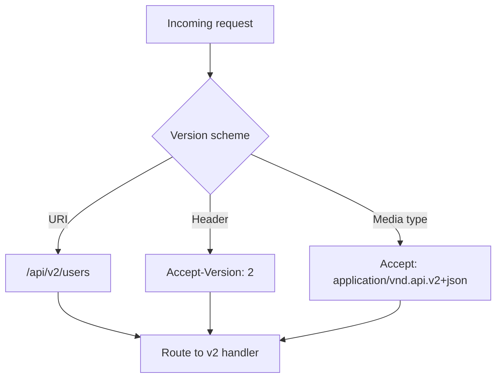
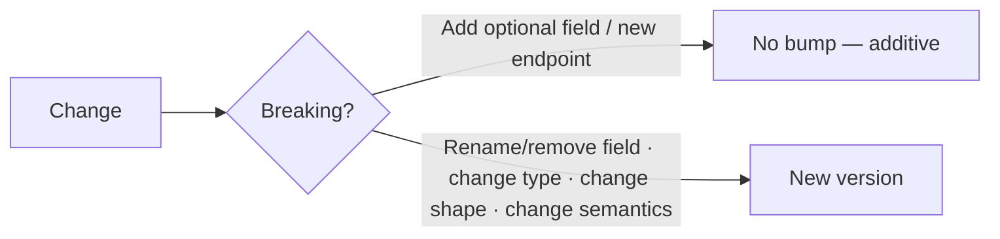
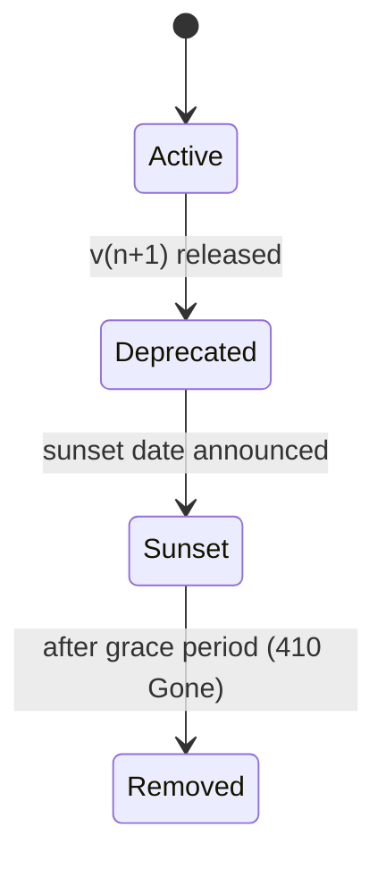
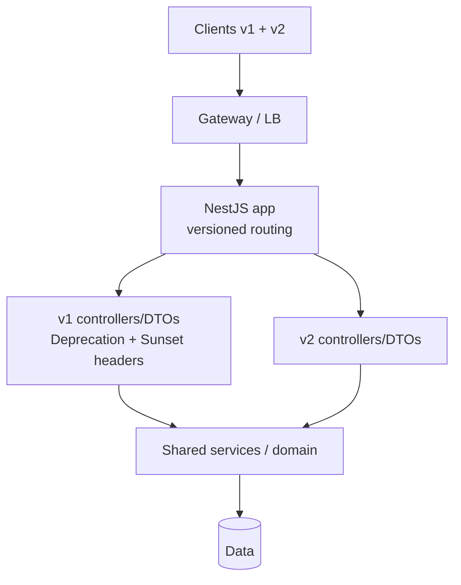
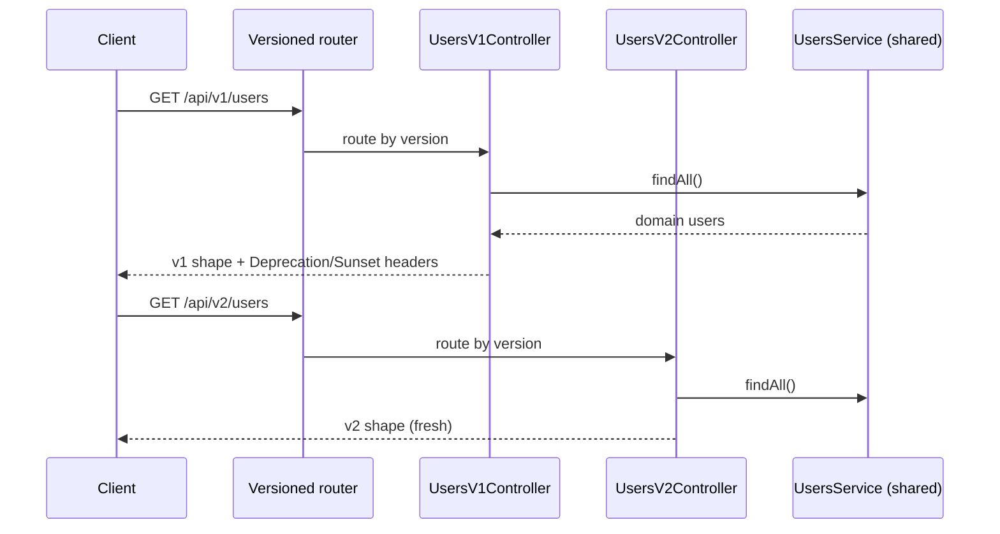

# 19. Implement an API Versioning Strategy

> **In one line:** Design how an API **evolves without breaking existing clients** — the versioning
> scheme (URI vs header vs media-type), how requests route to the right version, how you **deprecate and
> sunset** old versions, and how to run it at scale in Node/NestJS/Express.

> **Original prompt:** Set up a clean routing architecture in Express to handle `/v1/` and `/v2/`
> endpoints cleanly.

> **Part of a shared "production-ready API platform"** implemented once in
> [`../12-api-response-standardization/12-api-response-standardization.md`](../12-api-response-standardization/12-api-response-standardization.md)
> — see [`./implementation/`](./implementation/).

## Overview

APIs change. New fields, renamed fields, different shapes, removed endpoints. If you change the contract
in place, you break every client that hasn't updated. **Versioning** lets the API evolve while old
clients keep working on the version they integrated against. The hard parts aren't "add `/v2/`" — they're
**which scheme**, **how much to share vs fork**, and **how to retire** a version gracefully.

Questions this forces:

- **Which scheme**: URI (`/v2/users`), header (`Accept-Version: 2`), or media-type (`Accept:
  application/vnd.api.v2+json`)?
- What actually **needs a new version** (breaking change) vs. what's additive (no version bump)?
- How do you **route** cleanly and **share** unchanged logic across versions?
- How do you **deprecate** and **sunset** — and tell clients (headers)?
- How does versioning behave under **scale** and behind gateways/CDNs?

## Functional Requirements

1. Serve **multiple versions** of an endpoint concurrently (e.g. `v1` and `v2` of `/users`).
2. **Route** each request to the correct version by the chosen scheme.
3. **Default** to a sensible version when the client doesn't specify one.
4. **Deprecate** a version: still works, but advertises `Deprecation` + `Sunset` headers.
5. **Share** unchanged behavior across versions (don't fork the whole app).
6. Reject/΄fall back for **unknown/unsupported** versions predictably.

## Non-Functional Requirements

| Attribute | Target / approach |
|---|---|
| **Backward compatibility** | Old clients never break when a new version ships |
| **Discoverability** | Version is explicit; deprecation is advertised in headers |
| **Maintainability** | Shared code across versions; only changed parts fork |
| **Scalability** | Versioning is routing-only — no per-request cost; scales horizontally |
| **Clarity** | One documented scheme, applied consistently |
| **Lifecycle** | Clear deprecation → sunset → removal policy |

## A Realistic Interview Conversation

> **I** = Interviewer, **C** = Candidate.

**I:** How would you version a REST API?

**C:** First, *when* do you version — only on **breaking changes**. Adding an optional field or a new
endpoint is additive and needs no bump. Renaming/removing a field, changing a type, or changing response
shape is breaking → new version. Then the **scheme**. Three common ones: **URI** (`/v2/users`) — most
visible, trivial to route, cache- and browser-friendly; **header** (`Accept-Version: 2` or a custom
header) — keeps URLs clean, "purer" REST, but harder to eyeball/curl; **media-type** (`Accept:
application/vnd.myapi.v2+json`) — content negotiation, most RESTful, least approachable. I default to
**URI versioning** for public APIs because it's the clearest and works everywhere, with header versioning
as an option.

**I:** Doesn't URI versioning duplicate a lot of code?

**C:** Only the parts that actually changed. I keep **shared services/domain logic** and only fork the
**controller/DTO/serializer** for the changed version — v2 maps the same domain object to a new shape.
So `v1` and `v2` controllers both call the same service; the difference is presentation.

**I:** How do you retire v1?

**C:** A lifecycle: **active → deprecated → sunset → removed**. When v1 is deprecated it still works but
every response carries `Deprecation: true` and a `Sunset: <date>` header (RFC 8594), plus a `Link` to
migration docs. Clients get machine-readable warning ahead of time. After the sunset date you remove it
(or return `410 Gone`).

**I:** What version does a request with no version get?

**C:** A configured **default** — usually the latest stable, or you can pin the default to the oldest
supported to avoid surprising un-versioned callers. I'd document it and prefer requiring an explicit
version for public APIs.

**I:** How does this scale to millions of requests?

**C:** Versioning itself is **routing metadata** — effectively free per request. Scaling the API is the
usual story: **stateless** Node/Nest instances behind a load balancer, horizontal autoscaling, keep-alive
+ tuned connection pools, cache hot reads (Redis/CDN), offload heavy work to queues, and cluster Node to
use all cores. URI versioning is also **CDN/gateway-friendly** — different versions are different paths,
so caching and routing rules are simple.

**I:** Where do you put the versioning logic — app or gateway?

**C:** Both are valid. In-app (NestJS `enableVersioning`) keeps it close to the code; an **API gateway**
can route versions to different services entirely (useful when v2 is a rewrite). For a monolith, in-app;
for microservices mid-migration, gateway routing.

## Versioning Schemes



| Scheme | Example | Pros | Cons | Use |
|---|---|---|---|---|
| **URI** | `/api/v2/users` | Visible, cache/CDN-friendly, trivial to route & curl | "Impure" REST; URL churn | **Public APIs** ✅ |
| **Header** | `Accept-Version: 2` | Clean URLs, one resource URI | Harder to inspect/cache; easy to forget | Internal APIs |
| **Media-type** | `Accept: …v2+json` | Most RESTful (content negotiation) | Least approachable; tooling friction | Hypermedia/REST purists |
| **Query param** | `/users?version=2` | Simple | Pollutes params; caching quirks | Quick/legacy |

> **Choice:** **URI versioning** as the default (clearest, gateway/CDN-friendly). The implementation
> ships URI versioning; switching to header/media-type versioning is a one-line change of the NestJS
> versioning `type`.

## What Actually Needs a New Version?



Bump **only on breaking changes**. Additive changes ship within the current version. This keeps version
count low and clients stable.

## Deprecation & Sunset Lifecycle



A deprecated version keeps working but advertises it:

```http
HTTP/1.1 200 OK
Deprecation: true
Sunset: Wed, 31 Dec 2026 23:59:59 GMT
Link: <https://docs.example.com/migrate/v2>; rel="deprecation"
```

Clients (and monitoring) can detect deprecation programmatically and migrate before removal.

## High-Level Design (HLD)



Only the **presentation layer** (controllers/DTOs/serializers) forks per version; the **domain/services**
are shared. New clients use v2; old clients stay on v1 until sunset.

## Low-Level Design (LLD)

### NestJS versioning

```text
enableVersioning({ type: VersioningType.URI, defaultVersion: '2' })  // /api/v1, /api/v2
@Controller({ path: 'users', version: '1' })  → v1 shape (+ deprecation header)
@Controller({ path: 'users', version: '2' })  → v2 shape
// both call the same UsersService; only the DTO/serializer differs
```



### Contracts

```text
v1 GET /users → [{ id, name }]                         (deprecated)
v2 GET /users → [{ id, firstName, lastName, email }]   (current)
Unknown version → default (or 404/406 if strict)
Deprecated version → response + Deprecation + Sunset headers
```

## Scaling Production APIs (Node / NestJS / Express)

Versioning is routing-only, so scaling is the general API story:

- **Stateless services** behind a load balancer → **horizontal autoscaling**
  ([Horizontal Scaling](../../01-core-infrastructure-concepts/03-horizontal-scaling.md),
  [Load Balancer](../../01-core-infrastructure-concepts/04-load-balancer.md)).
- **Use all cores** — Node is single-threaded per process; run the **cluster**/PM2 or one container per
  core so a box isn't CPU-bound on one thread.
- **Cache hot reads** (Redis/CDN) and put **URI versions behind the CDN** — different paths cache cleanly
  ([Cache](../../02-data-and-storage-concepts/08-cache.md), [CDN](../../01-core-infrastructure-concepts/07-cdn.md)).
- **Tune connections** — keep-alive, bounded DB pools, timeouts; don't exhaust file descriptors.
- **Offload heavy/slow work** to a queue; keep request handlers fast and non-blocking.
- **Rate limit** at the edge/gateway
  ([Rate Limiting](../../05-reliability-performance-and-modern-concepts/02-rate-limiting.md)).
- **Gateway routing** can send v2 to a new service during a migration without touching v1.

## Security

- **Auth is version-agnostic** — apply the same auth/authorization across versions; don't let an old
  version bypass new security rules.
- **Backport security fixes** to still-supported versions, even deprecated ones, until sunset.
- **Don't leak internal version topology** (which service serves which version) in errors.
- **Validate per version** — v2's stricter validation shouldn't be skippable by calling v1.

## All Solution Patterns (summary)

| Concern | Options | Chosen | Why |
|---|---|---|---|
| Scheme | **URI** · header · media-type · query | URI (+ header) | Clearest, cache/gateway-friendly |
| When to bump | every change · **breaking only** | Breaking only | Fewer versions, stable clients |
| Code sharing | fork everything · **share domain, fork presentation** | Share + fork DTO | DRY + isolated changes |
| Retirement | hard cutoff · **deprecate → sunset → remove** | Lifecycle + headers | Graceful, advertised |
| Placement | in-app · **gateway** · both | In-app (gateway for microservices) | Fits monolith; gateway for rewrites |

## Implementation

See the shared platform in
[`../12-api-response-standardization/implementation/`](../12-api-response-standardization/implementation/)
(and this folder's [`./implementation/`](./implementation/) README, which maps the versioning code):

| Design element | Where in the code |
|---|---|
| Enable URI versioning | `server/src/main.ts` (`enableVersioning`) |
| v1 controller (deprecated) | `server/src/users/users.v1.controller.ts` |
| v2 controller (current) | `server/src/users/users.v2.controller.ts` |
| Shared domain/service | `server/src/users/users.service.ts` |
| Deprecation + Sunset headers | `server/src/common/deprecation.interceptor.ts` |

Verified by an end-to-end test: `v1` and `v2` return **different shapes** from the **same service**, the
default version routes correctly, and `v1` responses carry `Deprecation`/`Sunset` headers.

## Tips

- Version **only on breaking changes**; ship additive changes in place.
- Prefer **URI versioning** for public APIs (visible, cache/CDN-friendly); support headers too.
- **Share** domain logic; fork only the **presentation** (controllers/DTOs) per version.
- Advertise **deprecation** with `Deprecation`/`Sunset` headers before removal.
- Pick and document a **default version** behavior.
- Keep versioning **routing-only** so it adds no per-request cost.

## Trade-offs & Pitfalls

- **Versioning on every change** explodes the version count — only on breaking changes.
- **Forking the whole app per version** is a maintenance nightmare — share the domain.
- **Silent removal** of a version breaks clients — deprecate + sunset with headers first.
- **No default-version policy** surprises un-versioned callers — decide and document it.
- **Divergent auth/validation across versions** is a security hole — keep them consistent.
- **Header-only versioning without docs** is easy to forget and hard to debug.

## System Design Cheat Sheet

```text
1.  WHEN?      Version only on BREAKING changes (additive = in place)
2.  SCHEME     URI (default) · header · media-type · query
3.  ROUTE      Route by version; sensible default
4.  SHARE      Shared domain/services; fork presentation (controllers/DTOs)
5.  LIFECYCLE  active → deprecated → sunset → removed
6.  HEADERS    Deprecation: true · Sunset: <date> · Link: migration docs
7.  SCALE      stateless + LB + cluster cores + cache + CDN (URI paths)
8.  PLACEMENT  in-app (monolith) · gateway (microservices/rewrites)
```

## Interview Questions & Answers

- **URI vs header vs media-type versioning?** — URI (visible, cache-friendly), header (clean URLs), media-type (most RESTful); URI is the pragmatic default.
- **When do you bump the version?** — Only on breaking changes; additive changes ship in place.
- **How do you avoid duplicating code across versions?** — Share domain/services; fork only presentation.
- **How do you retire a version?** — Deprecate with `Deprecation`/`Sunset` headers, then remove (`410 Gone`).
- **What version does an un-versioned request get?** — A documented default (latest stable or pinned).
- **Where should versioning live?** — In-app for a monolith; at the gateway for microservices/rewrites.
- **How does versioning scale?** — It's routing-only (free); scale the API via stateless instances, clustering, caching, CDN.
- **How do you keep security consistent?** — Same auth/validation across versions; backport fixes to supported versions.
