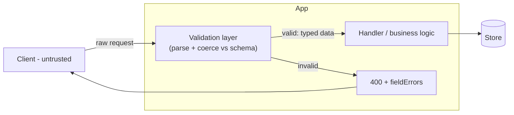
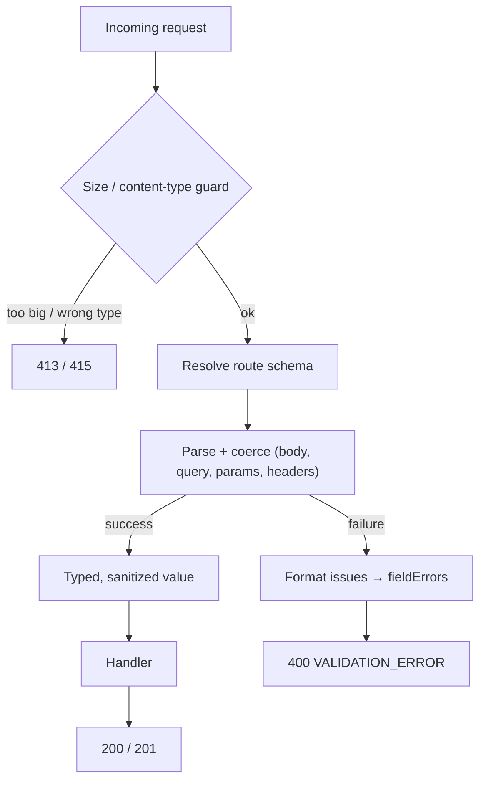

# 21. Implement Request Validation Middleware

> **In one line:** Design a single reusable layer that validates and coerces every incoming request —
> body, query, params, headers — against a schema *before* it reaches your business logic, rejecting bad
> input with a consistent, field-level error response and protecting the app from malformed data,
> injection, mass assignment, and oversized-payload DoS.

> **Original prompt:** Implement middleware that validates request bodies against a schema and returns
> structured errors.

## Overview

Every request from the outside world is **untrusted**. Validation is the boundary that turns raw,
attacker-controllable input into typed, trusted data your handlers can rely on. Skipping it (or scattering
`if (!req.body.email) ...` checks across controllers) leads to the classic failures: `NaN` prices,
`undefined` blowing up three layers down, a string where you expected a number, an attacker setting
`isAdmin: true` via **mass assignment**, or a 50 MB JSON body exhausting memory.

The fix is **one declarative validation layer**: attach a **schema** to each route, and a shared
pipe/middleware parses-and-coerces the request against it, either handing the handler a **clean typed
object** or short-circuiting with a **structured 400** listing exactly which fields failed and why.

This write-up covers:

- **What to validate** — body, query string, route params, headers (and *where* each lives).
- **Parse, don't just check** — coerce `"42"` → `42`, strip unknown keys, apply defaults, normalize.
- **Structured errors** — a stable, field-keyed shape a UI can render inline.
- **Security** — mass assignment, injection, and payload-size / depth limits as a DoS guard.
- **Where it runs** — middleware vs. pipe vs. guard, and doing it at the edge (gateway) too.

It ships a runnable implementation in [`./implementation/`](./implementation/): a **NestJS + Zod**
validation pipe that validates body/query/params/headers, coerces and strips unknown keys, enforces a
body-size guard, and returns a consistent field-level error envelope — plus a **Next.js + React + Redux
Toolkit** playground that submits payloads and renders the per-field errors live.

## Functional Requirements

1. Validate the **body**, **query**, **route params**, and **headers** of a request against a schema.
2. **Coerce** types (string→number/boolean/date), apply **defaults**, and **strip unknown** keys.
3. Reject invalid input with a **structured 400**: a stable, field-keyed error map (path → messages).
4. Support **nested objects and arrays**, and **cross-field** rules (e.g. `endDate > startDate`).
5. Be **reusable & declarative** — attach a schema per route; no bespoke checks in handlers.
6. Enforce **limits**: max body size, max string length, max array length / nesting depth.

## Non-Functional Requirements

| Attribute | Target / approach |
|---|---|
| **Safety** | Handlers only ever see validated, typed data; unknown keys stripped (no mass assignment) |
| **Consistency** | One error shape across every endpoint; stable machine-readable field keys |
| **Performance** | Validation is O(size of payload); compile/reuse schemas; cheap fast-path |
| **DX** | One line per route; types inferred from the schema (single source of truth) |
| **Security** | Size/depth/length caps; reject unknown content types; no reflection of raw input in errors |
| **Extensibility** | Custom rules/refinements; shared sub-schemas; localizable messages |

## A Realistic Interview Conversation

> **I** = Interviewer, **C** = Candidate.

**I:** How would you validate incoming requests in a Node service?

**C:** With **one declarative layer**, not ad-hoc checks in controllers. Each route declares a **schema**
for whatever parts it reads — body, query, params, headers — and a shared **pipe/middleware** runs before
the handler: it **parses and coerces** the input against the schema and either passes a clean typed object
downstream or throws a **400 with structured field errors**. The handler then never sees invalid data.

**I:** Validate or parse — what's the difference?

**C:** "Validate" often means a boolean check that leaves the data as-is. I prefer **parse**: the schema
*transforms* the input — coerces `"42"` to `42`, trims strings, applies defaults, drops unknown keys —
and returns a **new typed value**. That's the Zod/`zod`, Joi, `class-transformer` model. It matters
because query params and headers are **always strings**, so without coercion `age > 18` compares a string.

**I:** What does the error response look like?

**C:** A stable, **field-keyed** shape so a client can render errors inline, e.g.
`{ "error": "VALIDATION_ERROR", "fieldErrors": { "email": ["invalid email"], "age": ["expected number"] } }`.
Keys are dot-paths for nested fields (`address.zip`). It's the same shape on every endpoint, so the
frontend has one handler. I never echo the raw offending value back (that can reflect an attack).

**I:** Where should validation live — middleware, or in the framework?

**C:** Conceptually it's **middleware at the edge of the app**. In NestJS it's cleanest as a **pipe**
(runs per-handler, has the metadata/type), with a **global** default so nothing is unguarded. You often
*also* validate at the **API gateway / WAF** (size limits, JSON well-formedness, schema at the edge) as
defense in depth. Validate as **early** as possible.

**I:** What are the security angles?

**C:** Several. **Mass assignment** — an attacker sends `{ isAdmin: true, ... }`; stripping unknown keys
(allowlist, not blocklist) defeats it. **Injection** — validation constrains shape/type but you still use
parameterized queries downstream; validation reduces the surface (e.g. reject weird characters in an
id). **DoS** — cap **body size**, **string length**, **array length**, and **nesting depth**, because a
deeply nested or huge payload can exhaust CPU/memory before you even look at it. And **don't leak** — keep
error messages generic; don't reflect secrets or raw input.

**I:** How do you keep it DRY and type-safe?

**C:** The schema is the **single source of truth**: I infer the TypeScript type from it (`z.infer`), so
the handler's param type and the runtime validation can't drift. Shared sub-schemas (an `Address`, a
pagination schema) compose. Cross-field rules use refinements (`.refine(d => d.end > d.start)`).

**I:** How does it scale / perform?

**C:** Validation cost is proportional to payload size, so the **limits are also the performance guard**.
Compile/reuse schema objects (don't rebuild per request). Fail **fast** on the cheap checks (size,
content-type) before the expensive full parse. It's stateless, so it scales horizontally with the app.

## What & Why: the trust boundary



Validation is the **membrane** between untrusted input and trusted code. Nothing crosses it unparsed.

## What to Validate (and where it lives)

| Part | Source | Notes |
|---|---|---|
| **Body** | JSON/form payload | The main event; nested objects/arrays, defaults, unknown-key stripping |
| **Query** | URL `?a=1&b=2` | **Always strings** → coerce; arrays via repeated keys; pagination/filter allowlists |
| **Params** | Path `/users/:id` | Coerce + constrain (uuid/int); a bad `id` shouldn't reach the DB |
| **Headers** | Request headers | Content-Type, auth format, idempotency keys; case-insensitive |

## High-Level Design (HLD)



Related concepts: [API Gateway](../../01-core-infrastructure-concepts/09-api-gateway.md),
[Rate Limiting](../../05-reliability-performance-and-modern-concepts/02-rate-limiting.md),
[API Response Standardization](../12-api-response-standardization/12-api-response-standardization.md).

## Low-Level Design (LLD)

### The validation pipe (parse-or-throw)

```text
validate(schema, input):
  result = schema.safeParse(input)         # coerces, strips unknowns, applies defaults
  if !result.success:
     throw ValidationError(flatten(result.error))   # → { fieldErrors, formErrors }
  return result.data                        # typed, clean value the handler receives
```

### Structured error shape

```jsonc
{
  "error": "VALIDATION_ERROR",
  "message": "Validation failed",
  "fieldErrors": {
    "email": ["Invalid email"],
    "age": ["Expected number, received string"],
    "address.zip": ["Required"]
  },
  "formErrors": ["endDate must be after startDate"]   // cross-field / top-level
}
```

Dot-path keys map 1:1 to form fields, so the UI renders each message next to its input.

### Coercion & sanitization (why "parse" matters)

```text
query   { "age": "42", "active": "true" }  → { age: 42, active: true }   (coerced)
body    { "name": " Ada ", "role": "x" }   → { name: "Ada" }            (trimmed, unknown 'role' stripped)
missing { }                                → { page: 1, limit: 20 }     (defaults applied)
```

### Guards before parsing (fail fast + DoS defense)

```text
1. Content-Length / body size  > MAX_BODY      → 413 Payload Too Large
2. Content-Type not application/json (for JSON) → 415 Unsupported Media Type
3. Nesting depth / array length > caps          → 400 (reject pathological payloads)
4. Then, and only then, run the full schema parse
```

### Service contracts (implemented here)

```text
ZodValidationPipe(schema)                     → parse body|query|params, throw structured 400
validate(schema, value)                       → { ok, data } | { ok:false, fieldErrors, formErrors }
sizeGuard(payload, maxBytes)                  → throws 413 when over budget
routes: /users (nested body), /search (query coercion), /users/:id (param), custom refinements
```

### Project structure

```text
server/src/
├── validation/
│   ├── validate.ts          # core: safeParse → { data } | structured errors   ← the core
│   ├── zod-validation.pipe.ts # NestJS pipe wrapping validate() for body/query/params
│   ├── size.guard.ts        # body-size + depth guard (DoS)
│   └── schemas.ts           # example schemas (user, search, nested address, refinements)
├── demo/                    # endpoints exercising each validation target
└── main.ts
```

## Security

- **Mass assignment** → **allowlist** fields via the schema and **strip unknown keys** (never blocklist).
  An attacker's extra `isAdmin`/`role` field is dropped before it can be persisted.
- **Type/shape constraints** shrink the **injection** surface (constrain ids, enums, patterns) — but
  still parameterize DB/queries downstream; validation is not a substitute.
- **DoS via payload** → cap **body size** (413), **string length**, **array length**, and **nesting
  depth**; reject before the expensive parse.
- **Content-Type enforcement** → reject unexpected media types (415) to avoid parser confusion.
- **Don't reflect input** → generic messages; never echo secrets/raw values (avoids reflected-attack and
  info leaks).
- **Normalize/canonicalize** (trim, lowercase emails, Unicode NFC) to prevent homoglyph/dup bypasses.

## Scaling & Performance

- **Compile once, reuse** schema objects; don't construct them per request.
- **Fail fast** on cheap guards (size, content-type) before full parsing.
- **Limits are the perf guard** — bounded input size bounds validation cost.
- **Stateless** → scales horizontally with the app; also push coarse checks to the **API gateway/WAF**
  (size, JSON well-formedness, top-level schema) as defense in depth.
- **Streaming** for large uploads — validate metadata, stream the body to storage rather than buffering.

## All Solution Patterns (summary)

| Concern | Options | Chosen here | Why |
|---|---|---|---|
| Where | per-controller checks · **pipe/middleware** · gateway | Global pipe (+ gateway note) | DRY, nothing unguarded |
| Library | hand-rolled · Joi · class-validator · **Zod** | Zod | Parse+infer types, composable |
| Unknown keys | passthrough · **strip** · reject | Strip (allowlist) | Defeats mass assignment |
| Errors | first-error · **all field errors** | All, field-keyed | Inline UI rendering |
| Coercion | strict · **coerce** | Coerce (query/params) | Strings → typed values |
| DoS | none · **size/depth/len caps** | Caps + fail fast | Bounded cost |

## Implementation

A runnable full-stack implementation lives in [`./implementation/`](./implementation/):

| Layer | Stack | Highlights |
|---|---|---|
| **`server/`** | NestJS + Zod | A reusable validation pipe for **body / query / params**, coercion + **unknown-key stripping** + defaults, a **body-size/depth guard** (413), nested + cross-field (refinement) schemas, and a consistent **`VALIDATION_ERROR` + fieldErrors** envelope. |
| **`web/`** | Next.js + React + Redux Toolkit (RTK Query) | A payload playground: submit valid/invalid bodies and query strings and see **per-field errors** rendered inline, plus examples of coercion, unknown-key stripping, and the size guard. |

| Design element | Where in the code |
|---|---|
| Core parse-or-throw | `server/src/validation/validate.ts` |
| NestJS pipe (body/query/params) | `server/src/validation/zod-validation.pipe.ts` |
| Size/depth guard (DoS) | `server/src/validation/size.guard.ts` |
| Example schemas (nested, refine) | `server/src/validation/schemas.ts` |
| Playground UI | `web/src/components/*` + `store/validationApi.ts` |

The backend is verified by an **end-to-end test**: a valid body passes and is **coerced** (types +
defaults) with **unknown keys stripped**; an invalid body returns **all** field errors keyed by dot-path;
**query/param** coercion works; a **cross-field refinement** fails as a form error; and an **oversized**
body is rejected by the size guard.

## Tips

- **Parse, don't check** — return typed, coerced, unknown-stripped data to the handler.
- One **error shape** everywhere; dot-path field keys for inline UI rendering.
- Validate **all** inputs — query and params are strings, so coerce them.
- **Allowlist** fields (strip unknown) to kill mass assignment.
- Add **size/depth/length caps** — they're both a DoS guard and a perf bound.
- Schema = **single source of truth**; infer the TS type from it.

## Trade-offs & Pitfalls

- **Ad-hoc checks in controllers** drift and get skipped — centralize.
- **Blocklisting** unknown keys instead of allowlisting always misses one — strip by allowlist.
- **Forgetting coercion** on query/params → comparing strings to numbers.
- **No size/depth limits** → a payload DoS before validation even runs.
- **Leaking raw input** in errors → reflected attacks / info disclosure.
- **First-error-only** responses frustrate users and cost round-trips — return all field errors.

## System Design Cheat Sheet

```text
1.  UNTRUSTED?   every request part (body, query, params, headers) is attacker-controlled
2.  PARSE?       coerce + apply defaults + STRIP unknown keys → typed clean value (not just check)
3.  WHERE?       one pipe/middleware at the app edge (+ gateway/WAF as defense in depth)
4.  ERRORS?      one stable shape: VALIDATION_ERROR + fieldErrors{path: msgs} + formErrors
5.  MASS-ASSIGN? allowlist via schema; drop isAdmin/role/etc. before persistence
6.  DoS?         cap body size (413), string/array length, nesting depth; fail fast first
7.  DRY+TYPES?   schema is source of truth; infer TS type (z.infer) so they can't drift
8.  DOWNSTREAM?  still parameterize queries — validation narrows, doesn't replace
9.  SCALE?       stateless; compile/reuse schemas; limits bound cost
```
