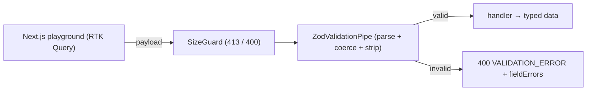

# Request Validation Middleware — full-stack implementation

A runnable version of the [design write-up](../21-request-validation-middleware.md): one reusable Zod
layer validates every request part before it reaches the handler — **coercing** types, **stripping
unknown keys** (mass-assignment defense), returning **field-keyed errors**, and guarding against
**oversized payloads**.

- **`server/`** — NestJS + Zod. A validation pipe for body/query/params, a size/depth guard, and demo
  endpoints. No database.
- **`web/`** — Next.js 14 + Redux Toolkit **RTK Query** playground that submits payloads and renders the
  per-field errors.

## Architecture



## Endpoints

| Method | Path | Purpose |
| --- | --- | --- |
| POST | `/users` | Body validation: coerces `age`, strips unknown keys, nested `address`. |
| GET | `/search` | Query coercion: `page`/`limit`→number, `active`→boolean, defaults. |
| GET | `/users/:id` | Param coercion: id → positive integer (bad id → 400). |
| POST | `/date-range` | Cross-field refinement: `endDate` must be after `startDate` (→ formError). |
| POST | `/upload` | `SizeGuard`: body over ~10 KB → **413**; too deep → **400**. |

## Run

**npm is under nvm** — prefix with `export PATH="/root/.nvm/versions/node/v22.23.2/bin:$PATH"` if `npm` isn't found.

```bash
cd server && cp .env.example .env && npm install && npm run build && npm start   # :3013
cd ../web && cp .env.example .env.local && npm install && npm run dev            # :3000
```

### Try it with curl

```bash
# coercion + unknown-key stripping (isAdmin is dropped; age "42" → 42)
curl -s -X POST :3013/users -H 'content-type: application/json' -d '{"name":" Ada ","email":"ada@example.com","age":"42","isAdmin":true}' | jq
# field errors, dot-path keyed
curl -s -X POST :3013/users -H 'content-type: application/json' -d '{"name":"","email":"nope","address":{"street":"x","city":"y","zip":"ABC"}}' | jq
curl -s ':3013/search?page=2&active=false' | jq
```

## Where each design element lives

| Element | Code |
| --- | --- |
| Core parse-or-return-errors (dot-path keys) | `server/src/validation/validate.ts` |
| NestJS pipe (body/query/params) | `server/src/validation/zod-validation.pipe.ts` |
| Size + depth DoS guard | `server/src/validation/size.guard.ts` |
| Example schemas (nested, refinement, coercion) | `server/src/validation/schemas.ts` |
| Playground + inline errors | `web/src/components/Playground.tsx` |

Verified end-to-end (engine + HTTP): coercion, unknown-key stripping, all field errors by dot-path,
query/param coercion, cross-field refinement, and the 413 size guard. See
[`server/README.md`](./server/README.md) and [`web/README.md`](./web/README.md).
